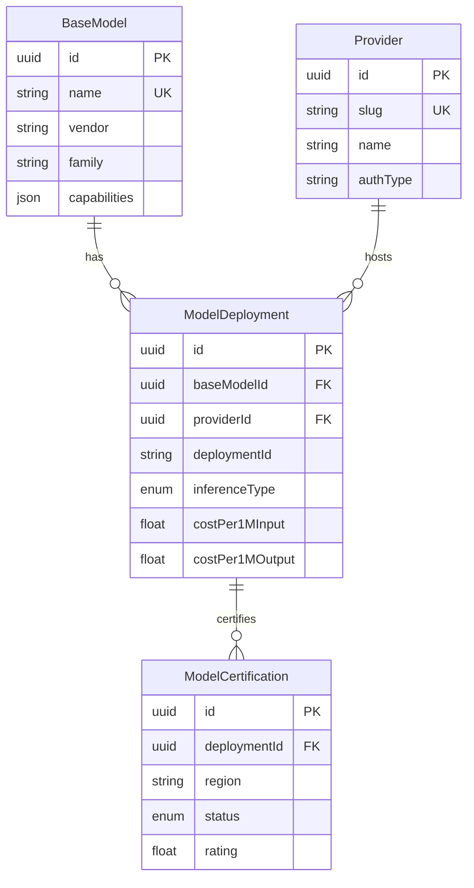

# 📋 Plano de Implementação: Clean Slate do Sistema de Modelos

> **Data:** 2026-02-09
> **Status:** Planejado
> **Versão:** 1.1

---

## 📌 Sumário Executivo

### Objetivo
Refatoração completa do sistema de modelos para usar banco de dados como **Single Source of Truth**, com suporte a:
- Múltiplos providers por modelo (Bedrock, Azure, OpenAI, etc.)
- Tipos de inferência (ON_DEMAND, INFERENCE_PROFILE, PROVISIONED)
- Validação automática de capabilities
- Métricas e observabilidade

### Abordagem
**Clean Slate** - Zerar TODOS os dados e começar do zero com controle total sobre cada modelo adicionado.

---

## 🔍 Problemas Identificados (Situação Atual)

### 1. Duplicação de Dados
| Local | Tipo | Problema |
|-------|------|----------|
| `ModelRegistry` (código) | Hardcoded | 74 modelos em arquivos .ts |
| `ai_models` (banco) | Dinâmico | 80 modelos, sem sincronização |
| `model_certifications` (banco) | Dinâmico | 91 certificações órfãs |

### 2. Custos em 2 Lugares
| Local | Arquivo | Status |
|-------|---------|--------|
| `PROVIDER_MAP` | `providerMap.ts` | Hardcoded, desatualizado |
| `ai_models.costPer1k*` | Banco | 97.5% zerados |

### 3. Falta de Single Source of Truth
- Modelo pode existir no Registry mas não no banco
- Certificações usam string ao invés de FK
- Sem suporte a múltiplos providers

### 4. Tabela Legacy
- `model_certifications_legacy` ainda existe (vazia, pode remover)

---

## 🏗️ Arquitetura Proposta

### Antes (Atual)
```
ModelRegistry (código) ←→ ai_models (banco) ←→ model_certifications (banco)
       ↓                        ↓                        ↓
   Hardcoded              Sem sincronização         Sem FK, usa strings
```

### Depois (Proposto)
```
BaseModel (banco) ←→ ModelDeployment (banco) ←→ ModelCertification (banco)
       ↓                        ↓                        ↓
   Modelo base            Provider-específico        FK direta
```

### Diagrama ER (Mermaid)



---

## 📊 Schema Prisma Completo

```prisma
// ===== ENUMS =====
enum InferenceType {
  ON_DEMAND           // Modelo direto, sem prefixo
  INFERENCE_PROFILE   // Requer prefixo regional (us., eu., apac.)
  PROVISIONED         // ARN dedicado com throughput reservado
}

enum CertificationStatus {
  PENDING
  QUEUED
  PROCESSING
  COMPLETED
  FAILED
  CANCELLED
  CERTIFIED
  QUALITY_WARNING
}

// ===== MODELO BASE =====
// Definição do modelo, independente de provider
model BaseModel {
  id            String @id @default(uuid())
  
  // Identificação
  name          String @unique  // "Claude 3.5 Sonnet", "GPT-4", "Llama 3.1 70B"
  vendor        String          // "Anthropic", "OpenAI", "Meta"
  family        String?         // "Claude", "GPT", "Llama"
  version       String?         // "3.5", "4", "3.1"
  
  // Capabilities (inerentes ao modelo)
  capabilities  Json            // { streaming, vision, functionCalling, maxContextWindow, maxOutputTokens }
  
  // Parâmetros recomendados (padrão do modelo)
  defaultParams Json?           // { temperature, topP, maxTokens }
  
  // Metadados
  description   String?
  releaseDate   DateTime?
  deprecated    Boolean @default(false)
  replacedBy    String?
  
  // Relacionamentos
  deployments   ModelDeployment[]
  
  // Timestamps
  createdAt     DateTime @default(now())
  updatedAt     DateTime @updatedAt
  
  @@index([vendor])
  @@index([family])
  @@map("base_models")
}

// ===== PROVIDER =====
// Onde os modelos rodam
model Provider {
  id            String @id @default(uuid())
  
  // Identificação
  name          String          // "AWS Bedrock", "Azure OpenAI", "OpenAI"
  slug          String @unique  // "bedrock", "azure", "openai"
  
  // Configuração
  baseUrl       String?
  authType      String?         // "aws_credentials", "api_key", "oauth"
  
  // Status
  isActive      Boolean @default(true)
  
  // Relacionamentos
  deployments   ModelDeployment[]
  
  // Timestamps
  createdAt     DateTime @default(now())
  updatedAt     DateTime @updatedAt
  
  @@map("providers")
}

// ===== DEPLOYMENT =====
// Modelo específico em um provider
model ModelDeployment {
  id              String @id @default(uuid())
  
  // Relacionamentos
  baseModelId     String
  baseModel       BaseModel @relation(fields: [baseModelId], references: [id])
  providerId      String
  provider        Provider @relation(fields: [providerId], references: [id])
  
  // ID específico do provider
  deploymentId    String          // "anthropic.claude-3-5-sonnet-20241022-v2:0" (Bedrock)
                                  // "gpt-4-turbo-2024-04-09" (OpenAI)
  
  // Tipo de inferência
  inferenceType   InferenceType @default(ON_DEMAND)
  
  // Configuração específica do provider
  providerConfig  Json?           // { arn, profileFormat, region, etc }
  
  // Custos (VARIAM por provider!)
  costPer1MInput  Float
  costPer1MOutput Float
  costPerHour     Float?          // Para provisioned
  
  // Parâmetros específicos (override do modelo base)
  customParams    Json?
  
  // Validação de capabilities
  capabilitiesVerifiedAt DateTime?
  capabilitiesSource     String?  // "manual", "auto_test"
  
  // Status
  isActive        Boolean @default(true)
  
  // Relacionamentos
  certifications  ModelCertification[]
  
  // Timestamps
  createdAt       DateTime @default(now())
  updatedAt       DateTime @updatedAt
  
  @@unique([providerId, deploymentId])
  @@index([baseModelId])
  @@index([providerId])
  @@index([inferenceType])
  @@map("model_deployments")
}

// ===== CERTIFICAÇÃO =====
// Por deployment, não por modelo
model ModelCertification {
  id              String @id @default(uuid())
  
  // FK para deployment
  deploymentId    String
  deployment      ModelDeployment @relation(fields: [deploymentId], references: [id], onDelete: Cascade)
  
  region          String
  status          CertificationStatus @default(PENDING)
  
  // Certificação
  certifiedAt     DateTime?
  expiresAt       DateTime?
  certifiedBy     String?
  
  // Testes
  lastTestedAt    DateTime?
  testsPassed     Int @default(0)
  testsFailed     Int @default(0)
  successRate     Float @default(0)
  
  // Performance
  avgLatencyMs    Int?
  lastError       String?
  failureReasons  Json?
  
  // Resultados detalhados
  passed          Boolean?
  score           Float?
  testResults     Json?
  errorMessage    String?
  errorCategory   String?
  errorSeverity   String?
  
  // Sistema de Rating
  rating          Float?
  badge           String?
  metrics         Json?
  scores          Json?
  ratingUpdatedAt DateTime?
  
  // Metadados
  jobId           String?
  startedAt       DateTime?
  completedAt     DateTime?
  duration        Int?
  
  // Timestamps
  createdAt       DateTime @default(now())
  updatedAt       DateTime @updatedAt
  createdBy       String?
  
  @@unique([deploymentId, region])
  @@index([status])
  @@index([region])
  @@map("model_certifications")
}

// ===== MÉTRICAS =====
// Observabilidade do sistema
model SystemMetric {
  id            String @id @default(uuid())
  deploymentId  String?
  metricType    String    // "latency", "error_rate", "usage", "certification"
  value         Float
  timestamp     DateTime @default(now())
  metadata      Json?
  
  @@index([deploymentId, metricType, timestamp])
  @@map("system_metrics")
}

// ===== USUÁRIO (mantido) =====
model User {
  id        String   @id @default(uuid())
  email     String   @unique
  password  String
  name      String?
  createdAt DateTime @default(now())
  updatedAt DateTime @updatedAt
  settings  UserSettings?
  
  @@map("users")
}

// ===== USER SETTINGS (mantido) =====
model UserSettings {
  id               String @id @default(uuid())
  theme            String @default("light")
  awsAccessKey     String?
  awsSecretKey     String?
  awsRegion        String? @default("us-east-1")
  awsEnabledModels String[] @default([])
  userId           String @unique
  user             User @relation(fields: [userId], references: [id])
  
  @@map("user_settings")
}

// ===== LOGS (mantido) =====
model Log {
  id          String   @id @default(uuid())
  timestamp   DateTime @default(now())
  level       String
  message     String
  requestId   String?
  userId      String?
  inferenceId String?
  metadata    Json?
  error       Json?
  
  @@index([timestamp(sort: Desc)])
  @@index([level])
  @@index([userId])
  @@index([requestId])
  @@map("logs")
}
```

---

## 🔌 Endpoints da API

### Novos Endpoints

| Método | Endpoint | Descrição |
|--------|----------|-----------|
| GET | `/api/v2/models` | Listar modelos base |
| GET | `/api/v2/models/:id` | Detalhes de um modelo |
| POST | `/api/v2/models` | Criar modelo base |
| PUT | `/api/v2/models/:id` | Atualizar modelo |
| DELETE | `/api/v2/models/:id` | Remover modelo |
| GET | `/api/v2/deployments` | Listar deployments |
| GET | `/api/v2/deployments/:id` | Detalhes de deployment |
| POST | `/api/v2/deployments` | Criar deployment |
| PUT | `/api/v2/deployments/:id` | Atualizar deployment |
| DELETE | `/api/v2/deployments/:id` | Remover deployment |
| GET | `/api/v2/providers` | Listar providers |
| POST | `/api/v2/providers` | Criar provider |
| GET | `/api/v2/models/:id/deployments` | Deployments de um modelo |
| GET | `/api/v2/models/:id/compare-prices` | Comparar preços |
| GET | `/api/v2/metrics` | Métricas do sistema |
| GET | `/api/v2/metrics/:deploymentId` | Métricas de um deployment |

### Endpoints a Atualizar

| Endpoint Atual | Mudança |
|----------------|---------|
| `/api/providers/models` | Retornar deployments |
| `/api/certification-queue/*` | Usar deploymentId |
| `/api/models/:modelId/capabilities` | Buscar de BaseModel + Deployment |

---

## 🛠️ Services e Controllers

### Novos Services

| Service | Responsabilidade |
|---------|------------------|
| `BaseModelService` | CRUD de modelos base |
| `DeploymentService` | CRUD de deployments |
| `ProviderService` | CRUD de providers |
| `ModelCacheService` | Cache em memória com invalidation |
| `CapabilityValidationService` | Validar capabilities durante certificação |
| `MetricsService` | Coletar e consultar métricas |

### Services a Refatorar

| Service | Mudança |
|---------|---------|
| `ModelCertificationService` | Usar deploymentId |
| `aws-models.service.ts` | Buscar de ModelDeployment |
| `vendor-aggregation.service.ts` | Buscar de ModelDeployment |
| `responseFormatter.service.ts` | Buscar custos de Deployment |

---

## 📁 Arquivos

### A Criar

> **Nota:** Nomes de arquivos seguem convenção camelCase conforme STANDARDS.md Seção 2.1

| Arquivo | Descrição |
|---------|-----------|
| `backend/prisma/schema-v2.prisma` | Novo schema |
| `backend/prisma/seed-clean.ts` | Seed vazio |
| `backend/src/services/ai/models/baseModelService.ts` | Service de modelos base |
| `backend/src/services/ai/models/deploymentService.ts` | Service de deployments |
| `backend/src/services/ai/models/modelCacheService.ts` | Cache em memória |
| `backend/src/services/ai/models/capabilityValidationService.ts` | Validação de capabilities |
| `backend/src/services/ai/models/metricsService.ts` | Métricas do sistema |
| `backend/src/services/ai/models/index.ts` | Re-exports |
| `backend/src/routes/modelsRoutes-v2.ts` | Novos endpoints |
| `backend/src/controllers/modelsController.ts` | Controller de modelos |
| `backend/src/controllers/deploymentsController.ts` | Controller de deployments |
| `docs/api/models-v2.md` | Documentação OpenAPI |

### A Remover

| Arquivo | Motivo |
|---------|--------|
| `backend/src/services/ai/registry/model-registry.ts` | Substituído |
| `backend/src/services/ai/registry/models/*.ts` | Dados vão para seed |
| `backend/src/config/providerMap.ts` | Custos vão para Deployment |
| `frontend/src/hooks/cost/data/modelPricing.ts` | Custos vêm da API |

### A Refatorar

> **Nota:** Lista atualizada conforme estrutura atual do projeto

**Adapters (7):** `backend/src/services/ai/adapters/`
- [`anthropic.adapter.ts`](backend/src/services/ai/adapters/anthropic.adapter.ts)
- [`cohere.adapter.ts`](backend/src/services/ai/adapters/cohere.adapter.ts)
- [`amazon.adapter.ts`](backend/src/services/ai/adapters/amazon.adapter.ts)
- [`adapter-factory.ts`](backend/src/services/ai/adapters/adapter-factory.ts)
- [`anthropic-profile.adapter.ts`](backend/src/services/ai/adapters/inference-profile/anthropic-profile.adapter.ts)
- [`amazon-profile.adapter.ts`](backend/src/services/ai/adapters/inference-profile/amazon-profile.adapter.ts)
- [`anthropic-on-demand.adapter.ts`](backend/src/services/ai/adapters/on-demand/anthropic-on-demand.adapter.ts)

**Providers (4):** `backend/src/services/ai/providers/`
- [`BedrockProvider.ts`](backend/src/services/ai/providers/bedrock/BedrockProvider.ts)
- [`InferenceProfileResolver.ts`](backend/src/services/ai/providers/bedrock/modelId/InferenceProfileResolver.ts)
- [`ModelIdNormalizer.ts`](backend/src/services/ai/providers/bedrock/modelId/ModelIdNormalizer.ts)
- [`factory.ts`](backend/src/services/ai/providers/factory.ts)

**Certificação (2):** `backend/src/services/ai/certification/`
- [`certification.service.ts`](backend/src/services/ai/certification/certification.service.ts)
- [`certification-repository.ts`](backend/src/services/ai/certification/persistence/certification-repository.ts)

**Frontend (3):** `frontend/src/hooks/cost/`
- [`useCostEstimate.ts`](frontend/src/hooks/cost/useCostEstimate.ts)
- [`useCostComparison.ts`](frontend/src/hooks/cost/useCostComparison.ts)
- [`modelPricing.ts`](frontend/src/hooks/cost/data/modelPricing.ts)

---

## 📈 Etapas de Implementação

| # | Etapa | Complexidade | Dependências |
|---|-------|--------------|--------------|
| 1 | Backup dos dados existentes | Baixa | - |
| 2 | Criar novo schema Prisma | Média | 1 |
| 3 | Criar migration (DROP + CREATE) | Baixa | 2 |
| 4 | Criar seed vazio | Baixa | 3 |
| 5 | Criar baseModelService | Média | 4 |
| 6 | Criar deploymentService | Média | 5 |
| 7 | Criar modelCacheService | Média | 6 |
| 8 | Criar capabilityValidationService | Média | 7 |
| 9 | Refatorar CertificationService | Alta | 8 |
| 10 | Refatorar adapters (7 arquivos) | Alta | 9 |
| 11 | Refatorar providers (4 arquivos) | Média | 10 |
| 12 | Criar novos endpoints v2 | Média | 11 |
| 13 | Atualizar endpoints existentes | Média | 12 |
| 14 | Adicionar métricas/observabilidade | Média | 13 |
| 15 | Documentação OpenAPI | Baixa | 14 |
| 16 | Remover código obsoleto | Baixa | 15 |
| 17 | Atualizar frontend hooks | Média | 16 |
| 18 | Testes unitários e integração | Alta | 17 |

---

## 🗑️ Tabelas a Remover (Clean Slate Total)

> ⚠️ **CLEAN SLATE TOTAL:** Todas as tabelas serão removidas e recriadas.
> Ambiente de desenvolvimento - começar do zero com controle total.

```sql
-- Ordem de remoção (por causa de FKs)
-- 1. TABELAS DE CERTIFICAÇÃO
DROP TABLE IF EXISTS job_certifications CASCADE;
DROP TABLE IF EXISTS certification_jobs CASCADE;
DROP TABLE IF EXISTS model_certifications CASCADE;
DROP TABLE IF EXISTS model_certifications_legacy CASCADE;

-- 2. TABELAS DE CHAT
DROP TABLE IF EXISTS messages CASCADE;
DROP TABLE IF EXISTS chats CASCADE;

-- 3. TABELAS DE ANALYTICS E CREDENCIAIS
DROP TABLE IF EXISTS api_call_logs CASCADE;
DROP TABLE IF EXISTS user_provider_credentials CASCADE;
DROP TABLE IF EXISTS provider_credential_validations CASCADE;

-- 4. TABELAS DE USUÁRIO
DROP TABLE IF EXISTS user_settings CASCADE;
DROP TABLE IF EXISTS users CASCADE;

-- 5. TABELAS DE MODELOS
DROP TABLE IF EXISTS ai_models CASCADE;
DROP TABLE IF EXISTS ai_providers CASCADE;

-- 6. TABELAS DE LOGS
DROP TABLE IF EXISTS logs CASCADE;
```

### Backup Antes do Clean Slate

```bash
# Exportar dados antes da migração
pg_dump -U leonardo -h localhost -d myia \
  --table=ai_models \
  --table=ai_providers \
  --table=model_certifications \
  --table=model_certifications_legacy \
  -f backup_models_$(date +%Y%m%d).sql
```

---

## ✅ Critérios de Sucesso

### Pré-Migração
- [ ] Backup dos dados existentes realizado
- [ ] Script de restauração documentado

### Arquitetura
- [ ] Banco é a única fonte de verdade para modelos
- [ ] Custos unificados em ModelDeployment (costPer1MInput/Output)
- [ ] Certificações com FK para deployments
- [ ] Suporte a múltiplos providers por modelo
- [ ] Suporte a tipos de inferência (ON_DEMAND, INFERENCE_PROFILE, PROVISIONED)
- [ ] Zero modelos no início (adicionar um a um)

### Funcionalidades
- [ ] Validação automática de capabilities
- [ ] Métricas e observabilidade implementadas
- [ ] Cache com invalidation funcionando

### Código
- [ ] ModelRegistry removido
- [ ] PROVIDER_MAP removido
- [ ] Tabela legacy removida
- [ ] Documentação API completa (OpenAPI)

### Qualidade
- [ ] Testes unitários para novos services (≥70% cobertura)
- [ ] Testes de integração para endpoints v2
- [ ] Todos os testes existentes passando

---

## 📚 Referências

- [AWS Bedrock Pricing](https://aws.amazon.com/bedrock/pricing/)
- [AWS Bedrock Inference Profiles](https://docs.aws.amazon.com/bedrock/latest/userguide/inference-profiles.html)
- [Prisma Schema Reference](https://www.prisma.io/docs/reference/api-reference/prisma-schema-reference)

---

## 📝 Notas

### Decisões Tomadas
1. **Clean Slate total** - Zerar TODOS os dados (dev environment)
2. **Sem rollback** - Ambiente de desenvolvimento
3. **Backup obrigatório** - Exportar dados antes da migração
4. **Sincronização automática** - Implementar futuramente
5. **Validação de capabilities** - Durante certificação
6. **Cache invalidation** - TTL + event-based
7. **Custos em 1M tokens** - Padrão da indústria (não 1k)

### Futuras Melhorias
1. Job periódico para descobrir novos modelos (ListFoundationModels)
2. Histórico de preços (PriceHistory table)
3. Permissões por provider
4. Rate limiting por deployment
5. Sincronização automática com AWS Bedrock

---

## 📋 Changelog

### v1.1 (2026-02-09)
- Removidas estimativas de tempo (conforme STANDARDS.md)
- Corrigida seção de DROP tables (users/user_settings mantidos)
- Adicionado diagrama Mermaid
- Corrigidos nomes de arquivos para camelCase
- Atualizada lista de arquivos conforme estrutura atual
- Adicionada seção de backup
- Expandidos critérios de sucesso
