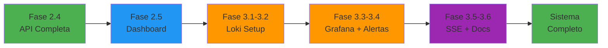

# Roadmap Executivo - Fases 2 e 3: Dashboard + Observabilidade

> **Documento Principal:** [LOGGING-ROADMAP-PHASES-2-3.md](./LOGGING-ROADMAP-PHASES-2-3.md)  
> **Versão:** 1.0  
> **Data:** 2026-01-26  
> **Status:** ✅ Pronto para Execução

---

## 📋 Resumo Executivo

Este documento consolida o roadmap completo das **Fases 2.5 e 3** do Sistema de Logging do MyIA.

### Status Atual

- ✅ **Fase 1:** Completa - Winston + SQLite + Middleware
- ✅ **Fase 2.1-2.4:** Completa - PostgreSQL + API de Busca
- 🔄 **Fase 2.5:** Dashboard Frontend (PENDENTE)
- 🔄 **Fase 3:** Observabilidade Avançada (PENDENTE)

---

## 🎯 Objetivos Consolidados

### Fase 2.5: Dashboard de Logs (Frontend)
**Estimativa:** 5-7 dias úteis

- Interface de busca e filtros de logs
- Tabela com paginação e expansão de detalhes
- Visualização completa de logs individuais
- Correlação de logs por requestId
- Gráficos de estatísticas em tempo real

### Fase 3: Observabilidade Avançada
**Estimativa:** 10-15 dias úteis

- Stack completa: Loki + Grafana + Prometheus + Alertmanager
- 3 Dashboards Grafana (Erros, Latência, Uso)
- 4 Alertas configurados (Error Rate, Latency, Service Down, Memory)
- SSE para logs em tempo real
- Documentação completa (Guias + Runbook)

---

## 📊 Estrutura de Tarefas

### Fase 2.5: Dashboard Frontend

| # | Tarefa | Estimativa | Arquivos |
|---|--------|------------|----------|
| 2.5.1 | Serviço de API | 2-3h | `logsService.ts`, `logs.ts` |
| 2.5.2 | Componente de Busca | 3-4h | `LogsSearch.tsx`, `LogsFilters.tsx` |
| 2.5.3 | Tabela de Logs | 4-5h | `LogsTable.tsx`, `LogRow.tsx`, `LogLevelBadge.tsx` |
| 2.5.4 | Página Principal | 3-4h | `LogsPage.tsx`, `App.tsx` |
| 2.5.5 | Detalhes do Log | 2-3h | `LogDetailsDrawer.tsx`, `LogMetadataViewer.tsx` |
| 2.5.6 | Correlação | 2-3h | `LogCorrelationView.tsx` |
| 2.5.7 | Gráficos Stats | 2-3h | `LogsStatsChart.tsx`, `LogsStatsCards.tsx` |

**Total:** 18-25 horas (5-7 dias úteis)

### Fase 3: Observabilidade

| # | Tarefa | Estimativa | Componentes |
|---|--------|------------|-------------|
| 3.1 | Docker Compose | 3-4h | Loki + Grafana + Promtail |
| 3.2 | Integração Loki | 2-3h | Winston Transport |
| 3.3 | Dashboards Grafana | 6-8h | 3 Dashboards |
| 3.4 | Alertas | 4-6h | Prometheus + Alertmanager |
| 3.5 | SSE Tempo Real | 4-5h | Backend + Frontend |
| 3.6 | Documentação | 4-6h | 4 Documentos |

**Total:** 23-32 horas (10-15 dias úteis)

---

## 🗓️ Cronograma Consolidado

```
┌─────────────────────────────────────────────────────────────┐
│ Semana 1: Dashboard Frontend (Fase 2.5)                     │
├─────────────────────────────────────────────────────────────┤
│ Dia 1-2:  Serviço API + Busca + Filtros                    │
│ Dia 2-3:  Tabela de Logs                                    │
│ Dia 3-4:  Página Principal                                  │
│ Dia 4-5:  Detalhes + Correlação + Gráficos                 │
└─────────────────────────────────────────────────────────────┘

┌─────────────────────────────────────────────────────────────┐
│ Semana 2: Observabilidade - Infraestrutura (Fase 3)        │
├─────────────────────────────────────────────────────────────┤
│ Dia 6-7:  Docker Compose + Loki                            │
│ Dia 8-9:  Dashboards Grafana                               │
│ Dia 10-11: Alertas (Prometheus + Alertmanager)             │
└─────────────────────────────────────────────────────────────┘

┌─────────────────────────────────────────────────────────────┐
│ Semana 3: Observabilidade - Finalização (Fase 3)           │
├─────────────────────────────────────────────────────────────┤
│ Dia 12:    SSE Tempo Real                                   │
│ Dia 13-14: Documentação Completa                           │
│ Dia 15:    Testes e Validação Final                        │
└─────────────────────────────────────────────────────────────┘

TOTAL: 15-20 dias úteis (3-4 semanas)
```

---

## 📈 Métricas de Sucesso

### Fase 2.5

| Métrica | Target |
|---------|--------|
| Performance Renderização | < 100ms |
| Tempo de Busca | < 500ms |
| Cobertura de Testes | > 80% |
| Responsividade | Mobile + Desktop |

### Fase 3

| Métrica | Target |
|---------|--------|
| Latência Loki | < 5s |
| Uptime Serviços | > 99% |
| Alertas Falsos Positivos | < 5% |
| Tempo Resposta Dashboard | < 2s |

---

## ✅ Checkpoints Críticos

### Fase 2.5

1. **Checkpoint 2.5.1:** Serviço de API funcionando
2. **Checkpoint 2.5.3:** Tabela renderizando < 100ms
3. **Checkpoint 2.5.4:** Página integrada e funcional
4. **Checkpoint 2.5.7:** Gráficos renderizando

### Fase 3

1. **Checkpoint 3.1:** Docker Compose rodando
2. **Checkpoint 3.2:** Logs chegando no Loki (< 5s)
3. **Checkpoint 3.3:** 3 Dashboards funcionando
4. **Checkpoint 3.4:** Alertas disparando corretamente
5. **Checkpoint 3.5:** SSE transmitindo (< 1s latência)
6. **Checkpoint 3.6:** Documentação completa

---

## 🔄 Estratégias de Contingência

| Problema | Solução Imediata | Plano B |
|----------|------------------|---------|
| Frontend lento | Otimizar renderização | Virtualização |
| SSE não funciona | Verificar CORS | Polling |
| Loki não ingere | Verificar Promtail | Transport direto |
| Dashboards vazios | Verificar queries | Dashboard básico |
| Alertas não disparam | Verificar regras | Simplificar |

---

## 📚 Documentos Relacionados

### Principais

1. **[LOGGING-ROADMAP-PHASES-2-3.md](./LOGGING-ROADMAP-PHASES-2-3.md)**
   - Roadmap completo com todas as tarefas detalhadas
   - Código de implementação
   - Checkpoints de validação

2. **[LOGGING-ROADMAP-PHASE-3-COMPLETE.md](./LOGGING-ROADMAP-PHASE-3-COMPLETE.md)**
   - Detalhes completos da Fase 3
   - Configurações Docker
   - Dashboards Grafana
   - Alertas e SSE

3. **[LOGS-API-DOCUMENTATION.md](./LOGS-API-DOCUMENTATION.md)**
   - Documentação da API de Logs (Fase 2.4)
   - Endpoints REST
   - Exemplos de uso

### Referências

- [LOGGING-IMPLEMENTATION-PLAN-PART2.md](./LOGGING-IMPLEMENTATION-PLAN-PART2.md)
- [STANDARDS.md](./STANDARDS.md) - Seção 13: Logging

---

## 🚀 Como Executar

### 1. Preparação

```bash
# Verificar dependências
cd frontend && npm install
cd backend && npm install

# Verificar API funcionando
curl http://localhost:3001/api/logs
```

### 2. Iniciar Fase 2.5

```bash
# Criar branch
git checkout -b feature/logging-dashboard

# Seguir tarefas sequencialmente:
# 2.5.1 → 2.5.2 → 2.5.3 → 2.5.4 → 2.5.5 → 2.5.6 → 2.5.7
```

### 3. Iniciar Fase 3

```bash
# Após completar Fase 2.5
git checkout -b feature/observability

# Seguir tarefas sequencialmente:
# 3.1 → 3.2 → 3.3 → 3.4 → 3.5 → 3.6
```

### 4. Validação Final

```bash
# Fase 2.5
cd frontend && npm run build && npm test

# Fase 3
cd docker && docker-compose -f docker-compose.observability.yml up -d
curl http://localhost:3100/ready
curl http://localhost:3002
```

---

## 📊 Diagrama de Fluxo



---

## 🎯 Próximos Passos Imediatos

1. ✅ **Revisar este roadmap** com stakeholders
2. ✅ **Aprovar cronograma** e alocar recursos
3. ✅ **Preparar ambiente** de desenvolvimento
4. 🚀 **Iniciar Tarefa 2.5.1** - Criar Serviço de API

---

**Documento criado em:** 2026-01-26  
**Versão:** 1.0  
**Status:** ✅ Pronto para Execução  
**Autor:** Kilo Code (Architect Mode)

---

**🎯 ROADMAP COMPLETO E EXECUTÁVEL**

Todos os detalhes técnicos, código de implementação, checkpoints e estratégias estão documentados nos arquivos principais. Este roadmap está pronto para ser executado imediatamente.

**Próximo passo:** Iniciar execução! 🚀
