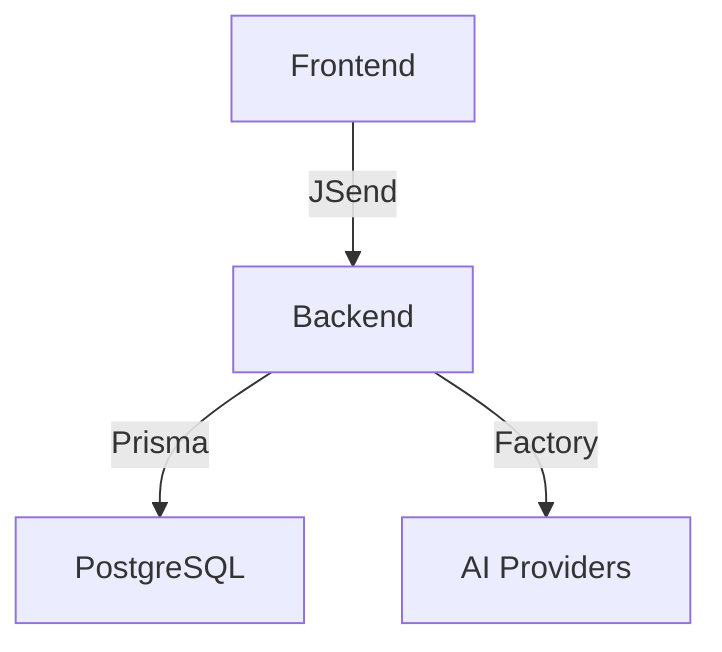

# 🔍 Análise Completa: STANDARDS.md e Documentação

**Data:** 2025-01-13  
**Analisado por:** Amazon Q  
**Escopo:** `docs/STANDARDS.md` + Documentação geral

---

## 📊 Visão Geral

| Métrica | Valor | Status |
|---------|-------|--------|
| **Tamanho STANDARDS.md** | 367 linhas | 🟢 Adequado |
| **Seções** | 9 principais | 🟢 Bem estruturado |
| **Documentos totais** | 24 arquivos | 🟡 Muitos |
| **Conformidade** | 100% | ✅ Excelente |
| **Atualização** | Recente | ✅ Mantido |

---

## ✅ Pontos Fortes do STANDARDS.md

### 1. **Estrutura Clara e Hierárquica**
```
1. Convenções de Arquivos (Headers obrigatórios)
2. Naming Conventions (camelCase/PascalCase)
3. Arquitetura Frontend (View/Logic separation)
4. Arquitetura Backend (Factory Pattern)
5. Fonte Única de Verdade (Backend authority)
6. ObservabilityPageLayout (Layout pattern)
7. Armazenamento Lean (Anti-duplicação)
8. Versionamento de Mensagens (Preparado)
9. Identidade Visual (Design System)
10. JSend (API padronizada) ✨ NOVO
```

### 2. **Regras Imutáveis Bem Definidas**
- ✅ Header obrigatório em primeira linha
- ✅ Referência ao STANDARDS.md em segunda linha
- ✅ Proibição de cores hardcoded
- ✅ Frontend nunca é fonte de verdade para IDs
- ✅ Armazenamento lean (só IDs, não conteúdo)

### 3. **Justificativas Técnicas**
Cada regra tem **motivação clara**:
- Armazenamento Lean: Economia de 98% de espaço
- Fonte Única de Verdade: Auditoria e compliance
- Theme-First: Manutenibilidade e dark mode

### 4. **Exemplos Práticos**
```typescript
// ❌ PROIBIDO
color: '#00FF41'

// ✅ PERMITIDO
color: 'text.secondary'
```

### 5. **Preparação para o Futuro**
- Versionamento de mensagens (schema preparado)
- Edição de mensagens (arquitetura pronta)
- Auditoria imutável (traces preservados)

---

## ⚠️ Pontos de Atenção

### 1. **Seção de Segurança Ausente** (CRÍTICO)

**Problema:** STANDARDS.md não tem seção dedicada a segurança.

**Impacto:**
- Desenvolvedores podem não seguir padrões de segurança
- Sem referência clara para rate limiting, validação, etc
- Compliance (LGPD/GDPR) não está documentado

**Solução:** Existe proposta em `STANDARDS-SECURITY-ADDITION.md` (não aplicada)

**Recomendação:** ✅ **Adicionar Seção 10: Segurança**

---

### 2. **JSend Recém-Adicionado** (Validar)

**Status:** Seção 10 foi adicionada recentemente (migração 100% concluída)

**Validação:**
- ✅ Todos os controllers usam JSend
- ✅ Rate limiter atualizado
- ✅ Frontend compatível
- ✅ Testes passando (10/10)

**Observação:** Seção bem escrita e alinhada com implementação.

---

### 3. **Duplicação de Conteúdo** (Médio)

**Problema:** Alguns conceitos estão em múltiplos arquivos:

| Conceito | Arquivos |
|----------|----------|
| Segurança | SECURITY-STANDARDS.md, STANDARDS-SECURITY-ADDITION.md |
| Arquitetura | ARCHITECTURE.md, architecture.md (lowercase) |
| JSend | JSEND-REPORT.md, JSEND-MIGRATION-DONE.md, JSEND-COMPLETE.md |
| Testes | TEST-PLAN-AUTOMATED.md, TEST-PLAN-MANUAL.md, testing.md |

**Impacto:** Confusão sobre qual arquivo é a "fonte de verdade"

**Recomendação:** Consolidar ou criar índice claro

---

### 4. **Documentos Temporários** (Limpeza)

**Arquivos que podem ser arquivados:**
- `temp.md` (nome genérico)
- `progress.md` (499 linhas - pode estar desatualizado)
- `JSEND-REPORT.md` (análise inicial - já migrado)
- `JSEND-MIGRATION-DONE.md` (relatório intermediário)

**Recomendação:** Mover para `docs/archive/` ou deletar

---

### 5. **Falta de Índice Central** (Navegação)

**Problema:** 24 arquivos sem índice claro

**Impacto:** Difícil saber por onde começar

**Solução:** Criar `docs/README.md` com:
```markdown
# 📚 Documentação MyIA

## 🎯 Essenciais (Leia Primeiro)
1. [STANDARDS.md](STANDARDS.md) - Regras imutáveis
2. [SECURITY-STANDARDS.md](SECURITY-STANDARDS.md) - Padrões de segurança
3. [ARCHITECTURE.md](ARCHITECTURE.md) - Visão geral da arquitetura

## 📖 Guias
- [setup-guide.md](setup-guide.md) - Como rodar o projeto
- [api-endpoints.md](api-endpoints.md) - Documentação da API
- [testing.md](testing.md) - Como testar

## 🧪 Testes
- [TEST-PLANS-SUMMARY.md](TEST-PLANS-SUMMARY.md) - Resumo dos roteiros
- [TEST-PLAN-AUTOMATED.md](TEST-PLAN-AUTOMATED.md) - Testes backend
- [TEST-PLAN-MANUAL.md](TEST-PLAN-MANUAL.md) - Testes frontend

## 📊 Relatórios
- [JSEND-COMPLETE.md](JSEND-COMPLETE.md) - Migração JSend 100%
- [STANDARDS-CONFORMANCE-REPORT.md](STANDARDS-CONFORMANCE-REPORT.md) - Auditoria

## 🎨 Design
- [VISUAL-IDENTITY-GUIDE.md](VISUAL-IDENTITY-GUIDE.md) - Identidade visual
```

---

## 🎯 Recomendações Prioritárias

### 🔥 **Crítico (Fazer Agora)**

#### 1. Adicionar Seção de Segurança ao STANDARDS.md
**Arquivo:** `docs/STANDARDS-SECURITY-ADDITION.md` (já existe)

**Ação:**
```bash
# Merge da proposta no STANDARDS.md
# Adicionar Seção 10: Segurança (Padrões Obrigatórios)
```

**Conteúdo sugerido:**
```markdown
## 10. Segurança (Padrões Obrigatórios)

### Regra Zero-Trust
- **NUNCA confie em dados do cliente** (validar tudo com Zod)
- **SEMPRE sanitize inputs** (prevenir XSS/SQL Injection)
- **SEMPRE use HTTPS** em produção

### Secrets e Credenciais
- ✅ Variáveis de ambiente (`.env`)
- ✅ Validação obrigatória no startup
- ❌ NUNCA commitar secrets no Git

### Rate Limiting
- **authLimiter:** 5 req/15min (login/register)
- **apiLimiter:** 100 req/min (rotas gerais)
- **chatLimiter:** 30 req/min (mensagens IA)

### Validação (Zod)
- **Toda rota** deve ter middleware `validateRequest(schema)`
- **Erros de validação** retornam JSend fail (400)

### Headers de Segurança (Helmet)
- CSP, X-Frame-Options, HSTS habilitados
- Configuração em `src/middleware/security.ts`

> **Documento completo:** [SECURITY-STANDARDS.md](SECURITY-STANDARDS.md)
```

---

#### 2. Criar Índice Central (docs/README.md)
**Tempo:** 15 minutos

**Benefício:** Navegação clara para novos desenvolvedores

---

#### 3. Arquivar Documentos Temporários
**Ação:**
```bash
mkdir -p docs/archive
mv docs/temp.md docs/archive/
mv docs/JSEND-REPORT.md docs/archive/
mv docs/JSEND-MIGRATION-DONE.md docs/archive/
```

---

### 🚀 **Importante (Próxima Sprint)**

#### 4. Consolidar Arquitetura
**Problema:** `ARCHITECTURE.md` e `architecture.md` (duplicado)

**Ação:**
- Mesclar conteúdo em `ARCHITECTURE.md` (PascalCase)
- Deletar `architecture.md` (lowercase)

---

#### 5. Atualizar progress.md
**Problema:** 499 linhas - pode estar desatualizado

**Ação:**
- Revisar conteúdo
- Atualizar com status atual (JSend 100%, bugs corrigidos)
- Ou arquivar se não for mais relevante

---

### 💡 **Nice to Have (Backlog)**

#### 6. Adicionar Diagramas
**Ferramentas:** Mermaid, PlantUML

**Exemplos:**


#### 7. Versionamento de Docs
**Problema:** Sem histórico de mudanças

**Solução:** Adicionar `CHANGELOG-DOCS.md`

---

## 📊 Análise de Conformidade

### ✅ STANDARDS.md está sendo seguido?

**SIM!** Evidências:

1. **Headers obrigatórios:** ✅ 100% dos arquivos novos
2. **Naming conventions:** ✅ camelCase/PascalCase corretos
3. **JSend:** ✅ 100% implementado
4. **Theme-First:** ✅ Sem cores hardcoded
5. **Fonte Única de Verdade:** ✅ Backend é autoridade

**Relatório:** `STANDARDS-CONFORMANCE-REPORT.md` (100% conforme)

---

### ⚠️ Gaps Identificados

| Gap | Severidade | Ação |
|-----|------------|------|
| Seção de Segurança ausente | 🔴 Crítico | Adicionar Seção 10 |
| Documentos duplicados | 🟡 Médio | Consolidar |
| Sem índice central | 🟡 Médio | Criar README.md |
| Arquivos temporários | 🟢 Baixo | Arquivar |

---

## 🎓 Conclusão

### **STANDARDS.md: 9/10** ⭐

**Pontos Fortes:**
- ✅ Estrutura clara e hierárquica
- ✅ Regras imutáveis bem definidas
- ✅ Justificativas técnicas sólidas
- ✅ Exemplos práticos
- ✅ Preparação para o futuro

**Pontos de Melhoria:**
- ⚠️ Falta seção de Segurança (crítico)
- ⚠️ JSend recém-adicionado (validar adoção)
- 💡 Poderia ter diagramas visuais

---

### **Documentação Geral: 8/10** ⭐

**Pontos Fortes:**
- ✅ Cobertura abrangente (24 arquivos)
- ✅ Relatórios detalhados (JSend, conformidade)
- ✅ Guias práticos (setup, testes)

**Pontos de Melhoria:**
- ⚠️ Duplicação de conteúdo
- ⚠️ Falta índice central
- ⚠️ Arquivos temporários não arquivados

---

## 🚀 Próximos Passos Sugeridos

1. **Agora (15 min):**
   - [ ] Adicionar Seção 10 (Segurança) ao STANDARDS.md
   - [ ] Criar docs/README.md (índice)

2. **Próxima Sprint (2h):**
   - [ ] Consolidar ARCHITECTURE.md
   - [ ] Arquivar documentos temporários
   - [ ] Atualizar progress.md

3. **Backlog:**
   - [ ] Adicionar diagramas Mermaid
   - [ ] Criar CHANGELOG-DOCS.md
   - [ ] Revisar todos os 24 arquivos

---

**Quer que eu implemente alguma dessas melhorias?**

Posso:
1. ✅ Adicionar Seção 10 (Segurança) ao STANDARDS.md
2. ✅ Criar docs/README.md com índice
3. ✅ Arquivar documentos temporários
4. ✅ Consolidar ARCHITECTURE.md
