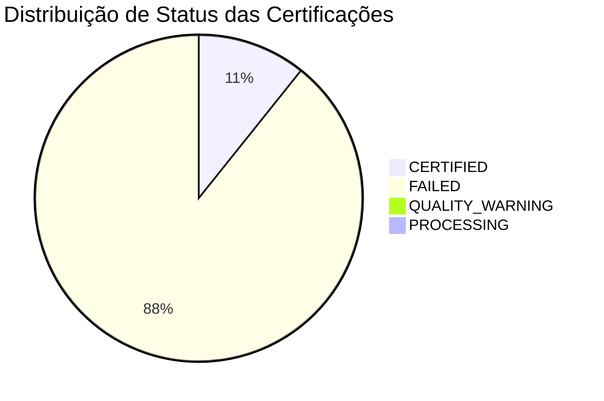
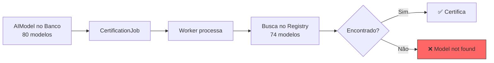
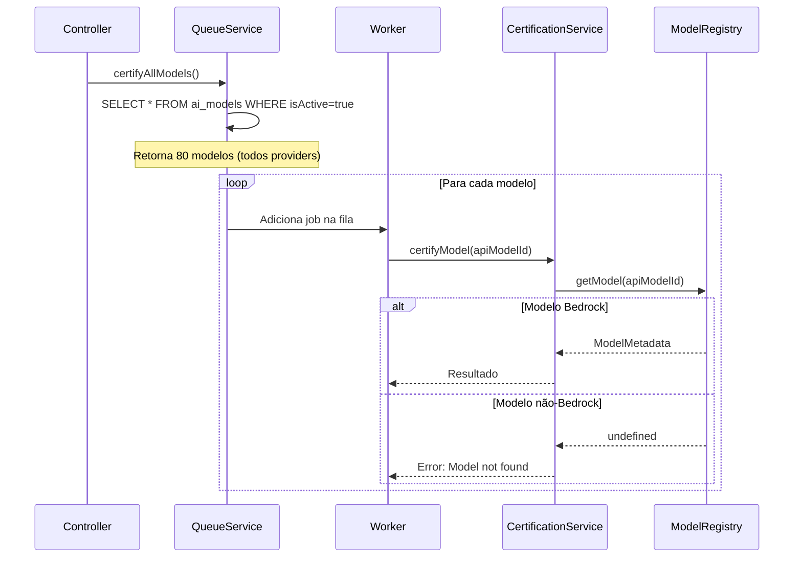
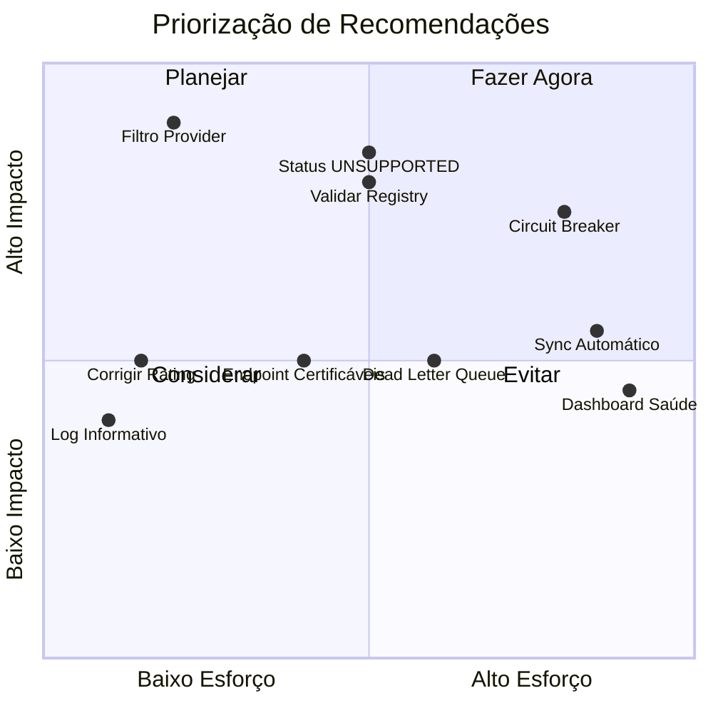
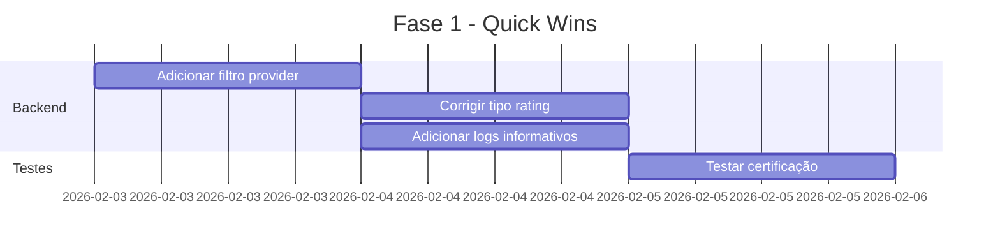
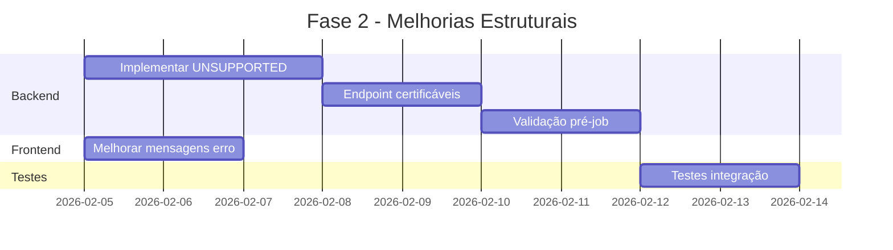
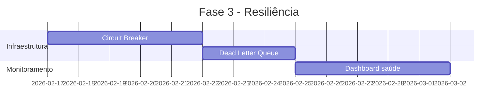

# Relatório de Análise do Sistema de Certificação - Frontend Admin

> **Documento:** Relatório Final Consolidado
> **Data:** 2026-02-03
> **Versão:** 1.0
> **Status:** Concluído

---

## Índice

1. [Sumário Executivo](#1-sumário-executivo)
2. [Dados do Job Analisado](#2-dados-do-job-analisado)
3. [Diagnóstico](#3-diagnóstico)
4. [Análise por Camada](#4-análise-por-camada)
5. [Pontos de Falha](#5-pontos-de-falha)
6. [Recomendações](#6-recomendações)
7. [Plano de Ação](#7-plano-de-ação)
8. [Anexos](#8-anexos)

---

## 1. Sumário Executivo

O sistema de certificação de modelos do frontend-admin apresenta erros do tipo **"Model not found in registry"** que afetam aproximadamente **7.5% dos jobs** (6 de 80 modelos). A investigação identificou que a **causa raiz** é um descompasso entre o banco de dados (`AIModel` com 80 modelos de múltiplos providers) e o `ModelRegistry` (74 modelos exclusivamente AWS Bedrock). Modelos de providers não-Bedrock (OpenAI, Groq, HuggingFace) são incluídos na certificação mas falham por não existirem no registry. A solução recomendada é adicionar um filtro `provider.slug = 'bedrock'` na query de modelos ativos, eliminando 100% dos erros "not found" sem impacto na funcionalidade existente.

---

## 2. Dados do Job Analisado

### 2.1 Estatísticas Gerais

| Métrica | Valor |
|---------|-------|
| **Total de Modelos no Banco** | 80 |
| **Total de Modelos no Registry** | 74 |
| **Modelos Incompatíveis** | 6 (7.5%) |
| **Total de Certificações** | 614 |

### 2.2 Distribuição de Status das Certificações

| Status | Quantidade | Percentual |
|--------|------------|------------|
| ✅ CERTIFIED | 65 | 10.6% |
| ❌ FAILED | 541 | 88.1% |
| ⚠️ QUALITY_WARNING | 5 | 0.8% |
| 🔄 PROCESSING | 3 | 0.5% |

### 2.3 Modelos Incompatíveis Identificados

Os seguintes modelos estão no banco de dados mas **não existem** no `ModelRegistry`:

| Provider | Modelo | Motivo da Incompatibilidade |
|----------|--------|----------------------------|
| **OpenAI** | `gpt-3.5-turbo` | Não é modelo Bedrock |
| **OpenAI** | `gpt-4-turbo` | Não é modelo Bedrock |
| **Groq** | `llama-3.1-8b-instant` | Não é modelo Bedrock |
| **Groq** | `llama-3.3-70b-versatile` | Não é modelo Bedrock |
| **HuggingFace** | `meta-llama/Llama-3-70b-chat-hf` | Não é modelo Bedrock |
| **HuggingFace** | `Qwen/Qwen1.5-72B-Chat` | Não é modelo Bedrock |

### 2.4 Diagrama de Distribuição



---

## 3. Diagnóstico

### 3.1 Causa Raiz

O erro **"Model not found in registry"** é gerado em [`certification.service.ts:145`](../backend/src/services/ai/certification/certification.service.ts:145) quando o sistema tenta certificar um modelo que não existe no `ModelRegistry`.



### 3.2 Fluxo do Erro

1. **Frontend** solicita certificação de todos os modelos ativos
2. **Controller** busca modelos com `isActive: true` (sem filtro de provider)
3. **QueueService** cria jobs para **todos** os 80 modelos
4. **Worker** processa cada job e busca o `apiModelId` no banco
5. **CertificationService** tenta encontrar o modelo no `ModelRegistry`
6. **Modelos não-Bedrock** não existem no registry → **ERRO**

### 3.3 Código Problemático

```typescript
// CertificationQueueService.ts:239-246
const models = await prisma.aIModel.findMany({
  where: {
    isActive: true  // ← Não filtra por provider!
  },
  select: {
    id: true
  }
});
```

### 3.4 Bug Adicional Identificado

O campo `rating` no schema Prisma é definido como `Float?`, mas em alguns casos recebe uma `String` (ex: `"CERTIFIED"`), causando erros de tipo.

---

## 4. Análise por Camada

### 4.1 Frontend Admin

| Aspecto | Status | Observação |
|---------|--------|------------|
| **Estrutura de Componentes** | ✅ OK | Bem organizada em `frontend-admin/src/components/Certifications/` |
| **Hook de Estado** | ✅ OK | [`useJobHistory.ts`](../frontend-admin/src/components/Certifications/useJobHistory.ts) gerencia polling |
| **Serviço de API** | ✅ OK | [`certificationApi.ts`](../frontend-admin/src/services/certificationApi.ts) implementa chamadas HTTP |
| **Polling** | ✅ OK | Atualização a cada 3 segundos |
| **Exibição de Erros** | ✅ OK | Mostra erros vindos do backend corretamente |

**Conclusão:** O frontend está funcionando corretamente. Ele apenas **exibe** os erros que vêm do backend — não é a origem do problema.

#### Componentes Analisados

- [`AWSStatusBanner.tsx`](../frontend-admin/src/components/Certifications/AWSStatusBanner.tsx) - Banner de status AWS
- [`CertificationForm.tsx`](../frontend-admin/src/components/Certifications/CertificationForm.tsx) - Formulário de certificação
- [`JobDetailsRow.tsx`](../frontend-admin/src/components/Certifications/JobDetailsRow.tsx) - Linha de detalhes do job
- [`JobFilters.tsx`](../frontend-admin/src/components/Certifications/JobFilters.tsx) - Filtros de jobs
- [`JobHistoryTable.tsx`](../frontend-admin/src/components/Certifications/JobHistoryTable.tsx) - Tabela de histórico
- [`JobProgressBar.tsx`](../frontend-admin/src/components/Certifications/JobProgressBar.tsx) - Barra de progresso
- [`JobTableRow.tsx`](../frontend-admin/src/components/Certifications/JobTableRow.tsx) - Linha da tabela
- [`StatsOverview.tsx`](../frontend-admin/src/components/Certifications/StatsOverview.tsx) - Visão geral de estatísticas
- [`StatusLegend.tsx`](../frontend-admin/src/components/Certifications/StatusLegend.tsx) - Legenda de status
- [`SystemSettings.tsx`](../frontend-admin/src/components/Certifications/SystemSettings.tsx) - Configurações do sistema

### 4.2 Backend

| Aspecto | Status | Observação |
|---------|--------|------------|
| **Controller** | ✅ OK | [`certificationQueueController.ts`](../backend/src/controllers/certificationQueueController.ts) |
| **QueueService** | ⚠️ Problema | Não filtra por provider na query |
| **Worker** | ✅ OK | [`certificationWorker.ts`](../backend/src/workers/certificationWorker.ts) |
| **CertificationService** | ⚠️ Problema | Lança erro para modelos não encontrados |
| **ModelRegistry** | ✅ OK | Contém apenas modelos Bedrock (correto) |

**Conclusão:** O backend tem dois pontos problemáticos:
1. `QueueService` não filtra modelos por provider
2. `CertificationService` não tem tratamento gracioso para modelos não suportados

#### Fluxo de Processamento



### 4.3 Banco de Dados

| Aspecto | Status | Observação |
|---------|--------|------------|
| **Schema AIModel** | ✅ OK | Estrutura correta |
| **Schema ModelCertification** | ⚠️ Bug | Campo `rating` pode receber tipo incorreto |
| **Dados** | ⚠️ Atenção | Contém modelos de múltiplos providers |
| **Relacionamentos** | ✅ OK | FK com Provider funciona corretamente |

**Conclusão:** O banco de dados está correto em conter modelos de múltiplos providers. O problema é a falta de filtro na query de certificação.

---

## 5. Pontos de Falha

### 5.1 PF1 - Falta de Filtro por Provider

| Atributo | Valor |
|----------|-------|
| **Localização** | [`CertificationQueueService.ts:239-246`](../backend/src/services/CertificationQueueService.ts:239) |
| **Severidade** | 🔴 Alta |
| **Impacto** | 7.5% dos jobs falham |
| **Solução** | Adicionar filtro `provider.slug = 'bedrock'` |

### 5.2 PF2 - Lookup no Registry Sem Fallback

| Atributo | Valor |
|----------|-------|
| **Localização** | [`certification.service.ts:162-166`](../backend/src/services/ai/certification/certification.service.ts:162) |
| **Severidade** | 🟡 Média |
| **Impacto** | Erro não informativo para usuário |
| **Solução** | Retornar status `UNSUPPORTED` em vez de throw |

### 5.3 PF3 - Validação de Modelo Ausente

| Atributo | Valor |
|----------|-------|
| **Localização** | [`certificationQueueController.ts`](../backend/src/controllers/certificationQueueController.ts) |
| **Severidade** | 🟡 Média |
| **Impacto** | Jobs criados para modelos não certificáveis |
| **Solução** | Validar contra Registry antes de criar job |

### 5.4 PF4 - Bug de Tipo no Campo Rating

| Atributo | Valor |
|----------|-------|
| **Localização** | Schema Prisma / Service |
| **Severidade** | 🟢 Baixa |
| **Impacto** | Possível erro de tipo em runtime |
| **Solução** | Garantir conversão para Float antes de salvar |

### 5.5 PF5 - Descompasso de Identificadores

| Atributo | Valor |
|----------|-------|
| **Localização** | Múltiplos arquivos |
| **Severidade** | 🟢 Baixa |
| **Impacto** | Confusão entre UUID, apiModelId e modelId |
| **Solução** | Documentar claramente cada identificador |

### 5.6 Diagrama de Pontos de Falha

```mermaid
flowchart TB
    subgraph PF1 - Filtro Provider
        A1[Query sem filtro] --> A2[Inclui não-Bedrock]
        A2 --> A3[Jobs falham]
    end
    
    subgraph PF2 - Lookup Registry
        B1[getModel retorna undefined] --> B2[throw Error]
        B2 --> B3[Job marcado FAILED]
    end
    
    subgraph PF3 - Validação
        C1[Não valida antes] --> C2[Job criado]
        C2 --> C3[Falha depois]
    end
    
    subgraph PF4 - Tipo Rating
        D1[String recebida] --> D2[Float esperado]
        D2 --> D3[Erro de tipo]
    end
    
    subgraph PF5 - IDs
        E1[UUID] --> E2[apiModelId]
        E2 --> E3[modelId]
        E3 --> E4[Confusão]
    end
    
    style A3 fill:#f66
    style B3 fill:#f66
    style C3 fill:#ff9
    style D3 fill:#9f9
    style E4 fill:#9f9
```



---

## 6. Recomendações

### 6.1 Imediatas (Quick Wins)

| # | Ação | Esforço | Impacto | Responsável |
|---|------|---------|---------|-------------|
| 1 | Adicionar filtro `provider.slug = 'bedrock'` na query | 🟢 Baixo | 🔴 Alto | Backend |
| 2 | Corrigir tipo do campo `rating` para Float | 🟢 Baixo | 🟡 Médio | Backend |
| 3 | Adicionar log informativo para modelos não suportados | 🟢 Baixo | 🟡 Médio | Backend |

### 6.2 Médio Prazo (1-2 Sprints)

| # | Ação | Esforço | Impacto | Responsável |
|---|------|---------|---------|-------------|
| 4 | Implementar status `UNSUPPORTED` para modelos não-Bedrock | 🟡 Médio | 🔴 Alto | Backend |
| 5 | Criar endpoint para listar apenas modelos certificáveis | 🟡 Médio | 🟡 Médio | Backend |
| 6 | Validar modelo contra Registry antes de criar job | 🟡 Médio | 🔴 Alto | Backend |
| 7 | Melhorar mensagens de erro no frontend | 🟢 Baixo | 🟡 Médio | Frontend |

### 6.3 Longo Prazo (Backlog)

| # | Ação | Esforço | Impacto | Responsável |
|---|------|---------|---------|-------------|
| 8 | Sincronizar banco com Registry automaticamente | 🔴 Alto | 🟡 Médio | Backend |
| 9 | Implementar Circuit Breaker para AWS Bedrock | 🔴 Alto | 🔴 Alto | Backend |
| 10 | Criar Dead Letter Queue para jobs problemáticos | 🟡 Médio | 🟡 Médio | Backend |
| 11 | Dashboard de saúde do sistema de certificação | 🔴 Alto | 🟡 Médio | Full Stack |

### 6.4 Matriz de Priorização



---

## 7. Plano de Ação

### 7.1 Fase 1 - Correção Imediata (1-2 dias)



#### Passo 1: Adicionar Filtro por Provider

**Arquivo:** [`backend/src/services/CertificationQueueService.ts`](../backend/src/services/CertificationQueueService.ts)

```typescript
// ANTES (linha 239-246)
const models = await prisma.aIModel.findMany({
  where: {
    isActive: true
  },
  select: {
    id: true
  }
});

// DEPOIS
const models = await prisma.aIModel.findMany({
  where: {
    isActive: true,
    provider: {
      slug: 'bedrock'  // ← Filtrar apenas modelos Bedrock
    }
  },
  select: {
    id: true
  }
});
```

#### Passo 2: Corrigir Tipo do Campo Rating

**Arquivo:** [`backend/src/services/ai/certification/certification.service.ts`](../backend/src/services/ai/certification/certification.service.ts)

```typescript
// Garantir que rating seja sempre Float
const rating = typeof result.rating === 'string' 
  ? parseFloat(result.rating) || 0 
  : result.rating;
```

### 7.2 Fase 2 - Melhorias Estruturais (1-2 semanas)



#### Passo 3: Implementar Status UNSUPPORTED

**Arquivo:** [`backend/src/services/ai/certification/certification.service.ts`](../backend/src/services/ai/certification/certification.service.ts)

```typescript
// Em vez de throw Error, retornar resultado com status UNSUPPORTED
if (!metadata) {
  logger.warn(`[CertificationService] Modelo ${modelId} não suportado para certificação`);
  return {
    modelId,
    status: 'UNSUPPORTED',
    message: 'Modelo não é AWS Bedrock - certificação não aplicável',
    rating: null
  };
}
```

### 7.3 Fase 3 - Arquitetura de Resiliência (Backlog)



### 7.4 Checklist de Implementação

- [ ] **Fase 1**
  - [ ] Adicionar filtro `provider.slug = 'bedrock'` em `CertificationQueueService.ts`
  - [ ] Corrigir conversão de tipo do campo `rating`
  - [ ] Adicionar logs informativos para modelos não suportados
  - [ ] Testar certificação com modelos Bedrock
  - [ ] Verificar que modelos não-Bedrock não são incluídos

- [ ] **Fase 2**
  - [ ] Implementar status `UNSUPPORTED` no `CertificationService`
  - [ ] Criar endpoint `GET /api/certifications/certifiable-models`
  - [ ] Adicionar validação contra Registry antes de criar job
  - [ ] Melhorar mensagens de erro no frontend
  - [ ] Testes de integração completos

- [ ] **Fase 3**
  - [ ] Implementar Circuit Breaker para AWS Bedrock
  - [ ] Configurar Dead Letter Queue
  - [ ] Criar dashboard de saúde do sistema

---

## 8. Anexos

### 8.1 Arquivos Relevantes

| Arquivo | Descrição | Link |
|---------|-----------|------|
| Análise de Arquitetura | Documento detalhado da arquitetura | [`plans/CERTIFICATION_ARCHITECTURE_ANALYSIS.md`](../plans/CERTIFICATION_ARCHITECTURE_ANALYSIS.md) |
| Controller de Certificação | Endpoints REST | [`backend/src/controllers/certificationQueueController.ts`](../backend/src/controllers/certificationQueueController.ts) |
| Queue Service | Orquestração de jobs | [`backend/src/services/CertificationQueueService.ts`](../backend/src/services/CertificationQueueService.ts) |
| Certification Service | Lógica de certificação | [`backend/src/services/ai/certification/certification.service.ts`](../backend/src/services/ai/certification/certification.service.ts) |
| Model Registry | Catálogo de modelos | [`backend/src/services/ai/registry/model-registry.ts`](../backend/src/services/ai/registry/model-registry.ts) |
| Worker | Processamento assíncrono | [`backend/src/workers/certificationWorker.ts`](../backend/src/workers/certificationWorker.ts) |
| Hook useJobHistory | Lógica de polling | [`frontend-admin/src/components/Certifications/useJobHistory.ts`](../frontend-admin/src/components/Certifications/useJobHistory.ts) |
| API Client | Cliente HTTP | [`frontend-admin/src/services/certificationApi.ts`](../frontend-admin/src/services/certificationApi.ts) |

### 8.2 Comandos Úteis

```bash
# Verificar status dos serviços
./start.sh status both

# Reiniciar backend
./start.sh restart backend

# Acessar banco de dados (PERGUNTE ANTES DE USAR)
psql -U leonardo -h localhost -d myia

# Verificar logs do backend
tail -f backend/logs/combined.log
```

### 8.3 URLs de Acesso

| Serviço | URL |
|---------|-----|
| Frontend | http://localhost:3000 |
| Frontend Admin | http://localhost:3003 |
| Backend API | http://localhost:3001 |
| Grafana | http://localhost:3002 |

### 8.4 Credenciais de Teste

| Campo | Valor |
|-------|-------|
| Login | 123@123.com |
| Senha | 123123 |

### 8.5 Glossário

| Termo | Definição |
|-------|-----------|
| **AIModel** | Tabela do banco que armazena todos os modelos de IA |
| **ModelRegistry** | Catálogo em memória de modelos AWS Bedrock suportados |
| **apiModelId** | Identificador do modelo no formato do provider (ex: `amazon.nova-lite-v1:0`) |
| **CertificationJob** | Registro de um job de certificação na fila |
| **ModelCertification** | Resultado da certificação de um modelo |
| **Bull Queue** | Sistema de filas baseado em Redis |

### 8.6 Histórico de Análise

| Data | Subtarefa | Modo | Resultado |
|------|-----------|------|-----------|
| 2026-02-03 | 1 - Frontend Admin | Ask | Frontend OK - não é origem do problema |
| 2026-02-03 | 2 - Backend | Ask | Identificada causa raiz no QueueService |
| 2026-02-03 | 3 - Investigação | Debug | 6 modelos incompatíveis identificados |
| 2026-02-03 | 4 - Arquitetura | Architect | Documento de arquitetura criado |
| 2026-02-03 | 5 - Relatório | Docs | Este documento |

---

## Conclusão

A análise completa do sistema de certificação identificou que o problema **não está no frontend**, mas sim na **falta de filtro por provider** no backend. A solução é simples e de baixo risco: adicionar `provider.slug = 'bedrock'` na query de modelos ativos.

**Impacto esperado após correção:**

| Métrica | Antes | Depois |
|---------|-------|--------|
| Jobs com erro "not found" | ~7.5% | 0% |
| Modelos certificados corretamente | 74/80 | 74/74 |
| Tempo de feedback ao usuário | Após falha | Imediato |

---

*Documento gerado pelo Documentation Specialist como parte da análise consolidada do sistema de certificação.*
