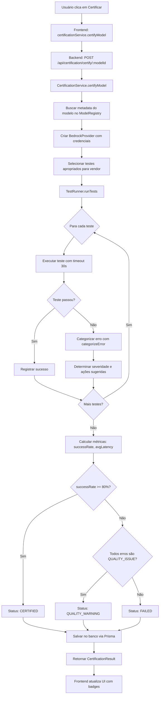

# 📚 Guia Completo do Sistema de Certificação AWS Bedrock

**Versão:** 1.0  
**Data:** Janeiro 2026  
**Status:** ✅ Produção

---

## 📋 Índice

1. [Visão Geral](#-visão-geral)
2. [Como Usar (Passo a Passo)](#-como-usar-passo-a-passo)
3. [Sistema de Badges](#-sistema-de-badges)
4. [Categorias de Erro](#-categorias-de-erro)
5. [Perguntas Frequentes (FAQ)](#-perguntas-frequentes-faq)
6. [Arquitetura Técnica](#-arquitetura-técnica-para-desenvolvedores)
7. [Troubleshooting](#-troubleshooting)

---

## 🎯 Visão Geral

### O que é o Sistema de Certificação?

O Sistema de Certificação AWS Bedrock é uma funcionalidade inteligente que **testa e valida automaticamente** cada modelo de IA antes de você usá-lo. Ele executa uma bateria de testes para garantir que o modelo está funcionando corretamente e identifica problemas potenciais.

### Por que foi criado?

Antes do sistema de certificação, você poderia selecionar um modelo que:
- ❌ Não existe na sua região AWS
- ❌ Você não tem permissão para acessar
- ❌ Está temporariamente indisponível
- ⚠️ Funciona mas tem limitações de qualidade

Isso resultava em **erros inesperados** durante o uso e **frustração** ao tentar descobrir o que estava errado.

### Benefícios para o Usuário

✅ **Confiança:** Saiba exatamente quais modelos funcionam antes de usá-los  
✅ **Transparência:** Veja detalhes sobre problemas e como resolvê-los  
✅ **Economia de Tempo:** Não perca tempo testando modelos que não funcionarão  
✅ **Decisões Informadas:** Escolha modelos com base em informações reais de qualidade  
✅ **Troubleshooting Guiado:** Receba ações sugeridas para resolver problemas

---

## 🚀 Como Usar (Passo a Passo)

### Passo 1: Acessar a Tela de Configuração AWS

1. Faça login na plataforma
2. Clique no ícone de **Configurações** (⚙️) no menu lateral
3. Selecione a aba **"AWS Bedrock"**

**Você verá:**
- Campos para inserir credenciais AWS (Access Key, Secret Key, Região)
- Lista de modelos disponíveis agrupados por provedor (Anthropic, Amazon, Cohere)

### Passo 2: Configurar Credenciais AWS

1. **Access Key ID:** Insira sua chave de acesso AWS (começa com `AKIA`)
2. **Secret Access Key:** Insira sua chave secreta (40 caracteres)
3. **Região:** Selecione a região AWS onde seus modelos estão disponíveis (ex: `us-east-1`)

4. Clique em **"Testar e Salvar"**

**O que acontece:**
- Sistema valida suas credenciais com a AWS
- Se válidas, carrega a lista de modelos disponíveis na região
- Credenciais são criptografadas e salvas no banco de dados

### Passo 3: Selecionar Modelos

1. **Buscar modelos:** Use a barra de busca para filtrar por nome, ID ou provedor
2. **Expandir provedores:** Clique nos acordeões para ver modelos de cada provedor
3. **Selecionar modelos:** Marque os checkboxes dos modelos que deseja usar

**Dica:** Clique no ícone **ℹ️** ao lado de cada modelo para ver:
- ID da API
- Context Window (tamanho máximo de entrada)
- Custos por 1k tokens (entrada e saída)
- Suporte a streaming

### Passo 4: Certificar Modelos

1. Após selecionar os modelos, clique em **"Certificar X Modelos"**
2. Um diálogo de progresso será aberto mostrando:
   - Nome de cada modelo sendo testado
   - Status em tempo real (Pendente → Executando → Sucesso/Erro)
   - Tempo decorrido
   - Resultado da certificação

**O que acontece durante a certificação:**
- Sistema executa 4-6 testes por modelo (dependendo do provedor)
- Testes incluem: prompt básico, streaming, contexto, JSON, etc.
- Cada teste tem timeout de 30 segundos
- Erros são categorizados automaticamente
- Resultados são salvos permanentemente no banco de dados

**Tempo estimado:** 30-60 segundos por modelo

### Passo 5: Interpretar os Badges

Após a certificação, cada modelo exibirá um badge colorido:

- **✅ Certificado (Verde):** Modelo passou em 80%+ dos testes e está pronto para uso
- **⚠️ Qualidade (Amarelo):** Modelo funciona mas tem limitações de qualidade
- **❌ Indisponível (Vermelho):** Modelo não pode ser usado no momento

### Passo 6: Ver Detalhes de Certificação

1. Clique no ícone **ℹ️** ao lado de qualquer modelo certificado
2. Um drawer lateral será aberto com:
   - Status da certificação
   - Data da última verificação
   - Categoria e severidade do erro (se houver)
   - Mensagem explicativa
   - Ações sugeridas para resolver problemas

### Passo 7: Entender Erros e Ações Sugeridas

Se um modelo falhou na certificação, o drawer mostrará:

**Exemplo de erro de permissão:**
```
❌ Modelo Indisponível

Sem permissão para acessar o modelo

Ações sugeridas:
1. Adicionar política IAM: bedrock:InvokeModel
2. Adicionar política IAM: bedrock:InvokeModelWithResponseStream
3. Verificar se a região está permitida nas políticas
4. Consultar documentação de permissões AWS Bedrock
```

**Exemplo de aviso de qualidade:**
```
⚠️ Modelo Disponível com Limitações

Modelo disponível mas com limitações de qualidade: Response too short

Ações sugeridas:
1. ✅ Modelo pode ser usado normalmente
2. Avaliar se limitações são aceitáveis para seu caso
3. Testar manualmente com seus prompts
4. Considerar usar outro modelo se qualidade for crítica
```

### Passo 8: Salvar Modelos Selecionados

1. Após certificar e revisar os resultados, clique em **"Salvar Modelos Selecionados"**
2. Apenas os modelos marcados serão habilitados para uso na plataforma

**Importante:** A certificação é salva automaticamente e não depende de salvar a seleção de modelos. Você pode certificar agora e decidir quais usar depois.

---

## 🏷️ Sistema de Badges

### ✅ Certificado (Verde)

**O que significa:**
- Modelo passou em **80% ou mais** dos testes
- Está pronto para uso em produção
- Não apresentou erros críticos

**Quando aparece:**
- Todos os testes passaram com sucesso, OU
- Alguns testes falharam mas a taxa de sucesso é ≥ 80%

**Pode usar?** ✅ **SIM** - Modelo totalmente funcional e recomendado

**Exemplo visual:**
```
[✅ Certificado] Claude 3 Sonnet
```

---

### ⚠️ Qualidade (Amarelo)

**O que significa:**
- Modelo **está disponível e pode ser usado**
- Apresentou problemas de qualidade em alguns testes
- Funciona mas pode ter limitações específicas

**Quando aparece:**
- Modelo respondeu mas com respostas muito curtas
- Streaming não funcionou perfeitamente
- Não manteve contexto em conversas longas
- Resposta não estava no formato esperado

**Pode usar?** ✅ **SIM** - Modelo funciona, mas avalie se as limitações são aceitáveis para seu caso de uso

**Exemplos de limitações:**
- Respostas mais curtas que o esperado
- Streaming pode não funcionar
- Contexto pode ser perdido em conversas muito longas

**Exemplo visual:**
```
[⚠️ Qualidade] Amazon Titan Text Lite
```

**Recomendação:** Teste manualmente com seus prompts antes de usar em produção.

---

### ❌ Indisponível (Vermelho)

**O que significa:**
- Modelo **não pode ser usado** no momento
- Apresentou erro crítico que impede o funcionamento
- Requer ação do usuário para resolver

**Quando aparece:**
- Modelo não existe na região selecionada
- Você não tem permissão IAM para acessá-lo
- Credenciais AWS inválidas ou expiradas
- Modelo requer configuração especial (Inference Profile)

**Pode usar?** ❌ **NÃO** - Modelo não funcionará até que o problema seja resolvido

**Exemplo visual:**
```
[❌ Indisponível] Claude 3 Opus
```

**Próximos passos:** Clique no ícone ℹ️ para ver ações sugeridas específicas para resolver o problema.

---

## 🔍 Categorias de Erro

O sistema categoriza erros em **9 categorias** com diferentes severidades e ações sugeridas.

### 1. UNAVAILABLE (Indisponível)

**Descrição:** Modelo não existe, não está disponível na região ou não pode ser acessado.

**Severidade:** 🔴 **CRÍTICA** - Modelo não pode ser usado

**Exemplos de mensagens:**
- `"Model amazon.nova-2-pro:256k not found"`
- `"Model anthropic.claude-v3-opus is not supported"`
- `"ResourceNotFoundException: Could not resolve model"`

**Ações sugeridas:**
1. Verificar se o modelo existe no AWS Bedrock
2. Confirmar disponibilidade na região selecionada
3. Verificar se o modelo requer Inference Profile
4. Consultar documentação AWS para nome correto do modelo

**Badge:** ❌ Indisponível (Vermelho)

**Pode usar o modelo?** ❌ Não

---

### 2. PERMISSION_ERROR (Erro de Permissão)

**Descrição:** Credenciais válidas mas sem permissão para acessar o modelo ou serviço.

**Severidade:** 🔴 **CRÍTICA** - Modelo não pode ser usado

**Exemplos de mensagens:**
- `"AccessDeniedException: User is not authorized to perform: bedrock:InvokeModel"`
- `"Access denied to model anthropic.claude-v3-sonnet"`
- `"Insufficient permissions to access Bedrock in us-east-1"`

**Ações sugeridas:**
1. Adicionar política IAM: `bedrock:InvokeModel`
2. Adicionar política IAM: `bedrock:InvokeModelWithResponseStream`
3. Verificar se a região está permitida nas políticas
4. Consultar documentação de permissões AWS Bedrock

**Badge:** ❌ Indisponível (Vermelho) com ícone 🔒

**Pode usar o modelo?** ❌ Não

**Como resolver:**
1. Acesse o console AWS IAM
2. Encontre o usuário/role associado às suas credenciais
3. Adicione a política `AmazonBedrockFullAccess` ou crie uma política customizada:
```json
{
  "Version": "2012-10-17",
  "Statement": [
    {
      "Effect": "Allow",
      "Action": [
        "bedrock:InvokeModel",
        "bedrock:InvokeModelWithResponseStream"
      ],
      "Resource": "*"
    }
  ]
}
```

---

### 3. AUTHENTICATION_ERROR (Erro de Autenticação)

**Descrição:** Credenciais AWS inválidas ou expiradas.

**Severidade:** 🔴 **CRÍTICA** - Modelo não pode ser usado

**Exemplos de mensagens:**
- `"InvalidAccessKeyId: The AWS Access Key Id you provided does not exist"`
- `"SignatureDoesNotMatch: The request signature we calculated does not match"`
- `"AWS credentials must be in format: ACCESS_KEY:SECRET_KEY"`

**Ações sugeridas:**
1. Verificar Access Key ID e Secret Access Key
2. Confirmar que credenciais não expiraram
3. Gerar novas credenciais no AWS IAM
4. Verificar formato: `ACCESS_KEY:SECRET_KEY`

**Badge:** ❌ Indisponível (Vermelho) com ícone 🔑

**Pode usar o modelo?** ❌ Não

**Como resolver:**
1. Acesse o console AWS IAM
2. Vá em "Usuários" → Selecione seu usuário
3. Aba "Credenciais de segurança"
4. Clique em "Criar chave de acesso"
5. Copie a Access Key ID e Secret Access Key
6. Atualize as credenciais na plataforma

---

### 4. RATE_LIMIT (Limite de Taxa)

**Descrição:** Muitas requisições em curto período de tempo.

**Severidade:** 🟡 **MÉDIA** - Temporário, pode funcionar depois

**Exemplos de mensagens:**
- `"ThrottlingException: Rate exceeded"`
- `"Too many requests. Please try again later"`
- `"Quota exceeded for model invocations"`

**Ações sugeridas:**
1. Aguardar alguns minutos e tentar novamente
2. Sistema fará retry automático (3 tentativas)
3. Considerar solicitar aumento de quota na AWS
4. Espaçar certificações em lote

**Badge:** ⚠️ Limite de Taxa (Amarelo) com ícone ⏱️

**Pode usar o modelo?** ⏳ Temporariamente não, tente novamente em alguns minutos

**Características:**
- Sistema já implementa retry automático com backoff exponencial
- Comum durante certificação em lote de muitos modelos
- Geralmente resolve sozinho após alguns minutos

---

### 5. TIMEOUT (Tempo Esgotado)

**Descrição:** Modelo demorou muito para responder.

**Severidade:** 🟡 **MÉDIA** - Temporário, pode funcionar depois

**Exemplos de mensagens:**
- `"Test basic-prompt timed out after 30000ms"`
- `"Request timeout after 30s"`
- `"Timeout exceeded"`

**Ações sugeridas:**
1. Tentar novamente - pode ser temporário
2. Verificar latência da região AWS
3. Considerar usar região mais próxima
4. Modelo pode estar sobrecarregado

**Badge:** ⚠️ Timeout (Amarelo) com ícone ⏰

**Pode usar o modelo?** ⏳ Pode funcionar com prompts mais simples ou em outro momento

**Características:**
- Timeout configurado: 30s para maioria dos testes
- Pode indicar modelo lento ou sobrecarga temporária
- Modelo pode funcionar normalmente em uso real

---

### 6. CONFIGURATION_ERROR (Erro de Configuração)

**Descrição:** Problema na configuração do modelo ou região.

**Severidade:** 🟠 **ALTA** - Requer ação mas pode ter workaround

**Exemplos de mensagens:**
- `"Model requires inference profile for cross-region access"`
- `"ValidationException: Invalid region for this model"`
- `"Model amazon.nova-pro requires system-defined inference profile"`

**Ações sugeridas:**
1. Verificar se modelo requer Inference Profile
2. Confirmar região suportada para o modelo
3. Consultar registry de modelos para regras específicas
4. Verificar documentação AWS do modelo

**Badge:** ❌ Configuração (Laranja) com ícone ⚙️

**Pode usar o modelo?** ❌ Não até que a configuração seja corrigida

**Características:**
- Modelo existe mas requer configuração especial
- Alguns modelos novos (como Amazon Nova) requerem Inference Profiles
- Região pode não ser suportada para este modelo específico

---

### 7. QUALITY_ISSUE (Problema de Qualidade)

**Descrição:** Modelo funciona mas não passa em testes de qualidade.

**Severidade:** 🟢 **BAIXA** - Modelo funciona mas com limitações

**Exemplos de mensagens:**
- `"Response too short"` (resposta < 20 caracteres)
- `"No chunks received"` (streaming não funcionou)
- `"Model did not remember context"` (não manteve histórico)
- `"Empty response"` (resposta vazia)

**Ações sugeridas:**
1. ✅ **Modelo pode ser usado normalmente**
2. Avaliar se limitações são aceitáveis para seu caso
3. Testar manualmente com seus prompts
4. Considerar usar outro modelo se qualidade for crítica

**Badge:** ⚠️ Qualidade (Amarelo claro) com ícone ⚠️

**Pode usar o modelo?** ✅ **SIM** - Modelo está disponível

**Características:**
- **Modelo está DISPONÍVEL e pode ser usado**
- Não passou em critérios de qualidade específicos
- Pode ser aceitável dependendo do caso de uso
- Success rate < 80%

**Exemplo de uso aceitável:**
- Se você precisa apenas de respostas curtas, um modelo com "Response too short" pode ser perfeito
- Se você não usa streaming, um modelo com "No chunks received" funciona normalmente

---

### 8. NETWORK_ERROR (Erro de Rede)

**Descrição:** Problema de conectividade com AWS.

**Severidade:** 🟡 **MÉDIA** - Temporário, relacionado à rede

**Exemplos de mensagens:**
- `"Network error: ECONNREFUSED"`
- `"Connection timeout to bedrock-runtime.us-east-1.amazonaws.com"`
- `"Socket hang up"`

**Ações sugeridas:**
1. Verificar conexão com internet
2. Tentar novamente em alguns instantes
3. Verificar se AWS está com problemas (status.aws.amazon.com)
4. Verificar firewall/proxy

**Badge:** ⚠️ Erro de Rede (Amarelo) com ícone 🌐

**Pode usar o modelo?** ⏳ Temporariamente não, problema de rede

**Características:**
- Não é problema do modelo
- Pode ser resolvido tentando novamente
- Verificar status da AWS em https://status.aws.amazon.com

---

### 9. UNKNOWN_ERROR (Erro Desconhecido)

**Descrição:** Erro não categorizado ou inesperado.

**Severidade:** 🟡 **MÉDIA** - Requer investigação

**Exemplos de mensagens:**
- `"Unknown error"`
- `"InternalServerException: Internal server error"`
- `"Unexpected error occurred"`

**Ações sugeridas:**
1. Verificar logs detalhados
2. Tentar novamente
3. Reportar erro se persistir
4. Verificar se AWS está com problemas

**Badge:** ❓ Erro Desconhecido (Cinza)

**Pode usar o modelo?** ❓ Incerto, requer investigação

**Características:**
- Não se encaixa em outras categorias
- Pode ser bug ou caso não previsto
- Reportar para a equipe de desenvolvimento

---

## ❓ Perguntas Frequentes (FAQ)

### 1. Por que meu modelo tem badge amarelo mas funciona?

**Resposta:** O badge amarelo **⚠️ Qualidade** indica que o modelo **está disponível e pode ser usado**, mas apresentou limitações em alguns testes específicos.

**Exemplo:**
- Se o teste esperava uma resposta de 50 caracteres mas o modelo retornou 15, ele falha no teste de qualidade
- Mas isso não significa que o modelo não funciona - apenas que ele tende a dar respostas mais curtas

**Recomendação:** Teste manualmente com seus prompts. Se funciona bem para seu caso de uso, pode usar sem problemas!

---

### 2. O que fazer quando modelo está indisponível?

**Resposta:** Depende da categoria do erro:

**Se for UNAVAILABLE (não existe):**
- Verifique se o nome do modelo está correto
- Confirme se o modelo está disponível na sua região
- Alguns modelos novos podem não estar em todas as regiões

**Se for PERMISSION_ERROR (sem permissão):**
- Adicione as políticas IAM necessárias (veja seção [PERMISSION_ERROR](#2-permission_error-erro-de-permissão))
- Verifique se a região está permitida nas políticas

**Se for AUTHENTICATION_ERROR (credenciais inválidas):**
- Gere novas credenciais no AWS IAM
- Atualize as credenciais na plataforma

**Se for CONFIGURATION_ERROR (configuração):**
- Verifique se o modelo requer Inference Profile
- Consulte a documentação AWS do modelo específico

---

### 3. Como saber se preciso permissões IAM?

**Resposta:** Se você vê o badge **❌ Indisponível** com ícone 🔒 e a mensagem contém:
- `"AccessDeniedException"`
- `"not authorized"`
- `"permission denied"`
- `"forbidden"`

Então você precisa adicionar permissões IAM.

**Permissões mínimas necessárias:**
```json
{
  "Version": "2012-10-17",
  "Statement": [
    {
      "Effect": "Allow",
      "Action": [
        "bedrock:InvokeModel",
        "bedrock:InvokeModelWithResponseStream"
      ],
      "Resource": "*"
    }
  ]
}
```

**Como adicionar:**
1. Acesse AWS IAM Console
2. Encontre seu usuário/role
3. Adicione a política `AmazonBedrockFullAccess` ou crie uma política customizada

---

### 4. Badge desaparece após reload?

**Resposta:** **NÃO!** Os badges são salvos permanentemente no banco de dados.

**Como funciona:**
1. Você certifica um modelo
2. Resultado é salvo no banco de dados com timestamp
3. Badge aparece imediatamente
4. Após reload, sistema busca certificações do banco
5. Badge continua aparecendo

**Se o badge desapareceu:**
- Pode ser um bug (reportar para a equipe)
- Verifique os logs do console do browser (F12)
- Tente certificar novamente

---

### 5. Posso usar modelo com warning de qualidade?

**Resposta:** **SIM!** ✅

O badge **⚠️ Qualidade** significa que o modelo **está disponível e funciona**, mas pode ter limitações específicas.

**Quando usar:**
- Se as limitações não afetam seu caso de uso
- Após testar manualmente e confirmar que funciona bem
- Se você precisa especificamente desse modelo

**Quando NÃO usar:**
- Se qualidade é crítica para sua aplicação
- Se há modelos certificados (badge verde) disponíveis
- Se você não testou manualmente ainda

**Exemplo prático:**
- Modelo com "Response too short" pode ser perfeito para respostas concisas
- Modelo com "No streaming" funciona normalmente se você não usa streaming

---

### 6. Quanto tempo dura uma certificação?

**Resposta:** 
- **Modelos certificados (✅):** 7 dias
- **Modelos com problemas (⚠️ ou ❌):** Permanente até recertificar

Após 7 dias, modelos certificados precisam ser recertificados para garantir que continuam funcionando.

---

### 7. Posso certificar apenas um modelo?

**Resposta:** **SIM!** Você pode certificar quantos modelos quiser:
- Selecione apenas 1 modelo → Certifica 1
- Selecione 10 modelos → Certifica 10
- Selecione todos → Certifica todos

**Tempo estimado:** 30-60 segundos por modelo

---

### 8. O que acontece se eu cancelar a certificação?

**Resposta:** 
- Modelos já certificados mantêm seus resultados
- Modelos ainda não testados ficam sem certificação
- Você pode recertificar a qualquer momento

---

### 9. Preciso salvar a seleção de modelos para manter a certificação?

**Resposta:** **NÃO!** A certificação é independente da seleção.

**Como funciona:**
1. Você certifica modelos → Resultados salvos permanentemente
2. Você pode salvar ou não a seleção de modelos
3. Badges continuam aparecendo independentemente

**Exemplo:**
- Certificar 10 modelos
- Salvar apenas 3 para uso
- Os 10 continuam com badges de certificação

---

### 10. Como saber qual modelo escolher?

**Resposta:** Priorize nesta ordem:

1. **✅ Certificados (Verde):** Primeira escolha, totalmente funcionais
2. **⚠️ Qualidade (Amarelo):** Segunda escolha, teste manualmente primeiro
3. **❌ Indisponíveis (Vermelho):** Não use até resolver o problema

**Outros fatores:**
- **Custo:** Veja custos por 1k tokens no drawer de informações
- **Context Window:** Modelos com maior context window suportam prompts mais longos
- **Streaming:** Se você precisa de respostas em tempo real, verifique suporte a streaming
- **Provedor:** Anthropic (Claude), Amazon (Titan/Nova), Cohere

---

## 🏗️ Arquitetura Técnica (Para Desenvolvedores)

### Fluxo de Certificação



### Arquivos Principais

#### Backend

**Serviço de Certificação:**
- [`backend/src/services/ai/certification/certification.service.ts`](backend/src/services/ai/certification/certification.service.ts) - Lógica principal de certificação
- [`backend/src/services/ai/certification/test-runner.ts`](backend/src/services/ai/certification/test-runner.ts) - Executor de testes
- [`backend/src/services/ai/certification/error-categorizer.ts`](backend/src/services/ai/certification/error-categorizer.ts) - Categorizador inteligente de erros
- [`backend/src/services/ai/certification/types.ts`](backend/src/services/ai/certification/types.ts) - Tipos TypeScript

**Testes por Vendor:**
- [`backend/src/services/ai/certification/test-specs/base.spec.ts`](backend/src/services/ai/certification/test-specs/base.spec.ts) - Testes base (todos os modelos)
- [`backend/src/services/ai/certification/test-specs/anthropic.spec.ts`](backend/src/services/ai/certification/test-specs/anthropic.spec.ts) - Testes específicos Anthropic
- [`backend/src/services/ai/certification/test-specs/amazon.spec.ts`](backend/src/services/ai/certification/test-specs/amazon.spec.ts) - Testes específicos Amazon
- [`backend/src/services/ai/certification/test-specs/cohere.spec.ts`](backend/src/services/ai/certification/test-specs/cohere.spec.ts) - Testes específicos Cohere

**Controller e Rotas:**
- [`backend/src/controllers/certificationController.ts`](backend/src/controllers/certificationController.ts) - Endpoints da API
- [`backend/src/routes/certificationRoutes.ts`](backend/src/routes/certificationRoutes.ts) - Definição de rotas

**Registry de Modelos:**
- [`backend/src/services/ai/registry/model-registry.ts`](backend/src/services/ai/registry/model-registry.ts) - Registro central de modelos
- [`backend/src/services/ai/registry/models/anthropic.models.ts`](backend/src/services/ai/registry/models/anthropic.models.ts) - Modelos Anthropic
- [`backend/src/services/ai/registry/models/amazon.models.ts`](backend/src/services/ai/registry/models/amazon.models.ts) - Modelos Amazon
- [`backend/src/services/ai/registry/models/cohere.models.ts`](backend/src/services/ai/registry/models/cohere.models.ts) - Modelos Cohere

#### Frontend

**Componentes:**
- [`frontend/src/features/settings/components/providers/AWSProviderPanel.tsx`](frontend/src/features/settings/components/providers/AWSProviderPanel.tsx) - Painel principal AWS
- [`frontend/src/components/ModelInfoDrawer.tsx`](frontend/src/components/ModelInfoDrawer.tsx) - Drawer de informações do modelo
- [`frontend/src/components/CertificationProgressDialog.tsx`](frontend/src/components/CertificationProgressDialog.tsx) - Diálogo de progresso de certificação

**Serviços:**
- [`frontend/src/services/certificationService.ts`](frontend/src/services/certificationService.ts) - Cliente HTTP para API de certificação

**Tipos:**
- [`frontend/src/types/ai.ts`](frontend/src/types/ai.ts) - Tipos TypeScript do frontend

### Endpoints da API

**POST `/api/certification/certify/:modelId`**
- Certifica um modelo específico
- Parâmetros: `modelId` (string)
- Retorna: `CertificationResult`

**POST `/api/certification/certify-vendor/:vendor`**
- Certifica todos os modelos de um vendor
- Parâmetros: `vendor` (string: anthropic, amazon, cohere)
- Retorna: `CertificationResult[]`

**POST `/api/certification/certify-all`**
- Certifica todos os modelos suportados
- Retorna: `CertificationResult[]`

**GET `/api/certification/certified-models`**
- Lista modelos certificados e não expirados
- Retorna: `{ modelIds: string[] }`

**GET `/api/certification/unavailable-models`**
- Lista modelos indisponíveis (erros críticos)
- Retorna: `{ modelIds: string[] }`

**GET `/api/certification/quality-warning-models`**
- Lista modelos com warnings de qualidade
- Retorna: `{ modelIds: string[] }`

**GET `/api/certification/details/:modelId`**
- Obtém detalhes completos da certificação
- Parâmetros: `modelId` (string)
- Retorna: `CertificationDetails`

### Estrutura do Banco de Dados

**Tabela: `ModelCertification`**

```prisma
model ModelCertification {
  id                Int       @id @default(autoincrement())
  modelId           String    @unique
  vendor            String
  status            String    // certified, failed, quality_warning
  certifiedAt       DateTime?
  expiresAt         DateTime?
  certifiedBy       String
  lastTestedAt      DateTime?
  testsPassed       Int       @default(0)
  testsFailed       Int       @default(0)
  successRate       Float     @default(0)
  avgLatencyMs      Int?
  lastError         String?
  failureReasons    Json?
  errorCategory     String?   // UNAVAILABLE, PERMISSION_ERROR, etc.
  errorSeverity     String?   // CRITICAL, HIGH, MEDIUM, LOW
  createdAt         DateTime  @default(now())
  updatedAt         DateTime  @updatedAt
}
```

**Índices:**
- `modelId` (único)
- `status`
- `errorCategory`
- `expiresAt`

### Como Adicionar Novas Categorias

1. **Adicionar enum em [`types.ts`](backend/src/services/ai/certification/types.ts):**
```typescript
export enum ErrorCategory {
  // ... categorias existentes
  NEW_CATEGORY = 'NEW_CATEGORY'
}
```

2. **Adicionar padrões de detecção em [`error-categorizer.ts`](backend/src/services/ai/certification/error-categorizer.ts):**
```typescript
// No método categorizeError()
else if (
  /pattern1/i.test(errorMessage) ||
  /pattern2/i.test(errorMessage)
) {
  category = ErrorCategory.NEW_CATEGORY;
}
```

3. **Adicionar severidade:**
```typescript
// No método getSeverity()
[ErrorCategory.NEW_CATEGORY]: ErrorSeverity.HIGH
```

4. **Adicionar ações sugeridas:**
```typescript
// No método getSuggestedActions()
[ErrorCategory.NEW_CATEGORY]: [
  'Ação 1',
  'Ação 2',
  'Ação 3'
]
```

5. **Adicionar mensagem amigável:**
```typescript
// No método createUserFriendlyMessage()
[ErrorCategory.NEW_CATEGORY]: 'Mensagem amigável para o usuário'
```

6. **Atualizar documentação:**
- Adicionar seção na taxonomia ([`plans/certification-error-taxonomy.md`](plans/certification-error-taxonomy.md))
- Atualizar este guia

---

## 🔧 Troubleshooting

### Problema: Badges não aparecem após certificação

**Sintomas:**
- Certificação completa com sucesso
- Badges não aparecem na lista de modelos
- Após reload, badges continuam ausentes

**Possíveis causas:**
1. Bug nos endpoints `/quality-warning-models` ou `/unavailable-models`
2. Frontend não está buscando certificações do backend
3. Incompatibilidade entre estrutura de dados backend/frontend

**Solução:**
1. Abra o console do browser (F12)
2. Procure por erros relacionados a certificação
3. Verifique se os endpoints retornam dados corretos:
   ```javascript
   // No console do browser
   fetch('/api/certification/certified-models')
     .then(r => r.json())
     .then(console.log)
   ```
4. Se retornar vazio mas há certificações no banco, reportar bug

**Referência:** [`CERTIFICATION-DEBUG-REPORT.md`](CERTIFICATION-DEBUG-REPORT.md)

---

### Problema: Erro "Model not found in registry"

**Sintomas:**
- Ao tentar certificar, recebe erro: `"Model X not found in registry"`
- Modelo aparece na lista mas não pode ser certificado

**Possíveis causas:**
1. Modelo não está registrado no ModelRegistry
2. ID do modelo está incorreto
3. Modelo foi removido do registry

**Solução:**
1. Verificar se modelo existe no registry:
   ```typescript
   // backend/src/services/ai/registry/models/[vendor].models.ts
   ```
2. Confirmar que `apiModelId` está correto
3. Se modelo é novo, adicionar ao registry apropriado
4. Reiniciar backend após adicionar modelo

---

### Problema: Todos os modelos falham com "AccessDeniedException"

**Sintomas:**
- Todos os modelos recebem badge vermelho
- Erro: `"AccessDeniedException: User is not authorized"`

**Possíveis causas:**
1. Falta permissão IAM `bedrock:InvokeModel`
2. Região não está permitida nas políticas
3. Credenciais não têm acesso ao Bedrock

**Solução:**
1. Acesse AWS IAM Console
2. Encontre o usuário/role das credenciais
3. Adicione a política `AmazonBedrockFullAccess`
4. Ou crie política customizada:
```json
{
  "Version": "2012-10-17",
  "Statement": [
    {
      "Effect": "Allow",
      "Action": [
        "bedrock:InvokeModel",
        "bedrock:InvokeModelWithResponseStream",
        "bedrock:ListFoundationModels"
      ],
      "Resource": "*"
    }
  ]
}
```
5. Aguarde 1-2 minutos para propagação
6. Tente certificar novamente

---

### Problema: Certificação trava em "Executando..."

**Sintomas:**
- Diálogo de progresso abre
- Modelo fica em "Executando..." indefinidamente
- Não completa nem falha

**Possíveis causas:**
1. Timeout muito longo
2. Modelo realmente está demorando muito
3. Problema de rede

**Solução:**
1. Aguarde até 60 segundos (2x o timeout padrão)
2. Se não resolver, cancele a certificação
3. Verifique logs do backend:
   ```bash
   # No terminal do backend
   tail -f logs/app.log | grep "Certification"
   ```
4. Tente certificar apenas esse modelo isoladamente
5. Se persistir, pode ser problema com o modelo específico

---

### Problema: Badge amarelo mas modelo funciona perfeitamente

**Sintomas:**
- Modelo tem badge ⚠️ Qualidade
- Ao usar, funciona sem problemas
- Não apresenta as limitações descritas

**Explicação:**
Isso é **normal e esperado**! O badge amarelo indica que o modelo não passou em **todos** os testes de qualidade, mas isso não significa que ele não funciona.

**Exemplo:**
- Teste esperava resposta de 50 caracteres
- Modelo retornou 15 caracteres
- Teste falhou, mas modelo funciona perfeitamente para respostas curtas

**Ação:**
- Continue usando o modelo se funciona bem para seu caso
- Badge amarelo é apenas um aviso, não um bloqueio
- Se quiser remover o aviso, pode recertificar após ajustar os testes

---

### Problema: Como verificar logs de certificação

**Backend:**
```bash
# Logs gerais
tail -f backend/logs/app.log

# Filtrar apenas certificação
tail -f backend/logs/app.log | grep "Certification"

# Ver últimas 100 linhas
tail -n 100 backend/logs/app.log | grep "Certification"
```

**Frontend (Console do Browser):**
1. Abra DevTools (F12)
2. Aba "Console"
3. Filtrar por: `certification`
4. Procure por mensagens com prefixo `[CertificationService]` ou `[AWSProviderPanel]`

**Banco de Dados:**
```bash
# Acessar Prisma Studio
cd backend
npx prisma studio

# Ou via SQL direto
sqlite3 backend/prisma/dev.db

# Query úteis
SELECT modelId, status, errorCategory, successRate
FROM ModelCertification
ORDER BY lastTestedAt DESC
LIMIT 10;
```

---

### Problema: Como debugar certificações

**Script de verificação:**
```bash
# Verificar modelos com quality_warning
cd backend
npx tsx scripts/check-quality-warnings.ts

# Verificar todas as certificações
npx tsx scripts/check-certifications.ts
```

**Logs estratégicos já implementados:**
- `[CertificationService]` - Logs do serviço de certificação
- `[TestRunner]` - Logs de execução de testes
- `[ErrorCategorizer]` - Logs de categorização de erros
- `[CertificationController]` - Logs dos endpoints
- `[AWSProviderPanel]` - Logs do frontend

**Como ativar logs detalhados:**
```typescript
// backend/src/utils/logger.ts
// Mudar nível de log para 'debug'
export const logger = winston.createLogger({
  level: 'debug', // era 'info'
  // ...
});
```

---

### Scripts Úteis

**Verificar certificações:**
```bash
cd backend
npx tsx scripts/check-certifications.ts
```

**Verificar modelos com quality warning:**
```bash
cd backend
npx tsx scripts/check-quality-warnings.ts
```

**Limpar certificações antigas:**
```bash
cd backend
sqlite3 prisma/dev.db "DELETE FROM ModelCertification WHERE expiresAt < datetime('now');"
```

**Recertificar todos os modelos:**
```bash
# Via API (com curl)
curl -X POST http://localhost:3000/api/certification/certify-all \
  -H "Content-Type: application/json" \
  -H "Authorization: Bearer YOUR_TOKEN"
```

**Ver estatísticas de certificação:**
```bash
cd backend
sqlite3 prisma/dev.db << EOF
SELECT
  status,
  COUNT(*) as count,
  AVG(successRate) as avg_success_rate
FROM ModelCertification
GROUP BY status;
EOF
```

---

## 📚 Recursos Adicionais

### Documentação Relacionada

- [`plans/certification-error-taxonomy.md`](plans/certification-error-taxonomy.md) - Taxonomia completa de erros
- [`CERTIFICATION-DEBUG-REPORT.md`](CERTIFICATION-DEBUG-REPORT.md) - Relatório de debug do sistema
- [`docs/STANDARDS.md`](docs/STANDARDS.md) - Padrões de código do projeto
- [`README.md`](README.md) - Documentação geral do projeto

### Links Externos

- [AWS Bedrock Documentation](https://docs.aws.amazon.com/bedrock/)
- [AWS Bedrock Error Handling](https://docs.aws.amazon.com/bedrock/latest/userguide/error-handling.html)
- [AWS Bedrock Permissions](https://docs.aws.amazon.com/bedrock/latest/userguide/security-iam.html)
- [AWS Bedrock Quotas](https://docs.aws.amazon.com/bedrock/latest/userguide/quotas.html)
- [AWS Service Health Dashboard](https://status.aws.amazon.com/)

### Suporte

**Reportar bugs:**
- Abra uma issue no repositório
- Inclua logs relevantes
- Descreva passos para reproduzir

**Sugestões de melhorias:**
- Abra uma issue com label "enhancement"
- Descreva o caso de uso
- Explique o benefício esperado

**Dúvidas:**
- Consulte este guia primeiro
- Verifique a seção de FAQ
- Consulte a documentação técnica

---

## 📝 Changelog

### Versão 1.0 (Janeiro 2026)
- ✅ Sistema de certificação inteligente implementado
- ✅ 9 categorias de erro com ações sugeridas
- ✅ 3 tipos de badges (Certificado, Qualidade, Indisponível)
- ✅ Drawer de informações detalhadas
- ✅ Diálogo de progresso em tempo real
- ✅ Persistência permanente no banco de dados
- ✅ Retry automático para erros temporários
- ✅ Documentação completa

---

## 🎓 Conclusão

O Sistema de Certificação AWS Bedrock foi projetado para:

✅ **Aumentar a confiança** ao selecionar modelos
✅ **Economizar tempo** evitando modelos problemáticos
✅ **Fornecer transparência** sobre o estado de cada modelo
✅ **Guiar troubleshooting** com ações sugeridas específicas
✅ **Diferenciar** entre modelos indisponíveis e modelos com limitações

**Principais aprendizados:**

1. **Badge Verde (✅)** = Use sem preocupações
2. **Badge Amarelo (⚠️)** = Funciona, mas teste antes
3. **Badge Vermelho (❌)** = Não funciona, resolva o problema primeiro

**Próximos passos:**

1. Configure suas credenciais AWS
2. Selecione os modelos que deseja usar
3. Certifique-os para ver o status real
4. Use os badges para tomar decisões informadas
5. Consulte este guia sempre que tiver dúvidas

**Lembre-se:** A certificação é sua amiga! Ela existe para te ajudar a escolher os melhores modelos e evitar surpresas desagradáveis.

---

**Documentação criada por:** Equipe de Desenvolvimento
**Última atualização:** Janeiro 2026
**Versão:** 1.0
**Status:** ✅ Completo e Validado