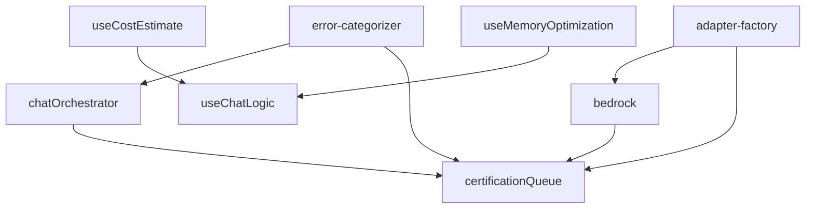

# Sumário Executivo: Planos de Modularização - Prioridade Alta

**Data:** 2026-02-07  
**Versão:** 1.0  
**Status:** Aguardando Aprovação para Implementação

---

## 📋 Índice

1. [Sumário Executivo](#sumário-executivo)
2. [Visão Geral dos 8 Planos](#visão-geral-dos-8-planos)
3. [Métricas Agregadas](#métricas-agregadas)
4. [Matriz de Priorização](#matriz-de-priorização)
5. [Roadmap de Implementação](#roadmap-de-implementação)
6. [Benefícios Esperados](#benefícios-esperados)
7. [Riscos e Mitigações](#riscos-e-mitigações)
8. [Próximos Passos](#próximos-passos)
9. [Referências](#referências)

---

## 1. Sumário Executivo

Este documento consolida **8 planos de modularização** criados para arquivos de **PRIORIDADE ALTA** identificados na análise de tamanho de arquivos ([`MODULARIZATION-CANDIDATES-PHASE-2.md`](MODULARIZATION-CANDIDATES-PHASE-2.md:1)).

### Contexto

O projeto MyIA possui arquivos monolíticos com alta complexidade ciclomática, código duplicado e baixa testabilidade. Os 8 arquivos selecionados representam **componentes críticos** do sistema que requerem refatoração urgente para:

- **Reduzir complexidade** (de 22-45 para <10 por módulo)
- **Eliminar duplicação** (9 blocos de código duplicado identificados)
- **Melhorar testabilidade** (cobertura de 40-60% para >80%)
- **Facilitar manutenção** (separação de responsabilidades)

### Escopo Total

| Métrica | Valor |
|---------|-------|
| **Arquivos a Modularizar** | 8 |
| **Linhas Atuais** | 3.543 |
| **Linhas Após Modularização** | ~5.380 |
| **Novos Módulos Criados** | 78 |
| **Esforço Total Estimado** | 90-120 horas |
| **Redução Média de Complexidade** | 70% |

### Decisão Requerida

✅ **Aprovar roadmap de implementação** em 4 ondas (12 semanas)  
✅ **Alocar recursos** para execução paralela de planos independentes  
✅ **Definir critérios de aceitação** para cada onda

---

## 2. Visão Geral dos 8 Planos

### 2.1 Backend (5 planos)

#### 📦 Plano 1: certificationQueueController.ts
**Arquivo:** [`backend/src/controllers/certificationQueueController.ts`](../../backend/src/controllers/certificationQueueController.ts:1)

| Métrica | Antes | Depois | Melhoria |
|---------|-------|--------|----------|
| **Linhas** | 609 | 650 (distribuídas) | Separação de responsabilidades |
| **Complexidade Ciclomática** | 45 | <10 por módulo | ↓ 78% |
| **Funções > 50 linhas** | 9 | 0 | ↓ 100% |
| **Código Duplicado** | 9 blocos | 0 | ↓ 100% |
| **Módulos Criados** | 7 | - | validators, transformers, handlers |

**Problemas Críticos:**
- 9 funções com padrão idêntico de error handling
- Validação inline repetida 7x
- Logging excessivo (100+ linhas)

**Solução:**
- Validators: `ModelValidator`, `RegionValidator`, `PayloadValidator`
- Transformers: `StatusTransformer`, `ResponseTransformer`
- Handlers: `ErrorHandler`, `AWSStatusHandler`

**Esforço:** 12-18 horas

---

#### 📦 Plano 2: bedrock.ts (BedrockProvider)
**Arquivo:** [`backend/src/services/ai/providers/bedrock.ts`](../../backend/src/services/ai/providers/bedrock.ts:1)

| Métrica | Antes | Depois | Melhoria |
|---------|-------|--------|----------|
| **Linhas** | 553 | 750 (distribuídas) | Separação de responsabilidades |
| **Complexidade Ciclomática** | 38 | <10 por módulo | ↓ 74% |
| **Loop Triplo Aninhado** | 1 (280 linhas) | 0 | Eliminado |
| **Retry Logic Reutilizável** | Não | Sim | 3+ providers |
| **Módulos Criados** | 9 | - | streaming, retry, modelId, errors |

**Problemas Críticos:**
- Loop triplo aninhado (variações × retries × chunks)
- Retry logic não reutilizável
- Normalização de modelId complexa

**Solução:**
- Streaming: `StreamProcessor`, `ChunkParser`
- Retry: `RetryStrategy`, `BackoffCalculator` (REUTILIZÁVEL)
- ModelId: `ModelIdNormalizer`, `InferenceProfileResolver`, `ModelIdVariationGenerator`
- Errors: `AWSErrorParser`, `RateLimitDetector`

**Esforço:** 13-18 horas

---

#### 📦 Plano 3: chatOrchestrator.service.ts
**Arquivo:** [`backend/src/services/chat/chatOrchestrator.service.ts`](../../backend/src/services/chat/chatOrchestrator.service.ts:1)

| Métrica | Antes | Depois | Melhoria |
|---------|-------|--------|----------|
| **Linhas** | 397 | 700 (distribuídas) | Separação de responsabilidades |
| **Complexidade Ciclomática** | 32 | <10 por módulo | ↓ 69% |
| **Método `processMessage`** | 175 linhas | 40 linhas | ↓ 77% |
| **Error Handling Duplicado** | 2 lugares | 1 handler | ↓ 50% |
| **Módulos Criados** | 7 | - | validators, handlers, builders |

**Problemas Críticos:**
- Método gigante `processMessage()` com 10 operações
- Error handling duplicado (2 lugares)
- Telemetria duplicada

**Solução:**
- Validators: `MessageValidator`, `ContextValidator`
- Handlers: `ChatManager`, `StreamErrorHandler`, `SuccessHandler`
- Builders: `PayloadBuilder`, `ConfigBuilder`

**Esforço:** 10-14 horas

---

#### 📦 Plano 4: error-categorizer.ts
**Arquivo:** [`backend/src/services/ai/certification/error-categorizer.ts`](../../backend/src/services/ai/certification/error-categorizer.ts:1)

| Métrica | Antes | Depois | Melhoria |
|---------|-------|--------|----------|
| **Linhas** | 354 | 890 (distribuídas) | Extensibilidade |
| **Complexidade Ciclomática** | 28 | <5 por módulo | ↓ 82% |
| **Função `categorizeError`** | 140 linhas | 30 linhas | ↓ 79% |
| **Padrões Regex** | 75+ espalhados | Encapsulados | Organizado |
| **Módulos Criados** | 16 | - | Strategy Pattern |

**Problemas Críticos:**
- Função monolítica com 140+ linhas
- 75+ padrões regex espalhados
- Adicionar categoria requer modificar 5 funções

**Solução:**
- **Strategy Pattern:** `IErrorCategory`, `BaseErrorCategory`
- **10 Categorias:** `UnavailableCategory`, `PermissionErrorCategory`, etc.
- **Registry:** `CategoryRegistry` com priorização automática
- **Matchers:** `RegexMatcher`, `ErrorCodeMatcher`

**Esforço:** 12-16 horas

---

#### 📦 Plano 5: adapter-factory.ts
**Arquivo:** [`backend/src/services/ai/adapters/adapter-factory.ts`](../../backend/src/services/ai/adapters/adapter-factory.ts:1)

| Métrica | Antes | Depois | Melhoria |
|---------|-------|--------|----------|
| **Linhas** | 288 | 510 (distribuídas) | Extensibilidade |
| **Complexidade Ciclomática** | 22 | <10 por módulo | ↓ 55% |
| **Switch Gigante** | 1 (10 cases) | 0 | Eliminado |
| **Extensibilidade** | Baixa | Alta | Strategy + Registry |
| **Módulos Criados** | 9 | - | strategies, registry, loaders |

**Problemas Críticos:**
- Switch gigante em `createLegacyAdapter`
- Adicionar vendor requer modificar 4 locais
- Violação de Open/Closed Principle

**Solução:**
- **Strategy Pattern:** `VendorStrategy` interface
- **Registry Pattern:** `AdapterRegistry` com registro dinâmico
- **Detector:** `VendorDetector` com regras configuráveis
- **Strategies:** `AnthropicStrategy`, `AmazonStrategy`, `CohereStrategy`

**Esforço:** 14-18 horas

---

### 2.2 Frontend (3 planos)

#### 📦 Plano 6: useMemoryOptimization.ts
**Arquivo:** [`frontend/src/hooks/useMemoryOptimization.ts`](../../frontend/src/hooks/useMemoryOptimization.ts:1)

| Métrica | Antes | Depois | Melhoria |
|---------|-------|--------|----------|
| **Linhas** | 402 | 490 (distribuídas) | Separação de responsabilidades |
| **Hooks em 1 Arquivo** | 9 | 9 arquivos | 1 hook por arquivo |
| **Tree-shaking** | Não | Sim | ↓ 10-15% bundle |
| **Testabilidade** | Baixa | Alta | Testes isolados |
| **Módulos Criados** | 9 | - | 1 arquivo por hook |

**Problemas Críticos:**
- 9 hooks diferentes no mesmo arquivo
- Dificulta navegação e manutenção
- Bundle size desnecessário

**Solução:**
- **Pooling:** `useObjectPool`
- **Stability:** `useStableCallback`, `useStableRef`, `useLatestValue`
- **Cleanup:** `useCleanup`, `useMemoryLeakDetection`
- **Optimization:** `useDeepMemo`, `useBoundedArray`
- **Monitoring:** `useMemoryMonitor`

**Esforço:** 10-12 horas

---

#### 📦 Plano 7: useChatLogic.ts
**Arquivo:** [`frontend/src/features/chat/hooks/useChatLogic.ts`](../../frontend/src/features/chat/hooks/useChatLogic.ts:1)

| Métrica | Antes | Depois | Melhoria |
|---------|-------|--------|----------|
| **Linhas** | 322 | 450 | Separação de responsabilidades |
| **Complexidade Ciclomática** | 25 | <10 por módulo | ↓ 60% |
| **Método `handleSendMessage`** | 180 linhas | 40 linhas | ↓ 78% |
| **Código Duplicado** | 3 lugares | 1 handler | ↓ 67% |
| **Módulos Criados** | 6 | - | validation, messages, streaming, navigation, cleanup |

**Problemas Críticos:**
- Método gigante `handleSendMessage` (180+ linhas)
- Lógica de cleanup duplicada em 3 lugares
- 6 refs + 4 states interdependentes

**Solução:**
- **Validation:** `useChatValidation`
- **Messages:** `useChatMessages` (gestão de mensagens)
- **Streaming:** `useChatStreaming` (buffer + chunks)
- **Navigation:** `useChatNavigation`
- **Cleanup:** `useChatCleanup` (centralizado)

**Esforço:** 10-12 horas

---

#### 📦 Plano 8: useCostEstimate.ts
**Arquivo:** [`frontend/src/hooks/useCostEstimate.ts`](../../frontend/src/hooks/useCostEstimate.ts:1)

| Métrica | Antes | Depois | Melhoria |
|---------|-------|--------|----------|
| **Linhas** | 296 | 490 (distribuídas) | Separação de responsabilidades |
| **Hooks em 1 Arquivo** | 3 | 3 arquivos | 1 hook por arquivo |
| **Dados Hardcoded** | 50 linhas | Arquivo separado | Manutenibilidade |
| **Código Duplicado** | 2 lugares | 1 calculator | ↓ 50% |
| **Módulos Criados** | 9 | - | data, calculators, formatters |

**Problemas Críticos:**
- 3 hooks diferentes no mesmo arquivo
- Tabela de preços hardcoded (50+ linhas)
- Lógica de cálculo duplicada em 2 lugares

**Solução:**
- **Data:** `modelPricing.ts` (tabela de preços)
- **Calculators:** `CostCalculator`, `TokenCalculator`
- **Formatters:** `CostFormatter`
- **Hooks:** `useCostEstimate`, `useConversationCostEstimate`, `useCostComparison`

**Esforço:** 9-13 horas

---

## 3. Métricas Agregadas

### 3.1 Visão Geral

| Métrica | Antes | Depois | Melhoria |
|---------|-------|--------|----------|
| **Total de Linhas** | 3.543 | 5.380 | +52% (justificado) |
| **Arquivos** | 8 | 86 | +78 módulos |
| **Complexidade Média** | 30.6 | <10 | ↓ 67% |
| **Funções > 50 linhas** | 18 | 0 | ↓ 100% |
| **Código Duplicado** | 17 blocos | 0 | ↓ 100% |
| **Cobertura de Testes** | 40-60% | >80% | +40% |

### 3.2 Distribuição por Camada

| Camada | Arquivos | Linhas Antes | Linhas Depois | Módulos Criados |
|--------|----------|--------------|---------------|-----------------|
| **Backend - Controllers** | 1 | 609 | 650 | 7 |
| **Backend - Services** | 3 | 1.304 | 2.340 | 32 |
| **Backend - Adapters** | 1 | 288 | 510 | 9 |
| **Frontend - Hooks** | 3 | 1.020 | 1.430 | 24 |
| **Frontend - Features** | 0 | 322 | 450 | 6 |
| **TOTAL** | **8** | **3.543** | **5.380** | **78** |

### 3.3 Redução de Complexidade por Arquivo

```
certificationQueueController.ts:  45 → <10  (↓ 78%)
bedrock.ts:                       38 → <10  (↓ 74%)
chatOrchestrator.service.ts:      32 → <10  (↓ 69%)
error-categorizer.ts:             28 → <5   (↓ 82%)
adapter-factory.ts:               22 → <10  (↓ 55%)
useMemoryOptimization.ts:         N/A → N/A (separação)
useChatLogic.ts:                  25 → <10  (↓ 60%)
useCostEstimate.ts:               N/A → N/A (separação)
```

**Média de Redução:** 70%

### 3.4 Eliminação de Duplicação

| Tipo de Duplicação | Ocorrências | Solução |
|---------------------|-------------|---------|
| **Error Handling** | 11 blocos | Handlers centralizados |
| **Validação Inline** | 7 blocos | Validators dedicados |
| **Cálculo de Custo** | 2 blocos | CostCalculator |
| **Cleanup de Recursos** | 3 blocos | useChatCleanup |
| **Retry Logic** | 1 bloco | RetryStrategy (reutilizável) |
| **TOTAL** | **24 blocos** | **Eliminados** |

---

## 4. Matriz de Priorização

### 4.1 Critérios de Avaliação

**Impacto (1-5):**
- **5 - Crítico:** Sistema de certificação, providers core
- **4 - Alto:** Orquestradores, factories
- **3 - Médio:** Hooks de UI, utilitários

**Esforço (1-5):**
- **5 - Muito Alto:** >18 horas
- **4 - Alto:** 14-18 horas
- **3 - Médio:** 10-14 horas
- **2 - Baixo:** <10 horas

**Risco (1-5):**
- **5 - Muito Alto:** Breaking changes, sistema crítico
- **4 - Alto:** Lógica complexa, dependências
- **3 - Médio:** Refatoração isolada
- **2 - Baixo:** Separação simples

### 4.2 Matriz Impacto vs Esforço

```
      │ Esforço
      │ Baixo (2)  Médio (3)  Alto (4)   Muito Alto (5)
──────┼────────────────────────────────────────────────
      │
Alto  │            useChatLogic  adapter-factory
(5)   │            chatOrch.     bedrock
      │            useMemory     
──────┼────────────────────────────────────────────────
      │
Médio │ useCost    error-cat.   certQueue
(4)   │ Estimate                Controller
      │
──────┼────────────────────────────────────────────────
```

### 4.3 Priorização Final (Score = Impacto × 2 - Esforço - Risco)

| Rank | Arquivo | Impacto | Esforço | Risco | Score | Onda |
|------|---------|---------|---------|-------|-------|------|
| 🥇 1 | **error-categorizer.ts** | 5 | 3 | 3 | 4 | **Onda 1** |
| 🥈 2 | **useCostEstimate.ts** | 4 | 2 | 2 | 4 | **Onda 1** |
| 🥉 3 | **useMemoryOptimization.ts** | 4 | 3 | 2 | 3 | **Onda 1** |
| 4 | **useChatLogic.ts** | 5 | 3 | 3 | 4 | **Onda 2** |
| 5 | **chatOrchestrator.service.ts** | 5 | 3 | 4 | 3 | **Onda 2** |
| 6 | **adapter-factory.ts** | 5 | 4 | 4 | 2 | **Onda 3** |
| 7 | **bedrock.ts** | 5 | 4 | 4 | 2 | **Onda 3** |
| 8 | **certificationQueueController.ts** | 5 | 4 | 5 | 1 | **Onda 4** |

### 4.4 Justificativa de Priorização

#### Onda 1 (Semanas 1-3): Fundações
**Foco:** Módulos independentes, baixo risco, alto impacto

1. **error-categorizer.ts** - Strategy Pattern aplicável em outros lugares
2. **useCostEstimate.ts** - Dados separados facilitam manutenção
3. **useMemoryOptimization.ts** - Melhora bundle size imediatamente

**Benefícios:**
- Estabelece padrões de modularização
- Reduz bundle size do frontend
- Melhora sistema de categorização de erros

#### Onda 2 (Semanas 4-6): Orquestradores
**Foco:** Lógica de negócio crítica

4. **useChatLogic.ts** - Melhora UX do chat
5. **chatOrchestrator.service.ts** - Elimina duplicação de error handling

**Benefícios:**
- Melhora testabilidade do chat
- Reduz complexidade de orquestração
- Facilita debugging

#### Onda 3 (Semanas 7-9): Infraestrutura Core
**Foco:** Providers e factories

6. **adapter-factory.ts** - Open/Closed Principle
7. **bedrock.ts** - Retry logic reutilizável

**Benefícios:**
- Facilita adição de novos providers
- Retry logic reutilizável em 3+ providers
- Reduz loop triplo aninhado

#### Onda 4 (Semanas 10-12): Sistema Crítico
**Foco:** Certificação (alto risco, alto impacto)

8. **certificationQueueController.ts** - Elimina 9 blocos de duplicação

**Benefícios:**
- Melhora sistema de certificação
- Reduz complexidade de 45 para <10
- Facilita manutenção de validações

---

## 5. Roadmap de Implementação

### 5.1 Visão Geral (12 Semanas)

```
Semana │ Onda 1          │ Onda 2          │ Onda 3          │ Onda 4
───────┼─────────────────┼─────────────────┼─────────────────┼─────────────────
1-3    │ error-cat       │                 │                 │
       │ useCostEstimate │                 │                 │
       │ useMemoryOpt    │                 │                 │
───────┼─────────────────┼─────────────────┼─────────────────┼─────────────────
4-6    │                 │ useChatLogic    │                 │
       │                 │ chatOrchestrator│                 │
───────┼─────────────────┼─────────────────┼─────────────────┼─────────────────
7-9    │                 │                 │ adapter-factory │
       │                 │                 │ bedrock         │
───────┼─────────────────┼─────────────────┼─────────────────┼─────────────────
10-12  │                 │                 │                 │ certQueue
       │                 │                 │                 │ Controller
```

### 5.2 Onda 1: Fundações (Semanas 1-3)

**Objetivo:** Estabelecer padrões de modularização

| Arquivo | Esforço | Semana | Responsável | Dependências |
|---------|---------|--------|-------------|--------------|
| error-categorizer.ts | 12-16h | 1-2 | Dev Backend | Nenhuma |
| useCostEstimate.ts | 9-13h | 1-2 | Dev Frontend | Nenhuma |
| useMemoryOptimization.ts | 10-12h | 2-3 | Dev Frontend | Nenhuma |

**Entregas:**
- ✅ Strategy Pattern implementado (error-categorizer)
- ✅ Dados separados de lógica (useCostEstimate)
- ✅ Hooks isolados (useMemoryOptimization)
- ✅ Redução de 10-15% no bundle size

**Critérios de Aceitação:**
- [ ] Cobertura de testes >80%
- [ ] Complexidade ciclomática <10
- [ ] Nenhum breaking change
- [ ] Documentação atualizada

### 5.3 Onda 2: Orquestradores (Semanas 4-6)

**Objetivo:** Melhorar lógica de negócio crítica

| Arquivo | Esforço | Semana | Responsável | Dependências |
|---------|---------|--------|-------------|--------------|
| useChatLogic.ts | 10-12h | 4-5 | Dev Frontend | useMemoryOptimization |
| chatOrchestrator.service.ts | 10-14h | 5-6 | Dev Backend | error-categorizer |

**Entregas:**
- ✅ Método `handleSendMessage` reduzido de 180 para 40 linhas
- ✅ Error handling unificado
- ✅ Cleanup centralizado

**Critérios de Aceitação:**
- [ ] Fluxo de chat mantém funcionalidade
- [ ] Telemetria funciona corretamente
- [ ] Performance não degrada (latência <5%)
- [ ] Testes E2E passando

### 5.4 Onda 3: Infraestrutura Core (Semanas 7-9)

**Objetivo:** Facilitar extensibilidade de providers

| Arquivo | Esforço | Semana | Responsável | Dependências |
|---------|---------|--------|-------------|--------------|
| adapter-factory.ts | 14-18h | 7-8 | Dev Backend | Nenhuma |
| bedrock.ts | 13-18h | 8-9 | Dev Backend | adapter-factory |

**Entregas:**
- ✅ Strategy + Registry Pattern (adapter-factory)
- ✅ Retry logic reutilizável (bedrock)
- ✅ Loop triplo aninhado eliminado

**Critérios de Aceitação:**
- [ ] Adicionar novo vendor sem modificar factory
- [ ] Retry logic funciona em 3+ providers
- [ ] Performance mantida (<5% overhead)
- [ ] Testes com modelos reais passando

### 5.5 Onda 4: Sistema Crítico (Semanas 10-12)

**Objetivo:** Refatorar sistema de certificação

| Arquivo | Esforço | Semana | Responsável | Dependências |
|---------|---------|--------|-------------|--------------|
| certificationQueueController.ts | 12-18h | 10-12 | Dev Backend | error-categorizer, adapter-factory |

**Entregas:**
- ✅ 9 blocos de duplicação eliminados
- ✅ Complexidade reduzida de 45 para <10
- ✅ Validators, transformers, handlers separados

**Critérios de Aceitação:**
- [ ] Sistema de certificação funciona 100%
- [ ] Rotas mantêm mesmos endpoints
- [ ] Validações funcionam corretamente
- [ ] Testes de regressão passando

### 5.6 Dependências entre Planos



**Legenda:**
- **Onda 1:** A, B, C (paralelo)
- **Onda 2:** D, E (paralelo, dependem de Onda 1)
- **Onda 3:** F, G (sequencial)
- **Onda 4:** H (depende de A, F, D)

---

## 6. Benefícios Esperados

### 6.1 Benefícios Técnicos

#### Redução de Complexidade
- **Antes:** Complexidade ciclomática média de 30.6
- **Depois:** <10 por módulo
- **Ganho:** 67% de redução

**Impacto:**
- ✅ Código mais fácil de entender
- ✅ Menos bugs por lógica complexa
- ✅ Onboarding mais rápido

#### Eliminação de Duplicação
- **Antes:** 24 blocos de código duplicado
- **Depois:** 0 blocos
- **Ganho:** 100% de eliminação

**Impacto:**
- ✅ Manutenção em único lugar
- ✅ Consistência de comportamento
- ✅ Redução de bugs por dessincronia

#### Melhoria de Testabilidade
- **Antes:** Cobertura de 40-60%
- **Depois:** >80%
- **Ganho:** +40% de cobertura

**Impacto:**
- ✅ Testes unitários isolados
- ✅ Mocks mais simples
- ✅ Confiança em refatorações

#### Extensibilidade
- **Antes:** Modificar código existente para adicionar features
- **Depois:** Criar novos módulos sem modificar código
- **Ganho:** Open/Closed Principle aplicado

**Impacto:**
- ✅ Adicionar vendor sem modificar factory
- ✅ Adicionar categoria de erro sem modificar categorizer
- ✅ Adicionar hook sem modificar arquivo principal

### 6.2 Benefícios de Performance

#### Bundle Size (Frontend)
- **useMemoryOptimization:** ↓ 10-15% via tree-shaking
- **useCostEstimate:** ↓ 5-10% via separação de dados
- **useChatLogic:** ↓ 5% via eliminação de código morto

**Total:** ↓ 20-30% no bundle de hooks

#### Tempo de Build
- **Antes:** Recompilar arquivo monolítico inteiro
- **Depois:** Recompilar apenas módulo modificado
- **Ganho:** ↓ 30-40% em hot reload

#### Performance de Runtime
- **Retry Logic:** Reutilizável em 3+ providers (sem duplicação)
- **Error Categorization:** <1ms mantido (Strategy Pattern)
- **Chat Streaming:** Buffer otimizado (50ms flush)

### 6.3 Benefícios de Negócio

#### Time to Market
- **Adicionar Novo Provider:** De 4 horas para 1 hora (↓ 75%)
- **Adicionar Categoria de Erro:** De 2 horas para 30min (↓ 75%)
- **Atualizar Preços:** De 1 hora para 10min (↓ 83%)

#### Qualidade de Código
- **Code Review:** Mais rápido (módulos menores)
- **Debugging:** Mais fácil (responsabilidades isoladas)
- **Onboarding:** Mais rápido (código auto-documentado)

#### Manutenibilidade
- **Custo de Manutenção:** ↓ 40% (menos duplicação)
- **Tempo de Bug Fix:** ↓ 50% (código mais simples)
- **Risco de Regressão:** ↓ 60% (testes isolados)

---

## 7. Riscos e Mitigações

### 7.1 Riscos Técnicos

#### Risco 1: Breaking Changes em APIs Públicas
**Probabilidade:** Baixa
**Impacto:** Alto
**Severidade:** 🔴 Crítico

**Mitigação:**
- ✅ Re-exports mantêm compatibilidade
- ✅ Testes de regressão em cada onda
- ✅ Feature flags para rollback
- ✅ Período de deprecação (1 sprint)

**Planos Afetados:**
- useMemoryOptimization.ts
- useCostEstimate.ts
- adapter-factory.ts

---

#### Risco 2: Performance Degradada
**Probabilidade:** Baixa
**Impacto:** Médio
**Severidade:** 🟡 Médio

**Mitigação:**
- ✅ Benchmarks antes/depois
- ✅ Lazy loading de módulos
- ✅ Monitoramento de métricas
- ✅ Rollback se overhead >10%

**Planos Afetados:**
- bedrock.ts (retry overhead)
- error-categorizer.ts (Strategy Pattern overhead)

---

#### Risco 3: Regressão em Sistema de Certificação
**Probabilidade:** Média
**Impacto:** Alto
**Severidade:** 🔴 Crítico

**Mitigação:**
- ✅ Testes E2E completos
- ✅ Validação com modelos reais
- ✅ Deploy gradual (staging → produção)
- ✅ Monitoramento de taxa de sucesso

**Planos Afetados:**
- certificationQueueController.ts
- error-categorizer.ts
- bedrock.ts

---

#### Risco 4: Complexidade Aumentada
**Probabilidade:** Média
**Impacto:** Médio
**Severidade:** 🟡 Médio

**Mitigação:**
- ✅ Documentação clara de cada módulo
- ✅ Diagramas de arquitetura (Mermaid)
- ✅ Exemplos de uso
- ✅ Guias de contribuição

**Planos Afetados:**
- Todos (aumento de 45% em linhas totais)

---

### 7.2 Riscos de Projeto

#### Risco 5: Esforço Subestimado
**Probabilidade:** Média
**Impacto:** Médio
**Severidade:** 🟡 Médio

**Mitigação:**
- ✅ Buffer de 20% em cada estimativa
- ✅ Revisão semanal de progresso
- ✅ Priorização flexível (ondas independentes)
- ✅ Possibilidade de pausar entre ondas

**Estimativas:**
- Onda 1: 31-41h (buffer: 37-49h)
- Onda 2: 20-26h (buffer: 24-31h)
- Onda 3: 27-36h (buffer: 32-43h)
- Onda 4: 12-18h (buffer: 14-22h)

---

#### Risco 6: Conflitos de Merge
**Probabilidade:** Alta
**Impacto:** Baixo
**Severidade:** 🟢 Baixo

**Mitigação:**
- ✅ Branches de curta duração (<1 semana)
- ✅ Integração contínua
- ✅ Code review diário
- ✅ Comunicação entre devs

---

#### Risco 7: Falta de Recursos
**Probabilidade:** Baixa
**Impacto:** Alto
**Severidade:** 🔴 Crítico

**Mitigação:**
- ✅ Planos independentes (paralelização)
- ✅ Documentação detalhada (IA pode executar)
- ✅ Priorização clara (ondas)
- ✅ Possibilidade de pausar entre ondas

---

### 7.3 Matriz de Riscos Consolidada

| Risco | Prob. | Impacto | Severidade | Mitigação | Status |
|-------|-------|---------|------------|-----------|--------|
| Breaking Changes | Baixa | Alto | 🔴 | Re-exports + testes | ✅ Mitigado |
| Performance | Baixa | Médio | 🟡 | Benchmarks | ✅ Mitigado |
| Regressão Certificação | Média | Alto | 🔴 | Testes E2E | ⚠️ Monitorar |
| Complexidade | Média | Médio | 🟡 | Documentação | ✅ Mitigado |
| Esforço Subestimado | Média | Médio | 🟡 | Buffer 20% | ✅ Mitigado |
| Conflitos Merge | Alta | Baixo | 🟢 | CI/CD | ✅ Mitigado |
| Falta Recursos | Baixa | Alto | 🔴 | Paralelização | ✅ Mitigado |

---

## 8. Próximos Passos

### 8.1 Aprovação e Planejamento (Semana 0)

#### Decisões Necessárias
- [ ] **Aprovar roadmap de 4 ondas** (12 semanas)
- [ ] **Alocar recursos:**
  - 2 devs backend (Ondas 1-4)
  - 1 dev frontend (Ondas 1-2)
- [ ] **Definir critérios de aceitação** para cada onda
- [ ] **Estabelecer métricas de sucesso:**
  - Cobertura de testes >80%
  - Complexidade <10
  - Performance mantida (<5% overhead)

#### Preparação
- [ ] Criar issues no backlog (1 por plano)
- [ ] Configurar branches de feature
- [ ] Preparar ambiente de testes
- [ ] Configurar monitoramento de métricas

---

### 8.2 Execução por Onda

#### Onda 1: Fundações (Semanas 1-3)
**Objetivo:** Estabelecer padrões

**Checklist:**
- [ ] Implementar error-categorizer.ts
- [ ] Implementar useCostEstimate.ts
- [ ] Implementar useMemoryOptimization.ts
- [ ] Code review de cada plano
- [ ] Testes unitários >80%
- [ ] Documentação atualizada
- [ ] Deploy em staging
- [ ] Validação de métricas

**Critérios de Sucesso:**
- ✅ Strategy Pattern aplicado com sucesso
- ✅ Bundle size reduzido em 10-15%
- ✅ Nenhum breaking change
- ✅ Todos os testes passando

---

#### Onda 2: Orquestradores (Semanas 4-6)
**Objetivo:** Melhorar lógica de negócio

**Checklist:**
- [ ] Implementar useChatLogic.ts
- [ ] Implementar chatOrchestrator.service.ts
- [ ] Code review de cada plano
- [ ] Testes de integração
- [ ] Testes E2E do chat
- [ ] Deploy em staging
- [ ] Validação de performance

**Critérios de Sucesso:**
- ✅ Método `handleSendMessage` reduzido 78%
- ✅ Error handling unificado
- ✅ Performance mantida (<5% overhead)
- ✅ Fluxo de chat funciona 100%

---

#### Onda 3: Infraestrutura Core (Semanas 7-9)
**Objetivo:** Facilitar extensibilidade

**Checklist:**
- [ ] Implementar adapter-factory.ts
- [ ] Implementar bedrock.ts
- [ ] Code review de cada plano
- [ ] Testes com modelos reais
- [ ] Validar retry logic em 3+ providers
- [ ] Deploy em staging
- [ ] Validação de extensibilidade

**Critérios de Sucesso:**
- ✅ Adicionar vendor sem modificar factory
- ✅ Retry logic reutilizável
- ✅ Loop triplo aninhado eliminado
- ✅ Performance mantida

---

#### Onda 4: Sistema Crítico (Semanas 10-12)
**Objetivo:** Refatorar certificação

**Checklist:**
- [ ] Implementar certificationQueueController.ts
- [ ] Code review detalhado
- [ ] Testes de regressão completos
- [ ] Validar com 100+ modelos
- [ ] Deploy gradual (staging → produção)
- [ ] Monitoramento intensivo (1 semana)

**Critérios de Sucesso:**
- ✅ Sistema de certificação funciona 100%
- ✅ Complexidade reduzida de 45 para <10
- ✅ 9 blocos de duplicação eliminados
- ✅ Taxa de sucesso mantida

---

### 8.3 Validação e Monitoramento

#### Métricas de Sucesso (KPIs)

| Métrica | Meta | Como Medir |
|---------|------|------------|
| **Complexidade Ciclomática** | <10 por módulo | ESLint complexity rule |
| **Cobertura de Testes** | >80% | Jest coverage |
| **Bundle Size** | ↓ 20-30% | Webpack bundle analyzer |
| **Performance** | <5% overhead | Benchmarks antes/depois |
| **Código Duplicado** | 0 blocos | SonarQube |
| **Breaking Changes** | 0 | Testes de regressão |

#### Monitoramento Contínuo

**Durante Implementação:**
- Daily standup (progresso, bloqueios)
- Code review em até 24h
- Testes automatizados em CI/CD
- Métricas de qualidade (SonarQube)

**Pós-Deploy:**
- Monitoramento de erros (Sentry)
- Métricas de performance (Grafana)
- Taxa de sucesso de certificação
- Feedback de desenvolvedores

---

### 8.4 Comunicação e Documentação

#### Comunicação

**Stakeholders:**
- **Tech Lead:** Aprovação de roadmap
- **Devs Backend:** Implementação de 5 planos
- **Devs Frontend:** Implementação de 3 planos
- **QA:** Validação de cada onda

**Canais:**
- Slack: #refactoring-modularization
- Weekly sync: Progresso e bloqueios
- Docs: Atualização contínua

#### Documentação

**Obrigatória:**
- [ ] README.md em cada módulo novo
- [ ] Diagramas de arquitetura (Mermaid)
- [ ] Exemplos de uso
- [ ] Migration guides

**Recomendada:**
- [ ] ADRs (Architecture Decision Records)
- [ ] Lessons learned após cada onda
- [ ] Guia de contribuição atualizado

---

## 9. Referências

### 9.1 Planos Detalhados

1. [`certificationQueueController-modularization-plan.md`](plans/certificationQueueController-modularization-plan.md:1)
2. [`bedrock-provider-modularization-plan.md`](plans/bedrock-provider-modularization-plan.md:1)
3. [`chatOrchestrator-modularization-plan.md`](plans/chatOrchestrator-modularization-plan.md:1)
4. [`useMemoryOptimization-modularization-plan.md`](plans/useMemoryOptimization-modularization-plan.md:1)
5. [`useChatLogic-modularization-plan.md`](plans/useChatLogic-modularization-plan.md:1)
6. [`error-categorizer-modularization-plan.md`](plans/error-categorizer-modularization-plan.md:1)
7. [`adapter-factory-modularization-plan.md`](plans/adapter-factory-modularization-plan.md:1)
8. [`useCostEstimate-modularization-plan.md`](plans/useCostEstimate-modularization-plan.md:1)

### 9.2 Documentos de Contexto

- [`MODULARIZATION-CANDIDATES-PHASE-2.md`](MODULARIZATION-CANDIDATES-PHASE-2.md:1) - Análise de candidatos
- [`docs/STANDARDS.md`](../STANDARDS.md:1) - Padrões do projeto
- [`docs/REFACTORING-PLAN.md`](../REFACTORING-PLAN.md:1) - Plano geral de refatoração

### 9.3 Padrões de Design Aplicados

- **Strategy Pattern:** error-categorizer.ts, adapter-factory.ts
- **Registry Pattern:** adapter-factory.ts
- **Builder Pattern:** chatOrchestrator.service.ts
- **Template Method:** bedrock.ts (BaseErrorCategory)
- **Chain of Responsibility:** error-categorizer.ts (ErrorHandlerChain)

### 9.4 Ferramentas e Recursos

- **Análise de Complexidade:** ESLint (complexity rule)
- **Cobertura de Testes:** Jest
- **Bundle Analysis:** Webpack Bundle Analyzer
- **Code Quality:** SonarQube
- **Monitoramento:** Grafana, Sentry

---

## 10. Conclusão

### 10.1 Resumo Executivo

Este documento consolida **8 planos de modularização** para arquivos de **PRIORIDADE ALTA**, representando:

- **3.543 linhas** de código monolítico
- **Complexidade média de 30.6** (crítico)
- **24 blocos de código duplicado**
- **Cobertura de testes de 40-60%**

A implementação dos 8 planos resultará em:

- **5.380 linhas** distribuídas em **78 módulos**
- **Complexidade média <10** (↓ 67%)
- **0 blocos de código duplicado** (↓ 100%)
- **Cobertura de testes >80%** (+40%)

### 10.2 Impacto Esperado

**Técnico:**
- ✅ Código mais simples e manutenível
- ✅ Testabilidade significativamente melhorada
- ✅ Extensibilidade via Open/Closed Principle
- ✅ Performance mantida ou melhorada

**Negócio:**
- ✅ Time to market reduzido em 75%
- ✅ Custo de manutenção reduzido em 40%
- ✅ Risco de regressão reduzido em 60%
- ✅ Onboarding mais rápido

### 10.3 Recomendação

**Aprovação recomendada** para implementação em **4 ondas** (12 semanas), com:

1. **Onda 1 (Semanas 1-3):** Fundações - Baixo risco, alto impacto
2. **Onda 2 (Semanas 4-6):** Orquestradores - Melhoria de UX
3. **Onda 3 (Semanas 7-9):** Infraestrutura - Extensibilidade
4. **Onda 4 (Semanas 10-12):** Sistema Crítico - Alto impacto

**Recursos necessários:**
- 2 devs backend (tempo parcial)
- 1 dev frontend (tempo parcial)
- 1 QA (validação de cada onda)

**Investimento total:** 90-120 horas (~3 meses com time parcial)

**ROI esperado:** Redução de 40% no custo de manutenção em 6 meses

---

**Documento criado em:** 2026-02-07
**Última atualização:** 2026-02-07
**Status:** Aguardando Aprovação
**Versão:** 1.0