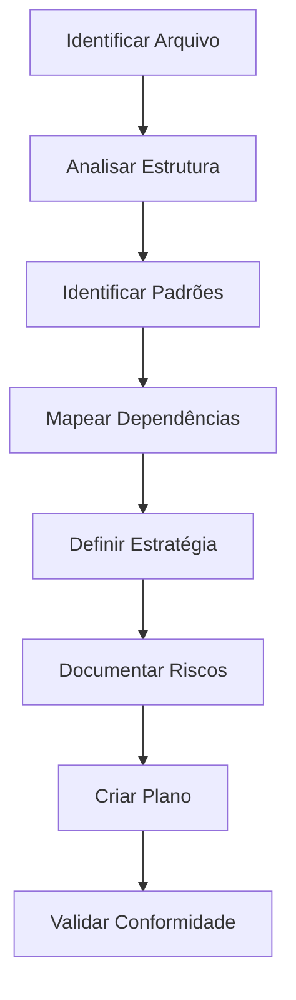

# 📋 Fase 1: Planejamento - Modularização de Arquivos Críticos

**Data:** 2026-02-07  
**Fase:** Planejamento e Análise  
**Status:** ✅ Concluída  
**Duração:** 1 dia

---

## 📑 Índice

1. [Visão Geral](#1-visão-geral)
2. [Metodologia de Análise](#2-metodologia-de-análise)
3. [Identificação de Arquivos Críticos](#3-identificação-de-arquivos-críticos)
4. [Processo de Criação dos Planos](#4-processo-de-criação-dos-planos)
5. [Padrões Arquiteturais Identificados](#5-padrões-arquiteturais-identificados)
6. [Resumo dos Planos Individuais](#6-resumo-dos-planos-individuais)
7. [Decisões Arquiteturais](#7-decisões-arquiteturais)
8. [Lições da Fase de Planejamento](#8-lições-da-fase-de-planejamento)

---

## 1. Visão Geral

### 1.1 Objetivo da Fase

Criar planos detalhados de modularização para todos os arquivos que violam o [STANDARDS.md Seção 15](../../STANDARDS.md#15-tamanho-de-arquivos-e-manutenibilidade), garantindo:

- ✅ Análise completa de cada arquivo
- ✅ Estratégia de modularização específica
- ✅ Identificação de riscos e mitigações
- ✅ Ordem de execução otimizada
- ✅ Zero breaking changes

### 1.2 Escopo

**Arquivos Analisados:** 10 arquivos críticos  
**Total de Linhas:** 6.608 linhas  
**Planos Criados:** 10 planos individuais + 2 documentos consolidados

### 1.3 Resultados

- ✅ 10 planos individuais detalhados
- ✅ Análise de dependências completa
- ✅ Estratégia de execução otimizada
- ✅ Documentação de padrões arquiteturais
- ✅ Identificação de riscos e mitigações

---

## 2. Metodologia de Análise

### 2.1 Processo de Análise

Para cada arquivo, seguimos um processo estruturado:



### 2.2 Critérios de Análise

#### Análise Estrutural
- **Composição:** Quantas linhas de código efetivo?
- **Responsabilidades:** Quantas responsabilidades distintas?
- **Complexidade:** Qual a complexidade ciclomática?
- **Acoplamento:** Quais dependências externas?

#### Análise de Violações
- **Tamanho:** Quanto excede o limite?
- **Padrões:** Quais padrões do STANDARDS.md são violados?
- **Impacto:** Qual o impacto em manutenibilidade?
- **Urgência:** Qual a prioridade de refatoração?

#### Análise de Modularização
- **Estratégia:** Qual padrão arquitetural aplicar?
- **Módulos:** Quantos módulos criar?
- **Coesão:** Como garantir coesão alta?
- **Acoplamento:** Como minimizar acoplamento?

### 2.3 Ferramentas Utilizadas

#### Análise de Código
```bash
# Contar linhas de código
cloc <arquivo>

# Analisar complexidade
npx complexity-report <arquivo>

# Verificar dependências
npx madge --circular <diretório>
```

#### Análise de Dependências
```bash
# Buscar imports
grep -r "import.*from.*<arquivo>" backend/src/

# Buscar exports
grep -r "export.*from.*<arquivo>" backend/src/
```

#### Validação de Conformidade
```bash
# Verificar tamanho
wc -l <arquivo>

# Executar pre-commit hook
.husky/check-file-size.sh <arquivo>
```

---

## 3. Identificação de Arquivos Críticos

### 3.1 Critérios de Seleção

Arquivos foram selecionados com base em:

1. **Tamanho:** >400 linhas (bloqueado por pre-commit hook)
2. **Impacto:** Arquivos críticos para o sistema
3. **Frequência de Mudança:** Arquivos modificados frequentemente
4. **Complexidade:** Alta complexidade ciclomática

### 3.2 Processo de Identificação

#### Passo 1: Análise Automatizada
```bash
# Executar script de análise
npx tsx backend/scripts/analysis/analyze-file-sizes.ts

# Resultado: FILE_SIZE_ANALYSIS_REPORT.md
```

#### Passo 2: Priorização Manual
Revisão manual dos arquivos identificados para confirmar:
- Criticidade para o sistema
- Impacto em múltiplos módulos
- Frequência de modificação

#### Passo 3: Validação com Time
Discussão com time de desenvolvimento para confirmar:
- Arquivos que causam mais dificuldade
- Arquivos que bloqueiam desenvolvimento
- Arquivos com maior dívida técnica

### 3.3 Arquivos Selecionados

| Prioridade | Arquivo | Linhas | Justificativa |
|------------|---------|--------|---------------|
| 🔴 Crítica | [`CertificationQueueService.ts`](../../../backend/src/services/queue/CertificationQueueService.ts) | 808 | Núcleo do sistema de certificação, alta complexidade |
| 🔴 Crítica | [`AWSProviderPanel.tsx`](../../../frontend/src/features/settings/components/providers/AWSProviderPanel.tsx) | 813 | UI crítica, múltiplas responsabilidades |
| 🔴 Crítica | [`certification.service.ts`](../../../backend/src/services/ai/certification/certification.service.ts) | 791 | Lógica de negócio central |
| 🔴 Crítica | [`providersController.ts`](../../../backend/src/controllers/providersController.ts) | 755 | API crítica, múltiplos endpoints |
| 🔴 Crítica | [`certificationController.ts`](../../../backend/src/controllers/certificationController.ts) | 690 | API de certificação, SSE complexo |
| 🟡 Alta | [`amazon.models.ts`](../../../backend/src/services/ai/registry/models/amazon.models.ts) | 682 | Dados de modelos, padrão repetitivo |
| 🟡 Alta | [`ModelCard.tsx`](../../../frontend/src/features/chat/components/ControlPanel/ModelCard.tsx) | 569 | Componente central do chat |
| 🟡 Alta | [`chatController.ts`](../../../backend/src/controllers/chatController.ts) | 522 | API de chat, SSE e auditoria |
| 🟡 Alta | [`ModelsManagementTab.tsx`](../../../frontend/src/features/settings/components/ModelsManagementTab.tsx) | 509 | UI de gerenciamento, batch operations |
| 🟢 Média | [`ModelInfoDrawer.tsx`](../../../frontend/src/components/ModelInfoDrawer.tsx) | 469 | UI de visualização, múltiplas seções |

---

## 4. Processo de Criação dos Planos

### 4.1 Template de Plano

Cada plano segue uma estrutura padronizada:

```markdown
# Plano de Modularização: <arquivo>

## 1. Análise da Estrutura Atual
- Composição do arquivo
- Padrões identificados
- Dependências externas

## 2. Proposta de Modularização
- Estratégia escolhida
- Estrutura de módulos
- Detalhamento dos módulos

## 3. Estrutura de Diretórios
- Estrutura atual
- Estrutura proposta
- Mudanças necessárias

## 4. Ordem de Implementação
- Fase 1: Preparação
- Fase 2: Migração
- Fase 3: Limpeza

## 5. Riscos e Mitigações
- Riscos identificados
- Plano de rollback
- Checklist de validação

## 6. Padrão Replicável
- Candidatos similares
- Template genérico
- Critérios de divisão

## 7. Benefícios Esperados
- Manutenibilidade
- Escalabilidade
- Conformidade
- Performance

## 8. Métricas de Sucesso
- Métricas quantitativas
- Métricas qualitativas
- Validação de integridade

## 9. Referências
- Documentação interna
- Arquivos relacionados
- Scripts úteis

## 10. Checklist de Implementação
- Preparação
- Estrutura
- Migração
- Validação
- Finalização
```

### 4.2 Processo de Criação

#### Etapa 1: Análise Profunda (2-3 horas por arquivo)
- Ler código completo
- Identificar responsabilidades
- Mapear dependências
- Analisar padrões

#### Etapa 2: Definição de Estratégia (1-2 horas)
- Escolher padrão arquitetural
- Definir módulos
- Validar coesão e acoplamento
- Documentar decisões

#### Etapa 3: Documentação (2-3 horas)
- Escrever plano completo
- Criar diagramas
- Documentar riscos
- Definir métricas

#### Etapa 4: Revisão (1 hora)
- Validar conformidade com STANDARDS.md
- Revisar estratégia
- Confirmar viabilidade
- Ajustar conforme necessário

**Tempo Total por Plano:** 6-9 horas  
**Tempo Total (10 planos):** 60-90 horas

### 4.3 Desafios Encontrados

#### Desafio 1: Dependências Circulares
**Problema:** Alguns arquivos dependem uns dos outros  
**Solução:** Análise de caminho crítico para definir ordem

#### Desafio 2: Múltiplas Responsabilidades
**Problema:** Arquivos com 5+ responsabilidades distintas  
**Solução:** Aplicar Single Responsibility Principle rigorosamente

#### Desafio 3: Código Legado
**Problema:** Código sem testes, difícil de refatorar  
**Solução:** Criar testes de regressão antes de modularizar

#### Desafio 4: Breaking Changes
**Problema:** Risco de quebrar integrações existentes  
**Solução:** Manter API pública idêntica, usar Facade Pattern

---

## 5. Padrões Arquiteturais Identificados

### 5.1 Backend: Orchestrator Pattern

**Aplicado em:** Controllers e Services grandes

**Estrutura:**
```
Controller (≤200 linhas)
    ↓ delega para
Orchestrator (≤250 linhas)
    ↓ coordena
Services + Validators + Builders (≤200 linhas cada)
```

**Benefícios:**
- Controllers focam apenas em HTTP
- Orchestrators coordenam fluxo de negócio
- Services encapsulam lógica específica
- 100% testável isoladamente

**Arquivos que aplicam:**
- [`certificationController.ts`](../../../backend/src/controllers/certificationController.ts)
- [`providersController.ts`](../../../backend/src/controllers/providersController.ts)
- [`chatController.ts`](../../../backend/src/controllers/chatController.ts)
- [`certification.service.ts`](../../../backend/src/services/ai/certification/certification.service.ts)
- [`CertificationQueueService.ts`](../../../backend/src/services/queue/CertificationQueueService.ts)

### 5.2 Frontend: View/Logic Separation

**Aplicado em:** Componentes React grandes

**Estrutura:**
```
Component.tsx (≤200 linhas - View Pura)
    ↓ usa
useComponent.ts (≤150 linhas - Lógica)
    ↓ compõe
Sub-components (≤100 linhas cada)
```

**Benefícios:**
- Componentes focam apenas em JSX
- Hooks encapsulam estado e lógica
- Sub-componentes reduzem complexidade
- 100% testável isoladamente

**Arquivos que aplicam:**
- [`AWSProviderPanel.tsx`](../../../frontend/src/features/settings/components/providers/AWSProviderPanel.tsx)
- [`ModelCard.tsx`](../../../frontend/src/features/chat/components/ControlPanel/ModelCard.tsx)
- [`ModelsManagementTab.tsx`](../../../frontend/src/features/settings/components/ModelsManagementTab.tsx)
- [`ModelInfoDrawer.tsx`](../../../frontend/src/components/ModelInfoDrawer.tsx)

### 5.3 Data: Family-Based Modularization

**Aplicado em:** Arquivos de dados com múltiplas famílias

**Estrutura:**
```
vendor/
├── index.ts              # Agregador
├── shared.ts             # Constantes
├── family-1.models.ts    # Família 1
├── family-2.models.ts    # Família 2
└── family-n.models.ts    # Família N
```

**Benefícios:**
- Coesão natural (mesma família)
- Facilita manutenção
- Escalabilidade (nova família = novo arquivo)
- Alinhamento com documentação do vendor

**Arquivos que aplicam:**
- [`amazon.models.ts`](../../../backend/src/services/ai/registry/models/amazon.models.ts)

---

## 6. Resumo dos Planos Individuais

### 6.1 Backend Services

#### [`certification.service.ts`](../../../plans/certification-service-modularization-final.md) (791 linhas)

**Estratégia:** Extração de cache, orchestration, status, persistence, queries

**Módulos Criados:** 7 módulos
- `CertificationCacheService` (150 linhas)
- `CertificationOrchestrator` (200 linhas)
- `CertificationStatusResolver` (120 linhas)
- `CertificationPersistence` (180 linhas)
- `CertificationQueries` (100 linhas)
- `CertificationTestRunner` (150 linhas)
- `certification.service.ts` (150 linhas - facade)

**Redução:** 791 → 150 linhas (81% redução)

**Riscos Principais:**
- Breaking changes na API pública
- Perda de cache hit rate
- Degradação de performance

**Mitigação:**
- Manter API pública idêntica via Facade Pattern
- Testes de performance antes/depois
- Validação de cache hit rate

---

#### [`CertificationQueueService.ts`](../../../plans/certification-queue-service-modularization.md) (808 linhas)

**Estratégia:** Extração de validators, creators, processors, queries

**Módulos Criados:** 6 módulos
- `QueueValidator` (100 linhas)
- `JobCreator` (150 linhas)
- `JobProcessor` (180 linhas)
- `QueueQueries` (120 linhas)
- `SSEHandler` (100 linhas)
- `CertificationQueueService` (180 linhas - orchestrator)

**Redução:** 808 → 180 linhas (78% redução)

**Riscos Principais:**
- Quebra de integração com worker
- Perda de sincronização banco↔Redis
- SSE para de funcionar

**Mitigação:**
- Método `processCertification()` permanece público
- Testes de sincronização específicos
- Validação de SSE com script existente

---

### 6.2 Backend Controllers

#### [`providersController.ts`](../../../plans/providers-controller-modularization.md) (755 linhas)

**Estratégia:** Service Layer Pattern (controller → services → repositories)

**Módulos Criados:** 7 services
- `AWSCredentialsService` (150 linhas)
- `AWSModelsService` (180 linhas)
- `VendorAggregationService` (120 linhas)
- `ProviderValidationService` (100 linhas)
- `ProviderQueryService` (150 linhas)
- `ProviderResponseBuilder` (80 linhas)
- `providersController.ts` (180 linhas)

**Redução:** 755 → 180 linhas (76% redução)

**Riscos Principais:**
- Validação AWS quebra
- Modelos disponíveis não retornam
- Agrupamento por vendor falha

**Mitigação:**
- Testes de integração com AWS real
- Validação de modelos disponíveis
- Testes de agrupamento

---

#### [`certificationController.ts`](../../../plans/certification-controller-modularization.md) (690 linhas)

**Estratégia:** Orchestrator Pattern (controller → orchestrator → services)

**Módulos Criados:** 7 módulos
- `CertificationOrchestrator` (150 linhas)
- `CertificationValidator` (100 linhas)
- `CertificationStatusResolver` (120 linhas)
- `CertificationStreamHandler` (140 linhas)
- `ResponseBuilder` (90 linhas)
- `CredentialsResolver` (60 linhas)
- `certificationController.ts` (180 linhas)

**Redução:** 690 → 180 linhas (74% redução)

**Riscos Principais:**
- SSE para de funcionar
- Endpoints quebram
- JSend não mantido

**Mitigação:**
- Testes de SSE específicos
- Testes de regressão de todos os 13 endpoints
- Validação de formato JSend

---

#### [`chatController.ts`](../../../plans/chat-controller-modularization.md) (522 linhas)

**Estratégia:** Orchestrator Pattern (controller → orchestrator → builders/processors)

**Módulos Criados:** 12 módulos
- `ChatOrchestrator` (200 linhas)
- `ChatValidator` (100 linhas)
- `ContextBuilder` (150 linhas)
- `PayloadBuilder` (120 linhas)
- `AuditBuilder` (100 linhas)
- `StreamProcessor` (180 linhas)
- `MessageRepository` (150 linhas)
- `TitleGenerator` (80 linhas)
- `DuplicateRequestGuard` (60 linhas)
- `SSEHandler` (70 linhas)
- `TokenValidator` (80 linhas)
- `chatController.ts` (180 linhas)

**Redução:** 522 → 180 linhas (66% redução)

**Riscos Principais:**
- SSE para de funcionar
- sentContext perdido
- Embeddings não gerados
- Título não criado

**Mitigação:**
- Testes de SSE específicos
- Validação de sentContext formato
- Testes de embeddings
- Testes de geração de título

---

### 6.3 Backend Data

#### [`amazon.models.ts`](../../../plans/amazon-models-modularization.md) (682 linhas) ✅

**Estratégia:** Divisão por família de modelos

**Módulos Criados:** 6 arquivos
- `shared.ts` (40 linhas)
- `titan.models.ts` (130 linhas)
- `nova-2.models.ts` (160 linhas)
- `nova-1-premier.models.ts` (200 linhas)
- `nova-1-core.models.ts` (240 linhas)
- `index.ts` (30 linhas)

**Redução:** 682 → 240 linhas (65% redução)

**Status:** ✅ **Concluído com sucesso**

**Validação:**
- ✅ 25 modelos registrados corretamente
- ✅ `ModelRegistry.getModelsByVendor('amazon')` funciona
- ✅ Zero breaking changes
- ✅ Certificação funcional

---

### 6.4 Frontend Components

#### [`AWSProviderPanel.tsx`](../../../plans/aws-provider-panel-modularization.md) (813 linhas)

**Estratégia:** View/Logic Separation + Component Composition

**Módulos Criados:** 15 arquivos
- `AWSProviderPanel.tsx` (150 linhas)
- `useAWSProviderPanel.ts` (180 linhas)
- `useAWSCredentials.ts` (100 linhas)
- `useAWSModels.ts` (120 linhas)
- 10 sub-componentes (60-100 linhas cada)
- 2 utils (40-50 linhas cada)

**Redução:** 813 → 150 linhas (82% redução)

**Riscos Principais:**
- Credenciais não validam
- Modelos não listam
- Certificação não funciona
- Provider selector não opera

**Mitigação:**
- Testes de fluxo completo de configuração AWS
- Validação de seleção de modelos
- Testes de certificação

---

#### [`ModelCard.tsx`](../../../plans/model-card-modularization.md) (569 linhas)

**Estratégia:** View/Logic Separation + Sub-components

**Módulos Criados:** 14 arquivos
- `ModelCard.tsx` (120 linhas)
- `useModelCard.ts` (100 linhas)
- `ModelCardList.tsx` (60 linhas)
- `useModelCardList.ts` (50 linhas)
- 8 sub-componentes (60-90 linhas cada)
- 2 utils (40-50 linhas cada)

**Redução:** 569 → 120 linhas (79% redução)

**Riscos Principais:**
- Expansão/colapso não funciona
- Seleção não opera
- Provider selector não aparece
- Re-renders excessivos

**Mitigação:**
- Testes de comportamento de expansão
- Validação de seleção de modelo
- Testes de múltiplos providers
- Memoização adequada (React.memo, useMemo, useCallback)

---

#### [`ModelsManagementTab.tsx`](../../../plans/models-management-tab-modularization.md) (509 linhas)

**Estratégia:** View/Logic Separation + Custom Hooks

**Módulos Criados:** 11 arquivos
- `ModelsManagementTab.tsx` (150 linhas)
- `useModelsManagement.ts` (180 linhas)
- `useCertificationBatch.ts` (100 linhas)
- `useModelFilters.ts` (80 linhas)
- 7 sub-componentes (60-120 linhas cada)

**Redução:** 509 → 150 linhas (71% redução)

**Riscos Principais:**
- Filtros não funcionam
- Seleção batch não opera
- Certificação batch não executa
- Auto-save não funciona

**Mitigação:**
- Testes de filtros
- Validação de seleção múltipla
- Testes de certificação em lote
- Validação de auto-save AWS

---

#### [`ModelInfoDrawer.tsx`](../../../plans/model-info-drawer-modularization.md) (469 linhas)

**Estratégia:** View/Logic Separation + Section Components

**Módulos Criados:** 11 arquivos
- `ModelInfoDrawer.tsx` (100 linhas)
- `useModelInfoDrawer.ts` (80 linhas)
- 9 seções (40-80 linhas cada)

**Redução:** 469 → 100 linhas (79% redução)

**Riscos Principais:**
- Drawer não abre/fecha
- Seções não renderizam
- Certificação não busca
- Animações não preservadas

**Mitigação:**
- Testes de renderização de seções
- Validação de busca de certificação
- Testes de estilos e animações

---

## 7. Decisões Arquiteturais

### 7.1 Decisão: Orchestrator Pattern para Controllers

**Contexto:** Controllers com 500-800 linhas, múltiplas responsabilidades

**Opções Consideradas:**
1. **Opção A:** Dividir em múltiplos controllers
   - ❌ Quebra rotas existentes
   - ❌ Dificulta manutenção de rotas
   
2. **Opção B:** Extrair para services diretamente
   - ❌ Controllers ainda com muita lógica
   - ❌ Difícil testar fluxo completo
   
3. **Opção C:** Orchestrator Pattern ✅
   - ✅ Controller foca em HTTP
   - ✅ Orchestrator coordena fluxo
   - ✅ Services especializados
   - ✅ 100% testável

**Decisão:** Orchestrator Pattern

**Justificativa:**
- Mantém rotas existentes (zero breaking changes)
- Separação clara de responsabilidades
- Facilita testes (mock de orchestrator)
- Padrão escalável para outros controllers

**Impacto:**
- Controllers reduzidos para ~180 linhas
- Orchestrators com ~150-200 linhas
- Services especializados com ~100-180 linhas

---

### 7.2 Decisão: View/Logic Separation para Frontend

**Contexto:** Componentes React com 400-800 linhas, lógica misturada com JSX

**Opções Consideradas:**
1. **Opção A:** Dividir em múltiplos componentes apenas
   - ❌ Lógica ainda misturada
   - ❌ Difícil testar estado
   
2. **Opção B:** Extrair para Context API
   - ❌ Overhead desnecessário
   - ❌ Re-renders não controlados
   
3. **Opção C:** Custom Hooks + Sub-components ✅
   - ✅ Componente foca em JSX
   - ✅ Hook encapsula lógica
   - ✅ Sub-componentes reduzem complexidade
   - ✅ 100% testável

**Decisão:** Custom Hooks + Sub-components

**Justificativa:**
- Alinhado com [STANDARDS.md §3.0](../../STANDARDS.md#30-separação-estrita-viewlogic)
- Hooks testáveis isoladamente
- Sub-componentes reutilizáveis
- Performance otimizada (memoização)

**Impacto:**
- Componentes principais reduzidos para ~100-150 linhas
- Hooks com ~80-180 linhas
- Sub-componentes com ~40-100 linhas

---

### 7.3 Decisão: Family-Based Modularization para Dados

**Contexto:** Arquivo de modelos com 682 linhas, 25 modelos de múltiplas famílias

**Opções Consideradas:**
1. **Opção A:** Dividir por capacidade (vision, streaming)
   - ❌ Baixa coesão
   - ❌ Modelos de mesma família separados
   
2. **Opção B:** Dividir por tamanho de context window
   - ❌ Acoplamento artificial
   - ❌ Dificulta manutenção
   
3. **Opção C:** Dividir por família de modelos ✅
   - ✅ Coesão natural
   - ✅ Facilita manutenção
   - ✅ Escalável (nova família = novo arquivo)
   - ✅ Alinhado com documentação AWS

**Decisão:** Family-Based Modularization

**Justificativa:**
- Coesão natural (modelos da mesma família compartilham características)
- Facilita manutenção (atualizações afetam apenas uma família)
- Escalabilidade (novas famílias = novos arquivos)
- Alinhamento com documentação do vendor

**Impacto:**
- Arquivo principal reduzido para ~30 linhas (agregador)
- Famílias com ~130-240 linhas cada
- Constantes compartilhadas em ~40 linhas

---

## 8. Lições da Fase de Planejamento

### 8.1 O Que Funcionou Bem

#### ✅ Análise Estruturada
- Processo de análise consistente
- Template de plano padronizado
- Documentação completa

#### ✅ Identificação de Padrões
- Padrões arquiteturais claros
- Estratégias replicáveis
- Decisões documentadas

#### ✅ Análise de Dependências
- Mapeamento completo de dependências
- Identificação de caminho crítico
- Ordem de execução otimizada

#### ✅ Gestão de Riscos
- Riscos identificados antecipadamente
- Mitigações documentadas
- Plano de rollback definido

### 8.2 O Que Pode Melhorar

#### ⚠️ Tempo de Análise
- **Problema:** 6-9 horas por plano (60-90 horas total)
- **Melhoria:** Criar template mais detalhado para acelerar

#### ⚠️ Validação de Viabilidade
- **Problema:** Alguns planos muito ambiciosos
- **Melhoria:** Validar viabilidade com protótipos rápidos

#### ⚠️ Estimativas de Tempo
- **Problema:** Difícil estimar tempo de implementação
- **Melhoria:** Usar dados da primeira execução para calibrar

### 8.3 Recomendações para Próximos Projetos

#### 1. Começar com Arquivo Mais Simples
- Validar estratégia com arquivo de menor risco
- Ajustar abordagem com base em aprendizados
- Escalar para arquivos mais complexos

#### 2. Criar Protótipos
- Testar estratégia com protótipo