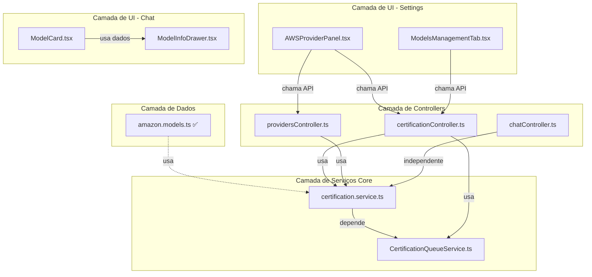

# 🔗 Fase 2: Consolidação e Estratégia de Execução

**Data:** 2026-02-07  
**Fase:** Análise Consolidada e Planejamento de Execução  
**Status:** ✅ Concluída  
**Documento Base:** [`EXECUTION-STRATEGY.md`](../../../plans/EXECUTION-STRATEGY.md)

---

## 📑 Índice

1. [Visão Geral](#1-visão-geral)
2. [Matriz de Dependências](#2-matriz-de-dependências)
3. [Análise de Caminho Crítico](#3-análise-de-caminho-crítico)
4. [Estratégia de Execução](#4-estratégia-de-execução)
5. [Faseamento e Priorização](#5-faseamento-e-priorização)
6. [Gestão de Riscos Consolidada](#7-gestão-de-riscos-consolidada)
7. [Plano de Rollback](#8-plano-de-rollback)

---

## 1. Visão Geral

### 1.1 Objetivo da Fase

Consolidar os 10 planos individuais em uma **estratégia executável** que:

- ✅ Identifica dependências entre arquivos
- ✅ Define ordem ótima de execução
- ✅ Minimiza riscos de breaking changes
- ✅ Permite paralelização quando possível
- ✅ Estabelece critérios de sucesso claros

### 1.2 Resultados

- ✅ Matriz de dependências completa
- ✅ Caminho crítico identificado (5 arquivos sequenciais)
- ✅ Estratégia de execução em 3 fases
- ✅ Gestão de riscos consolidada
- ✅ Plano de rollback em 3 níveis

---

## 2. Matriz de Dependências

### 2.1 Mapeamento de Interdependências



### 2.2 Análise de Acoplamento

| Arquivo | Depende De | É Usado Por | Nível de Acoplamento |
|---------|------------|-------------|----------------------|
| **amazon.models.ts** ✅ | ModelRegistry | certification.service | 🟢 Baixo |
| **CertificationQueueService.ts** | certification.service, QueueService | Worker, certificationController | 🔴 Alto |
| **certification.service.ts** | CertificationQueueService, ModelRegistry | certificationController, providersController | 🔴 Alto |
| **certificationController.ts** | certification.service, CertificationQueueService | Routes, ModelsManagementTab | 🔴 Alto |
| **providersController.ts** | certification.service, BedrockProvider | AWSProviderPanel, Routes | 🟡 Médio |
| **chatController.ts** | aiService, contextService | Routes | 🟢 Baixo |
| **AWSProviderPanel.tsx** | providersController (API), certificationController (API) | Settings Page | 🟡 Médio |
| **ModelCard.tsx** | ModelInfoDrawer | ControlPanel | 🟢 Baixo |
| **ModelsManagementTab.tsx** | certificationController (API) | Settings Page | 🟡 Médio |
| **ModelInfoDrawer.tsx** | certification API | ModelCard, outros | 🟢 Baixo |

---

## 3. Análise de Caminho Crítico

### 3.1 Caminho Crítico Identificado

```
amazon.models.ts (682 linhas) ✅ CONCLUÍDO
    ↓
CertificationQueueService.ts (808 linhas)
    ↓
certification.service.ts (791 linhas)
    ↓
certificationController.ts (690 linhas)
    ↓
providersController.ts (755 linhas)
```

**Total do Caminho Crítico:** 3.726 linhas (56% do total)

### 3.2 Justificativa

Este caminho representa o **núcleo do sistema de certificação**:

1. **Mais Complexo:** Lógica de negócio crítica
2. **Mais Acoplado:** Múltiplas dependências entre si
3. **Mais Arriscado:** Mudanças podem quebrar múltiplos pontos
4. **Mais Impactante:** Afeta tanto backend quanto frontend

**Estratégia:** Executar sequencialmente para minimizar riscos.

### 3.3 Caminhos Paralelos

Após completar o caminho crítico:

#### Trilha A: Chat System (Independente)
```
chatController.ts (522 linhas)
```

#### Trilha B: Frontend Components (Independentes)
```
AWSProviderPanel.tsx (813 linhas)
ModelCard.tsx (569 linhas)
ModelsManagementTab.tsx (509 linhas)
ModelInfoDrawer.tsx (469 linhas)
```

---

## 4. Estratégia de Execução

### 4.1 Ordem de Execução Ótima

| Ordem | Arquivo | Justificativa | Pode Paralelizar? |
|-------|---------|---------------|-------------------|
| **1** | amazon.models.ts ✅ | Sem dependências, usado por outros | ❌ Não |
| **2** | CertificationQueueService.ts | Usado por certification.service | ❌ Não |
| **3** | certification.service.ts | Núcleo do sistema, depende de #1 e #2 | ❌ Não |
| **4** | certificationController.ts | Depende de #3, usado por frontend | ❌ Não |
| **5** | providersController.ts | Depende de #3, usado por frontend | ❌ Não |
| **6** | chatController.ts | Independente, pode ser paralelo | ✅ Sim (com #7-10) |
| **7** | AWSProviderPanel.tsx | Apenas consome APIs já refatoradas | ✅ Sim (com #6, #8-10) |
| **8** | ModelCard.tsx | Componente isolado | ✅ Sim (com #6-7, #9-10) |
| **9** | ModelsManagementTab.tsx | Apenas consome APIs já refatoradas | ✅ Sim (com #6-8, #10) |
| **10** | ModelInfoDrawer.tsx | Componente isolado | ✅ Sim (com #6-9) |

---

## 5. Faseamento e Priorização

### 5.1 Fase 1: Fundação (Caminho Crítico - Sequencial)

**Objetivo:** Refatorar núcleo do sistema de certificação  
**Risco:** 🔴 Alto (mudanças no core)  
**Status:** 🟡 1/5 concluído

#### Arquivos

1. ✅ **amazon.models.ts** (682 linhas)
   - Estratégia: Divisão por família de modelos
   - Módulos: 6 arquivos
   - Validação: 25 modelos registrados
   - Status: **Concluído**

2. 🔴 **CertificationQueueService.ts** (808 linhas)
   - Estratégia: Extração de validators, creators, processors
   - Módulos: 6 services
   - Validação: Worker processa jobs, SSE funciona

3. 🔴 **certification.service.ts** (791 linhas)
   - Estratégia: Extração de cache, orchestration, status
   - Módulos: 7 módulos
   - Validação: API pública mantida

4. 🔴 **certificationController.ts** (690 linhas)
   - Estratégia: Orchestrator Pattern
   - Módulos: 7 módulos
   - Validação: Todos endpoints funcionam, SSE preservado

5. 🔴 **providersController.ts** (755 linhas)
   - Estratégia: Service Layer Pattern
   - Módulos: 7 services
   - Validação: Validação AWS funciona

**Critérios de Conclusão:**
- ✅ Todos os 5 arquivos ≤250 linhas
- ✅ Sistema de certificação funcional
- ✅ Zero breaking changes
- ✅ Testes de integração passando
- ✅ Worker de certificação operacional

---

### 5.2 Fase 2: Expansão (Paralelo - Após Fase 1)

**Objetivo:** Refatorar componentes independentes  
**Risco:** 🟡 Médio (componentes isolados)  
**Status:** 🔴 0/5 concluído

#### Trilha A: Backend - chatController.ts
- Estratégia: Orchestrator Pattern
- Módulos: 12 módulos
- Validação: SSE funciona, sentContext preservado

#### Trilha B: Frontend - AWSProviderPanel.tsx
- Estratégia: View/Logic Separation + Component Composition
- Módulos: 15 arquivos
- Validação: Credenciais validam, modelos listam

#### Trilha C: Frontend - ModelCard.tsx
- Estratégia: View/Logic Separation + Sub-components
- Módulos: 14 arquivos
- Validação: Expansão/colapso funciona, seleção opera

#### Trilha D: Frontend - ModelsManagementTab.tsx
- Estratégia: View/Logic Separation + Custom Hooks
- Módulos: 11 arquivos
- Validação: Filtros funcionam, certificação batch executa

#### Trilha E: Frontend - ModelInfoDrawer.tsx
- Estratégia: View/Logic Separation + Section Components
- Módulos: 11 arquivos
- Validação: Drawer abre/fecha, seções renderizam

**Critérios de Conclusão:**
- ✅ Todos os 5 arquivos ≤200 linhas
- ✅ Componentes funcionais
- ✅ Zero breaking changes
- ✅ Testes de regressão passando
- ✅ Performance mantida ou melhorada

---

### 5.3 Fase 3: Validação Final (Integração Completa)

**Objetivo:** Validar sistema completo  
**Risco:** 🟢 Baixo (apenas validação)  
**Status:** 🔴 Pendente

#### Testes de Integração End-to-End

**Fluxo 1: Configuração AWS → Certificação → Chat**
1. Configurar credenciais AWS
2. Certificar modelos
3. Selecionar modelo certificado
4. Enviar mensagem
5. Validar resposta e métricas

**Fluxo 2: Certificação em Lote → Visualização**
1. Selecionar múltiplos modelos
2. Certificar em lote
3. Acompanhar progresso (SSE)
4. Visualizar resultados

**Fluxo 3: Validação de Providers → Modelos Disponíveis**
1. Validar credenciais AWS
2. Buscar modelos disponíveis
3. Agrupar por vendor
4. Exibir em UI

**Critérios de Conclusão:**
- ✅ Todos os testes E2E passando
- ✅ Benchmarks dentro dos limites
- ✅ Zero regressões detectadas
- ✅ Documentação atualizada
- ✅ Code review aprovado

---

## 6. Estratégia de Testes por Fase

### 6.1 Pirâmide de Testes

```
                    E2E Tests (10%)
                   /              \
              Integration Tests (30%)
             /                        \
        Unit Tests (60%)
```

### 6.2 Cobertura de Testes Mínima

| Tipo de Arquivo | Cobertura Mínima | Validação |
|-----------------|------------------|-----------|
| **Services** | 85% | Jest coverage |
| **Controllers** | 80% | Jest coverage |
| **Hooks** | 90% | Jest coverage |
| **Components** | 75% | Jest coverage |
| **Utils** | 95% | Jest coverage |

---

## 7. Gestão de Riscos Consolidada

### 7.1 Matriz de Riscos Globais

| ID | Risco | Probabilidade | Impacto | Severidade | Fase Afetada |
|----|-------|---------------|---------|------------|--------------|
| **R1** | Breaking changes na API pública | Média | Crítico | 🔴 Alta | Fase 1 |
| **R2** | Quebra de integração com worker | Média | Crítico | 🔴 Alta | Fase 1 |
| **R3** | Perda de sincronização banco↔Redis | Baixa | Crítico | 🟡 Média | Fase 1 |
| **R4** | SSE para de funcionar | Baixa | Alto | 🟡 Média | Fase 1, 2 |
| **R5** | Degradação de performance | Baixa | Médio | 🟢 Baixa | Todas |
| **R6** | Regressão em certificação | Média | Alto | 🟡 Média | Fase 1 |
| **R7** | Perda de auditoria (sentContext) | Baixa | Alto | 🟡 Média | Fase 2 |
| **R8** | Re-renders excessivos (frontend) | Baixa | Médio | 🟢 Baixa | Fase 2 |
| **R9** | Conflitos de merge | Alta | Médio | 🟡 Média | Todas |
| **R10** | Escopo crescente | Alta | Médio | 🟡 Média | Todas |

### 7.2 Mitigações Principais

#### R1: Breaking Changes na API Pública
- ✅ Manter assinaturas de métodos públicos idênticas
- ✅ Usar Facade Pattern para preservar interface
- ✅ Testes de contrato (contract testing)

#### R2: Quebra de Integração com Worker
- ✅ Método `processCertification()` permanece público
- ✅ Testes de integração com mock de Bull Job
- ✅ Validar worker em ambiente de desenvolvimento

#### R4: SSE Para de Funcionar
- ✅ Testar SSE com script existente
- ✅ Validar callback de progresso ainda funciona
- ✅ Verificar eventos emitidos corretamente

#### R9: Conflitos de Merge
- ✅ Comunicar refatoração para o time
- ✅ Criar branches dedicadas por arquivo
- ✅ Fazer merge frequente da main
- ✅ Implementar em fases pequenas

---

## 8. Plano de Rollback

### 8.1 Estratégia de Rollback por Nível

#### Nível 1: Rollback de Arquivo Individual (Baixo Impacto)
**Quando usar:** Problema detectado em arquivo específico

**Procedimento:**
```bash
# 1. Identificar commit da refatoração
git log --oneline --grep="refactor: modularize <arquivo>"

# 2. Reverter commit específico
git revert <commit-hash>

# 3. Validar que sistema voltou ao normal
npm test
npm run test:integration
```

#### Nível 2: Rollback de Fase (Médio Impacto)
**Quando usar:** Múltiplos arquivos de uma fase com problemas

**Procedimento:**
```bash
# 1. Identificar branch da fase
git branch --list "refactor/phase-*"

# 2. Reverter merge da fase
git revert -m 1 <merge-commit-hash>

# 3. Validar sistema completo
npm run test:e2e
npm run test:integration
```

#### Nível 3: Rollback Completo (Alto Impacto)
**Quando usar:** Problemas sistêmicos, múltiplas fases afetadas

**Procedimento:**
```bash
# 1. Identificar tag antes da refatoração
git tag --list "v*-pre-modularization"

# 2. Criar branch de emergência
git checkout -b emergency/rollback-modularization

# 3. Reverter para tag
git reset --hard <tag-pre-modularization>

# 4. Deploy de emergência
./start.sh restart both
```

### 8.2 Critérios de Decisão de Rollback

| Severidade | Critério | Ação |
|------------|----------|------|
| **🟢 Baixa** | Bug menor, não bloqueia uso | Criar issue, corrigir depois |
| **🟡 Média** | Feature parcialmente quebrada | Rollback de arquivo (Nível 1) |
| **🔴 Alta** | Feature crítica quebrada | Rollback de fase (Nível 2) |
| **⚫ Crítica** | Sistema inoperante | Rollback completo (Nível 3) |

---

## 9. Critérios de Sucesso

### 9.1 Critérios Técnicos (Obrigatórios)

#### Por Arquivo
- ✅ Arquivo principal ≤250 linhas (services) ou ≤200 linhas (controllers/components)
- ✅ Todos os módulos criados ≤250 linhas
- ✅ Complexidade ciclomática ≤10 por função
- ✅ Zero breaking changes
- ✅ Todos os testes passando (unit + integration)
- ✅ Cobertura de testes ≥ mínimo definido
- ✅ Zero warnings de ESLint
- ✅ Documentação JSDoc completa

#### Por Fase
- ✅ Todos os arquivos da fase concluídos
- ✅ Testes de integração da fase passando
- ✅ Zero regressões detectadas
- ✅ Performance dentro dos limites (≤5% degradação)
- ✅ Code review aprovado

#### Global (Projeto Completo)
- ✅ Todos os 10 arquivos ≤250 linhas
- ✅ Total de linhas ≤2.500 (redução de 62%)
- ✅ Sistema 100% funcional
- ✅ Todos os testes E2E passando
- ✅ Zero breaking changes
- ✅ Documentação atualizada

---

## 10. Conclusão

### 10.1 Resumo Executivo

Esta fase consolidou os 10 planos individuais em uma **estratégia executável** que:

✅ **Identifica Caminho Crítico:** 5 arquivos sequenciais (56% do total)  
✅ **Otimiza Paralelização:** 5 arquivos independentes após crítico  
✅ **Mapeia Riscos:** 10 riscos com mitigações detalhadas  
✅ **Estrutura Testes:** Pirâmide 60/30/10 com cobertura mínima  
✅ **Planeja Rollback:** 3 níveis de contingência  
✅ **Define Sucesso:** Critérios claros por arquivo, fase e projeto

### 10.2 Próximos Passos

1. **Executar Fase 1:** Completar caminho crítico (4 arquivos restantes)
2. **Executar Fase 2:** Paralelizar 5 arquivos independentes
3. **Executar Fase 3:** Validação E2E completa
4. **Documentar:** Lições aprendidas e métricas finais

---

**Documento criado por:** Architect Mode  
**Baseado em:** [`EXECUTION-STRATEGY.md`](../../../plans/EXECUTION-STRATEGY.md)  
**Última atualização:** 2026-02-07
