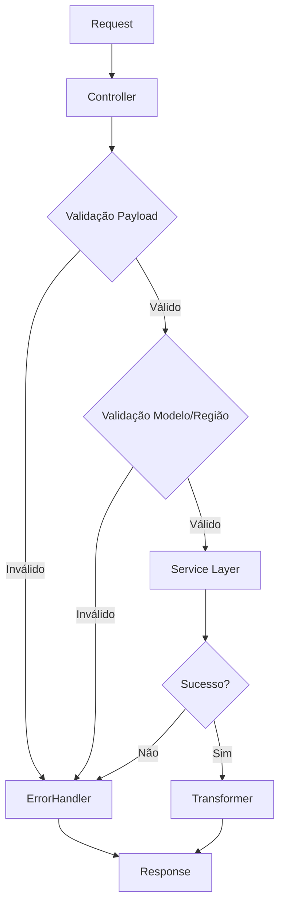

# Plano de Modularização: certificationQueueController.ts

**Arquivo:** [`backend/src/controllers/certificationQueueController.ts`](../../../backend/src/controllers/certificationQueueController.ts:1)  
**Linhas:** 609  
**Complexidade Ciclomática:** 45 (crítico)  
**Data:** 2026-02-07

---

## 1. Objetivo da Modularização

Transformar o controller monolítico em uma arquitetura modular que:
- **Separa responsabilidades** (validação, transformação, orquestração, error handling)
- **Reduz complexidade ciclomática** de 45 para <10 por módulo
- **Elimina duplicação** de código (9 funções com padrão idêntico de error handling)
- **Melhora testabilidade** através de módulos isolados e injetáveis
- **Mantém compatibilidade** total com rotas e contratos existentes

---

## 2. Análise de Responsabilidades Atuais

### 2.1 Responsabilidades Identificadas

| Responsabilidade | Funções Afetadas | Linhas Aproximadas |
|------------------|------------------|-------------------|
| **Validação de Entrada** | Todas (9 funções) | ~80 linhas |
| **Validação de Modelo** | `certifyModel`, `certifyMultipleModels` | ~60 linhas |
| **Validação de Região** | `getAvailableRegions` | ~20 linhas |
| **Transformação de Status** | `getCertifications` | ~15 linhas |
| **Transformação de Resposta** | Todas (9 funções) | ~90 linhas |
| **Error Handling** | Todas (9 funções) | ~180 linhas (DUPLICADO) |
| **Logging Detalhado** | `certifyModel`, `getCertifications` | ~100 linhas |
| **Validação AWS** | `getAWSStatus` | ~100 linhas |
| **Orquestração** | Todas (9 funções) | ~150 linhas |

### 2.2 Padrões Duplicados Críticos

**Padrão de Error Handling (repetido 9x):**
```typescript
catch (error: any) {
  logger.error('Error...', error);
  return res.status(500).json(
    ApiResponse.error(error.message || 'Failed...', 500)
  );
}
```

**Padrão de Validação de Entrada (repetido 7x):**
```typescript
if (!param || !Array.isArray(param) || param.length === 0) {
  return res.status(400).json(
    ApiResponse.error('param must be...', 400)
  );
}
```

---

## 3. Estrutura de Módulos Proposta

```
backend/src/controllers/certificationQueue/
├── certificationQueueController.ts (150 linhas)
│   └── Orquestração pura: delega para módulos especializados
│
├── validators/
│   ├── modelValidator.ts (80 linhas)
│   │   ├── validateModelExists(modelId)
│   │   ├── validateModelByApiId(apiModelId)
│   │   └── validateModelByUUID(uuid)
│   │
│   ├── regionValidator.ts (60 linhas)
│   │   ├── validateRegion(region)
│   │   ├── getAvailableRegions()
│   │   └── isValidRegion(region)
│   │
│   └── payloadValidator.ts (70 linhas)
│       ├── validateCertifyModelPayload(body)
│       ├── validateMultipleModelsPayload(body)
│       └── validateJobIdParam(params)
│
├── transformers/
│   ├── statusTransformer.ts (50 linhas)
│   │   ├── toFrontendStatus(prismaStatus)
│   │   └── toPrismaStatus(frontendStatus)
│   │
│   └── responseTransformer.ts (60 linhas)
│       ├── transformCertification(cert)
│       ├── transformJobStatus(job)
│       └── transformStats(stats)
│
└── handlers/
    ├── errorHandler.ts (80 linhas)
    │   ├── handleControllerError(error, res, context)
    │   ├── handlePrismaError(error, res)
    │   └── handleValidationError(error, res)
    │
    └── awsStatusHandler.ts (100 linhas)
        ├── checkAWSCredentials()
        ├── validateAWSConnection(credentials, region)
        └── getAWSModelsCount(client)
```

**Total Estimado:** ~650 linhas (vs. 609 originais)  
**Ganho:** Separação de responsabilidades, testabilidade, manutenibilidade

---

## 4. Interfaces e Contratos entre Módulos

### 4.1 Validators

```typescript
// validators/modelValidator.ts
export interface ModelValidationResult {
  exists: boolean;
  model?: AIModel;
  searchedBy: 'apiModelId' | 'uuid';
}

export class ModelValidator {
  async validateModelExists(modelId: string): Promise<ModelValidationResult>
  async validateModelByApiId(apiModelId: string): Promise<AIModel | null>
  async validateModelByUUID(uuid: string): Promise<AIModel | null>
}
```

```typescript
// validators/regionValidator.ts
export interface Region {
  id: string;
  name: string;
}

export class RegionValidator {
  validateRegion(region: string): boolean
  getAvailableRegions(): Region[]
  isValidRegion(region: string): boolean
}
```

### 4.2 Transformers

```typescript
// transformers/statusTransformer.ts
export class StatusTransformer {
  toFrontendStatus(prismaStatus: CertificationStatus): string
  toPrismaStatus(frontendStatus: string): CertificationStatus
}
```

```typescript
// transformers/responseTransformer.ts
export class ResponseTransformer {
  transformCertification(cert: ModelCertification): TransformedCertification
  transformJobStatus(job: CertificationJob): TransformedJobStatus
  transformStats(stats: any): TransformedStats
}
```

### 4.3 Handlers

```typescript
// handlers/errorHandler.ts
export interface ErrorContext {
  operation: string;
  params?: Record<string, any>;
}

export class ErrorHandler {
  handleControllerError(error: any, res: Response, context: ErrorContext): Response
  handlePrismaError(error: any, res: Response): Response
  handleValidationError(error: any, res: Response): Response
}
```

```typescript
// handlers/awsStatusHandler.ts
export interface AWSStatusResult {
  configured: boolean;
  valid: boolean;
  message: string;
  region: string | null;
  modelsAvailable: number;
  accessKeyPreview?: string;
  error?: string;
}

export class AWSStatusHandler {
  async checkAWSCredentials(): Promise<AWSStatusResult>
  async validateAWSConnection(credentials: string, region: string): Promise<AWSStatusResult>
}
```

---

## 5. Fluxo de Dados e Orquestração

### 5.1 Fluxo Geral (Todas as Funções)



### 5.2 Exemplo: certifyModel()

**ANTES (609 linhas monolíticas):**
```typescript
export async function certifyModel(req: Request, res: Response) {
  try {
    // Logging detalhado (20 linhas)
    // Validação inline (40 linhas)
    // Busca de modelo (30 linhas)
    // Chamada ao serviço (10 linhas)
    // Resposta (10 linhas)
  } catch (error: any) {
    // Error handling (10 linhas)
  }
}
```

**DEPOIS (150 linhas totais no controller):**
```typescript
export async function certifyModel(req: Request, res: Response) {
  try {
    const { modelId, region } = req.body;
    const userId = (req as any).userId;

    // Delegar validação
    const validationResult = await modelValidator.validateModelExists(modelId);
    if (!validationResult.exists) {
      return errorHandler.handleValidationError(
        new Error('Model not found'),
        res
      );
    }

    // Delegar ao serviço
    const result = await certificationQueueService.certifyModel(
      modelId,
      region,
      userId
    );

    // Delegar transformação e resposta
    return res.status(201).json(
      ApiResponse.success(responseTransformer.transformJobStatus(result))
    );
  } catch (error: any) {
    return errorHandler.handleControllerError(error, res, {
      operation: 'certifyModel',
      params: { modelId: req.body.modelId, region: req.body.region }
    });
  }
}
```

---

## 6. Estratégia de Migração (Passo a Passo)

### Fase 1: Preparação (1-2 horas)
1. **Criar estrutura de diretórios**
   ```bash
   mkdir -p backend/src/controllers/certificationQueue/{validators,transformers,handlers}
   ```

2. **Criar arquivos vazios com interfaces**
   - Definir contratos TypeScript para cada módulo
   - Garantir que interfaces sejam aprovadas antes da implementação

### Fase 2: Extração de Handlers (2-3 horas)
3. **Criar `errorHandler.ts`**
   - Extrair padrão de error handling das 9 funções
   - Implementar `handleControllerError()`, `handlePrismaError()`, `handleValidationError()`
   - **Teste:** Criar testes unitários para cada tipo de erro

4. **Criar `awsStatusHandler.ts`**
   - Extrair lógica de `getAWSStatus()` (linhas 533-609)
   - Implementar `checkAWSCredentials()`, `validateAWSConnection()`
   - **Teste:** Mockar BedrockClient e testar cenários de sucesso/falha

### Fase 3: Extração de Validators (3-4 horas)
5. **Criar `modelValidator.ts`**
   - Extrair lógica de busca de modelo (linhas 47-85 de `certifyModel`)
   - Implementar busca por apiModelId e UUID
   - **Teste:** Testar com modelos existentes e inexistentes

6. **Criar `regionValidator.ts`**
   - Extrair lista de regiões de `getAvailableRegions()` (linhas 502-523)
   - Implementar validação de região
   - **Teste:** Testar regiões válidas e inválidas

7. **Criar `payloadValidator.ts`**
   - Extrair validações inline de arrays e parâmetros
   - Consolidar validações duplicadas
   - **Teste:** Testar payloads válidos e inválidos

### Fase 4: Extração de Transformers (2-3 horas)
8. **Criar `statusTransformer.ts`**
   - Extrair conversão UPPERCASE → lowercase (linhas 375-378 de `getCertifications`)
   - Implementar mapeamento bidirecional
   - **Teste:** Testar todos os status do enum

9. **Criar `responseTransformer.ts`**
   - Extrair transformações de resposta
   - Padronizar formato de saída
   - **Teste:** Testar transformação de cada tipo de entidade

### Fase 5: Refatoração do Controller (4-5 horas)
10. **Refatorar função por função**
    - Ordem sugerida: `certifyModel` → `certifyMultipleModels` → `certifyAllModels` → demais
    - Para cada função:
      1. Substituir validações inline por chamadas aos validators
      2. Substituir error handling por chamadas ao errorHandler
      3. Adicionar transformações via transformers
      4. **Teste:** Executar testes de integração existentes

11. **Remover código duplicado**
    - Deletar blocos de validação inline
    - Deletar blocos de error handling duplicados
    - Deletar logging excessivo (manter apenas logs de alto nível)

### Fase 6: Validação e Testes (2-3 horas)
12. **Testes de Integração**
    - Executar suite completa de testes do controller
    - Validar que todas as rotas continuam funcionando
    - Verificar que respostas HTTP são idênticas

13. **Testes de Regressão**
    - Testar cenários de erro (modelo não encontrado, região inválida, etc.)
    - Testar paginação e filtros
    - Testar validação de UUID

14. **Code Review**
    - Verificar que complexidade ciclomática caiu para <10 por módulo
    - Verificar que não há código duplicado
    - Verificar que todos os módulos têm testes unitários

---

## 7. Checklist de Validação

### 7.1 Estrutura
- [ ] Diretório `certificationQueue/` criado
- [ ] Subdiretórios `validators/`, `transformers/`, `handlers/` criados
- [ ] Todos os 7 módulos criados e exportados corretamente

### 7.2 Validators
- [ ] `ModelValidator` implementado com 3 métodos
- [ ] `RegionValidator` implementado com 3 métodos
- [ ] `PayloadValidator` implementado com 3 métodos
- [ ] Testes unitários para cada validator (cobertura >80%)

### 7.3 Transformers
- [ ] `StatusTransformer` implementado com 2 métodos
- [ ] `ResponseTransformer` implementado com 3 métodos
- [ ] Testes unitários para cada transformer (cobertura >90%)

### 7.4 Handlers
- [ ] `ErrorHandler` implementado com 3 métodos
- [ ] `AWSStatusHandler` implementado com 2 métodos
- [ ] Testes unitários para cada handler (cobertura >85%)

### 7.5 Controller Refatorado
- [ ] Todas as 9 funções refatoradas
- [ ] Complexidade ciclomática <10 por função
- [ ] Código duplicado eliminado (0 duplicações)
- [ ] Logging reduzido para alto nível apenas
- [ ] Testes de integração passando (100%)

### 7.6 Compatibilidade
- [ ] Rotas mantêm mesmos endpoints
- [ ] Contratos de request/response idênticos
- [ ] Status HTTP codes inalterados
- [ ] Mensagens de erro mantêm mesmo formato
- [ ] Paginação funciona corretamente

### 7.7 Qualidade de Código
- [ ] ESLint sem erros
- [ ] TypeScript sem erros de tipo
- [ ] Imports organizados e sem ciclos
- [ ] Documentação JSDoc em todos os métodos públicos
- [ ] README.md atualizado com nova estrutura

---

## 8. Métricas de Sucesso

| Métrica | Antes | Meta | Como Medir |
|---------|-------|------|------------|
| **Linhas por arquivo** | 609 | <150 | `wc -l` |
| **Complexidade ciclomática** | 45 | <10 | ESLint complexity rule |
| **Código duplicado** | 9 blocos | 0 | SonarQube ou manual |
| **Cobertura de testes** | ~40% | >80% | Jest coverage |
| **Funções por arquivo** | 9 | 3-5 | Manual |
| **Responsabilidades por módulo** | 7 | 1 | Manual (SRP) |

---

## 9. Riscos e Mitigações

| Risco | Probabilidade | Impacto | Mitigação |
|-------|---------------|---------|-----------|
| **Breaking changes em rotas** | Baixa | Alto | Manter contratos idênticos, testes de integração |
| **Regressão em validações** | Média | Alto | Testes unitários para cada validator |
| **Performance degradada** | Baixa | Médio | Benchmarks antes/depois |
| **Complexidade aumentada** | Média | Médio | Documentação clara, interfaces simples |
| **Dificuldade em manutenção** | Baixa | Médio | Seguir SOLID, testes abrangentes |

---

## 10. Próximos Passos Após Modularização

1. **Aplicar mesmo padrão em outros controllers**
   - `certificationController.ts` (próximo candidato)
   - `chatController.ts`
   - `providersController.ts`

2. **Criar biblioteca compartilhada de validators**
   - Reutilizar `RegionValidator` em outros controllers
   - Criar `UUIDValidator` genérico

3. **Implementar middleware de validação**
   - Mover validações de payload para middleware
   - Reduzir ainda mais código no controller

4. **Adicionar métricas de observabilidade**
   - Instrumentar cada módulo com métricas
   - Adicionar tracing distribuído

---

## 11. Referências

- **Arquivo Original:** [`backend/src/controllers/certificationQueueController.ts`](../../../backend/src/controllers/certificationQueueController.ts:1)
- **Validator Existente:** [`backend/src/middleware/validators/certificationQueueValidator.ts`](../../../backend/src/middleware/validators/certificationQueueValidator.ts:1)
- **Service Layer:** [`backend/src/services/queue/CertificationQueueService.ts`](../../../backend/src/services/queue/CertificationQueueService.ts:1)
- **Standards:** [`docs/STANDARDS.md`](../../../docs/STANDARDS.md:1)

---

**Documento criado para implementação por IA**  
**Versão:** 1.0  
**Última atualização:** 2026-02-07
