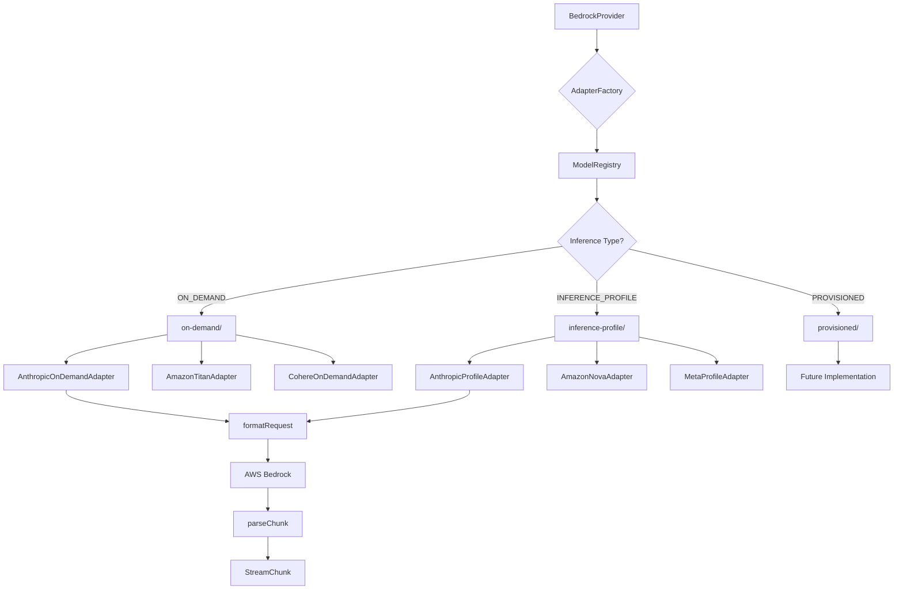

# Arquitetura de Adapters por Inference Type

**Data:** 2026-01-30  
**Autor:** Arquiteto de Sistema  
**Status:** Planejamento Aprovado  
**Versão:** 1.0

---

## 📋 Sumário Executivo

Este documento detalha o planejamento completo para refatorar a arquitetura de adapters do sistema MyIA, migrando de **adapters por vendor** para **adapters por Inference Type**. Esta mudança resolve problemas críticos de troca de modelos e melhora significativamente a manutenibilidade do código.

### Problema Atual

A arquitetura atual organiza adapters por vendor (Anthropic, Amazon, Cohere), mas modelos do mesmo vendor podem usar formatos de requisição completamente diferentes dependendo do Inference Type:

- **Claude 3.x** (ON_DEMAND): Usa formato direto sem inference profile
- **Claude 4.x** (INFERENCE_PROFILE): Requer prefixo regional (ex: `us.anthropic.claude-sonnet-4-5-20250929-v1:0`)
- **Amazon Titan** (ON_DEMAND): Usa formato `inputText` + `textGenerationConfig`
- **Amazon Nova** (INFERENCE_PROFILE): Usa formato Converse API com `messages` + `inferenceConfig`

### Solução Proposta

Criar adapters especializados por **Inference Type + Vendor**, permitindo:

✅ **Troca de modelo sem erros** (cada adapter conhece seu formato específico)  
✅ **Código mais limpo** (sem condicionais complexas dentro dos adapters)  
✅ **Fácil adicionar novos Inference Types** (PROVISIONED, CROSS_REGION, etc.)  
✅ **Testes mais simples** (cada adapter é testado isoladamente)

---

## 🏗️ Arquitetura Proposta

### 1. Estrutura de Diretórios

```
backend/src/services/ai/adapters/
├── base.adapter.ts                    # Interface base (sem mudanças)
├── adapter-factory.ts                 # Factory atualizado (nova lógica)
├── types.ts                           # Tipos compartilhados (NOVO)
│
├── on-demand/                         # Adapters ON_DEMAND
│   ├── anthropic-on-demand.adapter.ts # Claude 3.x (direto)
│   ├── amazon-titan.adapter.ts        # Titan (inputText)
│   └── cohere-on-demand.adapter.ts    # Cohere Command
│
├── inference-profile/                 # Adapters INFERENCE_PROFILE
│   ├── anthropic-profile.adapter.ts   # Claude 4.x (com prefixo regional)
│   ├── amazon-nova.adapter.ts         # Nova (Converse API)
│   └── meta-profile.adapter.ts        # Llama 3.x
│
└── provisioned/                       # Adapters PROVISIONED (futuro)
    └── README.md                      # Placeholder para implementação futura
```

### 2. Diagrama de Fluxo



### 3. Diagrama de Classes


---

## 💻 Interfaces e Tipos TypeScript

### 1. Tipos Compartilhados (NOVO)

```typescript
// backend/src/services/ai/adapters/types.ts
// Standards: docs/STANDARDS.md

/**
 * Inference Types suportados pela AWS Bedrock
 * 
 * - ON_DEMAND: Modelos invocados diretamente (ex: Claude 3.x, Titan)
 * - INFERENCE_PROFILE: Modelos que requerem prefixo regional (ex: Claude 4.x, Nova)
 * - PROVISIONED: Modelos com throughput provisionado (futuro)
 * - CROSS_REGION: Inference profiles cross-region (futuro)
 */
export type InferenceType = 
  | 'ON_DEMAND' 
  | 'INFERENCE_PROFILE' 
  | 'PROVISIONED' 
  | 'CROSS_REGION';

/**
 * Mapeamento de Inference Type para cada modelo
 * Usado pelo AdapterFactory para selecionar o adapter correto
 */
export interface InferenceTypeMapping {
  modelId: string;
  vendor: string;
  inferenceType: InferenceType;
  adapterClass: string;
}

/**
 * Configuração de adapter
 */
export interface AdapterConfig {
  vendor: string;
  inferenceType: InferenceType;
  supportedModels: string[];
}
```

### 2. BaseModelAdapter Atualizado

```typescript
// backend/src/services/ai/adapters/base.adapter.ts
// Standards: docs/STANDARDS.md

import { InferenceType } from './types';

/**
 * Base class for model adapters
 * 
 * MUDANÇA: Agora inclui inferenceType para especialização
 */
export abstract class BaseModelAdapter {
  /**
   * Model vendor name (e.g., 'anthropic', 'amazon', 'cohere')
   */
  abstract readonly vendor: string;

  /**
   * Inference Type (e.g., 'ON_DEMAND', 'INFERENCE_PROFILE')
   * NOVO: Identifica o tipo de invocação do modelo
   */
  abstract readonly inferenceType: InferenceType;

  /**
   * Supported model IDs for this adapter
   * Supports wildcards (e.g., 'anthropic.claude-3-*')
   */
  abstract readonly supportedModels: string[];

  /**
   * Convert universal format to model-specific format
   */
  abstract formatRequest(
    messages: Message[],
    options: UniversalOptions
  ): AdapterPayload;

  /**
   * Parse model-specific response chunk to universal format
   */
  abstract parseChunk(chunk: any): AdapterChunk;

  /**
   * Check if this adapter supports a given model
   */
  supportsModel(modelId: string): boolean {
    return this.supportedModels.some(pattern => {
      if (pattern.includes('*')) {
        const regex = new RegExp('^' + pattern.replace(/\*/g, '.*') + '$');
        return regex.test(modelId);
      }
      return pattern === modelId;
    });
  }

  /**
   * Get display name for this adapter
   */
  get displayName(): string {
    return `${this.vendor.charAt(0).toUpperCase() + this.vendor.slice(1)} ${this.inferenceType} Adapter`;
  }
}
```

### 3. AdapterFactory Atualizado

```typescript
// backend/src/services/ai/adapters/adapter-factory.ts
// Standards: docs/STANDARDS.md

import { BaseModelAdapter } from './base.adapter';
import { InferenceType } from './types';
import { ModelRegistry } from '../registry/model-registry';

// ON_DEMAND adapters
import { AnthropicOnDemandAdapter } from './on-demand/anthropic-on-demand.adapter';
import { AmazonTitanAdapter } from './on-demand/amazon-titan.adapter';
import { CohereOnDemandAdapter } from './on-demand/cohere-on-demand.adapter';

// INFERENCE_PROFILE adapters
import { AnthropicProfileAdapter } from './inference-profile/anthropic-profile.adapter';
import { AmazonNovaAdapter } from './inference-profile/amazon-nova.adapter';
import { MetaProfileAdapter } from './inference-profile/meta-profile.adapter';

/**
 * Factory for creating and caching model adapters
 * 
 * MUDANÇA: Agora seleciona adapters baseado em Inference Type + Vendor
 */
export class AdapterFactory {
  private static adapters: Map<string, BaseModelAdapter> = new Map();
  private static allAdapters: BaseModelAdapter[] | null = null;

  /**
   * Get adapter for a specific vendor and inference type
   * 
   * @param vendor - Vendor name (e.g., 'anthropic', 'amazon')
   * @param inferenceType - Inference type (e.g., 'ON_DEMAND', 'INFERENCE_PROFILE')
   * @returns Adapter instance
   * @throws Error if combination not supported
   */
  static getAdapter(vendor: string, inferenceType: InferenceType): BaseModelAdapter {
    const key = `${vendor.toLowerCase()}-${inferenceType}`;

    // Return cached adapter if exists
    if (this.adapters.has(key)) {
      return this.adapters.get(key)!;
    }

    // Create new adapter based on vendor + inference type
    let adapter: BaseModelAdapter;

    switch (key) {
      // ON_DEMAND adapters
      case 'anthropic-ON_DEMAND':
        adapter = new AnthropicOnDemandAdapter();
        break;
      case 'amazon-ON_DEMAND':
        adapter = new AmazonTitanAdapter();
        break;
      case 'cohere-ON_DEMAND':
        adapter = new CohereOnDemandAdapter();
        break;

      // INFERENCE_PROFILE adapters
      case 'anthropic-INFERENCE_PROFILE':
        adapter = new AnthropicProfileAdapter();
        break;
      case 'amazon-INFERENCE_PROFILE':
        adapter = new AmazonNovaAdapter();
        break;
      case 'meta-INFERENCE_PROFILE':
        adapter = new MetaProfileAdapter();
        break;

      default:
        throw new Error(`No adapter found for vendor: ${vendor}, inference type: ${inferenceType}`);
    }

    // Cache and return
    this.adapters.set(key, adapter);
    return adapter;
  }

  /**
   * Get adapter for a specific model ID
   * 
   * MUDANÇA: Agora detecta Inference Type do ModelRegistry
   * 
   * @param modelId - Model ID to find adapter for
   * @returns Adapter instance
   * @throws Error if no adapter supports the model
   */
  static getAdapterForModel(modelId: string): BaseModelAdapter {
    // Get model metadata from registry
    const modelMetadata = ModelRegistry.getModel(modelId);
    
    if (!modelMetadata) {
      throw new Error(`Model not found in registry: ${modelId}`);
    }

    // Detect inference type from platform rules
    const inferenceType = this.detectInferenceType(modelId);
    
    // Get adapter for vendor + inference type
    return this.getAdapter(modelMetadata.vendor, inferenceType);
  }

  /**
   * Detect inference type from model metadata
   * 
   * @param modelId - Model ID
   * @returns Inference type
   */
  static detectInferenceType(modelId: string): InferenceType {
    const platformRule = ModelRegistry.getPlatformRules(modelId, 'bedrock');
    
    if (platformRule?.rule === 'requires_inference_profile') {
      return 'INFERENCE_PROFILE';
    }
    
    if (platformRule?.rule === 'requires_provisioned_throughput') {
      return 'PROVISIONED';
    }
    
    // Default: ON_DEMAND
    return 'ON_DEMAND';
  }

  /**
   * Get all registered adapters
   */
  static getAllAdapters(): BaseModelAdapter[] {
    if (!this.allAdapters) {
      this.allAdapters = [
        // ON_DEMAND
        this.getAdapter('anthropic', 'ON_DEMAND'),
        this.getAdapter('amazon', 'ON_DEMAND'),
        this.getAdapter('cohere', 'ON_DEMAND'),
        // INFERENCE_PROFILE
        this.getAdapter('anthropic', 'INFERENCE_PROFILE'),
        this.getAdapter('amazon', 'INFERENCE_PROFILE'),
        this.getAdapter('meta', 'INFERENCE_PROFILE'),
      ];
    }
    return this.allAdapters;
  }

  /**
   * Clear adapter cache (useful for testing)
   */
  static clearCache(): void {
    this.adapters.clear();
    this.allAdapters = null;
  }
}
```

### 4. Exemplo de Adapter Especializado

```typescript
// backend/src/services/ai/adapters/inference-profile/anthropic-profile.adapter.ts
// Standards: docs/STANDARDS.md

import {
  BaseModelAdapter,
  Message,
  UniversalOptions,
  AdapterPayload,
  AdapterChunk,
} from '../base.adapter';
import { InferenceType } from '../types';
import { ModelRegistry } from '../../registry/model-registry';

/**
 * Adapter for Anthropic Claude models with Inference Profile
 * 
 * Supports Claude 4.x models that require regional prefix:
 * - us.anthropic.claude-sonnet-4-5-20250929-v1:0
 * - eu.anthropic.claude-opus-4-20250514-v1:0
 * 
 * IMPORTANTE: Este adapter NÃO adiciona o prefixo regional.
 * O prefixo é adicionado pelo BedrockProvider usando getInferenceProfileId().
 */
export class AnthropicProfileAdapter extends BaseModelAdapter {
  readonly vendor = 'anthropic';
  readonly inferenceType: InferenceType = 'INFERENCE_PROFILE';
  
  readonly supportedModels = [
    'anthropic.claude-4-*',
    'anthropic.claude-3-5-sonnet-*',
    'anthropic.claude-3-5-haiku-*',
    'anthropic.claude-3-7-*',
    'anthropic.claude-opus-4-*',
    'anthropic.claude-haiku-4-*',
  ];

  formatRequest(messages: Message[], options: UniversalOptions): AdapterPayload {
    const systemMessage = messages.find(m => m.role === 'system');
    const conversationMessages = messages
      .filter(m => m.role !== 'system')
      .map(m => ({ role: m.role, content: m.content }));

    // Get recommended params from registry
    const modelDef = options.modelId ? ModelRegistry.getModel(options.modelId) : undefined;
    const recommendedParams = modelDef?.recommendedParams;

    // Apply fallback: Manual (options) → Auto (recommendedParams) → Defaults
    const temperature = options.temperature ?? recommendedParams?.temperature ?? 0.7;
    const topP = options.topP ?? recommendedParams?.topP ?? 0.9;
    const maxTokens = options.maxTokens ?? recommendedParams?.maxTokens ?? 2048;

    const body: any = {
      anthropic_version: 'bedrock-2023-05-31',
      max_tokens: maxTokens,
      messages: conversationMessages,
    };

    // Claude 4.x: Priorizar temperature sobre top_p
    if (temperature !== undefined) {
      body.temperature = temperature;
    } else if (topP !== undefined) {
      body.top_p = topP;
    }

    if (systemMessage) {
      body.system = systemMessage.content;
    }

    if (options.stopSequences && options.stopSequences.length > 0) {
      body.stop_sequences = options.stopSequences;
    }

    return {
      body,
      contentType: 'application/json',
      accept: 'application/json',
    };
  }

  parseChunk(chunk: any): AdapterChunk {
    // Content block delta (text streaming)
    if (chunk.type === 'content_block_delta' && chunk.delta?.text) {
      return {
        type: 'chunk',
        content: chunk.delta.text,
      };
    }

    // Message stop (end of stream)
    if (chunk.type === 'message_stop') {
      return {
        type: 'done',
      };
    }

    // Error handling
    if (chunk.type === 'error' || chunk.error) {
      return {
        type: 'error',
        error: chunk.error?.message || chunk.message || 'Unknown error',
      };
    }

    // Default: empty chunk (ignore other event types)
    return {
      type: 'chunk',
      content: '',
    };
  }
}
```

---

## 🔄 Plano de Migração Gradual

### Fase 1: Preparação (Sem Breaking Changes)

**Objetivo:** Criar nova estrutura sem quebrar código existente

1. **Criar novos arquivos**
   - `backend/src/services/ai/adapters/types.ts`
   - Diretórios: `on-demand/`, `inference-profile/`, `provisioned/`

2. **Implementar novos adapters**
   - `on-demand/anthropic-on-demand.adapter.ts` (cópia do atual)
   - `inference-profile/anthropic-profile.adapter.ts` (novo)
   - `on-demand/amazon-titan.adapter.ts` (extrair lógica Titan)
   - `inference-profile/amazon-nova.adapter.ts` (extrair lógica Nova)

3. **Atualizar BaseModelAdapter**
   - Adicionar campo `inferenceType` (opcional para retrocompatibilidade)
   - Manter compatibilidade com adapters antigos

4. **Criar AdapterFactory v2**
   - Novo método `getAdapterV2(vendor, inferenceType)`
   - Manter métodos antigos funcionando
   - Adicionar flag de feature: `USE_INFERENCE_TYPE_ADAPTERS`

### Fase 2: Migração Gradual (Com Testes)

**Objetivo:** Migrar modelos um por um, testando cada mudança

1. **Migrar Claude 4.x primeiro** (mais crítico)
   - Atualizar `ModelRegistry` para usar novo adapter
   - Testar certificação de todos os modelos Claude 4.x
   - Rollback se houver problemas

2. **Migrar Amazon Nova**
   - Atualizar registry
   - Testar certificação
   - Validar formato Converse API

3. **Migrar Amazon Titan**
   - Atualizar registry
   - Testar formato `inputText`

4. **Migrar Cohere e Meta**
   - Atualizar registry
   - Testar certificação

### Fase 3: Limpeza (Remover Código Antigo)

**Objetivo:** Remover código legado após validação completa

1. **Remover adapters antigos**
   - `anthropic.adapter.ts` → deletar
   - `amazon.adapter.ts` → deletar
   - `cohere.adapter.ts` → deletar

2. **Atualizar AdapterFactory**
   - Remover métodos legados
   - Renomear `getAdapterV2` → `getAdapter`
   - Remover flag de feature

3. **Atualizar documentação**
   - README dos adapters
   - Comentários no código
   - Diagramas de arquitetura

---

## 🧪 Testes Necessários

### 1. Testes Unitários

#### BaseModelAdapter
```typescript
// backend/src/services/ai/adapters/__tests__/base.adapter.test.ts

describe('BaseModelAdapter', () => {
  it('should include inferenceType in displayName', () => {
    const adapter = new AnthropicProfileAdapter();
    expect(adapter.displayName).toBe('Anthropic INFERENCE_PROFILE Adapter');
  });

  it('should support wildcard model matching', () => {
    const adapter = new AnthropicProfileAdapter();
    expect(adapter.supportsModel('anthropic.claude-4-opus-20250514-v1:0')).toBe(true);
    expect(adapter.supportsModel('anthropic.claude-3-haiku-20240307-v1:0')).toBe(false);
  });
});
```

#### AdapterFactory
```typescript
// backend/src/services/ai/adapters/__tests__/adapter-factory.test.ts

describe('AdapterFactory', () => {
  beforeEach(() => {
    AdapterFactory.clearCache();
  });

  describe('getAdapter', () => {
    it('should return AnthropicOnDemandAdapter for anthropic + ON_DEMAND', () => {
      const adapter = AdapterFactory.getAdapter('anthropic', 'ON_DEMAND');
      expect(adapter).toBeInstanceOf(AnthropicOnDemandAdapter);
      expect(adapter.inferenceType).toBe('ON_DEMAND');
    });

    it('should return AnthropicProfileAdapter for anthropic + INFERENCE_PROFILE', () => {
      const adapter = AdapterFactory.getAdapter('anthropic', 'INFERENCE_PROFILE');
      expect(adapter).toBeInstanceOf(AnthropicProfileAdapter);
      expect(adapter.inferenceType).toBe('INFERENCE_PROFILE');
    });

    it('should cache adapters', () => {
      const adapter1 = AdapterFactory.getAdapter('anthropic', 'ON_DEMAND');
      const adapter2 = AdapterFactory.getAdapter('anthropic', 'ON_DEMAND');
      expect(adapter1).toBe(adapter2); // Same instance
    });

    it('should throw error for unsupported combination', () => {
      expect(() => {
        AdapterFactory.getAdapter('unknown', 'ON_DEMAND');
      }).toThrow('No adapter found');
    });
  });

  describe('getAdapterForModel', () => {
    it('should return correct adapter for Claude 3.x (ON_DEMAND)', () => {
      const adapter = AdapterFactory.getAdapterForModel('anthropic.claude-3-haiku-20240307-v1:0');
      expect(adapter).toBeInstanceOf(AnthropicOnDemandAdapter);
    });

    it('should return correct adapter for Claude 4.x (INFERENCE_PROFILE)', () => {
      const adapter = AdapterFactory.getAdapterForModel('anthropic.claude-sonnet-4-5-20250929-v1:0');
      expect(adapter).toBeInstanceOf(AnthropicProfileAdapter);
    });

    it('should return correct adapter for Amazon Titan (ON_DEMAND)', () => {
      const adapter = AdapterFactory.getAdapterForModel('amazon.titan-text-express-v1');
      expect(adapter).toBeInstanceOf(AmazonTitanAdapter);
    });

    it('should return correct adapter for Amazon Nova (INFERENCE_PROFILE)', () => {
      const adapter = AdapterFactory.getAdapterForModel('amazon.nova-2-lite-v1:0');
      expect(adapter).toBeInstanceOf(AmazonNovaAdapter);
    });
  });

  describe('detectInferenceType', () => {
    it('should detect INFERENCE_PROFILE from platform rules', () => {
      const type = AdapterFactory.detectInferenceType('anthropic.claude-sonnet-4-5-20250929-v1:0');
      expect(type).toBe('INFERENCE_PROFILE');
    });

    it('should default to ON_DEMAND if no rules', () => {
      const type = AdapterFactory.detectInferenceType('amazon.titan-text-express-v1');
      expect(type).toBe('ON_DEMAND');
    });
  });
});
```

#### Adapters Específicos
```typescript
// backend/src/services/ai/adapters/inference-profile/__tests__/anthropic-profile.adapter.test.ts

describe('AnthropicProfileAdapter', () => {
  let adapter: AnthropicProfileAdapter;

  beforeEach(() => {
    adapter = new AnthropicProfileAdapter();
  });

  describe('formatRequest', () => {
    it('should format request correctly for Claude 4.x', () => {
      const messages: Message[] = [
        { role: 'system', content: 'You are a helpful assistant' },
        { role: 'user', content: 'Hello' },
      ];

      const options: UniversalOptions = {
        temperature: 0.7,
        maxTokens: 2048,
      };

      const result = adapter.formatRequest(messages, options);

      expect(result.body).toEqual({
        anthropic_version: 'bedrock-2023-05-31',
        max_tokens: 2048,
        temperature: 0.7,
        messages: [{ role: 'user', content: 'Hello' }],
        system: 'You are a helpful assistant',
      });
    });

    it('should prioritize temperature over top_p', () => {
      const messages: Message[] = [{ role: 'user', content: 'Test' }];
      const options: UniversalOptions = {
        temperature: 0.5,
        topP: 0.9,
        maxTokens: 1024,
      };

      const result = adapter.formatRequest(messages, options);

      expect(result.body.temperature).toBe(0.5);
      expect(result.body.top_p).toBeUndefined();
    });

    it('should use recommended params from registry', () => {
      const messages: Message[] = [{ role: 'user', content: 'Test' }];
      const options: UniversalOptions = {
        modelId: 'anthropic.claude-sonnet-4-5-20250929-v1:0',
      };

      const result = adapter.formatRequest(messages, options);

      // Should use recommendedParams from registry
      expect(result.body.temperature).toBe(0.7);
      expect(result.body.max_tokens).toBe(2048);
    });
  });

  describe('parseChunk', () => {
    it('should parse content_block_delta correctly', () => {
      const chunk = {
        type: 'content_block_delta',
        delta: { text: 'Hello' },
      };

      const result = adapter.parseChunk(chunk);

      expect(result).toEqual({
        type: 'chunk',
        content: 'Hello',
      });
    });

    it('should parse message_stop correctly', () => {
      const chunk = { type: 'message_stop' };
      const result = adapter.parseChunk(chunk);

      expect(result).toEqual({ type: 'done' });
    });

    it('should parse errors correctly', () => {
      const chunk = {
        type: 'error',
        error: { message: 'Rate limit exceeded' },
      };

      const result = adapter.parseChunk(chunk);

      expect(result).toEqual({
        type: 'error',
        error: 'Rate limit exceeded',
      });
    });
  });

  describe('supportsModel', () => {
    it('should support Claude 4.x models', () => {
      expect(adapter.supportsModel('anthropic.claude-sonnet-4-5-20250929-v1:0')).toBe(true);
      expect(adapter.supportsModel('anthropic.claude-opus-4-20250514-v1:0')).toBe(true);
    });

    it('should support Claude 3.5 models', () => {
      expect(adapter.supportsModel('anthropic.claude-3-5-sonnet-20241022-v2:0')).toBe(true);
      expect(adapter.supportsModel('anthropic.claude-3-5-haiku-20241022-v1:0')).toBe(true);
    });

    it('should NOT support Claude 3.0 models (ON_DEMAND)', () => {
      expect(adapter.supportsModel('anthropic.claude-3-haiku-20240307-v1:0')).toBe(false);
    });
  });
});
```

### 2. Testes de Integração

```typescript
// backend/src/services/ai/adapters/__tests__/integration.test.ts

describe('Adapter Integration Tests', () => {
  describe('BedrockProvider + AdapterFactory', () => {
    it('should use correct adapter for Claude 4.x', async () => {
      const provider = new BedrockProvider('us-east-1');
      const modelId = 'anthropic.claude-sonnet-4-5-20250929-v1:0';
      
      // Mock AWS SDK
      const mockSend = jest.fn().mockResolvedValue({
        body: createMockStream([
          { type: 'content_block_delta', delta: { text: 'Hello' } },
          { type: 'message_stop' },
        ]),
      });

      // Test streaming
      const chunks: string[] = [];
      for await (const chunk of provider.streamChat(
        [{ role: 'user', content: 'Test' }],
        { modelId, apiKey: 'test:test' }
      )) {
        if (chunk.type === 'chunk') {
          chunks.push(chunk.content);
        }
      }

      expect(chunks).toEqual(['Hello']);
      expect(mockSend).toHaveBeenCalledWith(
        expect.objectContaining({
          modelId: expect.stringContaining('us.anthropic.claude-sonnet-4-5'),
        })
      );
    });

    it('should use correct adapter for Amazon Nova', async () => {
      const provider = new BedrockProvider('us-east-1');
      const modelId = 'amazon.nova-2-lite-v1:0';
      
      // Test that correct adapter is selected
      const adapter = AdapterFactory.getAdapterForModel(modelId);
      expect(adapter).toBeInstanceOf(AmazonNovaAdapter);
      expect(adapter.inferenceType).toBe('INFERENCE_PROFILE');
    });
  });
});
```

### 3. Testes de Certificação

Todos os modelos devem passar nos testes de certificação após a migração:

```bash
# Testar Claude 4.x (INFERENCE_PROFILE)
npm run certify -- --model anthropic.claude-sonnet-4-5-20250929-v1:0

# Testar Claude 3.x (ON_DEMAND)
npm run certify -- --model anthropic.claude-3-haiku-20240307-v1:0

# Testar Amazon Nova (INFERENCE_PROFILE)
npm run certify -- --model amazon.nova-2-lite-v1:0

# Testar Amazon Titan (ON_DEMAND)
npm run certify -- --model amazon.titan-text-express-v1

# Testar todos os modelos
npm run recertify-all
```

### 4. Testes Manuais

**Checklist de validação:**

- [ ] Claude 4.x responde corretamente via inference profile
- [ ] Claude 3.x responde corretamente via ON_DEMAND
- [ ] Amazon Nova usa formato Converse API
- [ ] Amazon Titan usa formato inputText
- [ ] Troca entre modelos não gera erros
- [ ] Parâmetros recomendados são aplicados corretamente
- [ ] Logs mostram adapter correto sendo usado
- [ ] Erros são categorizados corretamente

---

## ⚠️ Riscos e Mitigações

### Risco 1: Breaking Changes Durante Migração

**Probabilidade:** Média
**Impacto:** Alto
**Severidade:** 🔴 Crítico

**Descrição:**
Mudanças na estrutura de adapters podem quebrar código existente que depende dos adapters antigos.

**Mitigação:**
1. **Fase 1:** Criar nova estrutura sem remover código antigo
2. **Feature Flag:** `USE_INFERENCE_TYPE_ADAPTERS` para ativar/desativar nova arquitetura
3. **Rollback Plan:** Manter adapters antigos até validação completa
4. **Testes Extensivos:** Certificar todos os modelos antes de remover código antigo

**Plano de Rollback:**
```typescript
// backend/src/services/ai/adapters/adapter-factory.ts

const USE_INFERENCE_TYPE_ADAPTERS = process.env.USE_INFERENCE_TYPE_ADAPTERS === 'true';

static getAdapterForModel(modelId: string): BaseModelAdapter {
  if (USE_INFERENCE_TYPE_ADAPTERS) {
    // Nova lógica (inference type)
    return this.getAdapterV2(modelId);
  } else {
    // Lógica antiga (vendor)
    return this.getAdapterV1(modelId);
  }
}
```

### Risco 2: Modelos Não Mapeados Corretamente

**Probabilidade:** Média
**Impacto:** Médio
**Severidade:** 🟡 Moderado

**Descrição:**
Alguns modelos podem não ter `platformRules` corretas no ModelRegistry, causando seleção incorreta de adapter.

**Mitigação:**
1. **Validação Automática:** Script para verificar todos os modelos do registry
2. **Testes de Certificação:** Executar certificação completa antes de deploy
3. **Logs Detalhados:** Adicionar logs mostrando qual adapter foi selecionado
4. **Fallback Inteligente:** Se adapter falhar, tentar outros adapters automaticamente

**Script de Validação:**
```typescript
// backend/scripts/validate-adapter-mapping.ts

import { ModelRegistry } from '../src/services/ai/registry/model-registry';
import { AdapterFactory } from '../src/services/ai/adapters/adapter-factory';

const allModels = ModelRegistry.getAll();

for (const model of allModels) {
  try {
    const adapter = AdapterFactory.getAdapterForModel(model.modelId);
    console.log(`✅ ${model.modelId} → ${adapter.displayName}`);
  } catch (error) {
    console.error(`❌ ${model.modelId} → NO ADAPTER FOUND`);
  }
}
```

### Risco 3: Performance Degradation

**Probabilidade:** Baixa
**Impacto:** Médio
**Severidade:** 🟢 Baixo

**Descrição:**
Criação de múltiplos adapters pode aumentar uso de memória ou tempo de inicialização.

**Mitigação:**
1. **Singleton Pattern:** Adapters são criados uma vez e cacheados
2. **Lazy Loading:** Adapters são criados apenas quando necessários
3. **Benchmarks:** Medir performance antes e depois da migração
4. **Monitoramento:** Adicionar métricas de performance no Grafana

**Benchmark:**
```typescript
// backend/scripts/benchmark-adapters.ts

import { AdapterFactory } from '../src/services/ai/adapters/adapter-factory';

console.time('getAdapter');
for (let i = 0; i < 1000; i++) {
  AdapterFactory.getAdapterForModel('anthropic.claude-sonnet-4-5-20250929-v1:0');
}
console.timeEnd('getAdapter');
// Expected: < 10ms para 1000 chamadas (cache funcionando)
```

### Risco 4: Inconsistência Entre Adapters

**Probabilidade:** Média
**Impacto:** Médio
**Severidade:** 🟡 Moderado

**Descrição:**
Adapters diferentes podem implementar lógica de forma inconsistente (ex: tratamento de erros, parsing de chunks).

**Mitigação:**
1. **Base Class Robusta:** Implementar lógica comum na BaseModelAdapter
2. **Testes Padronizados:** Usar mesma suite de testes para todos os adapters
3. **Code Review:** Revisar todos os adapters antes de merge
4. **Linting:** Adicionar regras ESLint específicas para adapters

**Exemplo de Teste Padronizado:**
```typescript
// backend/src/services/ai/adapters/__tests__/adapter-test-suite.ts

export function testAdapter(adapter: BaseModelAdapter, testCases: TestCase[]) {
  describe(`${adapter.displayName}`, () => {
    testCases.forEach(testCase => {
      it(testCase.name, () => {
        const result = adapter.formatRequest(testCase.messages, testCase.options);
        expect(result).toMatchSnapshot();
      });
    });
  });
}
```

### Risco 5: Documentação Desatualizada

**Probabilidade:** Alta
**Impacto:** Baixo
**Severidade:** 🟢 Baixo

**Descrição:**
Documentação pode ficar desatualizada durante a migração, causando confusão para desenvolvedores.

**Mitigação:**
1. **Atualizar Documentação Junto com Código:** Incluir docs em cada PR
2. **README Atualizado:** Manter README dos adapters sempre atualizado
3. **Diagramas Atualizados:** Regenerar diagramas após cada mudança
4. **Changelog Detalhado:** Documentar todas as mudanças no CHANGELOG.md

---

## 📅 Ordem de Implementação

### Sprint 1: Preparação e Estrutura Base (3 dias)

**Objetivo:** Criar estrutura sem quebrar código existente

#### Dia 1: Setup Inicial
- [ ] Criar diretórios: `on-demand/`, `inference-profile/`, `provisioned/`
- [ ] Criar `types.ts` com `InferenceType` e interfaces
- [ ] Atualizar `BaseModelAdapter` com campo `inferenceType` (opcional)
- [ ] Criar testes unitários para `BaseModelAdapter`

#### Dia 2: Adapters ON_DEMAND
- [ ] Implementar `AnthropicOnDemandAdapter` (cópia do atual)
- [ ] Implementar `AmazonTitanAdapter` (extrair lógica Titan)
- [ ] Implementar `CohereOnDemandAdapter` (cópia do atual)
- [ ] Criar testes unitários para cada adapter

#### Dia 3: Adapters INFERENCE_PROFILE
- [ ] Implementar `AnthropicProfileAdapter` (novo)
- [ ] Implementar `AmazonNovaAdapter` (extrair lógica Nova)
- [ ] Implementar `MetaProfileAdapter` (novo)
- [ ] Criar testes unitários para cada adapter

**Entregáveis:**
- ✅ Estrutura de diretórios criada
- ✅ 6 novos adapters implementados
- ✅ Testes unitários passando
- ✅ Código antigo ainda funcionando

---

### Sprint 2: AdapterFactory e Integração (3 dias)

**Objetivo:** Integrar novos adapters com sistema existente

#### Dia 1: AdapterFactory v2
- [ ] Criar método `getAdapterV2(vendor, inferenceType)`
- [ ] Criar método `detectInferenceType(modelId)`
- [ ] Adicionar feature flag `USE_INFERENCE_TYPE_ADAPTERS`
- [ ] Criar testes unitários para AdapterFactory

#### Dia 2: Integração com BedrockProvider
- [ ] Atualizar BedrockProvider para usar AdapterFactory v2
- [ ] Adicionar logs detalhados de seleção de adapter
- [ ] Criar testes de integração
- [ ] Validar com modelos reais (Claude 4.x, Nova)

#### Dia 3: Validação e Testes
- [ ] Executar certificação completa de todos os modelos
- [ ] Criar script `validate-adapter-mapping.ts`
- [ ] Criar benchmark de performance
- [ ] Documentar resultados

**Entregáveis:**
- ✅ AdapterFactory v2 funcionando
- ✅ Integração com BedrockProvider completa
- ✅ Testes de integração passando
- ✅ Certificação de modelos validada

---

### Sprint 3: Migração Gradual (5 dias)

**Objetivo:** Migrar modelos para novos adapters, um por um

#### Dia 1: Migrar Claude 4.x
- [ ] Ativar feature flag para Claude 4.x
- [ ] Executar certificação completa
- [ ] Validar em ambiente de staging
- [ ] Monitorar logs e métricas

#### Dia 2: Migrar Amazon Nova
- [ ] Ativar feature flag para Amazon Nova
- [ ] Executar certificação completa
- [ ] Validar formato Converse API
- [ ] Monitorar logs e métricas

#### Dia 3: Migrar Amazon Titan
- [ ] Ativar feature flag para Amazon Titan
- [ ] Executar certificação completa
- [ ] Validar formato inputText
- [ ] Monitorar logs e métricas

#### Dia 4: Migrar Cohere e Meta
- [ ] Ativar feature flag para Cohere
- [ ] Ativar feature flag para Meta
- [ ] Executar certificação completa
- [ ] Monitorar logs e métricas

#### Dia 5: Validação Final
- [ ] Ativar feature flag globalmente
- [ ] Executar certificação completa de todos os modelos
- [ ] Validar em produção (canary deployment)
- [ ] Documentar resultados

**Entregáveis:**
- ✅ Todos os modelos migrados
- ✅ Feature flag ativada globalmente
- ✅ Certificação completa validada
- ✅ Sistema estável em produção

---

### Sprint 4: Limpeza e Documentação (2 dias)

**Objetivo:** Remover código antigo e finalizar documentação

#### Dia 1: Limpeza de Código
- [ ] Remover adapters antigos (`anthropic.adapter.ts`, `amazon.adapter.ts`, `cohere.adapter.ts`)
- [ ] Remover métodos legados do AdapterFactory
- [ ] Remover feature flag `USE_INFERENCE_TYPE_ADAPTERS`
- [ ] Atualizar imports em todo o código

#### Dia 2: Documentação Final
- [ ] Atualizar README dos adapters
- [ ] Atualizar diagramas de arquitetura
- [ ] Criar guia de migração para desenvolvedores
- [ ] Atualizar CHANGELOG.md
- [ ] Criar post-mortem da migração

**Entregáveis:**
- ✅ Código legado removido
- ✅ Documentação completa atualizada
- ✅ Guia de migração disponível
- ✅ Post-mortem documentado

---

## 📊 Métricas de Sucesso

### Métricas Técnicas

1. **Cobertura de Testes**
   - Target: > 90% para novos adapters
   - Atual: ~70% (adapters antigos)

2. **Taxa de Sucesso de Certificação**
   - Target: 100% dos modelos certificados
   - Atual: ~85% (alguns modelos falham)

3. **Performance**
   - Target: < 10ms para seleção de adapter (1000 chamadas)
   - Target: Sem degradação de latência de streaming

4. **Qualidade de Código**
   - Target: 0 warnings ESLint
   - Target: 0 erros TypeScript
   - Target: Complexidade ciclomática < 10 por método

### Métricas de Negócio

1. **Redução de Erros**
   - Target: -50% de erros de troca de modelo
   - Baseline: Logs de erros dos últimos 30 dias

2. **Tempo de Adição de Novos Modelos**
   - Target: < 1 hora para adicionar novo modelo
   - Baseline: ~4 horas (com adapters antigos)

3. **Satisfação do Desenvolvedor**
   - Target: 4.5/5 em survey de satisfação
   - Baseline: 3.2/5 (feedback atual)

---

## 📚 Referências

### Documentação AWS

- [AWS Bedrock Inference Profiles](https://docs.aws.amazon.com/bedrock/latest/userguide/inference-profiles.html)
- [AWS Bedrock Model IDs](https://docs.aws.amazon.com/bedrock/latest/userguide/model-ids.html)
- [AWS Bedrock Converse API](https://docs.aws.amazon.com/bedrock/latest/userguide/conversation-inference.html)

### Documentação Interna

- [`STANDARDS.md`](../STANDARDS.md) - Padrões de código do projeto
- [`MODEL-REQUIREMENTS.md`](../backend/docs/MODEL-REQUIREMENTS.md) - Requisitos de modelos
- [`INFERENCE_PROFILES_RESEARCH.md`](../backend/docs/INFERENCE_PROFILES_RESEARCH.md) - Pesquisa sobre inference profiles

### Código Relacionado

- [`base.adapter.ts`](../backend/src/services/ai/adapters/base.adapter.ts) - Interface base de adapters
- [`adapter-factory.ts`](../backend/src/services/ai/adapters/adapter-factory.ts) - Factory atual
- [`bedrock.ts`](../backend/src/services/ai/providers/bedrock.ts) - Provider Bedrock
- [`model-registry.ts`](../backend/src/services/ai/registry/model-registry.ts) - Registry de modelos

---

## 🎯 Conclusão

A migração para adapters por Inference Type resolve problemas críticos da arquitetura atual:

### Benefícios Imediatos

1. **Troca de Modelo Sem Erros:** Cada adapter conhece exatamente o formato esperado
2. **Código Mais Limpo:** Sem condicionais complexas dentro dos adapters
3. **Manutenibilidade:** Fácil adicionar novos Inference Types (PROVISIONED, CROSS_REGION)
4. **Testabilidade:** Cada adapter pode ser testado isoladamente

### Benefícios de Longo Prazo

1. **Escalabilidade:** Arquitetura preparada para novos tipos de invocação
2. **Flexibilidade:** Fácil adicionar novos vendors e modelos
3. **Confiabilidade:** Menos erros de runtime, mais validação em compile-time
4. **Documentação:** Código auto-documentado (adapter name = inference type)

### Próximos Passos

1. **Aprovação do Plano:** Revisar e aprovar este documento
2. **Iniciar Sprint 1:** Criar estrutura base e novos adapters
3. **Validação Contínua:** Executar testes e certificação em cada etapa
4. **Deploy Gradual:** Migrar modelos um por um, validando cada mudança

---

**Documento aprovado por:** _[Aguardando aprovação]_
**Data de aprovação:** _[Aguardando aprovação]_
**Início da implementação:** _[Aguardando aprovação]_