# Análise de Arquitetura do Sistema de Certificação

> **Documento:** Análise arquitetural completa do sistema de certificação de modelos
> **Data:** 2026-02-03
> **Status:** Subtarefa 4 - Arquitetura

---

## 1. Diagrama de Arquitetura do Sistema

### 1.1 Visão Geral da Arquitetura

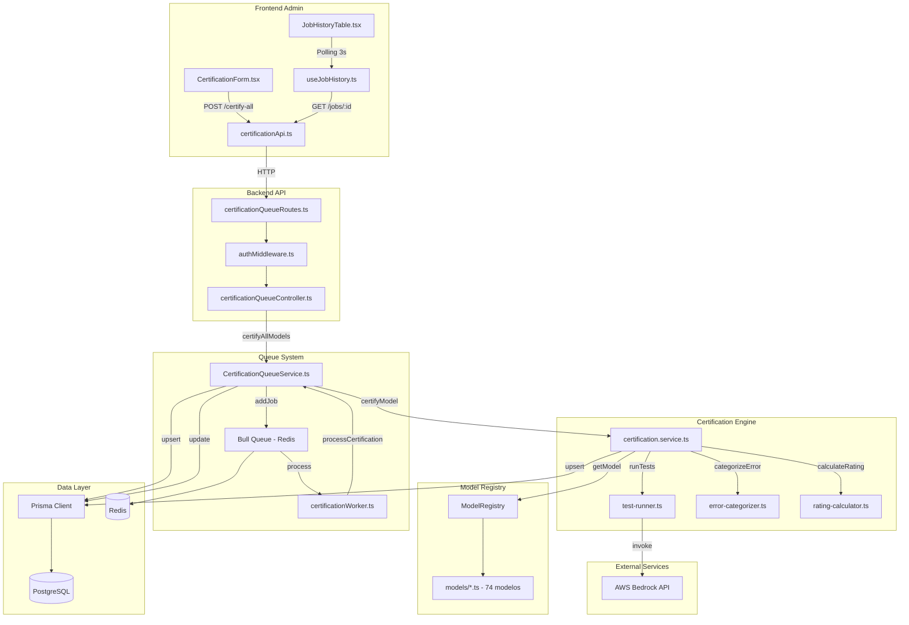

### 1.2 Componentes e Responsabilidades

| Componente | Camada | Responsabilidade |
|------------|--------|------------------|
| `CertificationForm.tsx` | Frontend | UI para iniciar certificações |
| `useJobHistory.ts` | Frontend | Lógica de polling e estado |
| `certificationApi.ts` | Frontend | Cliente HTTP para API |
| `certificationQueueController.ts` | Backend | Endpoints REST |
| `CertificationQueueService.ts` | Backend | Orquestração de jobs |
| `certificationWorker.ts` | Backend | Processamento assíncrono |
| `certification.service.ts` | Backend | Lógica de certificação |
| `ModelRegistry` | Backend | Catálogo de modelos suportados |
| `Bull Queue` | Infra | Fila de jobs |
| `PostgreSQL` | Infra | Persistência |
| `Redis` | Infra | Cache e fila |

---

## 2. Mapa de Fluxo de Dados

### 2.1 Fluxo de Criação de Job

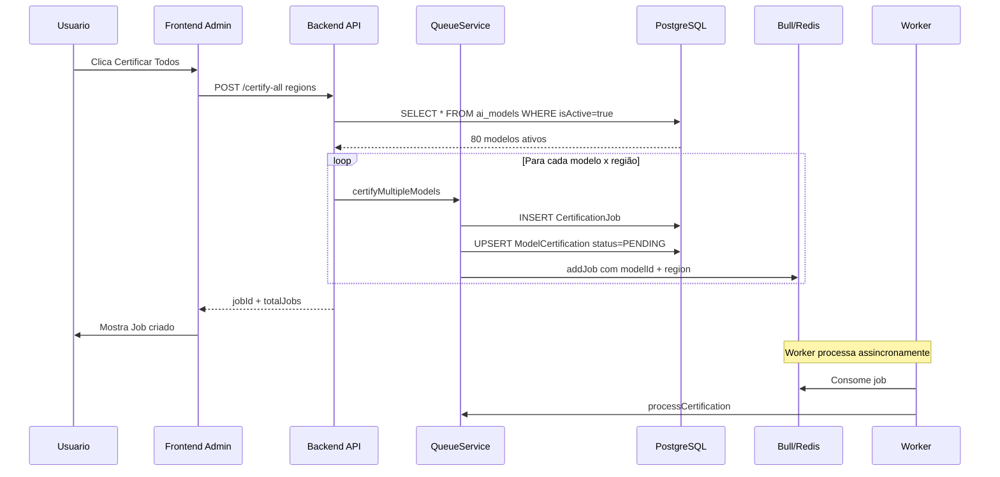

### 2.2 Fluxo de Processamento de Certificação

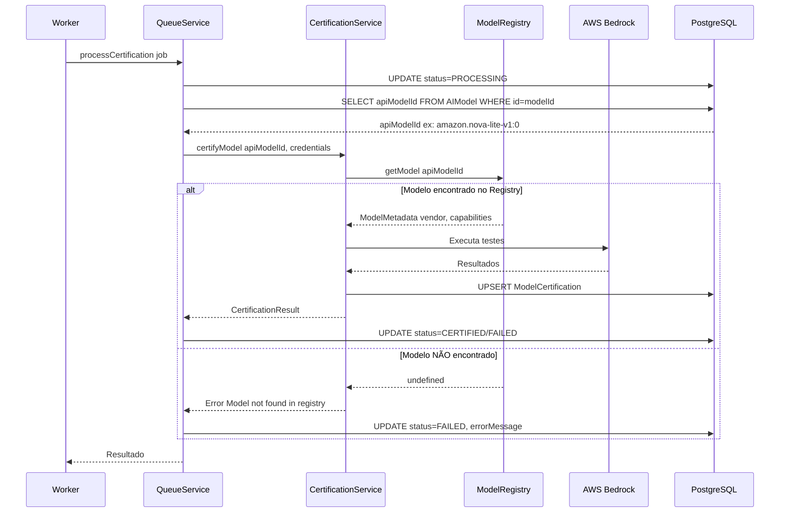

### 2.3 Transformações de Dados

| Etapa | Entrada | Transformação | Saída |
|-------|---------|---------------|-------|
| 1. Frontend | Regiões selecionadas | Serialização JSON | `{ regions: [us-east-1] }` |
| 2. Controller | Request body | Busca modelos ativos | Lista de UUIDs do banco |
| 3. QueueService | UUID do modelo | Busca apiModelId | `amazon.nova-lite-v1:0` |
| 4. CertificationService | apiModelId | Lookup no Registry | ModelMetadata ou undefined |
| 5. TestRunner | ModelMetadata | Executa testes AWS | TestResult[] |
| 6. RatingCalculator | Métricas | Calcula score | Rating 0-5 + Badge |
| 7. Prisma | Resultado | Upsert | ModelCertification |

---

## 3. Identificação de Pontos de Falha

### 3.1 Ponto de Falha 1: Validação de Modelos Antes de Criar Job

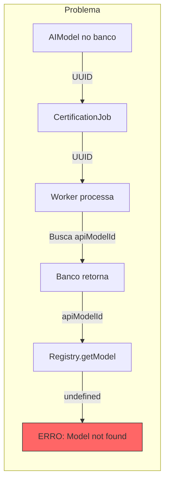

**Causa Raiz:**
- O banco de dados (`AIModel`) contém **80 modelos** de diversos providers
- O `ModelRegistry` contém apenas **74 modelos** do AWS Bedrock
- **6 modelos incompatíveis** estão no banco mas não no Registry:
  - OpenAI: `gpt-3.5-turbo`, `gpt-4-turbo`
  - Groq: `llama-3.1-8b-instant`, `llama-3.3-70b-versatile`
  - HuggingFace: `meta-llama/Llama-3-70b-chat-hf`, `Qwen/Qwen1.5-72B-Chat`

**Impacto:** Jobs falham com erro "Model not found in registry" para modelos não-Bedrock.

### 3.2 Ponto de Falha 2: Lookup no Registry Durante Certificação

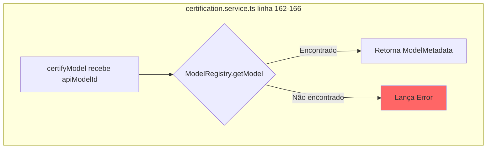

**Código Problemático:**
```typescript
// certification.service.ts:162-166
const metadata = ModelRegistry.getModel(modelId);
if (!metadata) {
  logger.error(`[CertificationService] ❌ Modelo ${modelId} não encontrado no registry`);
  throw new Error(`Model ${modelId} not found in registry`);
}
```

**Problema:** Não há validação prévia se o modelo é certificável antes de criar o job.

### 3.3 Ponto de Falha 3: Atualização de Status no Banco

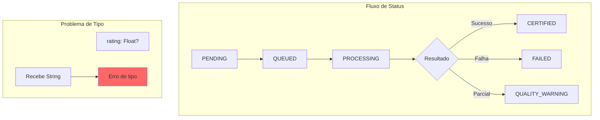

**Bug Identificado:** Campo `rating` no schema é `Float?` mas pode receber `String` em alguns casos.

### 3.4 Ponto de Falha 4: Descompasso de Identificadores

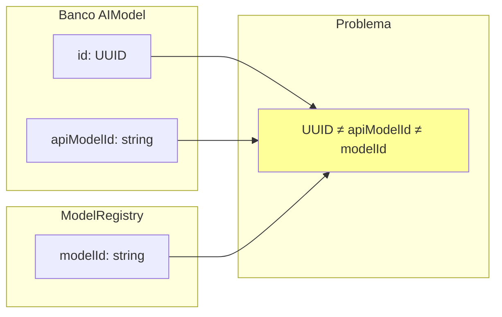

**Formatos de ID:**
| Fonte | Formato | Exemplo |
|-------|---------|---------|
| AIModel.id | UUID | `550e8400-e29b-41d4-a716-446655440000` |
| AIModel.apiModelId | Provider-specific | `amazon.nova-lite-v1:0` |
| ModelRegistry.modelId | Bedrock format | `anthropic.claude-3-sonnet-20240229-v1:0` |

### 3.5 Ponto de Falha 5: Falta de Filtro por Provider

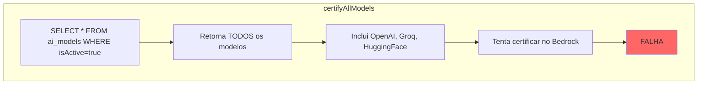

**Código Problemático:**
```typescript
// CertificationQueueService.ts:239-246
const models = await prisma.aIModel.findMany({
  where: {
    isActive: true  // ← Não filtra por provider!
  },
  select: {
    id: true
  }
});
```

---

## 4. Proposta de Arquitetura Melhorada

### 4.1 Solução para Descompasso Banco/Registry

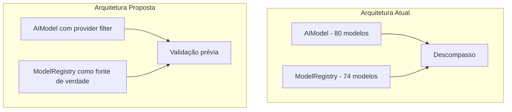

**Solução 1: Filtrar por Provider no Banco**
```typescript
// CertificationQueueService.ts - PROPOSTA
const models = await prisma.aIModel.findMany({
  where: {
    isActive: true,
    provider: {
      slug: 'bedrock'  // ← Filtrar apenas modelos Bedrock
    }
  }
});
```

**Solução 2: Validar contra Registry antes de criar job**
```typescript
// CertificationQueueService.ts - PROPOSTA
const validModels = modelIds.filter(id => {
  const model = await prisma.aIModel.findUnique({ where: { id } });
  return ModelRegistry.isSupported(model.apiModelId);
});
```

### 4.2 Onde Adicionar Validações

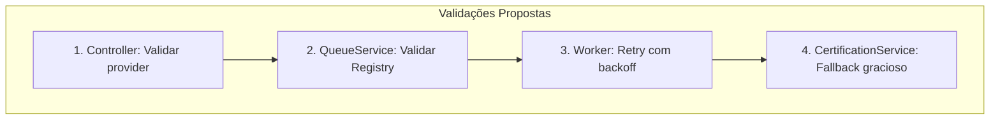

| Camada | Validação | Ação |
|--------|-----------|------|
| Controller | Provider é Bedrock? | Rejeitar com 400 |
| QueueService | Modelo existe no Registry? | Não criar job |
| Worker | Erro temporário? | Retry com exponential backoff |
| CertificationService | Modelo não encontrado? | Retornar status UNSUPPORTED |

### 4.3 Arquitetura de Resiliência

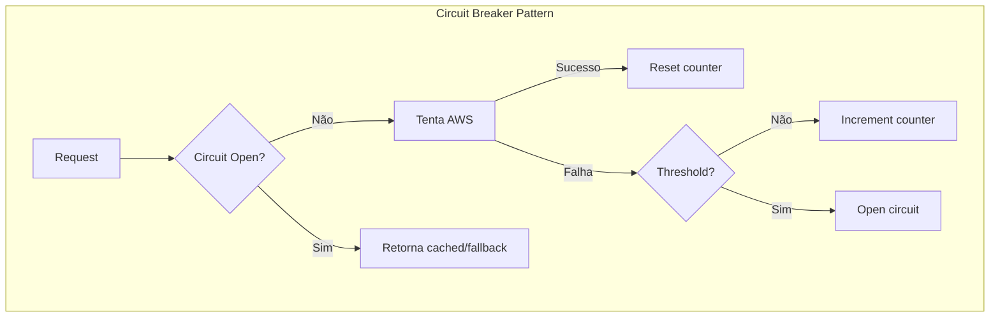

**Melhorias de Resiliência:**
1. **Circuit Breaker** para AWS Bedrock
2. **Cache de certificações** válidas
3. **Retry com exponential backoff**
4. **Dead Letter Queue** para jobs que falharam múltiplas vezes

### 4.4 Diagrama de Arquitetura Proposta

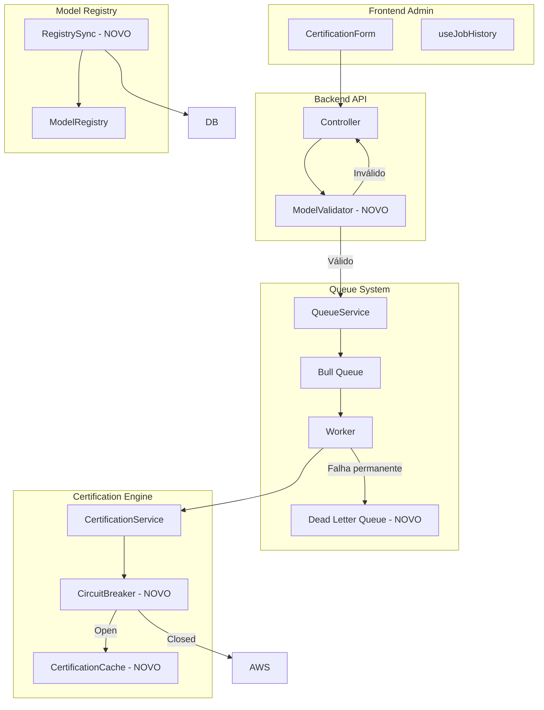

---

## 5. Matriz de Responsabilidades

### 5.1 RACI Matrix

| Componente | Validação de Modelo | Criação de Job | Processamento | Persistência | Notificação |
|------------|---------------------|----------------|---------------|--------------|-------------|
| Frontend | I | R | I | - | A |
| Controller | A | A | I | - | - |
| QueueService | C | R | A | R | - |
| Worker | - | - | R | C | - |
| CertificationService | R | - | R | R | - |
| ModelRegistry | R | C | C | - | - |
| Prisma | - | - | - | R | - |

**Legenda:** R=Responsável, A=Aprova, C=Consultado, I=Informado

### 5.2 Tratamento de Erros por Componente

| Componente | Tipo de Erro | Tratamento Atual | Tratamento Proposto |
|------------|--------------|------------------|---------------------|
| Controller | Modelo não existe | 404 Not Found | ✅ Correto |
| Controller | Provider inválido | Não valida | ❌ Adicionar validação |
| QueueService | Modelo não no Registry | Cria job mesmo assim | ❌ Validar antes |
| Worker | Erro de processamento | Retry 3x | ✅ Correto |
| CertificationService | Model not found | Throw Error | ❌ Retornar UNSUPPORTED |
| CertificationService | AWS timeout | Categoriza como FAILED | ⚠️ Adicionar retry |

### 5.3 Fluxo de Erros Proposto

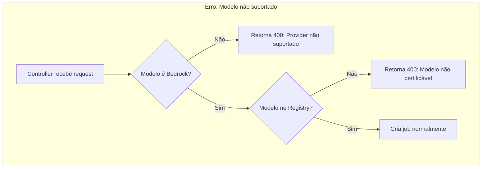

---

## 6. Resumo Executivo

### 6.1 Problemas Identificados

1. **Descompasso Banco/Registry:** 80 modelos no banco vs 74 no Registry
2. **6 modelos incompatíveis:** OpenAI, Groq, HuggingFace não são Bedrock
3. **Falta de validação prévia:** Jobs são criados para modelos não certificáveis
4. **Bug de tipo:** Campo `rating` pode receber String em vez de Float
5. **Sem filtro por provider:** `certifyAllModels` inclui todos os providers

### 6.2 Soluções Propostas

1. **Filtrar por provider** na query de modelos ativos
2. **Validar contra Registry** antes de criar job
3. **Adicionar status UNSUPPORTED** para modelos não-Bedrock
4. **Implementar Circuit Breaker** para resiliência
5. **Criar Dead Letter Queue** para jobs problemáticos

### 6.3 Impacto Esperado

| Métrica | Antes | Depois |
|---------|-------|--------|
| Jobs com erro "not found" | ~7.5% (6/80) | 0% |
| Tempo de feedback ao usuário | Após falha | Imediato |
| Resiliência a falhas AWS | Baixa | Alta |
| Clareza de erros | Genérica | Específica |

---

## 7. Próximos Passos Recomendados

### 7.1 Curto Prazo - Quick Wins

- [ ] Adicionar filtro `provider.slug = 'bedrock'` em `certifyAllModels`
- [ ] Validar modelo contra Registry antes de criar job
- [ ] Corrigir tipo do campo `rating` para garantir Float

### 7.2 Médio Prazo - Melhorias Estruturais

- [ ] Implementar status `UNSUPPORTED` para modelos não-Bedrock
- [ ] Criar endpoint para listar apenas modelos certificáveis
- [ ] Adicionar Circuit Breaker para AWS Bedrock

### 7.3 Longo Prazo - Arquitetura

- [ ] Sincronizar banco com Registry automaticamente
- [ ] Implementar Dead Letter Queue
- [ ] Dashboard de saúde do sistema de certificação

---

*Documento gerado como parte da análise de arquitetura do sistema de certificação.*
