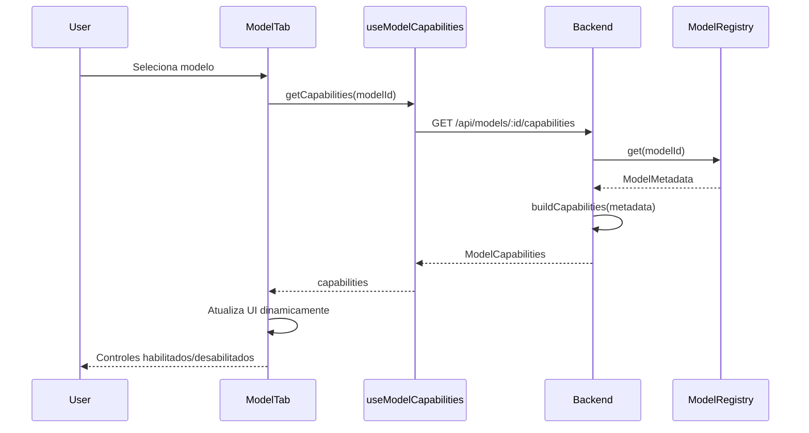
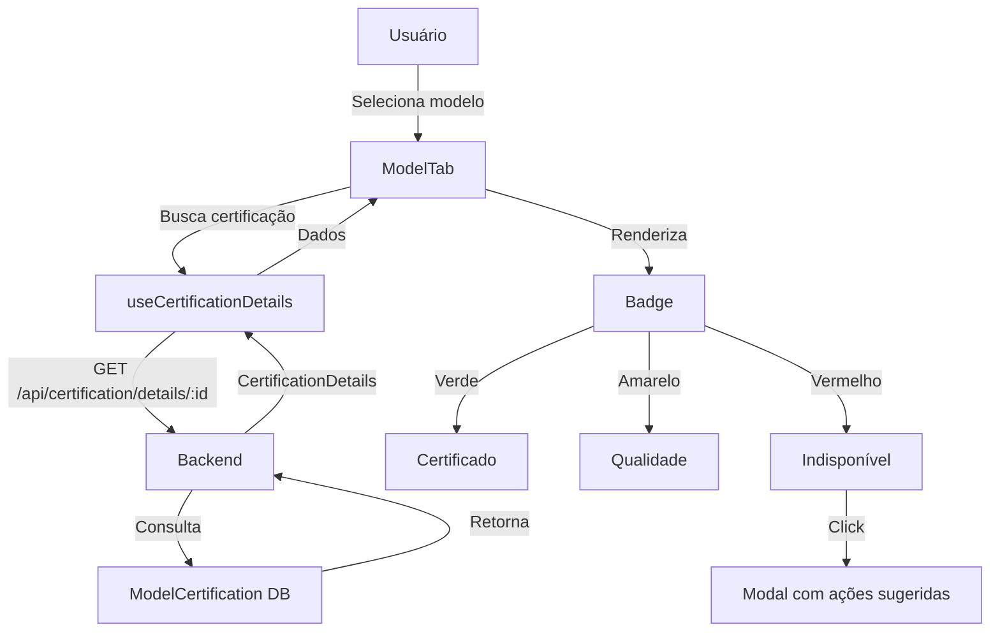

# 🎯 Auditoria e Redesign Estratégico do Painel de Controle - PARTE 2

**Continuação de:** [`plans/CHAT-PANEL-AUDIT-AND-REDESIGN.md`](plans/CHAT-PANEL-AUDIT-AND-REDESIGN.md:1)

---

## 6. Plano de Implementação

### Fase 1: Auditoria e Limpeza
**Objetivo:** Preparar o terreno sem breaking changes

**Tarefas:**
- [ ] Documentar todas as funcionalidades existentes (✅ FEITO neste documento)
- [ ] Identificar código morto ou não usado
- [ ] Criar testes unitários para componentes críticos:
  - `ModelTab.tsx`
  - `ContextConfigTab.tsx`
  - `useControlPanelLogic.ts`
- [ ] Adicionar logging estratégico para debugging
- [ ] Validar que todas as funcionalidades atuais funcionam

**Critérios de Sucesso:**
- ✅ 100% das funcionalidades documentadas
- ✅ Cobertura de testes > 70% nos componentes críticos
- ✅ Zero regressões detectadas

---

### Fase 2: Backend - Endpoint de Capabilities
**Objetivo:** Criar infraestrutura para habilitação dinâmica

**Tarefas:**
- [ ] Criar endpoint `GET /api/models/:modelId/capabilities`
- [ ] Implementar função `buildCapabilities(metadata: ModelMetadata)`
- [ ] Adicionar cache no backend (Redis ou in-memory com TTL 1h)
- [ ] Criar tipos TypeScript compartilhados (`ModelCapabilities`)
- [ ] Testes de integração para endpoint
- [ ] Documentar API no Swagger/OpenAPI

**Arquivos Afetados:**
- `backend/src/routes/modelsRoutes.ts` (novo)
- `backend/src/types/capabilities.ts` (novo)
- `backend/src/services/ai/registry/model-registry.ts` (atualizar)

**Critérios de Sucesso:**
- ✅ Endpoint retorna capabilities corretas para todos os modelos
- ✅ Cache funciona corretamente (verificar com logs)
- ✅ Testes de integração passam
- ✅ Performance < 50ms (com cache)

---

### Fase 3: Frontend - Hook useModelCapabilities
**Objetivo:** Consumir capabilities no frontend

**Tarefas:**
- [ ] Instalar React Query ou SWR (se não existir)
- [ ] Criar hook `useModelCapabilities(provider, modelId)`
- [ ] Implementar cache no frontend (staleTime: Infinity)
- [ ] Adicionar loading states e error handling
- [ ] Prefetch de capabilities ao carregar providers
- [ ] Testes unitários do hook

**Arquivos Afetados:**
- `frontend/src/hooks/useModelCapabilities.ts` (novo)
- `frontend/src/types/capabilities.ts` (novo)
- `frontend/package.json` (adicionar dependência)

**Critérios de Sucesso:**
- ✅ Hook retorna capabilities corretamente
- ✅ Cache funciona (verificar com React DevTools)
- ✅ Loading states funcionam
- ✅ Testes unitários passam

---

### Fase 4: UI - Habilitação Dinâmica
**Objetivo:** Atualizar UI para usar capabilities

**Tarefas:**
- [ ] Atualizar `ModelTab.tsx` para usar `useModelCapabilities`
- [ ] Desabilitar Top-K quando `!capabilities.topK.enabled`
- [ ] Adicionar controle de Top-P ao painel
- [ ] Adicionar controle de Max Tokens ao painel
- [ ] Ajustar ranges de sliders dinamicamente
- [ ] Adicionar alerts inline para incompatibilidades
- [ ] Remover/esconder controles não aplicáveis
- [ ] Atualizar `chatConfig` para incluir `topP` e `maxTokens`

**Arquivos Afetados:**
- `frontend/src/features/chat/components/ControlPanel/ModelTab.tsx`
- `frontend/src/contexts/LayoutContext.tsx`
- `frontend/src/features/chat/types/index.ts`

**Critérios de Sucesso:**
- ✅ Top-K desabilitado para modelos Anthropic
- ✅ Top-P visível e funcional
- ✅ Max Tokens configurável
- ✅ Ranges ajustados dinamicamente
- ✅ Alerts inline aparecem quando apropriado
- ✅ Zero regressões visuais

---

### Fase 5: Integração com Certificação
**Objetivo:** Mostrar badges completos e detalhes de certificação

**Tarefas:**
- [ ] Criar hook `useCertificationDetails(modelId)`
- [ ] Adicionar badges de quality warning (amarelo)
- [ ] Adicionar badges de indisponível (vermelho)
- [ ] Criar componente `CertificationDetailsModal`
- [ ] Adicionar tooltips com errorCategory
- [ ] Mostrar ações sugeridas inline
- [ ] Adicionar botão de recertificação rápida
- [ ] Adicionar filtros avançados (Certificados, Qualidade, Indisponíveis)
- [ ] Indicador de "certificado há X dias"

**Arquivos Afetados:**
- `frontend/src/hooks/useCertificationDetails.ts` (novo)
- `frontend/src/components/CertificationDetailsModal.tsx` (novo)
- `frontend/src/features/chat/components/ControlPanel/ModelTab.tsx`

**Critérios de Sucesso:**
- ✅ Badges amarelos e vermelhos aparecem corretamente
- ✅ Modal de detalhes mostra informações completas
- ✅ Ações sugeridas são claras e acionáveis
- ✅ Filtros funcionam corretamente
- ✅ Recertificação funciona

---

### Fase 6: Sistema de Instruções
**Objetivo:** Melhorar UX com instruções contextuais

**Tarefas:**
- [ ] Adicionar alerts inline para incompatibilidades
- [ ] Implementar onboarding contextual (localStorage)
- [ ] Adicionar status bar no topo do painel
- [ ] Criar badges informativos adicionais
- [ ] Melhorar tooltips existentes
- [ ] Adicionar contador de tokens em tempo real
- [ ] Adicionar estimativa de custo
- [ ] Criar sistema de notificações toast

**Arquivos Afetados:**
- `frontend/src/features/chat/components/ControlPanel/ModelTab.tsx`
- `frontend/src/features/chat/components/ControlPanel/ContextConfigTab.tsx`
- `frontend/src/components/OnboardingDialog.tsx` (novo)
- `frontend/src/components/StatusBar.tsx` (novo)

**Critérios de Sucesso:**
- ✅ Alerts inline aparecem quando apropriado
- ✅ Onboarding aparece na primeira vez
- ✅ Status bar reflete estado atual
- ✅ Tooltips são claros e úteis
- ✅ Contador de tokens funciona
- ✅ Estimativa de custo é precisa

---

### Fase 7: Testes E2E e Documentação
**Objetivo:** Garantir qualidade e documentar mudanças

**Tarefas:**
- [ ] Criar testes E2E com Playwright/Cypress:
  - Fluxo completo de seleção de modelo
  - Habilitação/desabilitação de controles
  - Certificação de modelos
  - Filtros e badges
- [ ] Atualizar documentação do usuário
- [ ] Criar guia de troubleshooting
- [ ] Gravar vídeos/GIFs demonstrativos
- [ ] Atualizar CHANGELOG.md
- [ ] Code review completo
- [ ] Performance audit (Lighthouse)

**Arquivos Afetados:**
- `docs/USER-GUIDE.md` (atualizar)
- `docs/TROUBLESHOOTING.md` (novo)
- `CHANGELOG.md`
- `tests/e2e/control-panel.spec.ts` (novo)

**Critérios de Sucesso:**
- ✅ Todos os testes E2E passam
- ✅ Documentação está completa e clara
- ✅ Vídeos demonstrativos criados
- ✅ Performance score > 90 (Lighthouse)
- ✅ Code review aprovado

---

## 7. Riscos e Mitigações

### Risco 1: Breaking Changes na API
**Impacto:** 🔴 ALTO  
**Probabilidade:** 🟡 MÉDIA

**Descrição:**
Mudanças no formato de `chatConfig` podem quebrar código existente que depende da estrutura atual.

**Cenários de Falha:**
- Backend espera `topK` mas frontend não envia
- Código antigo tenta acessar campos removidos
- Serialização/deserialização falha

**Mitigação:**
1. **Compatibilidade Retroativa:**
   - Manter campos antigos como opcionais
   - Backend aceita ambos formatos (antigo e novo)
   - Migração gradual, não abrupta

2. **Versionamento:**
   - Adicionar campo `version` ao `chatConfig`
   - Backend detecta versão e adapta comportamento
   - Exemplo: `{ version: 2, provider, model, topP, ... }`

3. **Testes de Regressão:**
   - Testes automatizados para formato antigo
   - Testes automatizados para formato novo
   - Testes de migração

4. **Rollback Plan:**
   - Feature flag para habilitar/desabilitar novo sistema
   - Capacidade de reverter para versão anterior rapidamente

**Indicadores de Sucesso:**
- ✅ Zero erros em produção relacionados a formato de dados
- ✅ Migração suave sem downtime

---

### Risco 2: Performance - Requests Excessivos
**Impacto:** 🟡 MÉDIO  
**Probabilidade:** 🔴 ALTA

**Descrição:**
Buscar capabilities a cada mudança de modelo pode sobrecarregar backend e degradar UX.

**Cenários de Falha:**
- Usuário troca de modelo rapidamente → 10+ requests em 1 segundo
- Backend sobrecarregado → latência aumenta
- Cache não funciona → requests duplicados

**Mitigação:**
1. **Cache Agressivo no Frontend:**
   ```typescript
   staleTime: Infinity, // Capabilities não mudam
   cacheTime: 1000 * 60 * 60 * 24, // 24 horas
   ```

2. **Cache no Backend:**
   - Redis com TTL de 1 hora
   - Ou in-memory cache (Node.js Map)
   - Invalidação apenas quando registry é atualizado

3. **Prefetch:**
   - Buscar capabilities de todos os modelos ao carregar providers
   - Usuário não espera ao trocar de modelo

4. **Debounce:**
   - Debounce de 300ms em mudanças rápidas
   - Evita requests desnecessários

5. **Monitoring:**
   - Logs de performance
   - Alertas se latência > 200ms
   - Dashboard de métricas

**Indicadores de Sucesso:**
- ✅ Latência < 50ms (com cache)
- ✅ < 1 request por segundo por usuário
- ✅ Cache hit rate > 95%

---

### Risco 3: UX Confusa - Controles Desabilitados
**Impacto:** 🟡 MÉDIO  
**Probabilidade:** 🟡 MÉDIA

**Descrição:**
Usuário não entende por que controle está desabilitado e fica frustrado.

**Cenários de Falha:**
- Top-K desabilitado para Claude → usuário não sabe por quê
- Usuário tenta ajustar mas nada acontece
- Usuário acha que é bug

**Mitigação:**
1. **Tooltips Explicativos:**
   ```typescript
   <Tooltip title="Este modelo não suporta Top-K. Use Top-P para controlar diversidade.">
     <Box>
       <Slider disabled={!capabilities.topK.enabled} />
     </Box>
   </Tooltip>
   ```

2. **Alerts Inline:**
   ```typescript
   {!capabilities.topK.enabled && (
     <Alert severity="info">
       Este modelo não suporta Top-K. Use <strong>Top-P</strong> abaixo.
     </Alert>
   )}
   ```

3. **Sugestão de Alternativa:**
   - Destacar Top-P quando Top-K está desabilitado
   - Link para documentação explicando diferença

4. **Onboarding:**
   - Primeira vez que usuário seleciona Claude:
     "💡 Modelos Claude usam Top-P ao invés de Top-K"

5. **Documentação Inline:**
   - Link "Por que está desabilitado?" → abre modal explicativo

**Indicadores de Sucesso:**
- ✅ < 5% de usuários reportam confusão
- ✅ Feedback positivo em pesquisas de UX
- ✅ Tempo médio para entender < 30 segundos

---

### Risco 4: Inconsistência Backend/Frontend
**Impacto:** 🔴 ALTO  
**Probabilidade:** 🟢 BAIXA

**Descrição:**
ModelRegistry no backend não reflete realidade dos adapters, causando comportamento inesperado.

**Cenários de Falha:**
- Registry diz que modelo suporta Top-K mas adapter não implementa
- Capabilities dizem max=8192 mas modelo só aceita 4096
- Streaming marcado como suportado mas não funciona

**Mitigação:**
1. **Testes de Integração:**
   ```typescript
   test('capabilities match adapter behavior', async () => {
     const capabilities = await getCapabilities('claude-3-5-sonnet');
     const adapter = AdapterFactory.create('anthropic');
     
     // Verificar que capabilities refletem adapter
     expect(capabilities.topK.enabled).toBe(false);
     expect(adapter.supportsTopK()).toBe(false);
   });
   ```

2. **Validação Automática:**
   - Script que compara registry com adapters
   - Roda no CI/CD
   - Falha se encontrar inconsistências

3. **Documentação Sincronizada:**
   - Registry é fonte única de verdade
   - Adapters consultam registry
   - Não duplicar informações

4. **Code Review Rigoroso:**
   - Checklist específico para mudanças em capabilities
   - Dois aprovadores obrigatórios
   - Testes obrigatórios

**Indicadores de Sucesso:**
- ✅ Zero inconsistências detectadas
- ✅ Testes de integração passam 100%
- ✅ CI/CD valida automaticamente

---

### Risco 5: Certificação Desatualizada
**Impacto:** 🟡 MÉDIO  
**Probabilidade:** 🔴 ALTA

**Descrição:**
Modelos certificados há 7+ dias podem estar desatualizados, mas usuário não sabe.

**Cenários de Falha:**
- Modelo certificado há 10 dias → agora indisponível
- Usuário usa modelo "certificado" → erro inesperado
- Confiança no sistema de certificação diminui

**Mitigação:**
1. **Indicador Visual:**
   ```typescript
   <Chip 
     label={`Certificado há ${daysSince(lastChecked)} dias`}
     color={daysSince(lastChecked) > 7 ? 'warning' : 'success'}
   />
   ```

2. **Alert ao Usar:**
   ```typescript
   {daysSince(certificationDetails.lastChecked) > 7 && (
     <Alert severity="warning">
       ⚠️ Certificação expirada. Recomendamos recertificar antes de usar.
       <Button onClick={recertify}>Recertificar Agora</Button>
     </Alert>
   )}
   ```

3. **Recertificação Automática:**
   - Background job que recertifica modelos expirados
   - Roda diariamente às 2AM
   - Notifica usuário se status mudou

4. **Botão de Recertificação Rápida:**
   - No painel de controle
   - Recertifica apenas o modelo selecionado
   - Feedback em tempo real

5. **Notificações:**
   - Email/toast se modelo usado recentemente ficou indisponível
   - Sugestão de modelos alternativos

**Indicadores de Sucesso:**
- ✅ < 10% dos modelos usados têm certificação expirada
- ✅ Recertificação automática funciona
- ✅ Usuários recertificam proativamente

---

## 8. Conclusão e Próximos Passos

### 8.1 Resumo Executivo

Este documento apresentou uma auditoria completa do Painel de Controle (Chat Interface) da aplicação MyIA, identificando:

**Problemas Críticos:**
1. ❌ **Top-K sempre visível** mas Anthropic não suporta
2. ❌ **Top-P não implementado** apesar de ser universal
3. ❌ **Max Tokens não configurável** apesar de variar muito
4. ❌ **Badges de certificação incompletos** (faltam amarelo e vermelho)
5. ❌ **Sem habilitação dinâmica** baseada em capabilities

**Soluções Propostas:**
1. ✅ Sistema de habilitação dinâmica via `useModelCapabilities`
2. ✅ Endpoint backend `/api/models/:modelId/capabilities`
3. ✅ Integração completa com sistema de certificação
4. ✅ Sistema de instruções em 5 níveis
5. ✅ Plano de implementação em 7 fases

**Impacto Esperado:**
- 🎯 **UX:** Usuário entende por que controles estão desabilitados
- 🎯 **Confiabilidade:** Parâmetros sempre compatíveis com modelo
- 🎯 **Transparência:** Certificação visível e acionável
- 🎯 **Escalabilidade:** Fácil adicionar novos providers/modelos
- 🎯 **Manutenibilidade:** Lógica centralizada no ModelRegistry

### 8.2 Métricas de Sucesso

**Técnicas:**
- ✅ Zero erros de incompatibilidade de parâmetros
- ✅ Cobertura de testes > 80%
- ✅ Performance < 50ms para buscar capabilities
- ✅ Cache hit rate > 95%

**UX:**
- ✅ < 5% de usuários reportam confusão
- ✅ Tempo para entender controles < 30 segundos
- ✅ NPS (Net Promoter Score) > 8/10

**Negócio:**
- ✅ Redução de 50% em tickets de suporte relacionados a configuração
- ✅ Aumento de 30% no uso de modelos AWS Bedrock
- ✅ Redução de 40% em erros de runtime

### 8.3 Próximos Passos Imediatos

1. **Revisar este documento** com stakeholders
2. **Priorizar fases** baseado em impacto vs esforço
3. **Criar issues no GitHub** para cada fase
4. **Definir sprint planning** (sugestão: 2 sprints de 2 semanas)
5. **Iniciar Fase 1** (Auditoria e Limpeza)

### 8.4 Dependências Externas

- ✅ **React Query ou SWR:** Necessário para cache no frontend
- ✅ **Redis (opcional):** Para cache no backend (pode usar in-memory)
- ✅ **Playwright/Cypress:** Para testes E2E

### 8.5 Cronograma Sugerido

**Sprint 1 (2 semanas):**
- Fase 1: Auditoria e Limpeza
- Fase 2: Backend - Endpoint de Capabilities

**Sprint 2 (2 semanas):**
- Fase 3: Frontend - Hook useModelCapabilities
- Fase 4: UI - Habilitação Dinâmica (parcial)

**Sprint 3 (2 semanas):**
- Fase 4: UI - Habilitação Dinâmica (completo)
- Fase 5: Integração com Certificação

**Sprint 4 (2 semanas):**
- Fase 6: Sistema de Instruções
- Fase 7: Testes E2E e Documentação

**Total:** 8 semanas (2 meses)

### 8.6 Considerações Finais

Este redesign não é apenas uma melhoria técnica, mas uma **transformação na experiência do usuário**. Ao tornar o painel de controle inteligente e adaptável, estamos:

1. **Reduzindo fricção:** Usuário não precisa entender detalhes técnicos de cada modelo
2. **Aumentando confiança:** Certificação visível e transparente
3. **Melhorando descoberta:** Usuário descobre capabilities naturalmente
4. **Facilitando manutenção:** Adicionar novos modelos é trivial
5. **Preparando para o futuro:** Arquitetura escalável para novos providers

**O painel de controle deixa de ser um formulário estático e se torna um assistente inteligente que guia o usuário.**

---

**Documento criado por:** Kilo Code (Architect Mode)  
**Data:** 2026-01-21  
**Versão:** 1.0  
**Status:** ✅ Completo e Pronto para Revisão

---

## Apêndices

### Apêndice A: Glossário

- **Capabilities:** Capacidades técnicas de um modelo (parâmetros suportados, limites, etc.)
- **Inference Profile:** Configuração AWS para modelos que requerem invocação cross-region
- **Top-K:** Parâmetro que limita vocabulário às K palavras mais prováveis
- **Top-P:** Parâmetro que limita vocabulário por probabilidade cumulativa (Nucleus Sampling)
- **Context Window:** Quantidade máxima de tokens que o modelo pode processar de uma vez
- **Habilitação Dinâmica:** Sistema que habilita/desabilita controles baseado em capabilities

### Apêndice B: Referências

- [`docs/STANDARDS.md`](docs/STANDARDS.md:1) - Padrões de desenvolvimento do projeto
- [`docs/CERTIFICATION-SYSTEM-GUIDE.md`](docs/CERTIFICATION-SYSTEM-GUIDE.md:1) - Guia do sistema de certificação
- [`docs/api/ALL-MODELS-OFFICIAL-SPECS.md`](docs/api/ALL-MODELS-OFFICIAL-SPECS.md:1) - Especificações oficiais dos modelos
- [`backend/src/services/ai/registry/model-registry.ts`](backend/src/services/ai/registry/model-registry.ts:1) - Registry de modelos
- [`frontend/src/features/chat/components/ControlPanel/`](frontend/src/features/chat/components/ControlPanel/:1) - Componentes do painel

### Apêndice C: Diagramas Mermaid

#### Fluxo de Habilitação Dinâmica



#### Arquitetura de Certificação



---

**FIM DO DOCUMENTO**
