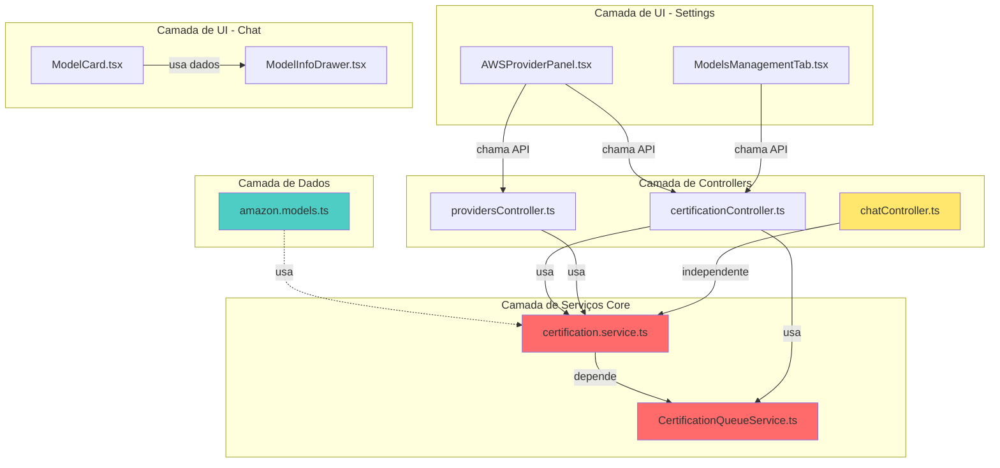
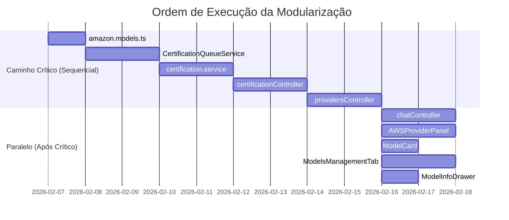

# 🎯 Estratégia Consolidada de Execução da Modularização

**Data:** 2026-02-07  
**Versão:** 1.0  
**Status:** 📋 Pronto para Aprovação e Execução

---

## 📋 Índice

1. [Visão Geral](#1-visão-geral)
2. [Matriz de Dependências](#2-matriz-de-dependências)
3. [Análise de Caminho Crítico](#3-análise-de-caminho-crítico)
4. [Ordem de Execução Ótima](#4-ordem-de-execução-ótima)
5. [Fases de Implementação](#5-fases-de-implementação)
6. [Estratégia de Testes por Fase](#6-estratégia-de-testes-por-fase)
7. [Gestão de Riscos Consolidada](#7-gestão-de-riscos-consolidada)
8. [Critérios de Sucesso](#8-critérios-de-sucesso)
9. [Plano de Rollback](#9-plano-de-rollback)

---

## 1. Visão Geral

### 1.1 Escopo Total

**10 arquivos críticos** identificados para modularização:

| # | Arquivo | Linhas | Tipo | Prioridade |
|---|---------|--------|------|------------|
| 1 | [`certification.service.ts`](../backend/src/services/ai/certification/certification.service.ts) | 791 | Backend Service | 🔴 Crítica |
| 2 | [`CertificationQueueService.ts`](../backend/src/services/queue/CertificationQueueService.ts) | 808 | Backend Service | 🔴 Crítica |
| 3 | [`providersController.ts`](../backend/src/controllers/providersController.ts) | 755 | Backend Controller | 🔴 Crítica |
| 4 | [`AWSProviderPanel.tsx`](../frontend/src/features/settings/components/providers/AWSProviderPanel.tsx) | 813 | Frontend Component | 🟡 Alta |
| 5 | [`certificationController.ts`](../backend/src/controllers/certificationController.ts) | 690 | Backend Controller | 🔴 Crítica |
| 6 | [`amazon.models.ts`](../backend/src/services/ai/registry/models/amazon.models.ts) | 682 | Backend Data | 🟢 Média |
| 7 | [`ModelCard.tsx`](../frontend/src/features/chat/components/ControlPanel/ModelCard.tsx) | 569 | Frontend Component | 🟡 Alta |
| 8 | [`chatController.ts`](../backend/src/controllers/chatController.ts) | 522 | Backend Controller | 🔴 Crítica |
| 9 | [`ModelsManagementTab.tsx`](../frontend/src/features/settings/components/ModelsManagementTab.tsx) | 509 | Frontend Component | 🟡 Alta |
| 10 | [`ModelInfoDrawer.tsx`](../frontend/src/components/ModelInfoDrawer.tsx) | 469 | Frontend Component | 🟢 Média |

**Total:** 6.608 linhas → Meta: ≤2.500 linhas (redução de 62%)

### 1.2 Objetivos Estratégicos

✅ **Conformidade 100%** com [STANDARDS.md Seção 15](../docs/STANDARDS.md:1199)  
✅ **Zero Breaking Changes** - Sistema funcional durante toda refatoração  
✅ **Entregas Incrementais** - Validação após cada arquivo  
✅ **Minimizar Conflitos** - Ordem otimizada para reduzir merge conflicts  
✅ **Testabilidade** - 100% dos módulos testáveis isoladamente

---

## 2. Matriz de Dependências

### 2.1 Mapeamento de Interdependências



### 2.2 Análise de Acoplamento

| Arquivo | Depende De | É Usado Por | Nível de Acoplamento |
|---------|------------|-------------|----------------------|
| **amazon.models.ts** | ModelRegistry | certification.service | 🟢 Baixo |
| **certification.service.ts** | CertificationQueueService, ModelRegistry | certificationController, providersController | 🔴 Alto |
| **CertificationQueueService.ts** | certification.service, QueueService | Worker, certificationController | 🔴 Alto |
| **providersController.ts** | certification.service, BedrockProvider | AWSProviderPanel, Routes | 🟡 Médio |
| **certificationController.ts** | certification.service, CertificationQueueService | Routes, ModelsManagementTab | 🔴 Alto |
| **chatController.ts** | aiService, contextService | Routes | 🟢 Baixo |
| **AWSProviderPanel.tsx** | providersController (API), certificationController (API) | Settings Page | 🟡 Médio |
| **ModelCard.tsx** | ModelInfoDrawer | ControlPanel | 🟢 Baixo |
| **ModelsManagementTab.tsx** | certificationController (API) | Settings Page | 🟡 Médio |
| **ModelInfoDrawer.tsx** | certification API | ModelCard, outros | 🟢 Baixo |

### 2.3 Dependências Críticas Identificadas

#### 🔴 Bloqueantes (Devem ser feitos primeiro)

1. **amazon.models.ts** → Não depende de ninguém, mas é usado por certification.service
2. **CertificationQueueService.ts** → Usado por certification.service e certificationController
3. **certification.service.ts** → Núcleo do sistema de certificação

#### 🟡 Intermediários (Podem ser paralelizados)

4. **providersController.ts** → Usa certification.service (já refatorado)
5. **certificationController.ts** → Usa certification.service e CertificationQueueService
6. **chatController.ts** → Independente do sistema de certificação

#### 🟢 Independentes (Podem ser feitos por último)

7. **AWSProviderPanel.tsx** → Apenas consome APIs
8. **ModelCard.tsx** → Componente isolado
9. **ModelsManagementTab.tsx** → Apenas consome APIs
10. **ModelInfoDrawer.tsx** → Componente isolado

---

## 3. Análise de Caminho Crítico

### 3.1 Caminho Crítico Identificado

```
amazon.models.ts (682 linhas)
    ↓
CertificationQueueService.ts (808 linhas)
    ↓
certification.service.ts (791 linhas)
    ↓
certificationController.ts (690 linhas)
    ↓
providersController.ts (755 linhas)
```

**Total do Caminho Crítico:** 3.726 linhas (56% do total)

### 3.2 Justificativa do Caminho Crítico

Este caminho representa o **núcleo do sistema de certificação**, que é:

1. **Mais Complexo:** Lógica de negócio crítica
2. **Mais Acoplado:** Múltiplas dependências entre si
3. **Mais Arriscado:** Mudanças podem quebrar múltiplos pontos
4. **Mais Impactante:** Afeta tanto backend quanto frontend

**Estratégia:** Executar o caminho crítico **sequencialmente** para minimizar riscos.

### 3.3 Caminhos Paralelos

Após completar o caminho crítico, os seguintes arquivos podem ser refatorados **em paralelo**:

#### Trilha A: Chat System (Independente)
```
chatController.ts (522 linhas)
```

#### Trilha B: Frontend Components (Independentes)
```
AWSProviderPanel.tsx (813 linhas)
ModelCard.tsx (569 linhas)
ModelsManagementTab.tsx (509 linhas)
ModelInfoDrawer.tsx (469 linhas)
```

---

## 4. Ordem de Execução Ótima

### 4.1 Sequência Recomendada

| Ordem | Arquivo | Justificativa | Pode Paralelizar? |
|-------|---------|---------------|-------------------|
| **1** | amazon.models.ts | Sem dependências, usado por outros | ❌ Não |
| **2** | CertificationQueueService.ts | Usado por certification.service | ❌ Não |
| **3** | certification.service.ts | Núcleo do sistema, depende de #1 e #2 | ❌ Não |
| **4** | certificationController.ts | Depende de #3, usado por frontend | ❌ Não |
| **5** | providersController.ts | Depende de #3, usado por frontend | ❌ Não |
| **6** | chatController.ts | Independente, pode ser paralelo | ✅ Sim (com #7-10) |
| **7** | AWSProviderPanel.tsx | Apenas consome APIs já refatoradas | ✅ Sim (com #6, #8-10) |
| **8** | ModelCard.tsx | Componente isolado | ✅ Sim (com #6-7, #9-10) |
| **9** | ModelsManagementTab.tsx | Apenas consome APIs já refatoradas | ✅ Sim (com #6-8, #10) |
| **10** | ModelInfoDrawer.tsx | Componente isolado | ✅ Sim (com #6-9) |

### 4.2 Diagrama de Execução



---

## 5. Fases de Implementação

### 5.1 Fase 1: Fundação (Caminho Crítico - Sequencial)

**Objetivo:** Refatorar núcleo do sistema de certificação  
**Duração:** Não fornecer estimativas de tempo  
**Risco:** 🔴 Alto (mudanças no core)

#### Arquivo 1: amazon.models.ts
- **Estratégia:** Divisão por família de modelos
- **Módulos Criados:** 6 arquivos (titan, nova-2, nova-1-premier, nova-1-core, shared, index)
- **Validação:** 25 modelos registrados corretamente
- **Testes:** Validar ModelRegistry.getModelsByVendor('amazon')

#### Arquivo 2: CertificationQueueService.ts
- **Estratégia:** Extração de validators, creators, processors, queries
- **Módulos Criados:** 5 services + 1 orquestrador
- **Validação:** Worker processa jobs, SSE funciona, sincronização banco↔Redis
- **Testes:** Certificação única, batch, cancelamento

#### Arquivo 3: certification.service.ts
- **Estratégia:** Extração de cache, orchestration, status, persistence, queries
- **Módulos Criados:** 7 módulos especializados
- **Validação:** API pública mantida, integração com fila funciona
- **Testes:** Certificação real, cache hit/miss, status determination

#### Arquivo 4: certificationController.ts
- **Estratégia:** Orchestrator Pattern (controller → orchestrator → services)
- **Módulos Criados:** 7 módulos (orchestrator, validators, resolvers, handlers, utils)
- **Validação:** Todos endpoints funcionam, SSE preservado, JSend mantido
- **Testes:** Regressão de todos os 13 endpoints

#### Arquivo 5: providersController.ts
- **Estratégia:** Service Layer Pattern (controller → services → repositories)
- **Módulos Criados:** 7 services (AWS credentials, AWS models, vendor aggregation, etc.)
- **Validação:** Validação AWS funciona, modelos disponíveis retornados, agrupamento correto
- **Testes:** Validação de credenciais, busca de modelos, agrupamento por vendor

**Critérios de Conclusão da Fase 1:**
- ✅ Todos os 5 arquivos ≤250 linhas
- ✅ Sistema de certificação funcional
- ✅ Zero breaking changes
- ✅ Testes de integração passando
- ✅ Worker de certificação operacional

---

### 5.2 Fase 2: Expansão (Paralelo - Após Fase 1)

**Objetivo:** Refatorar componentes independentes  
**Duração:** Não fornecer estimativas de tempo  
**Risco:** 🟡 Médio (componentes isolados)

#### Trilha A: Backend - chatController.ts
- **Estratégia:** Orchestrator Pattern (controller → orchestrator → builders/processors)
- **Módulos Criados:** 12 módulos (orchestrator, builders, processors, utils)
- **Validação:** SSE funciona, sentContext preservado, embeddings gerados, título criado
- **Testes:** Stream completo, auditoria, salvamento de mensagens

#### Trilha B: Frontend - AWSProviderPanel.tsx
- **Estratégia:** View/Logic Separation + Component Composition
- **Módulos Criados:** 10 componentes + 3 hooks + 2 utils
- **Validação:** Credenciais validam, modelos listam, certificação funciona, provider selector opera
- **Testes:** Fluxo completo de configuração AWS, seleção de modelos, certificação

#### Trilha C: Frontend - ModelCard.tsx
- **Estratégia:** View/Logic Separation + Sub-components
- **Módulos Criados:** 10 componentes + 2 hooks + 2 utils
- **Validação:** Expansão/colapso funciona, seleção opera, provider selector aparece
- **Testes:** Comportamento de expansão, seleção de modelo, múltiplos providers

#### Trilha D: Frontend - ModelsManagementTab.tsx
- **Estratégia:** View/Logic Separation + Custom Hooks
- **Módulos Criados:** 8 componentes + 3 hooks
- **Validação:** Filtros funcionam, seleção batch opera, certificação batch executa, auto-save funciona
- **Testes:** Filtros, seleção múltipla, certificação em lote, auto-save AWS

#### Trilha E: Frontend - ModelInfoDrawer.tsx
- **Estratégia:** View/Logic Separation + Section Components
- **Módulos Criados:** 10 seções + 1 hook
- **Validação:** Drawer abre/fecha, seções renderizam, certificação busca, animações preservadas
- **Testes:** Renderização de seções, busca de certificação, estilos

**Critérios de Conclusão da Fase 2:**
- ✅ Todos os 5 arquivos ≤200 linhas
- ✅ Componentes funcionais
- ✅ Zero breaking changes
- ✅ Testes de regressão passando
- ✅ Performance mantida ou melhorada

---

### 5.3 Fase 3: Validação Final (Integração Completa)

**Objetivo:** Validar sistema completo após todas as refatorações  
**Duração:** Não fornecer estimativas de tempo  
**Risco:** 🟢 Baixo (apenas validação)

#### Testes de Integração End-to-End

**Fluxo 1: Configuração AWS → Certificação → Chat**
1. Configurar credenciais AWS (AWSProviderPanel)
2. Certificar modelos (ModelsManagementTab)
3. Selecionar modelo certificado (ModelCard)
4. Enviar mensagem (chatController)
5. Validar resposta e métricas

**Fluxo 2: Certificação em Lote → Visualização**
1. Selecionar múltiplos modelos (ModelsManagementTab)
2. Certificar em lote (certificationController + CertificationQueueService)
3. Acompanhar progresso (SSE)
4. Visualizar resultados (ModelInfoDrawer)

**Fluxo 3: Validação de Providers → Modelos Disponíveis**
1. Validar credenciais AWS (providersController)
2. Buscar modelos disponíveis (providersController)
3. Agrupar por vendor (providersController)
4. Exibir em UI (AWSProviderPanel)

#### Testes de Performance

**Benchmarks Obrigatórios:**
- Tempo de certificação individual: ≤ baseline + 5%
- Tempo de certificação batch: ≤ baseline + 10%
- Tempo de renderização de ModelCard: ≤ 100ms
- Tempo de abertura de ModelInfoDrawer: ≤ 200ms
- Tempo de resposta de chat: ≤ baseline + 5%

#### Testes de Regressão

**Checklist de Funcionalidades:**
- [ ] Configuração AWS funciona
- [ ] Validação de credenciais funciona
- [ ] Busca de modelos disponíveis funciona
- [ ] Certificação individual funciona
- [ ] Certificação em lote funciona
- [ ] Worker de certificação processa jobs
- [ ] SSE emite eventos corretamente
- [ ] Sincronização banco↔Redis mantida
- [ ] Chat envia mensagens
- [ ] Chat recebe respostas
- [ ] Embeddings gerados
- [ ] Títulos gerados
- [ ] Auditoria (sentContext) preservada
- [ ] Métricas de custo calculadas
- [ ] UI responsiva
- [ ] Sem memory leaks

**Critérios de Conclusão da Fase 3:**
- ✅ Todos os testes E2E passando
- ✅ Benchmarks dentro dos limites
- ✅ Zero regressões detectadas
- ✅ Documentação atualizada
- ✅ Code review aprovado

---

## 6. Estratégia de Testes por Fase

### 6.1 Pirâmide de Testes

```
                    E2E Tests (10%)
                   /              \
              Integration Tests (30%)
             /                        \
        Unit Tests (60%)
```

### 6.2 Testes por Tipo de Arquivo

#### Backend Services
```typescript
// Testes Unitários (60%)
describe('CertificationService', () => {
  describe('certifyModel', () => {
    it('deve retornar cache hit quando disponível', async () => {
      // Mock de cache
      // Validar que não executa testes
    });
    
    it('deve executar testes quando cache miss', async () => {
      // Mock de test runner
      // Validar execução de testes
    });
  });
});

// Testes de Integração (30%)
describe('CertificationService Integration', () => {
  it('deve certificar modelo real com AWS', async () => {
    // Usar credenciais reais de teste
    // Validar certificação completa
  });
});

// Testes E2E (10%)
describe('Certification E2E', () => {
  it('deve certificar via API e validar no banco', async () => {
    // Chamar endpoint
    // Validar persistência
  });
});
```

#### Backend Controllers
```typescript
// Testes Unitários (60%)
describe('certificationController', () => {
  it('deve retornar 400 se modelId ausente', async () => {
    // Mock de request
    // Validar resposta JSend
  });
});

// Testes de Integração (30%)
describe('certificationController Integration', () => {
  it('deve processar certificação completa', async () => {
    // Usar orchestrator real
    // Validar fluxo completo
  });
});

// Testes E2E (10%)
describe('Certification API E2E', () => {
  it('deve certificar via HTTP e retornar resultado', async () => {
    // Fazer request HTTP real
    // Validar resposta
  });
});
```

#### Frontend Components
```typescript
// Testes Unitários (60%)
describe('ModelCard', () => {
  it('deve renderizar estado colapsado', () => {
    render(<ModelCard model={mockModel} isSelected={false} />);
    expect(screen.getByText(/CLAUDE/)).toBeInTheDocument();
  });
  
  it('deve expandir ao clicar', () => {
    const { getByRole } = render(<ModelCard model={mockModel} />);
    fireEvent.click(getByRole('button'));
    expect(screen.getByText('Context:')).toBeInTheDocument();
  });
});

// Testes de Integração (30%)
describe('ModelCard Integration', () => {
  it('deve integrar com useModelCard hook', () => {
    // Testar integração hook + component
  });
});

// Testes E2E (10%)
describe('ModelCard E2E', () => {
  it('deve selecionar modelo e atualizar contexto', () => {
    // Testar fluxo completo com Cypress/Playwright
  });
});
```

### 6.3 Cobertura de Testes Mínima

| Tipo de Arquivo | Cobertura Mínima | Validação |
|-----------------|------------------|-----------|
| **Services** | 85% | Jest coverage |
| **Controllers** | 80% | Jest coverage |
| **Hooks** | 90% | Jest coverage |
| **Components** | 75% | Jest coverage |
| **Utils** | 95% | Jest coverage |

### 6.4 Ferramentas de Teste

**Backend:**
- Jest (unit + integration)
- Supertest (API testing)
- Prisma Test Environment (database)

**Frontend:**
- Jest + React Testing Library (unit + integration)
- Cypress ou Playwright (E2E)
- Storybook (visual testing)

---

## 7. Gestão de Riscos Consolidada

### 7.1 Matriz de Riscos Globais

| ID | Risco | Probabilidade | Impacto | Severidade | Fase Afetada |
|----|-------|---------------|---------|------------|--------------|
| **R1** | Breaking changes na API pública | Média | Crítico | 🔴 Alta | Fase 1 |
| **R2** | Quebra de integração com worker | Média | Crítico | 🔴 Alta | Fase 1 |
| **R3** | Perda de sincronização banco↔Redis | Baixa | Crítico | 🟡 Média | Fase 1 |
| **R4** | SSE para de funcionar | Baixa | Alto | 🟡 Média | Fase 1, 2 |
| **R5** | Degradação de performance | Baixa | Médio | 🟢 Baixa | Todas |
| **R6** | Regressão em certificação | Média | Alto | 🟡 Média | Fase 1 |
| **R7** | Perda de auditoria (sentContext) | Baixa | Alto | 🟡 Média | Fase 2 |
| **R8** | Re-renders excessivos (frontend) | Baixa | Médio | 🟢 Baixa | Fase 2 |
| **R9** | Conflitos de merge | Alta | Médio | 🟡 Média | Todas |
| **R10** | Escopo crescente | Alta | Médio | 🟡 Média | Todas |

### 7.2 Mitigações Detalhadas

#### R1: Breaking Changes na API Pública
**Mitigação:**
- ✅ Manter assinaturas de métodos públicos idênticas
- ✅ Usar Facade Pattern para preservar interface
- ✅ Testes de contrato (contract testing)
- ✅ Validar com testes de regressão

**Validação:**
```typescript
// Teste de contrato
describe('API Contract', () => {
  it('deve manter mesma assinatura de certifyModel()', () => {
    const service = new CertificationService();
    expect(service.certifyModel).toBeDefined();
    expect(service.certifyModel.length).toBe(3); // modelId, credentials, force
  });
});
```

#### R2: Quebra de Integração com Worker
**Mitigação:**
- ✅ Método `processCertification()` permanece público
- ✅ Testes de integração com mock de Bull Job
- ✅ Validar worker em ambiente de desenvolvimento antes de deploy

**Validação:**
```bash
# Iniciar worker em modo debug
NODE_ENV=development npm run worker:cert

# Criar job de teste
npx tsx backend/scripts/certification/test-queue-basic.ts

# Validar job completou
npx tsx backend/scripts/certification/test-job-details.ts <jobId>
```

#### R3: Perda de Sincronização Banco↔Redis
**Mitigação:**
- ✅ Manter logs de sincronização (já existentes no worker)
- ✅ Adicionar testes de sincronização
- ✅ Validar com script de diagnóstico

**Validação:**
```bash
# Script de diagnóstico
npx tsx backend/scripts/certification/test-sync-banco-fila.ts

# Verificar logs
grep "SYNC-CHECK" logs/worker.log
```

#### R4: SSE Para de Funcionar
**Mitigação:**
- ✅ Testar SSE com script existente
- ✅ Validar callback de progresso ainda funciona
- ✅ Verificar eventos emitidos corretamente

**Validação:**
```bash
# Testar SSE
node backend/scripts/certification/test-sse-certification.js

# Eventos esperados: progress (múltiplos) + complete (1)
```

#### R5: Degradação de Performance
**Mitigação:**
- ✅ Adicionar métricas de duração em cada módulo
- ✅ Comparar performance antes/depois
- ✅ Validar overhead de delegação é mínimo (<5%)

**Validação:**
```typescript
// Adicionar em cada módulo
const startTime = Date.now();
// ... lógica ...
const duration = Date.now() - startTime;
logger.debug(`[${this.constructor.name}] Duração: ${duration}ms`);
```

#### R9: Conflitos de Merge
**Mitigação:**
- ✅ Comunicar refatoração para o time
- ✅ Criar branches dedicadas por arquivo
- ✅ Fazer merge frequente da main
- ✅ Implementar em fases pequenas
- ✅ Coordenar com outras features

**Plano de Comunicação:**
- Anunciar início da refatoração
- Atualizar status após cada arquivo
- Avisar quando branch estiver pronta para merge

#### R10: Escopo Crescente
**Mitigação:**
- ✅ Definir escopo claro e imutável
- ✅ Criar issues separadas para melhorias futuras
- ✅ Focar apenas em modularização
- ✅ Não adicionar novas features
- ✅ Revisar escopo após cada arquivo

**Regra de Ouro:**
> "Se não está no plano, não entra nesta refatoração."

### 7.3 Plano de Contingência por Fase

#### Fase 1 (Caminho Crítico)
**Se algo der errado:**
1. Parar imediatamente
2. Avaliar impacto (apenas arquivo atual ou múltiplos?)
3. Executar plano de rollback (ver seção 9)
4. Revisar estratégia antes de continuar

#### Fase 2 (Paralelo)
**Se algo der errado em uma trilha:**
1. Isolar trilha problemática
2. Continuar outras trilhas (se independentes)
3. Executar rollback apenas da trilha afetada
4. Revisar e corrigir antes de prosseguir

#### Fase 3 (Validação)
**Se testes E2E falharem:**
1. Identificar arquivo causador
2. Executar rollback do arquivo específico
3. Corrigir problema
4. Re-executar validação

---

## 8. Critérios de Sucesso

### 8.1 Critérios Técnicos (Obrigatórios)

#### Por Arquivo
- ✅ Arquivo principal ≤250 linhas (services) ou ≤200 linhas (controllers/components)
- ✅ Todos os módulos criados ≤250 linhas
- ✅ Complexidade ciclomática ≤10 por função
- ✅ Zero breaking changes
- ✅ Todos os testes passando (unit + integration)
- ✅ Cobertura de testes ≥ mínimo definido (seção 6.3)
- ✅ Zero warnings de ESLint
- ✅ Documentação JSDoc completa

#### Por Fase
- ✅ Todos os arquivos da fase concluídos
- ✅ Testes de integração da fase passando
- ✅ Zero regressões detectadas
- ✅ Performance dentro dos limites (≤5% degradação)
- ✅ Code review aprovado

#### Global (Projeto Completo)
- ✅ Todos os 10 arquivos ≤250 linhas
- ✅ Total de linhas ≤2.500 (redução de 62%)
- ✅ Sistema 100% funcional
- ✅ Todos os testes E2E passando
- ✅ Zero breaking changes
- ✅ Documentação atualizada

### 8.2 Critérios de Qualidade

#### Manutenibilidade
- ✅ Responsabilidade única por módulo
- ✅ Acoplamento baixo entre módulos
- ✅ Coesão alta dentro de módulos
- ✅ Nomes descritivos e consistentes
- ✅ Estrutura de diretórios lógica

#### Testabilidade
- ✅ Todos os módulos testáveis isoladamente
- ✅ Dependências injetáveis
- ✅ Mocks fáceis de criar
- ✅ Testes rápidos (<5s por arquivo)

#### Performance
- ✅ Tempo de resposta ≤ baseline + 5%
- ✅ Uso de memória ≤ baseline + 10%
- ✅ Zero memory leaks
- ✅ Re-renders otimizados (frontend)

### 8.3 Critérios de Negócio

#### Funcionalidade
- ✅ Todas as features funcionando
- ✅ Fluxos críticos validados
- ✅ Integrações preservadas
- ✅ Dados consistentes

#### Experiência do Usuário
- ✅ UI responsiva
- ✅ Feedback visual mantido
- ✅ Animações preservadas
- ✅ Sem erros visíveis

---

## 9. Plano de Rollback

### 9.1 Estratégia de Rollback por Nível

#### Nível 1: Rollback de Arquivo Individual (Baixo Impacto)
**Quando usar:** Problema detectado em arquivo específico, sem afetar outros

**Procedimento:**
```bash
# 1. Identificar commit da refatoração
git log --oneline --grep="refactor: modularize <arquivo>"

# 2. Reverter commit específico
git revert <commit-hash>

# 3. Validar que sistema voltou ao normal
npm test
npm run test:integration

# 4. Criar issue para revisar problema
gh issue create --title "Rollback: <arquivo>" --body "Motivo: ..."
```

**Validação Pós-Rollback:**
- [ ] Testes passando
- [ ] Sistema funcional
- [ ] Sem erros no console
- [ ] Logs limpos

#### Nível 2: Rollback de Fase (Médio Impacto)
**Quando usar:** Múltiplos arquivos de uma fase com problemas

**Procedimento:**
```bash
# 1. Identificar branch da fase
git branch --list "refactor/phase-*"

# 2. Reverter merge da fase
git revert -m 1 <merge-commit-hash>

# 3. Validar sistema completo
npm run test:e2e
npm run test:integration

# 4. Comunicar ao time
# Enviar mensagem: "Fase X revertida devido a [motivo]"
```

**Validação Pós-Rollback:**
- [ ] Todos os testes E2E passando
- [ ] Integrações funcionando
- [ ] Performance normal
- [ ] Sem regressões

#### Nível 3: Rollback Completo (Alto Impacto)
**Quando usar:** Problemas sistêmicos, múltiplas fases afetadas

**Procedimento:**
```bash
# 1. Identificar tag antes da refatoração
git tag --list "v*-pre-modularization"

# 2. Criar branch de emergência
git checkout -b emergency/rollback-modularization

# 3. Reverter para tag
git reset --hard <tag-pre-modularization>

# 4. Deploy de emergência
./start.sh restart both

# 5. Validar sistema completo
npm run test:e2e
npm run test:smoke

# 6. Comunicar incidente
# Enviar alerta: "Rollback completo executado"
```

**Validação Pós-Rollback:**
- [ ] Sistema 100% funcional
- [ ] Todos os testes passando
- [ ] Dados íntegros
- [ ] Usuários não afetados

### 9.2 Critérios de Decisão de Rollback

| Severidade | Critério | Ação |
|------------|----------|------|
| **🟢 Baixa** | Bug menor, não bloqueia uso | Criar issue, corrigir depois |
| **🟡 Média** | Feature parcialmente quebrada | Rollback de arquivo (Nível 1) |
| **🔴 Alta** | Feature crítica quebrada | Rollback de fase (Nível 2) |
| **⚫ Crítica** | Sistema inoperante | Rollback completo (Nível 3) |

### 9.3 Checklist de Rollback

**Antes de Executar Rollback:**
- [ ] Problema confirmado e reproduzível
- [ ] Impacto avaliado (quantos usuários afetados?)
- [ ] Nível de rollback determinado
- [ ] Time comunicado
- [ ] Backup de dados recente disponível

**Durante Rollback:**
- [ ] Logs salvos para análise posterior
- [ ] Comandos documentados
- [ ] Validações executadas em cada etapa
- [ ] Comunicação contínua com time

**Após Rollback:**
- [ ] Sistema validado completamente
- [ ] Causa raiz identificada
- [ ] Post-mortem agendado
- [ ] Plano de correção criado
- [ ] Documentação atualizada

### 9.4 Prevenção de Rollbacks

**Estratégias para Minimizar Necessidade de Rollback:**

1. **Testes Rigorosos:** Executar todos os testes antes de merge
2. **Code Review:** Revisão por pelo menos 1 desenvolvedor
3. **Deploy Gradual:** Fazer merge de 1 arquivo por vez
4. **Monitoramento:** Observar logs e métricas após cada merge
5. **Feature Flags:** Usar flags para ativar/desativar código novo (se aplicável)

---

## 10. Comunicação e Coordenação

### 10.1 Plano de Comunicação

#### Antes de Iniciar
**Audiência:** Time de desenvolvimento  
**Canal:** Slack/Email  
**Mensagem:**
```
📢 Início da Modularização - 10 Arquivos Críticos

Iniciando refatoração de 10 arquivos (6.608 linhas → 2.500 linhas)

Fases:
- Fase 1 (Sequencial): 5 arquivos do caminho crítico
- Fase 2 (Paralelo): 5 arquivos independentes
- Fase 3 (Validação): Testes E2E completos

Impacto esperado: Zero breaking changes
Branches: refactor/phase-1, refactor/phase-2

Por favor, coordenar features que toquem estes arquivos.
```

#### Durante Execução (Após Cada Arquivo)
**Audiência:** Time de desenvolvimento  
**Canal:** Slack (thread dedicada)  
**Mensagem:**
```
✅ Arquivo X/10 Concluído: <nome-arquivo>

- Linhas: <antes> → <depois>
- Módulos criados: <quantidade>
- Testes: ✅ Passando
- Performance: ✅ Dentro do limite
- Branch: refactor/<arquivo>

Próximo: <próximo-arquivo>
```

#### Após Cada Fase
**Audiência:** Time + Stakeholders  
**Canal:** Email + Slack  
**Mensagem:**
```
🎉 Fase X Concluída - Modularização

Arquivos refatorados: <lista>
Redução de linhas: <total>
Testes: ✅ Todos passando
Regressões: ❌ Nenhuma

Próxima fase: <descrição>
```

#### Ao Finalizar
**Audiência:** Time + Stakeholders + Management  
**Canal:** Email + Apresentação  
**Mensagem:**
```
🚀 Modularização Completa - 10 Arquivos Refatorados

Resultados:
- 6.608 linhas → 2.500 linhas (62% redução)
- 10 arquivos ≤250 linhas
- 100% conformidade com STANDARDS.md
- Zero breaking changes
- Todos os testes passando

Benefícios:
- Manutenibilidade melhorada
- Testabilidade aumentada
- Complexidade reduzida
- Onboarding facilitado

Documentação: plans/EXECUTION-STRATEGY.md
```

### 10.2 Coordenação com Outras Features

#### Conflitos Potenciais
**Cenário:** Outra feature precisa modificar arquivo em refatoração

**Estratégia:**
1. **Priorizar:** Definir qual trabalho tem prioridade
2. **Sequenciar:** Fazer um depois do outro
3. **Comunicar:** Avisar ambos os times
4. **Sincronizar:** Fazer merge frequente

**Exemplo:**
```
Feature X precisa modificar certificationController.ts

Opção 1: Pausar refatoração, deixar feature passar
Opção 2: Completar refatoração primeiro, feature adapta depois
Opção 3: Coordenar para trabalhar em partes diferentes do arquivo

Decisão: [A ser definida caso a caso]
```

### 10.3 Gestão de Expectativas

#### Stakeholders
**Expectativa:** "Quando estará pronto?"  
**Resposta:** "Não fornecemos estimativas de tempo. Priorizamos qualidade e zero breaking changes. Atualizaremos após cada fase."

**Expectativa:** "Vai adicionar novas features?"  
**Resposta:** "Não. Esta refatoração foca apenas em modularização. Novas features serão criadas como issues separadas."

**Expectativa:** "Vai quebrar algo?"  
**Resposta:** "Estratégia minimiza riscos: testes rigorosos, entregas incrementais, plano de rollback. Meta é zero breaking changes."

#### Time de Desenvolvimento
**Expectativa:** "Posso modificar estes arquivos?"  
**Resposta:** "Coordenar antes. Verificar se arquivo está em refatoração ativa. Sincronizar branches frequentemente."

**Expectativa:** "Como ajudo?"  
**Resposta:** "Code review, testes manuais, validação de funcionalidades, feedback sobre estrutura proposta."

---

## 11. Métricas e Monitoramento

### 11.1 Métricas de Progresso

#### Por Arquivo
```typescript
interface FileMetrics {
  name: string;
  linesBefore: number;
  linesAfter: number;
  reductionPercent: number;
  modulesCreated: number;
  testsAdded: number;
  testCoverage: number;
  complexityBefore: number;
  complexityAfter: number;
  status: 'pending' | 'in-progress' | 'completed';
}
```

#### Por Fase
```typescript
interface PhaseMetrics {
  phase: number;
  filesCompleted: number;
  filesTotal: number;
  totalLinesBefore: number;
  totalLinesAfter: number;
  testsAdded: number;
  testsPassing: number;
  regressionsFound: number;
  status: 'pending' | 'in-progress' | 'completed';
}
```

#### Global
```typescript
interface GlobalMetrics {
  totalFiles: 10;
  filesCompleted: number;
  totalLinesBefore: 6608;
  totalLinesAfter: number;
  reductionPercent: number;
  totalModulesCreated: number;
  totalTestsAdded: number;
  averageTestCoverage: number;
  totalRegressionsFound: number;
  totalRollbacks: number;
}
```

### 11.2 Dashboard de Acompanhamento

**Ferramenta:** Planilha Google Sheets ou GitHub Project Board

**Colunas:**
- Arquivo
- Status (🔴 Pendente | 🟡 Em Progresso | 🟢 Concluído)
- Linhas Antes
- Linhas Depois
- Redução %
- Módulos Criados
- Testes Passando
- Cobertura %
- Responsável
- Data Conclusão

**Exemplo:**
| Arquivo | Status | Linhas Antes | Linhas Depois | Redução % | Módulos | Testes | Cobertura | Responsável | Data |
|---------|--------|--------------|---------------|-----------|---------|--------|-----------|-------------|------|
| amazon.models.ts | 🟢 | 682 | 120 | 82% | 6 | ✅ | 90% | Dev A | 2026-02-08 |
| CertificationQueueService.ts | 🟡 | 808 | - | - | - | - | - | Dev A | - |
| ... | 🔴 | - | - | - | - | - | - | - | - |

### 11.3 Alertas e Notificações

#### Alertas Automáticos
**Trigger:** Testes falhando após merge  
**Ação:** Notificar responsável + time no Slack  
**Severidade:** 🔴 Alta

**Trigger:** Cobertura de testes < mínimo  
**Ação:** Bloquear merge, notificar responsável  
**Severidade:** 🟡 Média

**Trigger:** Performance degradada > 5%  
**Ação:** Notificar responsável, investigar  
**Severidade:** 🟡 Média

**Trigger:** Arquivo > 250 linhas após refatoração  
**Ação:** Bloquear merge, revisar estratégia  
**Severidade:** 🔴 Alta

---

## 12. Lições Aprendidas e Melhorias Contínuas

### 12.1 Retrospectiva Pós-Fase

**Após cada fase, realizar retrospectiva:**

#### O que funcionou bem?
- Estratégias que foram eficazes
- Ferramentas que ajudaram
- Processos que fluíram

#### O que pode melhorar?
- Gargalos encontrados
- Dificuldades enfrentadas
- Processos que travaram

#### Ações para próxima fase
- Ajustes na estratégia
- Ferramentas adicionais
- Mudanças de processo

### 12.2 Documentação de Decisões

**Registrar decisões importantes:**

```markdown
## Decisão: [Título]
**Data:** YYYY-MM-DD
**Contexto:** [Por que precisamos decidir?]
**Opções Consideradas:**
1. Opção A: [Prós e contras]
2. Opção B: [Prós e contras]

**Decisão:** [Opção escolhida]
**Justificativa:** [Por que esta opção?]
**Impacto:** [O que muda?]
```

### 12.3 Conhecimento Compartilhado

**Criar documentação de aprendizados:**

#### Padrões Descobertos
- Padrões de modularização que funcionaram bem
- Anti-padrões a evitar
- Estruturas de diretórios eficazes

#### Técnicas de Teste
- Estratégias de mock eficazes
- Testes que pegaram bugs
- Ferramentas úteis

#### Armadilhas Comuns
- Problemas encontrados
- Como foram resolvidos
- Como evitar no futuro

---

## 13. Conclusão

### 13.1 Resumo Executivo

Esta estratégia consolida a análise de **10 planos individuais de modularização** (6.608 linhas) e define uma **abordagem executável** para refatorar arquivos críticos do projeto MyIA.

**Destaques:**

✅ **Caminho Crítico Identificado:** 5 arquivos sequenciais (56% do total)  
✅ **Paralelização Otimizada:** 5 arquivos independentes após crítico  
✅ **Riscos Mapeados:** 10 riscos com mitigações detalhadas  
✅ **Testes Estruturados:** Pirâmide 60/30/10 com cobertura mínima  
✅ **Rollback Planejado:** 3 níveis de contingência  
✅ **Comunicação Definida:** Plano de comunicação por fase

### 13.2 Próximos Passos

1. **Aprovação:** Revisar e aprovar esta estratégia
2. **Setup:** Criar branches, configurar CI/CD, preparar ambiente
3. **Execução:** Iniciar Fase 1 (Caminho Crítico)
4. **Monitoramento:** Acompanhar métricas e ajustar conforme necessário
5. **Validação:** Executar Fase 3 (Testes E2E completos)
6. **Conclusão:** Documentar lições aprendidas e celebrar

### 13.3 Critérios de Aprovação

**Esta estratégia está pronta para execução se:**

- ✅ Time de desenvolvimento revisou e aprovou
- ✅ Stakeholders cientes do escopo e timeline
- ✅ Ambiente de testes preparado
- ✅ CI/CD configurado para validações automáticas
- ✅ Plano de comunicação acordado
- ✅ Plano de rollback validado

### 13.4 Contatos e Responsabilidades

**Responsável pela Estratégia:** Architect Mode  
**Responsável pela Execução:** Code Mode (a ser acionado)  
**Responsável por Testes:** Test Engineer Mode (a ser acionado)  
**Responsável por Review:** Code Reviewer Mode (a ser acionado)

---

## 14. Referências e Aprovação

### 14.1 Documentos Relacionados

**Planos Individuais:**
1. [`aws-provider-panel-modularization.md`](aws-provider-panel-modularization.md)
2. [`amazon-models-modularization.md`](amazon-models-modularization.md)
3. [`providers-controller-modularization.md`](providers-controller-modularization.md)
4. [`certification-service-modularization-final.md`](certification-service-modularization-final.md)
5. [`certification-queue-service-modularization.md`](certification-queue-service-modularization.md)
6. [`certification-controller-modularization.md`](certification-controller-modularization.md)
7. [`model-card-modularization.md`](model-card-modularization.md)
8. [`models-management-tab-modularization.md`](models-management-tab-modularization.md)
9. [`model-info-drawer-modularization.md`](model-info-drawer-modularization.md)
10. [`chat-controller-modularization.md`](chat-controller-modularization.md)

**Documentos de Suporte:**
- [`MODULARIZATION-SUMMARY.md`](MODULARIZATION-SUMMARY.md) - Resumo dos primeiros 5 planos
- [`../docs/STANDARDS.md`](../docs/STANDARDS.md) - Padrões do projeto (Seção 15: Tamanho de Arquivos)
- [`../docs/FILE_SIZE_ANALYSIS_REPORT.md`](../docs/FILE_SIZE_ANALYSIS_REPORT.md) - Análise inicial

### 14.2 Controle de Versão

| Versão | Data | Autor | Mudanças |
|--------|------|-------|----------|
| 1.0 | 2026-02-07 | Architect Mode | Versão inicial - Estratégia consolidada completa |

### 14.3 Aprovação

**Aprovadores Necessários:**

- [ ] **Tech Lead** - Aprovar estratégia técnica
- [ ] **Product Owner** - Aprovar impacto no roadmap
- [ ] **QA Lead** - Aprovar estratégia de testes
- [ ] **DevOps** - Aprovar plano de rollback e CI/CD

**Assinaturas:**

```
_________________________    __________
Tech Lead                    Data

_________________________    __________
Product Owner                Data

_________________________    __________
QA Lead                      Data

_________________________    __________
DevOps                       Data
```

---

## 15. Anexos

### 15.1 Comandos Úteis

#### Validação de Tamanho de Arquivos
```bash
# Verificar tamanho de todos os arquivos
find backend/src -name "*.ts" -exec wc -l {} \; | sort -rn | head -20

# Verificar arquivo específico
wc -l backend/src/services/ai/certification/certification.service.ts
```

#### Execução de Testes
```bash
# Testes unitários
npm test

# Testes de integração
npm run test:integration

# Testes E2E
npm run test:e2e

# Cobertura
npm run test:coverage
```

#### Validação de Worker
```bash
# Iniciar worker
npm run worker:cert

# Testar fila
npx tsx backend/scripts/certification/test-queue-basic.ts

# Testar SSE
node backend/scripts/certification/test-sse-certification.js
```

#### Git
```bash
# Criar branch de refatoração
git checkout -b refactor/phase-1/<arquivo>

# Commit seguindo padrão
git commit -m "refactor: modularize <arquivo> into X modules"

# Merge com main
git checkout main
git pull
git merge refactor/phase-1/<arquivo>
```

### 15.2 Templates

#### Template de Commit
```
refactor: modularize <arquivo> into X modules

- Extract <módulo1> (Y lines)
- Extract <módulo2> (Z lines)
- Main file reduced from A to B lines

Tests: ✅ All passing
Coverage: X%
Breaking Changes: None
```

#### Template de PR
```markdown
## 🎯 Objetivo
Modularizar <arquivo> conforme EXECUTION-STRATEGY.md

## 📊 Métricas
- **Linhas Antes:** X
- **Linhas Depois:** Y
- **Redução:** Z%
- **Módulos Criados:** N

## ✅ Checklist
- [ ] Arquivo principal ≤250 linhas
- [ ] Todos os módulos ≤250 linhas
- [ ] Testes unitários passando
- [ ] Testes de integração passando
- [ ] Cobertura ≥ mínimo
- [ ] Zero breaking changes
- [ ] Documentação atualizada

## 🧪 Testes
- Unit: ✅ X/X passing
- Integration: ✅ Y/Y passing
- Coverage: Z%

## 📝 Notas
[Qualquer observação relevante]
```

---

**FIM DO DOCUMENTO**

**Status:** ✅ Pronto para Aprovação e Execução  
**Próxima Ação:** Revisar e aprovar estratégia → Iniciar Fase 1