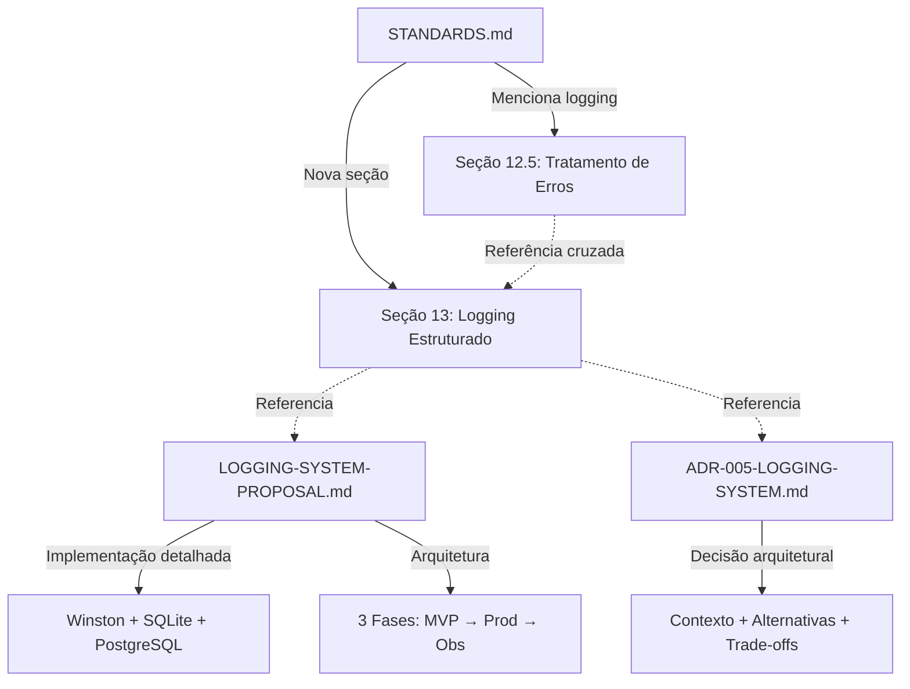

# 📊 Análise e Refinamento: STANDARDS-SECTION-13-LOGGING.md

> **Documento:** Análise Arquitetural  
> **Data:** 2026-01-26  
> **Objetivo:** Refinar proposta de Seção 13 para integração no STANDARDS.md sem invadir escopo de outros arquivos

---

## 📋 Sumário Executivo

A proposta [`STANDARDS-SECTION-13-LOGGING.md`](../docs/STANDARDS-SECTION-13-LOGGING.md) está **bem estruturada e alinhada** com o estilo do STANDARDS.md, mas precisa ser **reduzida em ~50%** (de 298 para ~150 linhas) para:

1. ✅ Eliminar redundâncias com [`LOGGING-SYSTEM-PROPOSAL.md`](../docs/LOGGING-SYSTEM-PROPOSAL.md) e [`ADR-005`](../docs/architecture/ADR-005-LOGGING-SYSTEM.md)
2. ✅ Focar em **regras imutáveis**, não em detalhes de implementação
3. ✅ Manter apenas conteúdo que pertence ao STANDARDS.md
4. ✅ Referenciar documentos técnicos para detalhes

---

## 🔍 Análise de Conformidade

### ✅ Pontos Fortes

| Aspecto | Status | Observação |
|---------|--------|------------|
| **Estilo Prescritivo** | ✅ Conforme | Usa ❌ PROIBIDO / ✅ OBRIGATÓRIO |
| **Exemplos TypeScript** | ✅ Conforme | Código bem formatado |
| **Tabelas Comparativas** | ✅ Conforme | Níveis de log clara |
| **Checklist** | ✅ Conforme | Útil para validação |
| **Referências** | ✅ Conforme | Links para docs técnicos |
| **Emojis** | ✅ Conforme | Consistente com STANDARDS |

### ⚠️ Problemas Identificados

| Problema | Impacto | Severidade |
|----------|---------|------------|
| **Muito longo** (298 linhas) | Outras seções têm 50-150 linhas | 🔴 Alto |
| **Exemplos muito detalhados** | Devem estar no PROPOSAL, não no STANDARDS | 🟡 Médio |
| **Seção 13.10 temporária** | Migração de console.log não é padrão permanente | 🟡 Médio |
| **Redundância com PROPOSAL** | Interface LogEntry repetida 3x | 🟡 Médio |
| **Redundância com ADR-005** | Exemplos de código idênticos | 🟡 Médio |

---

## 🚫 Conflitos de Escopo

### Análise de Sobreposição



### Resultado da Análise

| Documento | Escopo | Conflito? | Ação |
|-----------|--------|-----------|------|
| **STANDARDS.md Seção 12.5** | Menciona Winston superficialmente | ❌ Não | Adicionar referência cruzada |
| **LOGGING-SYSTEM-PROPOSAL.md** | Implementação técnica completa | ❌ Não | Manter separado, referenciar |
| **ADR-005-LOGGING-SYSTEM.md** | Decisão arquitetural formal | ❌ Não | Manter separado, referenciar |

**Conclusão:** ✅ **Não há conflitos diretos**, apenas redundâncias que devem ser eliminadas.

---

## 🔄 Redundâncias Identificadas

### Conteúdo Repetido Entre Documentos

| Conteúdo | SECTION-13 | PROPOSAL | ADR-005 | Ação |
|----------|------------|----------|---------|------|
| **Interface LogEntry** | ✅ Completa | ✅ Completa | ✅ Completa | Manter apenas em SECTION-13 (simplificada) |
| **Exemplos de Controllers** | ✅ 50 linhas | ✅ 50 linhas | ✅ 30 linhas | Reduzir para 10 linhas em SECTION-13 |
| **Exemplos de Services** | ✅ 40 linhas | ✅ 40 linhas | ✅ 20 linhas | **REMOVER** de SECTION-13 |
| **Segurança (dados sensíveis)** | ✅ 25 linhas | ✅ 30 linhas | ❌ Não | Manter em SECTION-13 (simplificado) |
| **Migration PostgreSQL** | ❌ Não | ✅ 60 linhas | ✅ 50 linhas | Manter apenas em PROPOSAL/ADR |
| **Docker Compose** | ❌ Não | ✅ 100 linhas | ✅ 50 linhas | Manter apenas em PROPOSAL |
| **Middleware requestId** | ✅ 30 linhas | ✅ 30 linhas | ✅ 20 linhas | Reduzir para 10 linhas em SECTION-13 |

---

## 📐 Estrutura Refinada Proposta

### Comparação: Atual vs. Proposta

| Seção | Atual (linhas) | Proposta (linhas) | Ação |
|-------|----------------|-------------------|------|
| 13.1 Princípios Fundamentais | 15 | 15 | ✅ Manter |
| 13.2 Estrutura de Log | 40 | 20 | 🔄 Simplificar (só interface) |
| 13.3 Níveis de Log | 10 | 10 | ✅ Manter |
| 13.4 Uso em Controllers | 50 | 15 | 🔄 Reduzir (exemplo mínimo) |
| 13.5 Uso em Services | 40 | 0 | ❌ Remover (redundante) |
| 13.6 Segurança | 25 | 20 | 🔄 Simplificar |
| 13.7 Performance | 15 | 10 | 🔄 Simplificar |
| 13.8 Correlação de Logs | 30 | 15 | 🔄 Reduzir |
| 13.9 Checklist | 15 | 15 | ✅ Manter |
| 13.10 Migração console.log | 30 | 0 | ❌ Remover (temporário) |
| 13.11 Exemplo JSON | 20 | 15 | 🔄 Simplificar |
| 13.12 Referências | 8 | 5 | 🔄 Simplificar |
| **TOTAL** | **298** | **~140** | **-53%** |

---

## ✂️ Seções a Remover

### 13.5 Uso em Services

**Motivo:** Redundante com 13.4 (Uso em Controllers)

**Justificativa:**
- O padrão de uso é o mesmo (chamar `logger.info/warn/error`)
- Exemplo de `executeWithLogging` é muito específico
- Deve estar no PROPOSAL, não no STANDARDS

**Ação:** ❌ **REMOVER COMPLETAMENTE**

---

### 13.10 Migração de console.log

**Motivo:** Conteúdo temporário, não é padrão permanente

**Justificativa:**
- Fala sobre "FASE 1" e "FASE 2" (temporário)
- Após migração completa, esta seção fica obsoleta
- Husky já implementa a validação (`.husky/pre-commit`)
- STANDARDS.md deve ter apenas regras permanentes

**Ação:** ❌ **REMOVER COMPLETAMENTE**

**Alternativa:** Manter aviso no Husky, documentar migração no PROPOSAL

---

## 🔧 Seções a Simplificar

### 13.2 Estrutura de Log Padronizada

**Atual:** 40 linhas (interface completa + explicações)

**Proposta:** 20 linhas (interface resumida)

**Mudanças:**
```typescript
// ❌ REMOVER: Comentários detalhados em cada campo
// ✅ MANTER: Interface TypeScript limpa
// ✅ ADICIONAR: Referência ao PROPOSAL para detalhes

interface LogEntry {
  timestamp: string;
  level: LogLevel;
  message: string;
  requestId?: string;
  userId?: string;
  inferenceId?: string;
  provider?: string;
  model?: string;
  metadata?: Record<string, unknown>;
  error?: { name: string; message: string; stack?: string };
  duration?: number;
  statusCode?: number;
  action?: string;
  resource?: string;
}
```

**Adicionar:** 
> Para detalhes de implementação, veja [`LOGGING-SYSTEM-PROPOSAL.md`](./LOGGING-SYSTEM-PROPOSAL.md)

---

### 13.4 Uso em Controllers

**Atual:** 50 linhas (exemplo completo de controller)

**Proposta:** 15 linhas (exemplo mínimo)

**Mudanças:**
```typescript
// ❌ REMOVER: Exemplo completo de 50 linhas
// ✅ MANTER: Exemplo mínimo de 15 linhas

// Exemplo mínimo
logger.info('Inference completed', {
  requestId: req.id,
  userId: req.user.id,
  inferenceId: result.id,
  provider: 'bedrock',
  model: 'claude-3-sonnet',
  duration: Date.now() - startTime,
  metadata: { tokens: 500, cost: 0.01 }
});
```

**Adicionar:**
> Para exemplos completos, veja [`LOGGING-SYSTEM-PROPOSAL.md`](./LOGGING-SYSTEM-PROPOSAL.md#exemplos-de-implementação)

---

### 13.7 Performance

**Atual:** 15 linhas (exemplo de código)

**Proposta:** 10 linhas (apenas regras)

**Mudanças:**
- ❌ REMOVER: Exemplo de código com `heavyObject`
- ✅ MANTER: Regra "Logs NÃO DEVEM impactar performance"
- ✅ ADICIONAR: Regra "Evitar logar objetos pesados"

---

### 13.8 Correlação de Logs (renumerar para 13.7)

**Atual:** 30 linhas (middleware completo)

**Proposta:** 15 linhas (regra + referência)

**Mudanças:**
- ❌ REMOVER: Código completo do middleware
- ✅ MANTER: Regra "Todo log DEVE incluir requestId"
- ✅ ADICIONAR: Referência ao PROPOSAL para implementação

---

### 13.12 Referências (renumerar para 13.10)

**Atual:** 8 linhas (3 links)

**Proposta:** 5 linhas (2 links principais)

**Mudanças:**
```markdown
### 13.10 Referências

- **Proposta Completa:** [LOGGING-SYSTEM-PROPOSAL.md](./LOGGING-SYSTEM-PROPOSAL.md)
- **ADR:** [ADR-005-LOGGING-SYSTEM.md](./architecture/ADR-005-LOGGING-SYSTEM.md)
```

---

## 🔗 Referências Cruzadas

### Adicionar em Seção 12.5 (Tratamento de Erros)

**Atual:**
```markdown
- [ ] Logs estruturados com Winston (não `console.log`)
```

**Proposta:**
```markdown
- [ ] Logs estruturados com Winston (não `console.log`) — Ver [Seção 13](#13-sistema-de-logging-estruturado)
```

---

### Adicionar em Seção 13.1 (Princípios Fundamentais)

**Adicionar:**
```markdown
> **Integração com APIs:** Para tratamento de erros em rotas REST, veja [Seção 12.5](#125-tratamento-de-erros-error-handling)
```

---

## 📝 Estrutura Final Recomendada

```markdown
## 13. Sistema de Logging Estruturado

### 13.1 Princípios Fundamentais
- ❌ PROIBIDO: console.log/error/warn
- ✅ OBRIGATÓRIO: logger.info/error/warn/debug
- Referência cruzada com Seção 12.5

### 13.2 Estrutura de Log Padronizada
- Interface LogEntry (simplificada, sem comentários detalhados)
- Referência ao PROPOSAL para detalhes

### 13.3 Níveis de Log
- Tabela: info, warn, error, debug
- Quando usar cada nível

### 13.4 Uso Básico
- Exemplo mínimo (15 linhas)
- Referência ao PROPOSAL para exemplos completos

### 13.5 Segurança e Dados Sensíveis
- Regras estritas (não logar senhas, tokens)
- Stack traces apenas em desenvolvimento

### 13.6 Performance
- Regras (não logar objetos pesados)
- Impacto mínimo na aplicação

### 13.7 Correlação de Logs
- Regra: requestId obrigatório
- Referência ao PROPOSAL para middleware

### 13.8 Checklist de Conformidade
- Lista de verificação pré-commit

### 13.9 Exemplo de Log Completo
- 1 exemplo JSON (simplificado)

### 13.10 Referências
- LOGGING-SYSTEM-PROPOSAL.md
- ADR-005-LOGGING-SYSTEM.md
```

**Total estimado:** ~140 linhas (-53% de redução)

---

## ✅ Checklist de Refinamento

### Antes de Integrar ao STANDARDS.md

- [ ] Remover Seção 13.5 (Uso em Services)
- [ ] Remover Seção 13.10 (Migração console.log)
- [ ] Simplificar Seção 13.2 (Estrutura de Log)
- [ ] Simplificar Seção 13.4 (Uso em Controllers)
- [ ] Simplificar Seção 13.7 (Performance)
- [ ] Simplificar Seção 13.8 (Correlação de Logs)
- [ ] Simplificar Seção 13.12 (Referências)
- [ ] Adicionar referência cruzada em Seção 12.5
- [ ] Adicionar referência cruzada em Seção 13.1
- [ ] Renumerar seções após remoções
- [ ] Validar total de linhas (~140)
- [ ] Revisar conformidade com estilo STANDARDS.md

---

## 🎯 Próximos Passos

### 1. Aprovação da Análise
- [ ] Revisar este documento com stakeholders
- [ ] Validar estrutura proposta
- [ ] Aprovar remoções e simplificações

### 2. Refinamento do STANDARDS-SECTION-13
- [ ] Aplicar mudanças propostas
- [ ] Criar versão refinada (v2.0)
- [ ] Validar redução de linhas

### 3. Integração ao STANDARDS.md
- [ ] Inserir Seção 13 após Seção 12
- [ ] Adicionar referências cruzadas
- [ ] Atualizar índice do STANDARDS.md
- [ ] Validar formatação e links

### 4. Atualização de Documentos Relacionados
- [ ] Atualizar LOGGING-SYSTEM-PROPOSAL.md (remover redundâncias)
- [ ] Atualizar ADR-005 (status: Approved)
- [ ] Atualizar .husky/pre-commit (referenciar Seção 13)

---

## 📊 Métricas de Sucesso

| Métrica | Meta | Status |
|---------|------|--------|
| Redução de linhas | -50% (298 → 140) | ⏳ Pendente |
| Remoção de redundâncias | 100% | ⏳ Pendente |
| Conformidade com STANDARDS | 100% | ✅ Conforme |
| Referências cruzadas | 2+ | ⏳ Pendente |
| Conflitos de escopo | 0 | ✅ Zero conflitos |

---

## 🔒 Garantias de Qualidade

### Princípios Mantidos

✅ **Imutabilidade:** Seção 13 define regras permanentes, não temporárias  
✅ **Clareza:** Foco em REGRAS, não em implementação  
✅ **Coesão:** Referências cruzadas com Seção 12.5  
✅ **Separação de Responsabilidades:** STANDARDS (regras) vs PROPOSAL (implementação) vs ADR (decisão)  
✅ **Manutenibilidade:** Conteúdo enxuto e fácil de atualizar

---

## 📚 Referências

- [`STANDARDS.md`](../docs/STANDARDS.md) — Padrões de Desenvolvimento MyIA
- [`STANDARDS-SECTION-13-LOGGING.md`](../docs/STANDARDS-SECTION-13-LOGGING.md) — Proposta original
- [`LOGGING-SYSTEM-PROPOSAL.md`](../docs/LOGGING-SYSTEM-PROPOSAL.md) — Proposta técnica completa
- [`ADR-005-LOGGING-SYSTEM.md`](../docs/architecture/ADR-005-LOGGING-SYSTEM.md) — Decisão arquitetural
- [`.husky/pre-commit`](../.husky/pre-commit) — Validação de console.log

---

**Documento criado em:** 2026-01-26  
**Versão:** 1.0  
**Autor:** Architect Mode  
**Status:** Aguardando Aprovação
