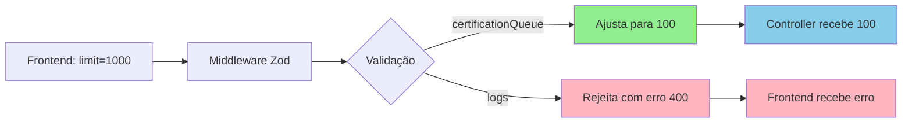

# Plano de Mitigação: Inconsistência de Validação do Parâmetro `limit`

**Data:** 2026-02-08  
**Autor:** Kilo Code (Architect Mode)  
**Referência:** [STANDARDS.md](../docs/STANDARDS.md)

---

## 📋 Sumário Executivo

Este plano aborda inconsistências na validação do parâmetro `limit` entre frontend e backend, identificadas durante análise de erro `"limit must be between 1 and 100"`.

**Problema Principal:** Três camadas de validação com comportamentos diferentes:
1. **Frontend**: Envia `limit: 1000`
2. **Middleware Zod**: Ajusta automaticamente para 100 (silencioso)
3. **Validator Manual**: Rejeita valores > 100 (com erro)

**Impacto:** Baixo-Médio (funciona, mas pode confundir desenvolvedores e causar bugs futuros)

---

## 🎯 Objetivos

1. **Padronizar** validação de `limit` em todas as camadas
2. **Eliminar** inconsistências entre middleware Zod e validator manual
3. **Documentar** limites de paginação no código
4. **Prevenir** problemas similares no futuro

---

## 📊 Análise do Problema

### Locais Afetados

| Local | Comportamento Atual | Problema |
|-------|-------------------|----------|
| [`frontend/src/services/certificationService.ts:116`](../frontend/src/services/certificationService.ts) | Envia `limit: 1000` | Inconsistente com backend |
| [`frontend/src/services/certificationService.ts:199`](../frontend/src/services/certificationService.ts) | Envia `limit: 1000` | Inconsistente com backend |
| [`frontend/src/services/certificationService.ts:282`](../frontend/src/services/certificationService.ts) | Envia `limit: 1000` | Inconsistente com backend |
| [`backend/src/middleware/validators/certificationQueueValidator.ts:159`](../backend/src/middleware/validators/certificationQueueValidator.ts) | Ajusta para 100 (silencioso) | Comportamento oculto |
| [`backend/src/middleware/validators/logsValidator.ts:63`](../backend/src/middleware/validators/logsValidator.ts) | Rejeita > 100 (com erro) | Inconsistente com certificationQueue |
| [`backend/src/controllers/certificationQueue/validators/payloadValidator.ts:232`](../backend/src/controllers/certificationQueue/validators/payloadValidator.ts) | Rejeita > 100 (com erro) | Não é usado (middleware intercepta antes) |

### Fluxo Atual



---

## 🛠️ Solução Proposta

### Abordagem: Padronização em 3 Camadas

**Princípio:** Validação deve ser **consistente**, **explícita** e **documentada**.

#### Camada 1: Frontend (Correção de Valores)

**Ação:** Reduzir `limit` de 1000 para 100 em todos os services.

**Justificativa:**
- Alinha com limite do backend
- Evita ajuste silencioso
- Melhora clareza do código

#### Camada 2: Backend Middleware (Padronização Zod)

**Ação:** Escolher UMA abordagem para todos os validators:
- **Opção A (Recomendada):** Rejeitar valores > 100 com erro explícito
- **Opção B:** Ajustar automaticamente para 100 (com log de warning)

**Justificativa:**
- Elimina inconsistência entre `certificationQueueValidator` e `logsValidator`
- Torna comportamento previsível
- Facilita debugging

#### Camada 3: Backend Validator Manual (Remoção ou Alinhamento)

**Ação:** Remover `payloadValidator.validatePaginationParams()` ou alinhar com Zod.

**Justificativa:**
- Validator manual não é usado (middleware intercepta antes)
- Duplicação de lógica de validação
- Fonte de inconsistência

---

## 📝 Plano de Implementação

### Fase 1: Correção Frontend (Prioridade Alta)

**Objetivo:** Alinhar valores enviados com limites do backend.

**Tarefas:**

1. **Atualizar `certificationService.ts`**
   - Arquivo: [`frontend/src/services/certificationService.ts`](../frontend/src/services/certificationService.ts)
   - Linhas: 116, 199, 282
   - Mudança: `limit: 1000` → `limit: 100`
   - Adicionar comentário: `// IMPORTANTE: Limite máximo é 100 (backend)`

2. **Verificar outros services**
   - Buscar por `limit:\s*\d{3,}` em `frontend/src/services/`
   - Corrigir valores > 100

**Resultado Esperado:**
- Frontend envia valores compatíveis com backend
- Sem ajustes silenciosos
- Código auto-documentado

**Estimativa:** 30 minutos

---

### Fase 2: Padronização Backend Middleware (Prioridade Alta)

**Objetivo:** Unificar comportamento de validação em todos os validators Zod.

**Opção A (Recomendada): Rejeitar com Erro**

```typescript
// backend/src/middleware/validators/certificationQueueValidator.ts

limit: z.string()
  .optional()
  .default('20')
  .transform(val => parseInt(val, 10))
  .refine(val => val >= 1 && val <= 100, {
    message: 'limit must be a positive integer between 1 and 100'
  })
```

**Opção B: Ajustar com Warning**

```typescript
limit: z.string()
  .optional()
  .default('20')
  .transform(val => {
    const parsed = parseInt(val, 10);
    if (parsed > 100) {
      logger.warn('[Validator] limit ajustado de ${parsed} para 100');
      return 100;
    }
    return parsed;
  })
  .refine(val => val >= 1, 'limit must be at least 1')
```

**Tarefas:**

1. **Decidir abordagem** (Opção A ou B)
2. **Atualizar `certificationQueueValidator.ts`**
   - Arquivo: [`backend/src/middleware/validators/certificationQueueValidator.ts`](../backend/src/middleware/validators/certificationQueueValidator.ts)
   - Linhas: 128-136 (paginationSchema)
   - Linhas: 156-164 (certificationsQuerySchema)
3. **Atualizar `logsValidator.ts`** (se necessário)
   - Arquivo: [`backend/src/middleware/validators/logsValidator.ts`](../backend/src/middleware/validators/logsValidator.ts)
   - Linha: 63
   - Garantir consistência com abordagem escolhida

**Resultado Esperado:**
- Comportamento consistente em todos os validators
- Erros claros e previsíveis
- Logs de warning (se Opção B)

**Estimativa:** 1 hora

---

### Fase 3: Limpeza de Código Duplicado (Prioridade Média)

**Objetivo:** Remover validação manual duplicada.

**Tarefas:**

1. **Analisar uso de `payloadValidator.validatePaginationParams()`**
   - Buscar por `validatePaginationParams` no código
   - Verificar se é usado em algum lugar

2. **Remover ou deprecar**
   - Se não usado: Deletar método
   - Se usado: Alinhar com Zod ou migrar para Zod

3. **Atualizar testes**
   - Remover testes do método deletado
   - Adicionar testes para validação Zod

**Resultado Esperado:**
- Fonte única de verdade para validação
- Menos código para manter
- Testes mais simples

**Estimativa:** 1 hora

---

### Fase 4: Documentação e Prevenção (Prioridade Média)

**Objetivo:** Documentar limites e prevenir problemas futuros.

**Tarefas:**

1. **Adicionar constantes de configuração**
   ```typescript
   // backend/src/config/pagination.ts
   export const PAGINATION_LIMITS = {
     DEFAULT: 20,
     MIN: 1,
     MAX: 100
   } as const;
   ```

2. **Usar constantes nos validators**
   ```typescript
   import { PAGINATION_LIMITS } from '../../config/pagination';
   
   limit: z.string()
     .optional()
     .default(String(PAGINATION_LIMITS.DEFAULT))
     .transform(val => parseInt(val, 10))
     .refine(
       val => val >= PAGINATION_LIMITS.MIN && val <= PAGINATION_LIMITS.MAX,
       `limit must be between ${PAGINATION_LIMITS.MIN} and ${PAGINATION_LIMITS.MAX}`
     )
   ```

3. **Documentar no código**
   - Adicionar comentários JSDoc nos services
   - Adicionar comentários inline nos validators

4. **Atualizar STANDARDS.md**
   - Adicionar seção sobre limites de paginação
   - Documentar padrão de validação

5. **Criar testes de integração**
   - Testar comportamento com `limit=1`, `limit=50`, `limit=100`, `limit=101`, `limit=1000`
   - Verificar mensagens de erro

**Resultado Esperado:**
- Limites centralizados e reutilizáveis
- Código auto-documentado
- Padrão claro para novos endpoints

**Estimativa:** 2 horas

---

## ✅ Checklist de Conformidade

### Frontend
- [ ] Todos os services enviam `limit <= 100`
- [ ] Comentários documentam limite máximo
- [ ] Busca por `limit:\s*\d{3,}` retorna 0 resultados

### Backend Middleware
- [ ] Todos os validators Zod têm comportamento consistente
- [ ] Mensagens de erro são claras e padronizadas
- [ ] Logs de warning (se Opção B escolhida)

### Backend Validator Manual
- [ ] `payloadValidator.validatePaginationParams()` removido ou alinhado
- [ ] Sem duplicação de lógica de validação

### Documentação
- [ ] Constantes de paginação criadas e usadas
- [ ] Comentários JSDoc adicionados
- [ ] STANDARDS.md atualizado
- [ ] Testes de integração criados

### Testes
- [ ] Testes passam com `limit=1`, `limit=50`, `limit=100`
- [ ] Testes falham com `limit=0`, `limit=101`, `limit=1000`
- [ ] Mensagens de erro verificadas

---

## 🎯 Métricas de Sucesso

| Métrica | Antes | Depois | Objetivo |
|---------|-------|--------|----------|
| Inconsistências de validação | 3 | 0 | Eliminar todas |
| Valores `limit > 100` no frontend | 3 | 0 | Eliminar todos |
| Validators com comportamento diferente | 2 | 0 | Unificar |
| Linhas de código duplicado | ~50 | 0 | Remover duplicação |
| Cobertura de testes (validação) | ~30% | >80% | Aumentar |

---

## 📚 Referências

### STANDARDS.md

- **Seção 4.1:** Responsabilidade Única
- **Seção 9:** Padronização de API (JSend)
- **Seção 11:** Sistema de Logging
- **Seção 12.4:** Checklist Pré-Commit

### Arquivos Relacionados

- [`frontend/src/services/certificationService.ts`](../frontend/src/services/certificationService.ts)
- [`backend/src/middleware/validators/certificationQueueValidator.ts`](../backend/src/middleware/validators/certificationQueueValidator.ts)
- [`backend/src/middleware/validators/logsValidator.ts`](../backend/src/middleware/validators/logsValidator.ts)
- [`backend/src/controllers/certificationQueue/validators/payloadValidator.ts`](../backend/src/controllers/certificationQueue/validators/payloadValidator.ts)

---

## 🚀 Próximos Passos

1. **Revisar plano** com equipe/stakeholder
2. **Aprovar abordagem** (Opção A ou B para Fase 2)
3. **Criar branch** `fix/limit-validation-inconsistency`
4. **Implementar Fase 1** (Frontend)
5. **Implementar Fase 2** (Backend Middleware)
6. **Implementar Fase 3** (Limpeza)
7. **Implementar Fase 4** (Documentação)
8. **Code Review**
9. **Merge para develop**

---

## 📝 Notas Adicionais

### Por que não usar `limit: 1000`?

**Razões técnicas:**
1. **Performance:** Queries com `LIMIT 1000` são mais lentas
2. **Memória:** Transferir 1000 registros consome mais banda
3. **UX:** Usuário não consegue processar 1000 itens de uma vez
4. **Padrão:** APIs REST geralmente limitam a 100-200 itens

**Solução:** Se precisar de mais de 100 itens, implementar paginação.

### Por que Opção A (Rejeitar) é recomendada?

**Vantagens:**
- ✅ Comportamento explícito (não oculta problemas)
- ✅ Força frontend a enviar valores corretos
- ✅ Facilita debugging (erro claro)
- ✅ Consistente com princípio Fail-Secure (STANDARDS.md §10.2)

**Desvantagens:**
- ⚠️ Requer correção no frontend (mas isso é bom!)

### Alternativa: Paginação Automática

Se realmente precisar de mais de 100 itens, considerar:

```typescript
// Frontend
async function getAllCertifications() {
  let allItems = [];
  let page = 1;
  let hasMore = true;
  
  while (hasMore) {
    const response = await api.get('/certifications', {
      params: { page, limit: 100 }
    });
    
    allItems.push(...response.data.certifications);
    hasMore = response.data.pagination.page < response.data.pagination.totalPages;
    page++;
  }
  
  return allItems;
}
```

---

**Fim do Plano**
