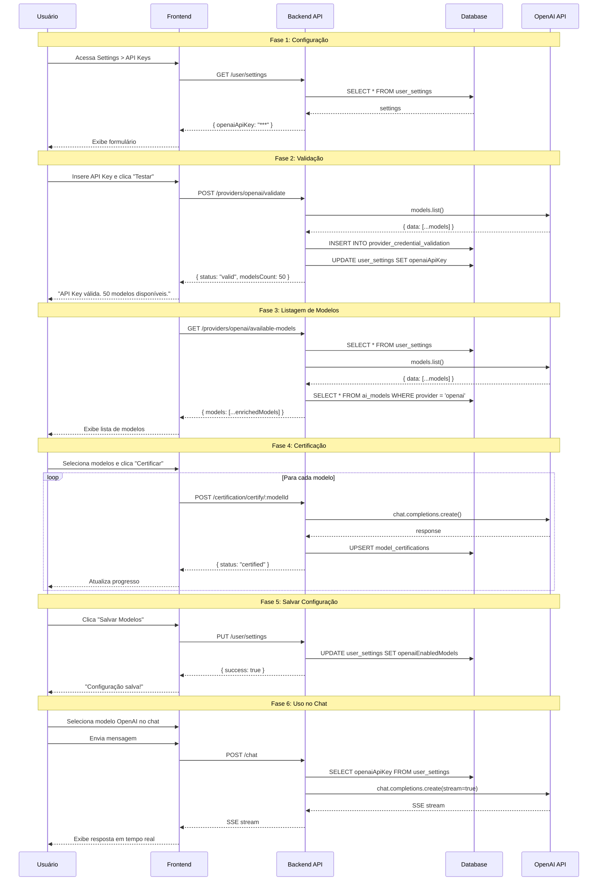

# Proposta de Implementação: OpenAI/Groq Frontend Integration - PARTE 2

**Continuação do documento principal**

---

## 8. Pipeline Completo de Uso

### Fluxo Detalhado Passo a Passo

#### Fase 1: Configuração Inicial

```
1. Usuário acessa Settings
   ↓
2. Clica na aba "Chaves de API"
   ↓
3. Vê 4 sub-abas:
   - Padrão (OpenAI, Groq, Together, etc.)
   - AWS Bedrock
   - Azure OpenAI
   - Gerenciar Modelos
```

#### Fase 2: Configuração OpenAI

```
4. Usuário clica na sub-aba "Padrão"
   ↓
5. Vê seção "OpenAI" com campo de API Key
   ↓
6. Insere API Key (sk-...)
   ↓
7. Clica "Testar e Salvar"
   ↓
8. Sistema valida chave no backend:
   - POST /api/providers/openai/validate
   - Testa com models.list()
   - Retorna contagem de modelos
   ↓
9. Se válida:
   - Salva API Key criptografada no banco
   - Registra validação em providerCredentialValidation
   - Busca modelos disponíveis
   - Exibe lista de modelos
   ↓
10. Se inválida:
    - Exibe mensagem de erro amigável
    - Não salva nada
```

#### Fase 3: Seleção de Modelos

```
11. Usuário vê lista de modelos disponíveis
    - Agrupados por owner (openai, system, etc.)
    - Com informações de custo e contexto
    - Com badges de certificação
    ↓
12. Usuário seleciona modelos desejados
    - Marca checkboxes dos modelos
    - Pode buscar por nome/ID
    ↓
13. Usuário clica "Certificar X Modelos"
    ↓
14. Sistema certifica cada modelo:
    - POST /api/certification/certify/:modelId
    - Testa cada modelo individualmente
    - Salva resultado em modelCertification
    - Exibe progresso em tempo real
    ↓
15. Certificação completa:
    - Modelos certificados: badge verde ✅
    - Modelos com warning: badge amarelo ⚠️
    - Modelos failed: badge vermelho ❌ (desabilitados)
    ↓
16. Usuário clica "Salvar Modelos Selecionados"
    - PUT /api/user/settings
    - Salva openaiEnabledModels no banco
    - Dispara evento 'openai-credentials-updated'
```

#### Fase 4: Uso no Chat

```
17. Usuário vai para a página de Chat
    ↓
18. Abre o Control Panel (painel lateral)
    ↓
19. Clica na aba "Modelo"
    ↓
20. Vê VendorSelector com vendors disponíveis
    - Anthropic (se AWS Bedrock configurado)
    - OpenAI (se configurado)
    - Groq (se configurado)
    - etc.
    ↓
21. Seleciona vendor "OpenAI"
    ↓
22. Vê lista de modelos OpenAI habilitados
    - Apenas modelos em openaiEnabledModels
    - Com badges de certificação
    - Com informações de custo e capacidades
    ↓
23. Seleciona modelo (ex: gpt-4-turbo)
    ↓
24. Digita mensagem e envia
    ↓
25. Sistema processa:
    - POST /api/chat
    - Busca API Key do usuário
    - Descriptografa API Key
    - Cria OpenAIProvider
    - Chama streamChat()
    - Retorna resposta em stream
    ↓
26. Usuário vê resposta em tempo real
    - Com metadados (tokens, custo, latência)
    - Salvo no histórico
```

### Diagrama de Sequência Completo



---

## 9. Estimativa de Esforço

### Tabela Detalhada

| Componente | Arquivo | Complexidade | Prioridade | Dependências |
|------------|---------|--------------|------------|--------------|
| **Backend - Controllers** |
| `validateOpenAI` | `providersController.ts` | Média | Alta | OpenAIProvider, encryptionService |
| `validateGroq` | `providersController.ts` | Média | Alta | OpenAIProvider, encryptionService |
| `getAvailableOpenAIModels` | `providersController.ts` | Média | Alta | OpenAIProvider, ModelRegistry |
| `getAvailableGroqModels` | `providersController.ts` | Média | Alta | OpenAIProvider, ModelRegistry |
| **Backend - Routes** |
| Rotas OpenAI | `providers.ts` | Baixa | Alta | providersController |
| Rotas Groq | `providers.ts` | Baixa | Alta | providersController |
| **Backend - Schemas** |
| `openaiConfigSchema` | `providerSchemas.ts` | Baixa | Alta | Zod |
| `groqConfigSchema` | `providerSchemas.ts` | Baixa | Alta | Zod |
| **Backend - Database** |
| Migration | `add_openai_groq_enabled_models` | Baixa | Alta | Prisma |
| **Backend - Provider** |
| `getAvailableModels` | `openai.ts` | Baixa | Alta | OpenAI SDK |
| **Frontend - Services** |
| `openaiService.ts` | `services/` | Baixa | Alta | api |
| `groqService.ts` | `services/` | Baixa | Alta | api |
| **Frontend - Hooks** |
| `useOpenAIConfig.ts` | `hooks/` | Média | Alta | openaiService, userSettingsService |
| `useGroqConfig.ts` | `hooks/` | Média | Alta | groqService, userSettingsService |
| **Frontend - Components** |
| `OpenAIProviderPanel.tsx` | `components/providers/` | Alta | Alta | useOpenAIConfig, certificationService |
| `GroqProviderPanel.tsx` | `components/providers/` | Alta | Alta | useGroqConfig, certificationService |
| Atualizar `ApiKeysTab.tsx` | `components/` | Baixa | Média | OpenAIProviderPanel, GroqProviderPanel |
| **Testes** |
| Testes de validação | `__tests__/` | Média | Média | Jest, Supertest |
| Testes de listagem | `__tests__/` | Média | Média | Jest, Supertest |
| Testes de certificação | `__tests__/` | Média | Baixa | Jest, Supertest |
| **Documentação** |
| Atualizar README | `README.md` | Baixa | Baixa | - |
| Documentar API | `docs/API.md` | Baixa | Baixa | - |

### Resumo de Complexidade

- **Baixa Complexidade:** 10 itens (40%)
- **Média Complexidade:** 10 itens (40%)
- **Alta Complexidade:** 2 itens (20%)

### Ordem de Implementação Recomendada

1. **Sprint 1: Backend Foundation**
   - [ ] Criar schemas Zod (`providerSchemas.ts`)
   - [ ] Adicionar método `getAvailableModels` no `OpenAIProvider`
   - [ ] Criar migration do Prisma
   - [ ] Implementar `validateOpenAI` e `validateGroq`
   - [ ] Implementar `getAvailableOpenAIModels` e `getAvailableGroqModels`
   - [ ] Adicionar rotas em `providers.ts`

2. **Sprint 2: Frontend Services & Hooks**
   - [ ] Criar `openaiService.ts` e `groqService.ts`
   - [ ] Criar `useOpenAIConfig.ts`
   - [ ] Criar `useGroqConfig.ts`

3. **Sprint 3: Frontend Components**
   - [ ] Criar `OpenAIProviderPanel.tsx`
   - [ ] Criar `GroqProviderPanel.tsx`
   - [ ] Atualizar `ApiKeysTab.tsx`

4. **Sprint 4: Testes & Documentação**
   - [ ] Escrever testes de validação
   - [ ] Escrever testes de listagem de modelos
   - [ ] Escrever testes de certificação
   - [ ] Atualizar documentação

---

## 10. Checklist de Implementação

### Backend

#### Controllers
- [ ] Implementar `validateOpenAI` em `providersController.ts`
  - [ ] Resolução de credenciais (nova vs armazenada)
  - [ ] Validação com `models.list()`
  - [ ] Persistência segura (Safe-Save)
  - [ ] Registro em `providerCredentialValidation`
  - [ ] Tratamento de erros específicos (401, 429, 403)
  - [ ] Logging estruturado

- [ ] Implementar `validateGroq` em `providersController.ts`
  - [ ] Resolução de credenciais (nova vs armazenada)
  - [ ] Validação com `models.list()` (baseURL Groq)
  - [ ] Persistência segura (Safe-Save)
  - [ ] Registro em `providerCredentialValidation`
  - [ ] Tratamento de erros específicos
  - [ ] Logging estruturado

- [ ] Implementar `getAvailableOpenAIModels` em `providersController.ts`
  - [ ] Buscar API Key do usuário
  - [ ] Descriptografar API Key
  - [ ] Buscar modelos da OpenAI
  - [ ] Filtrar modelos suportados (ModelRegistry)
  - [ ] Enriquecer com dados do banco
  - [ ] Retornar modelos enriquecidos

- [ ] Implementar `getAvailableGroqModels` em `providersController.ts`
  - [ ] Buscar API Key do usuário
  - [ ] Descriptografar API Key
  - [ ] Buscar modelos do Groq
  - [ ] Filtrar modelos suportados (ModelRegistry)
  - [ ] Enriquecer com dados do banco
  - [ ] Retornar modelos enriquecidos

#### Routes
- [ ] Adicionar rota `POST /providers/openai/validate`
  - [ ] Middleware `protect`
  - [ ] Middleware `apiLimiter`
  - [ ] Middleware `validateRequest(openaiConfigSchema)`
  - [ ] Handler `providersController.validateOpenAI`

- [ ] Adicionar rota `GET /providers/openai/available-models`
  - [ ] Middleware `protect`
  - [ ] Handler `providersController.getAvailableOpenAIModels`

- [ ] Adicionar rota `POST /providers/groq/validate`
  - [ ] Middleware `protect`
  - [ ] Middleware `apiLimiter`
  - [ ] Middleware `validateRequest(groqConfigSchema)`
  - [ ] Handler `providersController.validateGroq`

- [ ] Adicionar rota `GET /providers/groq/available-models`
  - [ ] Middleware `protect`
  - [ ] Handler `providersController.getAvailableGroqModels`

#### Schemas
- [ ] Criar `backend/src/schemas/providerSchemas.ts`
  - [ ] Definir `openaiApiKeyRegex` (`/^sk-[A-Za-z0-9]{48,}$/`)
  - [ ] Definir `groqApiKeyRegex` (`/^gsk_[A-Za-z0-9]{52,}$/`)
  - [ ] Criar `openaiConfigBodySchema` com Zod
  - [ ] Criar `groqConfigBodySchema` com Zod
  - [ ] Exportar `openaiConfigSchema` completo
  - [ ] Exportar `groqConfigSchema` completo
  - [ ] Exportar tipos TypeScript

#### Database
- [ ] Atualizar `backend/prisma/schema.prisma`
  - [ ] Adicionar campo `openaiEnabledModels String[] @default([])`
  - [ ] Adicionar campo `groqEnabledModels String[] @default([])`

- [ ] Criar migration
  - [ ] Executar `npx prisma migrate dev --name add_openai_groq_enabled_models`
  - [ ] Verificar migration gerada
  - [ ] Aplicar migration no banco de desenvolvimento
  - [ ] Testar rollback (se necessário)

#### Provider
- [ ] Adicionar método `getAvailableModels` em `backend/src/services/ai/providers/openai.ts`
  - [ ] Criar cliente OpenAI com API Key
  - [ ] Chamar `client.models.list()`
  - [ ] Retornar `response.data`
  - [ ] Tratamento de erros

### Frontend

#### Services
- [ ] Criar `frontend/src/services/openaiService.ts`
  - [ ] Definir interface `OpenAIValidationPayload`
  - [ ] Definir interface `OpenAIValidationResponse`
  - [ ] Definir interface `EnrichedOpenAIModel`
  - [ ] Implementar `validateApiKey()`
  - [ ] Implementar `getAvailableModels()`

- [ ] Criar `frontend/src/services/groqService.ts`
  - [ ] Definir interface `GroqValidationPayload`
  - [ ] Definir interface `GroqValidationResponse`
  - [ ] Definir interface `EnrichedGroqModel`
  - [ ] Implementar `validateApiKey()`
  - [ ] Implementar `getAvailableModels()`

#### Hooks
- [ ] Criar `frontend/src/features/settings/hooks/useOpenAIConfig.ts`
  - [ ] Definir tipos (`FormState`, `ValidationStatus`, `UseOpenAIConfigReturn`)
  - [ ] Implementar estados (formState, isLoading, error, etc.)
  - [ ] Implementar `loadOpenAIConfig()`
  - [ ] Implementar `validateLocal()`
  - [ ] Implementar `handleFieldChange()`
  - [ ] Implementar `handleValidate()`
  - [ ] Implementar `handleSave()`
  - [ ] Implementar `toggleModel()`
  - [ ] Disparar evento `openai-credentials-updated`

- [ ] Criar `frontend/src/features/settings/hooks/useGroqConfig.ts`
  - [ ] Copiar estrutura de `useOpenAIConfig.ts`
  - [ ] Substituir "openai" por "groq" em todo o código
  - [ ] Ajustar regex de validação
  - [ ] Disparar evento `groq-credentials-updated`

#### Components
- [ ] Criar `frontend/src/features/settings/components/providers/OpenAIProviderPanel.tsx`
  - [ ] Importar dependências (MUI, hooks, services)
  - [ ] Criar componente `ModelCheckboxItem` memoizado
  - [ ] Implementar estados (search, certifications, drawer, etc.)
  - [ ] Implementar debounce de busca
  - [ ] Implementar detecção de credenciais existentes
  - [ ] Implementar carregamento de certificações
  - [ ] Implementar `handleShowModelInfo()`
  - [ ] Implementar `handleCertifySelected()`
  - [ ] Implementar `handleCancelCertification()`
  - [ ] Implementar agrupamento de modelos por owner
  - [ ] Renderizar formulário de API Key
  - [ ] Renderizar lista de modelos com acordeões
  - [ ] Renderizar botões de ação
  - [ ] Integrar `ModelInfoDrawer`
  - [ ] Integrar `CertificationProgressDialog`

- [ ] Criar `frontend/src/features/settings/components/providers/GroqProviderPanel.tsx`
  - [ ] Copiar estrutura de `OpenAIProviderPanel.tsx`
  - [ ] Substituir "OpenAI" por "Groq" em todo o código
  - [ ] Ajustar textos e labels
  - [ ] Ajustar placeholder da API Key

- [ ] Atualizar `frontend/src/features/settings/components/ApiKeysTab.tsx`
  - [ ] Importar `OpenAIProviderPanel` e `GroqProviderPanel`
  - [ ] Adicionar abas "OpenAI" e "Groq" no Tabs
  - [ ] Renderizar `OpenAIProviderPanel` quando aba OpenAI ativa
  - [ ] Renderizar `GroqProviderPanel` quando aba Groq ativa
  - [ ] Ajustar índices das abas existentes

### Testes

#### Backend
- [ ] Criar testes para `validateOpenAI`
  - [ ] Teste: API Key válida retorna sucesso
  - [ ] Teste: API Key inválida retorna erro 400
  - [ ] Teste: API Key sem permissão retorna erro 403
  - [ ] Teste: Limite de requisições retorna erro 429
  - [ ] Teste: Credenciais armazenadas funcionam
  - [ ] Teste: Validação salva em `providerCredentialValidation`

- [ ] Criar testes para `validateGroq`
  - [ ] Teste: API Key válida retorna sucesso
  - [ ] Teste: API Key inválida retorna erro 400
  - [ ] Teste: Credenciais armazenadas funcionam

- [ ] Criar testes para `getAvailableOpenAIModels`
  - [ ] Teste: Retorna lista de modelos enriquecidos
  - [ ] Teste: Filtra apenas modelos suportados
  - [ ] Teste: Retorna erro 401 se não autenticado
  - [ ] Teste: Retorna erro 400 se API Key não configurada

- [ ] Criar testes para `getAvailableGroqModels`
  - [ ] Teste: Retorna lista de modelos enriquecidos
  - [ ] Teste: Filtra apenas modelos suportados

#### Frontend
- [ ] Criar testes para `useOpenAIConfig`
  - [ ] Teste: Carrega configurações ao montar
  - [ ] Teste: Valida API Key corretamente
  - [ ] Teste: Salva configurações corretamente
  - [ ] Teste: Toggle de modelos funciona
  - [ ] Teste: Dispara evento após salvar

- [ ] Criar testes para `OpenAIProviderPanel`
  - [ ] Teste: Renderiza formulário corretamente
  - [ ] Teste: Valida e salva API Key
  - [ ] Teste: Lista modelos após validação
  - [ ] Teste: Certifica modelos selecionados
  - [ ] Teste: Busca de modelos funciona

### Documentação

- [ ] Atualizar `README.md`
  - [ ] Adicionar seção sobre configuração OpenAI
  - [ ] Adicionar seção sobre configuração Groq
  - [ ] Adicionar exemplos de uso
  - [ ] Adicionar troubleshooting

- [ ] Criar/Atualizar `docs/API.md`
  - [ ] Documentar `POST /providers/openai/validate`
  - [ ] Documentar `GET /providers/openai/available-models`
  - [ ] Documentar `POST /providers/groq/validate`
  - [ ] Documentar `GET /providers/groq/available-models`
  - [ ] Adicionar exemplos de request/response

- [ ] Criar `docs/OPENAI-GROQ-SETUP.md`
  - [ ] Guia passo a passo para configurar OpenAI
  - [ ] Guia passo a passo para configurar Groq
  - [ ] Como obter API Keys
  - [ ] Troubleshooting comum
  - [ ] FAQ

---

## 11. Considerações Finais

### Pontos de Atenção

1. **Segurança**
   - ✅ API Keys devem ser sempre criptografadas antes de salvar no banco
   - ✅ Nunca retornar API Keys descriptografadas para o frontend
   - ✅ Usar HTTPS em produção
   - ✅ Implementar rate limiting nos endpoints de validação

2. **Performance**
   - ✅ Cachear lista de modelos disponíveis (TTL: 1 hora)
   - ✅ Debounce na busca de modelos (300ms)
   - ✅ Memoizar componentes pesados (ModelCheckboxItem)
   - ✅ Virtualização para listas grandes (se necessário)

3. **UX**
   - ✅ Feedback visual claro em cada etapa
   - ✅ Mensagens de erro amigáveis
   - ✅ Loading states em todas as operações assíncronas
   - ✅ Tooltips explicativos
   - ✅ Confirmação antes de ações destrutivas

4. **Manutenibilidade**
   - ✅ Código bem documentado
   - ✅ Testes abrangentes
   - ✅ Logging estruturado
   - ✅ Tratamento de erros consistente
   - ✅ Seguir padrões do projeto (STANDARDS.md)

### Próximos Passos

Após implementação completa:

1. **Fase 1: Validação Interna**
   - Testar fluxo completo em ambiente de desenvolvimento
   - Validar com diferentes API Keys
   - Testar edge cases (API Key inválida, sem permissão, etc.)

2. **Fase 2: Code Review**
   - Revisar código com equipe
   - Verificar conformidade com STANDARDS.md
   - Validar testes e cobertura

3. **Fase 3: Deploy Staging**
   - Deploy em ambiente de staging
   - Testes de integração
   - Testes de performance

4. **Fase 4: Deploy Produção**
   - Deploy gradual (feature flag)
   - Monitoramento de erros
   - Coleta de feedback dos usuários

5. **Fase 5: Iteração**
   - Analisar métricas de uso
   - Implementar melhorias baseadas em feedback
   - Otimizações de performance

---

## 12. Referências

### Documentação Externa

- [OpenAI API Reference](https://platform.openai.com/docs/api-reference)
- [Groq API Documentation](https://console.groq.com/docs)
- [Zod Documentation](https://zod.dev/)
- [Prisma Documentation](https://www.prisma.io/docs)
- [Material-UI Documentation](https://mui.com/)

### Arquivos do Projeto

- [`backend/src/controllers/providersController.ts`](backend/src/controllers/providersController.ts:1) - Controller de referência (AWS Bedrock)
- [`backend/src/routes/providers.ts`](backend/src/routes/providers.ts:1) - Rotas de referência
- [`backend/src/schemas/bedrockSchema.ts`](backend/src/schemas/bedrockSchema.ts:1) - Schema de referência
- [`backend/prisma/schema.prisma`](backend/prisma/schema.prisma:1) - Database schema
- [`frontend/src/features/settings/components/providers/AWSProviderPanel.tsx`](frontend/src/features/settings/components/providers/AWSProviderPanel.tsx:1) - Componente de referência
- [`frontend/src/features/settings/hooks/useAWSConfig.ts`](frontend/src/features/settings/hooks/useAWSConfig.ts:1) - Hook de referência

### Padrões do Projeto

- [`docs/STANDARDS.md`](docs/STANDARDS.md) - Padrões de código do projeto

---

**Documento criado em:** 2026-01-27  
**Última atualização:** 2026-01-27  
**Versão:** 1.0  
**Status:** Completo e pronto para implementação
