# Proposta de Implementação: OpenAI/Groq Frontend Integration

**Data:** 2026-01-27  
**Autor:** Architect Mode  
**Status:** Proposta Completa  
**Prioridade:** Alta

---

## 📋 Sumário Executivo

Esta proposta detalha a implementação completa da integração frontend para OpenAI e Groq, seguindo o padrão já estabelecido pela integração AWS Bedrock. Atualmente, OpenAI e Groq possuem apenas campos de API Key sem validação, listagem de modelos ou certificação.

### Objetivos

1. ✅ Implementar validação de API Keys (OpenAI/Groq)
2. ✅ Implementar listagem dinâmica de modelos disponíveis
3. ✅ Implementar sistema de certificação de modelos
4. ✅ Criar UI dedicada para cada provider (painéis separados)
5. ✅ Garantir paridade de funcionalidades com AWS Bedrock

---

## 🎯 Análise do Estado Atual

### ✅ O que já existe (AWS Bedrock)

```typescript
// Backend
- ✅ Validação de credenciais (POST /api/providers/bedrock/validate)
- ✅ Listagem de modelos (GET /api/providers/bedrock/available-models)
- ✅ Sistema de certificação completo
- ✅ Schemas Zod para validação
- ✅ Campos no Prisma (awsAccessKey, awsSecretKey, awsRegion, awsEnabledModels)

// Frontend
- ✅ AWSProviderPanel com UI completa
- ✅ Hook useAWSConfig para gerenciar estado
- ✅ Integração com sistema de certificação
- ✅ Drawer de informações de modelo
- ✅ Diálogo de progresso de certificação
```

### ❌ O que falta (OpenAI/Groq)

```typescript
// Backend
- ❌ Endpoints de validação de API Keys
- ❌ Endpoints de listagem de modelos
- ❌ Schemas Zod para validação
- ❌ Campos no Prisma para armazenar configurações

// Frontend
- ❌ Painéis dedicados (OpenAIProviderPanel, GroqProviderPanel)
- ❌ Hooks para gerenciar estado
- ❌ Services para comunicação com API
- ❌ Integração com sistema de certificação
```

---

## 🏗️ Arquitetura da Solução

### Diagrama de Fluxo Completo

```mermaid
graph TB
    A[Usuário acessa Settings] --> B[Clica na aba OpenAI/Groq]
    B --> C[Insere API Key]
    C --> D[Clica Testar e Salvar]
    D --> E{Validação Backend}
    E -->|Válida| F[Lista modelos disponíveis]
    E -->|Inválida| G[Exibe erro]
    F --> H[Usuário seleciona modelos]
    H --> I[Clica Certificar Modelos]
    I --> J[Sistema certifica cada modelo]
    J --> K[Salva certificações no banco]
    K --> L[Usuário clica Salvar]
    L --> M[Salva configurações]
    M --> N[Usuário vai para Chat]
    N --> O[Seleciona modelo OpenAI/Groq]
    O --> P[Envia mensagem]
    P --> Q[Sistema usa modelo certificado]
```



### Diagrama de Componentes


---

## 📝 Implementação Detalhada

## 1. Backend - Controllers

### 1.1. Completar `validateOpenAI` em `providersController.ts`

```typescript
// backend/src/controllers/providersController.ts

/**
 * POST /api/providers/openai/validate
 * Validação de API Key OpenAI
 */
async validateOpenAI(req: AuthRequest, res: Response) {
  try {
    const userId = req.userId!;
    if (!userId) {
      return res.status(401).json(jsend.fail({ auth: 'Não autorizado' }));
    }

    logger.info('Iniciando validação OpenAI', {
      requestId: req.id,
      userId,
      hasApiKey: !!req.body.apiKey,
      useStoredCredentials: req.body.useStoredCredentials
    });

    const config = req.body;
    let apiKey: string;

    // Resolução de Credenciais
    if (config.apiKey) {
      // Caso A: Edição - Usar API Key enviada
      apiKey = config.apiKey;
    } else {
      // Caso B: Teste Rápido - Buscar API Key salva no banco
      const userSettings = await prisma.userSettings.findUnique({
        where: { userId },
        select: { openaiApiKey: true },
      });

      if (!userSettings?.openaiApiKey) {
        return res.status(400).json(jsend.fail({
          credentials: 'Nenhuma API Key OpenAI salva. Forneça uma API Key.',
        }));
      }

      apiKey = encryptionService.decrypt(userSettings.openaiApiKey);
    }

    // Dry Run: Teste com models.list()
    const startTime = Date.now();
    let latencyMs: number;
    let modelsCount: number;

    try {
      const openaiProvider = new OpenAIProvider();
      
      // Validar chave
      const isValid = await openaiProvider.validateKey(apiKey);
      if (!isValid) {
        throw new Error('API Key inválida ou sem permissão');
      }

      // Obter contagem de modelos
      const models = await openaiProvider.getAvailableModels(apiKey);
      modelsCount = models.length;
      latencyMs = Date.now() - startTime;

    } catch (error: any) {
      const errorMsg = error.message || 'Erro desconhecido na validação';
      logger.warn('OpenAI validation failed', {
        userId,
        error: errorMsg,
        timestamp: new Date().toISOString(),
      });

      // Mapear erros específicos
      let friendlyMessage = 'API Key inválida';
      if (error.message?.includes('401')) {
        friendlyMessage = 'API Key OpenAI inválida ou expirada';
      } else if (error.message?.includes('429')) {
        friendlyMessage = 'Limite de requisições excedido. Tente novamente em alguns minutos.';
      } else if (error.message?.includes('403')) {
        friendlyMessage = 'Sem permissão para acessar a API OpenAI';
      }

      return res.status(400).json(jsend.fail({
        validation: friendlyMessage,
      }));
    }

    // Persistência (Safe-Save): Só salvar se sucesso E API Key nova foi enviada
    if (config.apiKey) {
      await prisma.userSettings.upsert({
        where: { userId },
        update: {
          openaiApiKey: encryptionService.encrypt(apiKey),
        },
        create: {
          userId,
          openaiApiKey: encryptionService.encrypt(apiKey),
        },
      });
    }
    
    // Registrar validação bem-sucedida
    await prisma.providerCredentialValidation.upsert({
      where: {
        userId_provider: {
          userId,
          provider: 'openai'
        }
      },
      update: {
        status: 'valid',
        lastValidatedAt: new Date(),
        latencyMs,
        lastError: null,
        errorCode: null
      },
      create: {
        userId,
        provider: 'openai',
        status: 'valid',
        lastValidatedAt: new Date(),
        latencyMs
      }
    });

    // Auditoria: Log de sucesso
    logger.info('OpenAI validation success', {
      userId,
      modelsCount,
      latencyMs,
      timestamp: new Date().toISOString(),
    });

    return res.json(jsend.success({
      status: 'valid',
      message: `API Key válida. ${modelsCount} modelos disponíveis.`,
      latencyMs,
      modelsCount,
    }));

  } catch (error) {
    if (error?.constructor?.name === 'ZodError') {
      const zodError = error as any;
      logger.warn('Erro de validação Zod na validação OpenAI', {
        requestId: req.id,
        userId: req.userId,
        errors: zodError.errors
      });
      return res.status(400).json(jsend.fail({
        validation: 'Dados inválidos',
        errors: zodError.errors
      }));
    }
    
    if (error instanceof AppError) {
      throw error;
    }
    const err = isError(error) ? error : new Error(String(error));
    
    logger.error('Erro inesperado na validação OpenAI', {
      requestId: req.id,
      userId: req.userId,
      error: err.message,
      stack: err.stack,
    });
    return res.status(500).json(jsend.error('Erro interno na validação OpenAI', 500));
  }
},

/**
 * POST /api/providers/groq/validate
 * Validação de API Key Groq
 */
async validateGroq(req: AuthRequest, res: Response) {
  try {
    const userId = req.userId!;
    if (!userId) {
      return res.status(401).json(jsend.fail({ auth: 'Não autorizado' }));
    }

    logger.info('Iniciando validação Groq', {
      requestId: req.id,
      userId,
      hasApiKey: !!req.body.apiKey,
      useStoredCredentials: req.body.useStoredCredentials
    });

    const config = req.body;
    let apiKey: string;

    // Resolução de Credenciais
    if (config.apiKey) {
      // Caso A: Edição - Usar API Key enviada
      apiKey = config.apiKey;
    } else {
      // Caso B: Teste Rápido - Buscar API Key salva no banco
      const userSettings = await prisma.userSettings.findUnique({
        where: { userId },
        select: { groqApiKey: true },
      });

      if (!userSettings?.groqApiKey) {
        return res.status(400).json(jsend.fail({
          credentials: 'Nenhuma API Key Groq salva. Forneça uma API Key.',
        }));
      }

      apiKey = encryptionService.decrypt(userSettings.groqApiKey);
    }

    // Dry Run: Teste com models.list()
    const startTime = Date.now();
    let latencyMs: number;
    let modelsCount: number;

    try {
      // Groq usa OpenAIProvider com baseURL diferente
      const groqProvider = new OpenAIProvider('https://api.groq.com/openai/v1');
      
      // Validar chave
      const isValid = await groqProvider.validateKey(apiKey);
      if (!isValid) {
        throw new Error('API Key inválida ou sem permissão');
      }

      // Obter contagem de modelos
      const models = await groqProvider.getAvailableModels(apiKey);
      modelsCount = models.length;
      latencyMs = Date.now() - startTime;

    } catch (error: any) {
      const errorMsg = error.message || 'Erro desconhecido na validação';
      logger.warn('Groq validation failed', {
        userId,
        error: errorMsg,
        timestamp: new Date().toISOString(),
      });

      // Mapear erros específicos
      let friendlyMessage = 'API Key inválida';
      if (error.message?.includes('401')) {
        friendlyMessage = 'API Key Groq inválida ou expirada';
      } else if (error.message?.includes('429')) {
        friendlyMessage = 'Limite de requisições excedido. Tente novamente em alguns minutos.';
      } else if (error.message?.includes('403')) {
        friendlyMessage = 'Sem permissão para acessar a API Groq';
      }

      return res.status(400).json(jsend.fail({
        validation: friendlyMessage,
      }));
    }

    // Persistência (Safe-Save): Só salvar se sucesso E API Key nova foi enviada
    if (config.apiKey) {
      await prisma.userSettings.upsert({
        where: { userId },
        update: {
          groqApiKey: encryptionService.encrypt(apiKey),
        },
        create: {
          userId,
          groqApiKey: encryptionService.encrypt(apiKey),
        },
      });
    }
    
    // Registrar validação bem-sucedida
    await prisma.providerCredentialValidation.upsert({
      where: {
        userId_provider: {
          userId,
          provider: 'groq'
        }
      },
      update: {
        status: 'valid',
        lastValidatedAt: new Date(),
        latencyMs,
        lastError: null,
        errorCode: null
      },
      create: {
        userId,
        provider: 'groq',
        status: 'valid',
        lastValidatedAt: new Date(),
        latencyMs
      }
    });

    // Auditoria: Log de sucesso
    logger.info('Groq validation success', {
      userId,
      modelsCount,
      latencyMs,
      timestamp: new Date().toISOString(),
    });

    return res.json(jsend.success({
      status: 'valid',
      message: `API Key válida. ${modelsCount} modelos disponíveis.`,
      latencyMs,
      modelsCount,
    }));

  } catch (error) {
    if (error?.constructor?.name === 'ZodError') {
      const zodError = error as any;
      logger.warn('Erro de validação Zod na validação Groq', {
        requestId: req.id,
        userId: req.userId,
        errors: zodError.errors
      });
      return res.status(400).json(jsend.fail({
        validation: 'Dados inválidos',
        errors: zodError.errors
      }));
    }
    
    if (error instanceof AppError) {
      throw error;
    }
    const err = isError(error) ? error : new Error(String(error));
    
    logger.error('Erro inesperado na validação Groq', {
      requestId: req.id,
      userId: req.userId,
      error: err.message,
      stack: err.stack,
    });
    return res.status(500).json(jsend.error('Erro interno na validação Groq', 500));
  }
},

/**
 * GET /api/providers/openai/available-models
 * Retorna os modelos disponíveis na conta OpenAI do usuário
 */
async getAvailableOpenAIModels(req: AuthRequest, res: Response) {
  try {
    const userId = req.userId!;
    
    logger.info('Iniciando busca de modelos OpenAI disponíveis', {
      requestId: req.id,
      userId
    });
    
    if (!userId) {
      logger.warn('Usuário não autorizado ao buscar modelos OpenAI', {
        requestId: req.id
      });
      return res.status(401).json(jsend.fail({ auth: 'Não autorizado' }));
    }

    // Buscar API Key salva do usuário
    const userSettings = await prisma.userSettings.findUnique({
      where: { userId },
      select: { openaiApiKey: true },
    });

    if (!userSettings?.openaiApiKey) {
      logger.warn('API Key OpenAI não configurada', {
        requestId: req.id,
        userId
      });
      return res.status(400).json(jsend.fail({
        credentials: 'Nenhuma API Key OpenAI configurada. Configure sua API Key primeiro.',
      }));
    }

    // Descriptografar API Key
    const apiKey = encryptionService.decrypt(userSettings.openaiApiKey);

    // Buscar modelos disponíveis na OpenAI
    const openaiProvider = new OpenAIProvider();
    const openaiModels = await openaiProvider.getAvailableModels(apiKey);
    
    logger.info('Modelos OpenAI obtidos', {
      requestId: req.id,
      userId,
      totalModels: openaiModels.length,
      registryModels: ModelRegistry.count()
    });

    // Filtrar apenas modelos suportados usando Model Registry
    const supportedModels = openaiModels.filter(model => {
      const isSupported = ModelRegistry.isSupported(model.id);
      if (!isSupported) {
        logger.debug('Modelo não está no registry', {
          requestId: req.id,
          modelId: model.id
        });
      }
      return isSupported;
    });

    // Buscar modelos cadastrados no banco para enriquecer com informações de custo
    const dbModels = await prisma.aIModel.findMany({
      where: {
        provider: {
          slug: 'openai',
          isActive: true
        },
        isActive: true
      },
      select: {
        apiModelId: true,
        name: true,
        costPer1kInput: true,
        costPer1kOutput: true,
        contextWindow: true
      }
    });

    // Criar mapa de modelos do banco para lookup rápido
    const dbModelsMap = new Map(dbModels.map(m => [m.apiModelId, m]));

    // Combinar informações da OpenAI com informações do banco e registry
    const enrichedModels = supportedModels.map(openaiModel => {
      const dbModel = dbModelsMap.get(openaiModel.id);
      const registryMetadata = ModelRegistry.getModel(openaiModel.id);
      
      return {
        id: openaiModel.id,
        apiModelId: openaiModel.id,
        name: dbModel?.name || registryMetadata?.displayName || openaiModel.id,
        description: registryMetadata?.description,
        costPer1kInput: dbModel?.costPer1kInput || 0,
        costPer1kOutput: dbModel?.costPer1kOutput || 0,
        contextWindow: dbModel?.contextWindow || registryMetadata?.capabilities.maxContextWindow || 0,
        capabilities: registryMetadata?.capabilities,
        isInDatabase: !!dbModel,
        isInRegistry: !!registryMetadata,
        ownedBy: openaiModel.owned_by
      };
    });

    logger.info('OpenAI models fetched', {
      requestId: req.id,
      userId,
      totalModels: openaiModels.length,
      supportedModels: supportedModels.length,
      enrichedModels: enrichedModels.length,
      timestamp: new Date().toISOString(),
    });

    return res.json(jsend.success({
      models: enrichedModels,
      totalCount: enrichedModels.length
    }));

  } catch (error: any) {
    if (error instanceof AppError) {
      throw error;
    }
    
    const err = isError(error) ? error : new Error(String(error));
    
    logger.error('Erro ao buscar modelos OpenAI', {
      requestId: req.id,
      userId: req.userId,
      error: err.message,
      stack: err.stack,
    });
    
    return res.status(500).json(jsend.error('Erro ao buscar modelos OpenAI', 500));
  }
},

/**
 * GET /api/providers/groq/available-models
 * Retorna os modelos disponíveis na conta Groq do usuário
 */
async getAvailableGroqModels(req: AuthRequest, res: Response) {
  try {
    const userId = req.userId!;
    
    logger.info('Iniciando busca de modelos Groq disponíveis', {
      requestId: req.id,
      userId
    });
    
    if (!userId) {
      logger.warn('Usuário não autorizado ao buscar modelos Groq', {
        requestId: req.id
      });
      return res.status(401).json(jsend.fail({ auth: 'Não autorizado' }));
    }

    // Buscar API Key salva do usuário
    const userSettings = await prisma.userSettings.findUnique({
      where: { userId },
      select: { groqApiKey: true },
    });

    if (!userSettings?.groqApiKey) {
      logger.warn('API Key Groq não configurada', {
        requestId: req.id,
        userId
      });
      return res.status(400).json(jsend.fail({
        credentials: 'Nenhuma API Key Groq configurada. Configure sua API Key primeiro.',
      }));
    }

    // Descriptografar API Key
    const apiKey = encryptionService.decrypt(userSettings.groqApiKey);

    // Buscar modelos disponíveis no Groq
    const groqProvider = new OpenAIProvider('https://api.groq.com/openai/v1');
    const groqModels = await groqProvider.getAvailableModels(apiKey);
    
    logger.info('Modelos Groq obtidos', {
      requestId: req.id,
      userId,
      totalModels: groqModels.length,
      registryModels: ModelRegistry.count()
    });

    // Filtrar apenas modelos suportados usando Model Registry
    const supportedModels = groqModels.filter(model => {
      const isSupported = ModelRegistry.isSupported(model.id);
      if (!isSupported) {
        logger.debug('Modelo não está no registry', {
          requestId: req.id,
          modelId: model.id
        });
      }
      return isSupported;
    });

    // Buscar modelos cadastrados no banco para enriquecer com informações de custo
    const dbModels = await prisma.aIModel.findMany({
      where: {
        provider: {
          slug: 'groq',
          isActive: true
        },
        isActive: true
      },
      select: {
        apiModelId: true,
        name: true,
        costPer1kInput: true,
        costPer1kOutput: true,
        contextWindow: true
      }
    });

    // Criar mapa de modelos do banco para lookup rápido
    const dbModelsMap = new Map(dbModels.map(m => [m.apiModelId, m]));

    // Combinar informações do Groq com informações do banco e registry
    const enrichedModels = supportedModels.map(groqModel => {
      const dbModel = dbModelsMap.get(groqModel.id);
      const registryMetadata = ModelRegistry.getModel(groqModel.id);
      
      return {
        id: groqModel.id,
        apiModelId: groqModel.id,
        name: dbModel?.name || registryMetadata?.displayName || groqModel.id,
        description: registryMetadata?.description,
        costPer1kInput: dbModel?.costPer1kInput || 0,
        costPer1kOutput: dbModel?.costPer1kOutput || 0,
        contextWindow: dbModel?.contextWindow || registryMetadata?.capabilities.maxContextWindow || 0,
        capabilities: registryMetadata?.capabilities,
        isInDatabase: !!dbModel,
        isInRegistry: !!registryMetadata,
        ownedBy: groqModel.owned_by
      };
    });

    logger.info('Groq models fetched', {
      requestId: req.id,
      userId,
      totalModels: groqModels.length,
      supportedModels: supportedModels.length,
      enrichedModels: enrichedModels.length,
      timestamp: new Date().toISOString(),
    });

    return res.json(jsend.success({
      models: enrichedModels,
      totalCount: enrichedModels.length
    }));

  } catch (error: any) {
    if (error instanceof AppError) {
      throw error;
    }
    
    const err = isError(error) ? error : new Error(String(error));
    
    logger.error('Erro ao buscar modelos Groq', {
      requestId: req.id,
      userId: req.userId,
      error: err.message,
      stack: err.stack,
    });
    
    return res.status(500).json(jsend.error('Erro ao buscar modelos Groq', 500));
  }
},
```

### 1.2. Adicionar método `getAvailableModels` no `OpenAIProvider`

```typescript
// backend/src/services/ai/providers/openai.ts

async getAvailableModels(apiKey: string): Promise<any[]> {
  try {
    const client = new OpenAI({ apiKey, baseURL: this.baseURL });
    const response = await client.models.list();
    return response.data || [];
  } catch (error) {
    logger.error('[OpenAIProvider] Erro ao buscar modelos:', error);
    throw error;
  }
}
```

---

## 2. Backend - Routes

### 2.1. Adicionar rotas em `providers.ts`

```typescript
// backend/src/routes/providers.ts

import { openaiConfigSchema, groqConfigSchema } from '../schemas/providerSchemas';

// OpenAI Routes
router.post(
  '/openai/validate',
  protect,
  apiLimiter,
  validateRequest(openaiConfigSchema),
  providersController.validateOpenAI
);

router.get(
  '/openai/available-models',
  protect,
  async (req: Request, res: Response, next: NextFunction) => {
    try {
      await providersController.getAvailableOpenAIModels(req as any, res);
    } catch (error) {
      next(error);
    }
  }
);

// Groq Routes
router.post(
  '/groq/validate',
  protect,
  apiLimiter,
  validateRequest(groqConfigSchema),
  providersController.validateGroq
);

router.get(
  '/groq/available-models',
  protect,
  async (req: Request, res: Response, next: NextFunction) => {
    try {
      await providersController.getAvailableGroqModels(req as any, res);
    } catch (error) {
      next(error);
    }
  }
);
```

---

## 3. Backend - Schemas de Validação

### 3.1. Criar `providerSchemas.ts`

```typescript
// backend/src/schemas/providerSchemas.ts
// LEIA ESSE ARQUIVO -> Standards: docs/STANDARDS.md <- NÃO EDITE O CODIGO SEM CONHECIMENTO DESSE ARQUIVO

import { z } from 'zod';
import logger from '../utils/logger';

// Regex para API Key OpenAI (formato: sk-... com 48+ caracteres)
const openaiApiKeyRegex = /^sk-[A-Za-z0-9]{48,}$/;

// Regex para API Key Groq (formato: gsk_... com 52+ caracteres)
const groqApiKeyRegex = /^gsk_[A-Za-z0-9]{52,}$/;

// Schema para validação do body OpenAI
const openaiConfigBodySchema = z.object({
  useStoredCredentials: z.boolean().optional().default(false),
  apiKey: z.string().optional(),
}).refine(
  (data) => {
    // Se useStoredCredentials=true OU se não tem apiKey, permitir
    if (data.useStoredCredentials || !data.apiKey) {
      logger.info('🔍 [openaiSchema] Validação: usando credenciais armazenadas ou teste rápido');
      return true;
    }
    
    // Se tem apiKey, validar formato
    logger.info('🔍 [openaiSchema] Validação: API Key nova fornecida, validando formato...');
    const isValid = openaiApiKeyRegex.test(data.apiKey);
    
    if (!isValid) {
      logger.info('❌ [openaiSchema] Validação falhou:', {
        hasApiKey: !!data.apiKey,
        apiKeyValid: data.apiKey ? openaiApiKeyRegex.test(data.apiKey) : false
      });
    }
    
    return isValid;
  },
  {
    message: 'API Key inválida: deve começar com sk- e ter pelo menos 48 caracteres',
    path: ['apiKey'],
  }
);

// Schema para validação do body Groq
const groqConfigBodySchema = z.object({
  useStoredCredentials: z.boolean().optional().default(false),
  apiKey: z.string().optional(),
}).refine(
  (data) => {
    // Se useStoredCredentials=true OU se não tem apiKey, permitir
    if (data.useStoredCredentials || !data.apiKey) {
      logger.info('🔍 [groqSchema] Validação: usando credenciais armazenadas ou teste rápido');
      return true;
    }
    
    // Se tem apiKey, validar formato
    logger.info('🔍 [groqSchema] Validação: API Key nova fornecida, validando formato...');
    const isValid = groqApiKeyRegex.test(data.apiKey);
    
    if (!isValid) {
      logger.info('❌ [groqSchema] Validação falhou:', {
        hasApiKey: !!data.apiKey,
        apiKeyValid: data.apiKey ? groqApiKeyRegex.test(data.apiKey) : false
      });
    }
    
    return isValid;
  },
  {
    message: 'API Key inválida: deve começar com gsk_ e ter pelo menos 52 caracteres',
    path: ['apiKey'],
  }
);

// Schema completo para validateRequest middleware
export const openaiConfigSchema = z.object({
  body: openaiConfigBodySchema,
  query: z.object({}).optional(),
  params: z.object({}).optional()
});

export const groqConfigSchema = z.object({
  body: groqConfigBodySchema,
  query: z.object({}).optional(),
  params: z.object({}).optional()
});

export type OpenAIConfig = z.infer<typeof openaiConfigBodySchema>;
export type GroqConfig = z.infer<typeof groqConfigBodySchema>;
```

---

## 4. Backend - Database Schema

### 4.1. Adicionar campos no Prisma Schema

```prisma
// backend/prisma/schema.prisma

model UserSettings {
  id    String @id @default(uuid())
  theme String @default("light")

  // --- Aba 3: Chaves de API ---
  openaiApiKey     String?
  groqApiKey       String?
  claudeApiKey     String?
  togetherApiKey   String?
  perplexityApiKey String?
  mistralApiKey    String?

  // --- AWS Bedrock Configuration ---
  awsAccessKey     String?
  awsSecretKey     String?
  awsRegion        String?  @default("us-east-1")
  awsEnabledModels String[] @default([])

  // --- OpenAI Configuration ---
  openaiEnabledModels String[] @default([]) // ✅ NOVO

  // --- Groq Configuration ---
  groqEnabledModels String[] @default([]) // ✅ NOVO

  userId String @unique
  user   User   @relation(fields: [userId], references: [id])

  @@map("user_settings")
}
```

### 4.2. Criar Migration

```bash
# Comando para criar migration
npx prisma migrate dev --name add_openai_groq_enabled_models
```

---

## 5. Frontend - Services

### 5.1. Criar `openaiService.ts`

```typescript
// frontend/src/services/openaiService.ts
// LEIA ESSE ARQUIVO -> Standards: docs/STANDARDS.md <- NÃO EDITE O CODIGO SEM CONHECIMENTO DESSE ARQUIVO

import { api } from './api';

export interface OpenAIValidationPayload {
  apiKey?: string;
  useStoredCredentials?: boolean;
}

export interface OpenAIValidationResponse {
  status: 'valid' | 'invalid';
  message: string;
  latencyMs: number;
  modelsCount: number;
}

export interface EnrichedOpenAIModel {
  id: string;
  apiModelId: string;
  name: string;
  description?: string;
  costPer1kInput: number;
  costPer1kOutput: number;
  contextWindow: number;
  capabilities?: any;
  isInDatabase: boolean;
  isInRegistry: boolean;
  ownedBy: string;
}

export const openaiService = {
  /**
   * Valida API Key OpenAI
   */
  async validateApiKey(payload: OpenAIValidationPayload): Promise<OpenAIValidationResponse> {
    const response = await api.post('/providers/openai/validate', payload);
    return response.data;
  },

  /**
   * Busca modelos disponíveis na conta OpenAI do usuário
   */
  async getAvailableModels(): Promise<EnrichedOpenAIModel[]> {
    const response = await api.get('/providers/openai/available-models');
    return response.data.models || [];
  },
};
```

### 5.2. Criar `groqService.ts`

```typescript
// frontend/src/services/groqService.ts
// LEIA ESSE ARQUIVO -> Standards: docs/STANDARDS.md <- NÃO EDITE O CODIGO SEM CONHECIMENTO DESSE ARQUIVO

import { api } from './api';

export interface GroqValidationPayload {
  apiKey?: string;
  useStoredCredentials?: boolean;
}

export interface GroqValidationResponse {
  status: 'valid' | 'invalid';
  message: string;
  latencyMs: number;
  modelsCount: number;
}

export interface EnrichedGroqModel {
  id: string;
  apiModelId: string;
  name: string;
  description?: string;
  costPer1kInput: number;
  costPer1kOutput: number;
  contextWindow: number;
  capabilities?: any;
  isInDatabase: boolean;
  isInRegistry: boolean;
  ownedBy: string;
}

export const groqService = {
  /**
   * Valida API Key Groq
   */
  async validateApiKey(payload: GroqValidationPayload): Promise<GroqValidationResponse> {
    const response = await api.post('/providers/groq/validate', payload);
    return response.data;
  },

  /**
   * Busca modelos disponíveis na conta Groq do usuário
   */
  async getAvailableModels(): Promise<EnrichedGroqModel[]> {
    const response = await api.get('/providers/groq/available-models');
    return response.data.models || [];
  },
};
```

---

## 6. Frontend - Hooks

### 6.1. Criar `useOpenAIConfig.ts`

```typescript
// frontend/src/features/settings/hooks/useOpenAIConfig.ts
// LEIA ESSE ARQUIVO -> Standards: docs/STANDARDS.md <- NÃO EDITE O CODIGO SEM CONHECIMENTO DESSE ARQUIVO

import { useState, useEffect, useCallback } from 'react';
import { userSettingsService } from '../../../services/userSettingsService';
import { openaiService, EnrichedOpenAIModel } from '../../../services/openaiService';

type FormState = {
  apiKey: string;
};

type ValidationStatus = 'idle' | 'validating' | 'valid' | 'invalid';

type UseOpenAIConfigReturn = {
  formState: FormState;
  setFormState: (s: FormState) => void;
  isDirty: boolean;
  isLoading: boolean;
  isSaving: boolean;
  error: string | null;
  success: string | null;
  validationStatus: ValidationStatus;
  validationResult: any;
  availableModels: EnrichedOpenAIModel[];
  selectedModels: string[];
  setSelectedModels: (ids: string[]) => void;
  handleFieldChange: (field: keyof FormState, value: string) => void;
  handleValidate: () => Promise<void>;
  handleSave: () => Promise<void>;
  toggleModel: (modelId: string) => void;
  loadOpenAIConfig: () => Promise<void>;
};

const OPENAI_API_KEY_REGEX = /^sk-[A-Za-z0-9]{48,}$/;

export function useOpenAIConfig(): UseOpenAIConfigReturn {
  const [formState, setFormState] = useState<FormState>({
    apiKey: ''
  });
  const [isDirty, setIsDirty] = useState(false);
  const [isLoading, setIsLoading] = useState(true);
  const [isSaving, setIsSaving] = useState(false);
  const [validationStatus, setValidationStatus] = useState<ValidationStatus>('idle');
  const [validationResult, setValidationResult] = useState<any>(null);
  const [availableModels, setAvailableModels] = useState<EnrichedOpenAIModel[]>([]);
  const [selectedModels, setSelectedModels] = useState<string[]>([]);
  const [error, setError] = useState<string | null>(null);
  const [success, setSuccess] = useState<string | null>(null);

  // Carrega configurações e modelos ao montar
  useEffect(() => {
    loadOpenAIConfig();
    // eslint-disable-next-line react-hooks/exhaustive-deps
  }, []);

  const loadOpenAIConfig = useCallback(async () => {
    setIsLoading(true);
    setError(null);
    setSuccess(null);
    try {
      const settings = await userSettingsService.getSettings();
      
      setFormState({
        apiKey: settings.openaiApiKey || ''
      });
      setSelectedModels(settings.openaiEnabledModels || []);
      setValidationStatus(settings.openaiApiKey ? 'valid' : 'idle');
      setIsDirty(false);

      if (settings.openaiApiKey) {
        try {
          const models = await openaiService.getAvailableModels();
          setAvailableModels(models);
        } catch (modelsErr: any) {
          console.error('Erro ao buscar modelos disponíveis:', modelsErr);
          setAvailableModels([]);
          setError('Erro ao carregar modelos. Verifique sua API Key OpenAI.');
        }
      } else {
        setAvailableModels([]);
      }
    } catch (err: any) {
      setError('Erro ao carregar configuração OpenAI');
    } finally {
      setIsLoading(false);
    }
  }, []);

  // Validação local dos campos
  const validateLocal = (apiKey: string) => {
    if (!OPENAI_API_KEY_REGEX.test(apiKey)) return 'API Key inválida';
    return null;
  };

  // Atualiza campos e marca como dirty
  const handleFieldChange = (field: keyof FormState, value: string) => {
    setFormState(prev => ({ ...prev, [field]: value }));
    setIsDirty(true);
    setValidationStatus('idle');
    setError(null);
    setSuccess(null);
  };

  // Validação da API Key OpenAI
  const handleValidate = useCallback(async () => {
    setValidationStatus('validating');
    setError(null);
    setSuccess(null);
    setValidationResult(null);

    // Validação local apenas se dirty
    if (isDirty) {
      const localError = validateLocal(formState.apiKey);
      if (localError) {
        setValidationStatus('invalid');
        setError(localError);
        return;
      }
    }

    try {
      let payload: any;
      if (!isDirty) {
        payload = { useStoredCredentials: true };
      } else {
        payload = { apiKey: formState.apiKey };
      }
      const response = await openaiService.validateApiKey(payload);

      if (response.status === 'valid') {
        setValidationStatus('valid');
        setValidationResult(response);
        setSuccess(response.message);

        // Após validação bem-sucedida, buscar modelos disponíveis
        try {
          const models = await openaiService.getAvailableModels();
          setAvailableModels(models);
        } catch (modelsErr: any) {
          console.error('Erro ao buscar modelos disponíveis:', modelsErr);
        }
      } else {
        setValidationStatus('invalid');
        setError(response.message || 'API Key inválida');
      }
    } catch (err: any) {
      setValidationStatus('invalid');
      setError(err.response?.data?.message || 'Erro ao validar API Key');
    }
  }, [formState, isDirty]);

  // Salva configurações OpenAI
  const handleSave = useCallback(async () => {
    const hasExistingCredentials = formState.apiKey && formState.apiKey.length > 0;
    
    if (!hasExistingCredentials && validationStatus !== 'valid') {
      setError('Valide a API Key antes de salvar');
      return;
    }
    
    if (hasExistingCredentials && isDirty && validationStatus !== 'valid') {
      setError('Valide a API Key antes de salvar');
      return;
    }
    
    setIsSaving(true);
    setError(null);
    setSuccess(null);
    try {
      await userSettingsService.updateSettings({
        openaiApiKey: formState.apiKey,
        openaiEnabledModels: selectedModels
      });
      
      setSuccess('Configuração OpenAI salva com sucesso!');
      setIsDirty(false);
      
      // Disparar evento customizado para atualizar lista de providers
      window.dispatchEvent(new CustomEvent('openai-credentials-updated'));
    } catch (err: any) {
      setError(err.response?.data?.message || 'Erro ao salvar configuração');
    } finally {
      setIsSaving(false);
    }
  }, [formState, selectedModels, validationStatus, isDirty]);

  // Alterna seleção de modelos
  const toggleModel = (modelId: string) => {
    setSelectedModels(prev =>
      prev.includes(modelId)
        ? prev.filter(id => id !== modelId)
        : [...prev, modelId]
    );
    setIsDirty(true);
  };

  return {
    formState,
    setFormState,
    isDirty,
    isLoading,
    isSaving,
    error,
    success,
    validationStatus,
    validationResult,
    availableModels,
    selectedModels,
    setSelectedModels,
    handleFieldChange,
    handleValidate,
    handleSave,
    toggleModel,
    loadOpenAIConfig
  };
}
```

### 6.2. Criar `useGroqConfig.ts`

```typescript
// frontend/src/features/settings/hooks/useGroqConfig.ts
// (Código idêntico ao useOpenAIConfig.ts, apenas substituindo "openai" por "groq")
// Por brevidade, não vou duplicar todo o código aqui
// Basta copiar useOpenAIConfig.ts e fazer find/replace:
// - openai -> groq
// - OpenAI -> Groq
// - OPENAI -> GROQ
```

---

## 7. Frontend - Components

### 7.1. Criar `OpenAIProviderPanel.tsx`

```typescript
// frontend/src/features/settings/components/providers/OpenAIProviderPanel.tsx
// LEIA ESSE ARQUIVO -> Standards: docs/STANDARDS.md <- NÃO EDITE O CODIGO SEM CONHECIMENTO DESSE ARQUIVO

import { useState, useMemo, memo, useEffect, useCallback } from 'react';
import {
  Box, TextField, Button, Alert, CircularProgress,
  FormGroup, FormControlLabel, Checkbox, Typography, Divider,
  LinearProgress, Chip, InputAdornment, IconButton,
  Accordion, AccordionSummary, AccordionDetails
} from '@mui/material';
import CheckCircleIcon from '@mui/icons-material/CheckCircle';
import ErrorIcon from '@mui/icons-material/Error';
import WarningIcon from '@mui/icons-material/Warning';
import ExpandMoreIcon from '@mui/icons-material/ExpandMore';
import SearchIcon from '@mui/icons-material/Search';
import VerifiedUserIcon from '@mui/icons-material/VerifiedUser';
import EditIcon from '@mui/icons-material/Edit';
import HelpOutlineIcon from '@mui/icons-material/HelpOutline';
import InfoIcon from '@mui/icons-material/Info';
import { useTheme } from '@mui/material/styles';
import { useOpenAIConfig } from '../../hooks/useOpenAIConfig';
import { EnrichedOpenAIModel } from '../../../../services/openaiService';
import { certificationService } from '../../../../services/certificationService';
import { OptimizedTooltip } from '../../../../components/OptimizedTooltip';
import { ModelInfoDrawer } from '../../../../components/ModelInfoDrawer';
import { CertificationProgressDialog, ModelCertificationProgress } from '../../../../components/CertificationProgressDialog';
import { logger } from '../../../../utils/logger';

// Componente memoizado para item de modelo individual
const ModelCheckboxItem = memo(({
  model,
  isSelected,
  onToggle,
  disabled,
  isCertified,
  hasQualityWarning,
  isUnavailable,
  onShowInfo
}: {
  model: EnrichedOpenAIModel;
  isSelected: boolean;
  onToggle: (id: string) => void;
  disabled: boolean;
  isCertified: boolean;
  hasQualityWarning: boolean;
  isUnavailable: boolean;
  onShowInfo: (model: EnrichedOpenAIModel) => void;
}) => {
  const hasDbInfo = model.isInDatabase !== false;
  const hasCostInfo = model.costPer1kInput > 0 || model.costPer1kOutput > 0;
  
  return (
    <FormControlLabel
      disabled={disabled}
      control={
        <Checkbox
          checked={isSelected}
          onChange={() => onToggle(model.apiModelId)}
          tabIndex={0}
          disabled={disabled || isUnavailable}
        />
      }
      label={
        <Box sx={{ display: 'flex', alignItems: 'center', gap: 1, width: '100%' }}>
          <Box sx={{ flex: 1 }}>
            <Box sx={{ display: 'flex', alignItems: 'center', gap: 1 }}>
              <Typography variant="body2">{model.name}</Typography>
              {isCertified && (
                <Chip label="✅ Certificado" size="small" color="success" sx={{ height: 18, fontSize: '0.65rem' }} />
              )}
              {hasQualityWarning && (
                <Chip label="⚠️ Qualidade" size="small" color="warning" sx={{ height: 18, fontSize: '0.65rem' }} />
              )}
              {isUnavailable && (
                <Chip label="❌ Indisponível" size="small" color="error" sx={{ height: 18, fontSize: '0.65rem' }} />
              )}
              {!hasDbInfo && (
                <Chip label="Novo" size="small" color="info" sx={{ height: 18, fontSize: '0.65rem' }} />
              )}
            </Box>
            <Typography variant="caption" color="text.secondary" sx={{ display: 'block', fontSize: '0.7rem' }}>
              {model.apiModelId}
            </Typography>
            {hasCostInfo && (
              <Typography variant="caption" color="text.secondary" sx={{ display: 'block', fontSize: '0.7rem' }}>
                ${model.costPer1kInput}/1k in • ${model.costPer1kOutput}/1k out
              </Typography>
            )}
          </Box>
          <OptimizedTooltip content="Ver detalhes do modelo" placement="left" delay={500}>
            <IconButton
              size="small"
              onClick={(e) => {
                e.stopPropagation();
                onShowInfo(model);
              }}
              sx={{ ml: 1 }}
            >
              <InfoIcon fontSize="small" />
            </IconButton>
          </OptimizedTooltip>
        </Box>
      }
    />
  );
});

ModelCheckboxItem.displayName = 'ModelCheckboxItem';

export default function OpenAIProviderPanel() {
  const theme = useTheme();
  const [searchTerm, setSearchTerm] = useState('');
  const [debouncedSearchTerm, setDebouncedSearchTerm] = useState('');
  const [certifiedModels, setCertifiedModels] = useState<string[]>([]);
  const [unavailableModels, setUnavailableModels] = useState<string[]>([]);
  const [qualityWarningModels, setQualityWarningModels] = useState<string[]>([]);
  
  const [certificationProgress, setCertificationProgress] = useState<ModelCertificationProgress[]>([]);
  const [isProgressDialogOpen, setIsProgressDialogOpen] = useState(false);
  const [canCancelCertification, setCanCancelCertification] = useState(false);
  const [certificationAborted, setCertificationAborted] = useState(false);
  
  const [selectedModelForInfo, setSelectedModelForInfo] = useState<EnrichedOpenAIModel | null>(null);
  const [isDrawerOpen, setIsDrawerOpen] = useState(false);
  
  // Debounce do searchTerm
  useEffect(() => {
    const timer = setTimeout(() => {
      setDebouncedSearchTerm(searchTerm);
    }, 300);
    
    return () => clearTimeout(timer);
  }, [searchTerm]);
  
  const [hasExistingCredentials, setHasExistingCredentials] = useState(false);
  const [isEditingCredentials, setIsEditingCredentials] = useState(false);
  
  const {
    formState,
    isLoading,
    isSaving,
    error,
    success,
    validationStatus,
    validationResult,
    availableModels,
    selectedModels,
    handleFieldChange,
    handleValidate,
    handleSave,
    toggleModel,
  } = useOpenAIConfig();

  // Detectar credenciais existentes
  useEffect(() => {
    if (formState.apiKey && formState.apiKey.length > 0 && validationStatus === 'valid') {
      setHasExistingCredentials(true);
      setIsEditingCredentials(false);
    } else {
      setHasExistingCredentials(false);
      setIsEditingCredentials(false);
    }
  }, [formState.apiKey, validationStatus]);

  // Buscar certificações
  useEffect(() => {
    async function loadCertifications() {
      try {
        logger.debug('[OpenAIProviderPanel] Carregando certificações...');
        const [certified, allFailed, warnings] = await Promise.all([
          certificationService.getCertifiedModels(),
          certificationService.getAllFailedModels(),
          certificationService.getQualityWarningModels()
        ]);
        setCertifiedModels(certified);
        setUnavailableModels(allFailed);
        setQualityWarningModels(warnings);
      } catch (error) {
        logger.error('Erro ao carregar certificações', { error });
      }
    }
    loadCertifications();
  }, []);

  const handleShowModelInfo = useCallback((model: EnrichedOpenAIModel) => {
    setSelectedModelForInfo(model);
    setIsDrawerOpen(true);
  }, []);

  // Handler para certificar modelos
  const handleCertifySelected = async () => {
    const initialProgress: ModelCertificationProgress[] = selectedModels.map(modelId => {
      const model = availableModels.find(m => m.apiModelId === modelId);
      return {
        modelId,
        modelName: model?.name || modelId,
        status: 'pending' as const
      };
    });
    
    setCertificationProgress(initialProgress);
    setIsProgressDialogOpen(true);
    setCanCancelCertification(true);
    setCertificationAborted(false);

    try {
      for (let i = 0; i < selectedModels.length; i++) {
        if (certificationAborted) {
          setCertificationProgress(prev =>
            prev.map((p, idx) =>
              idx >= i ? { ...p, status: 'error' as const, error: 'Cancelado pelo usuário' } : p
            )
          );
          break;
        }
        
        const modelId = selectedModels[i];
        const startTime = Date.now();
        
        setCertificationProgress(prev =>
          prev.map(p => p.modelId === modelId ? { ...p, status: 'running' as const, startTime } : p)
        );
        
        try {
          await certificationService.certifyModel(modelId);
          const endTime = Date.now();
          const certDetails = await certificationService.getCertificationDetails(modelId);
          
          setCertificationProgress(prev =>
            prev.map(p => p.modelId === modelId ? { 
              ...p, 
              status: 'success' as const, 
              endTime,
              result: certDetails || undefined
            } : p)
          );
        } catch (error: any) {
          const endTime = Date.now();
          const errorMessage = error?.response?.data?.message || error?.message || 'Erro desconhecido';
          
          setCertificationProgress(prev =>
            prev.map(p => p.modelId === modelId ? {
              ...p,
              status: 'error' as const,
              error: errorMessage,
              endTime
            } : p)
          );
        }
      }

      const [updatedCertifiedModels, updatedAllFailedModels, updatedWarningModels] = await Promise.all([
        certificationService.getCertifiedModels(true),
        certificationService.getAllFailedModels(true),
        certificationService.getQualityWarningModels(true)
      ]);
      setCertifiedModels(updatedCertifiedModels);
      setUnavailableModels(updatedAllFailedModels);
      setQualityWarningModels(updatedWarningModels);
    } catch (error) {
      console.error('Erro ao certificar modelos:', error);
    } finally {
      setCanCancelCertification(false);
    }
  };
  
  const handleCancelCertification = () => {
    setCertificationAborted(true);
    setCanCancelCertification(false);
  };
  
  const handleCloseProgressDialog = () => {
    setIsProgressDialogOpen(false);
    setCertificationProgress([]);
    setCertificationAborted(false);
  };

  // Agrupar modelos por owner
  const groupedModels = useMemo(() => {
    const filtered = availableModels.filter(model => {
      if (!debouncedSearchTerm) return true;
      const search = debouncedSearchTerm.toLowerCase();
      return (
        model.name.toLowerCase().includes(search) ||
        model.apiModelId.toLowerCase().includes(search) ||
        (model.ownedBy && model.ownedBy.toLowerCase().includes(search))
      );
    });

    const groups: Record<string, typeof availableModels> = {};
    filtered.forEach(model => {
      const owner = model.ownedBy || 'Outros';
      if (!groups[owner]) {
        groups[owner] = [];
      }
      groups[owner].push(model);
    });

    return Object.entries(groups).sort(([a], [b]) => a.localeCompare(b));
  }, [availableModels, debouncedSearchTerm]);

  if (isLoading) {
    return (
      <Box sx={{ p: 3 }}>
        <CircularProgress color="primary" />
      </Box>
    );
  }

  const canSelectModels = validationStatus === 'valid';

  return (
    <>
      <Box component="form" onSubmit={e => e.preventDefault()}>
        {error && (
          <Alert severity="error" sx={{ mb: 3, color: theme.palette.error.main }}>
            {error}
          </Alert>
        )}
        {success && (
          <Alert severity="success" sx={{ mb: 3, color: theme.palette.primary.main }}>
            {success}
          </Alert>
        )}

        <Box sx={{ mb: 4 }}>
          <Typography variant="h6" gutterBottom>API Key OpenAI</Typography>
          
          {hasExistingCredentials && !isEditingCredentials && (
            <Alert
              severity="success"
              sx={{ mb: 3 }}
              action={
                <Button
                  color="inherit"
                  size="small"
                  onClick={() => setIsEditingCredentials(true)}
                >
                  Alterar Key
                </Button>
              }
            >
              <strong>API Key OpenAI já cadastrada</strong>
              <br />
              Você já possui uma API Key configurada para este provider.
              Clique em "Alterar Key" se deseja modificá-la.
            </Alert>
          )}
          
          <Box sx={{ display: 'flex', flexDirection: 'column', gap: 2 }}>
            <OptimizedTooltip content="Sua API Key OpenAI. Nunca será exibida após salvar.">
              <TextField
                fullWidth
                type="password"
                label="API Key"
                placeholder={formState.apiKey ? '********' : 'sk-...'}
                value={formState.apiKey}
                onChange={e => handleFieldChange('apiKey', e.target.value.trim())}
                disabled={
                  validationStatus === 'validating' ||
                  (hasExistingCredentials && !isEditingCredentials)
                }
                InputProps={{
                  readOnly: hasExistingCredentials && !isEditingCredentials,
                  endAdornment: hasExistingCredentials && !isEditingCredentials && (
                    <InputAdornment position="end">
                      <CheckCircleIcon color="success" />
                    </InputAdornment>
                  )
                }}
                sx={{ mb: 1 }}
                inputProps={{
                  autoComplete: 'current-password'
                }}
              />
            </OptimizedTooltip>
            
            {hasExistingCredentials && !isEditingCredentials ? (
              <Box sx={{ display: 'flex', gap: 2, alignItems: 'center' }}>
                <Button
                  variant="outlined"
                  color="primary"
                  onClick={() => setIsEditingCredentials(true)}
                  startIcon={<EditIcon />}
                  sx={{ fontWeight: 'bold', px: 3 }}
                >
                  Alterar API Key
                </Button>
                <Chip icon={<CheckCircleIcon />} label="API Key Válida" color="success" />
              </Box>
            ) : (
              <Box sx={{ display: 'flex', gap: 2, alignItems: 'center' }}>
                <OptimizedTooltip content="Testa a API Key e salva se for válida.">
                  <span>
                    <Button
                      variant="contained"
                      color="primary"
                      onClick={async () => {
                        await handleValidate();
                        if (validationStatus === 'valid') {
                          await handleSave();
                          setHasExistingCredentials(true);
                          setIsEditingCredentials(false);
                        }
                      }}
                      disabled={validationStatus === 'validating' || !formState.apiKey}
                      sx={{ fontWeight: 'bold', px: 4, transition: 'all 0.2s' }}
                    >
                      {validationStatus === 'validating' ||