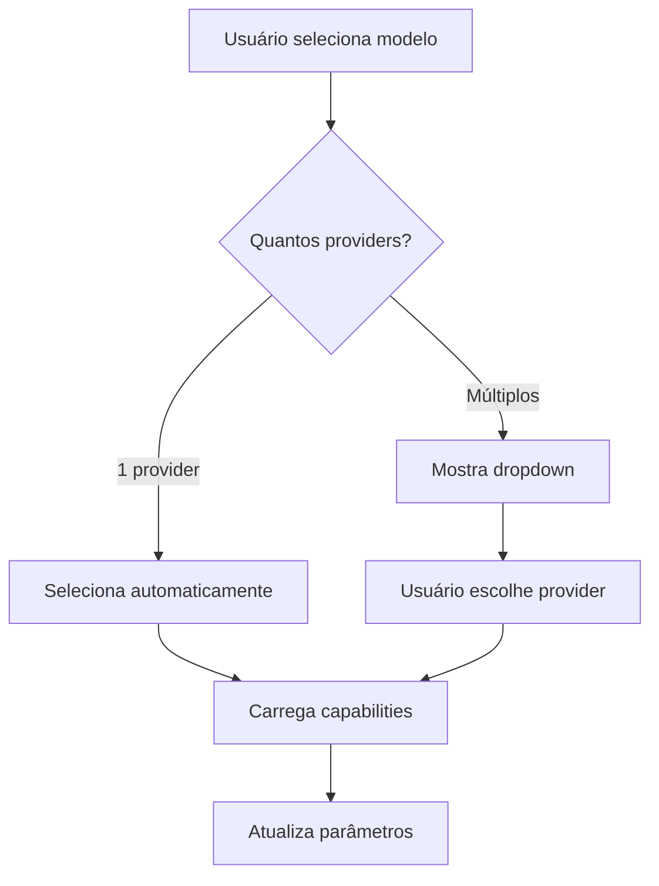

# 🏗️ Arquitetura: Refatoração do ModelTab - Organização por Vendor

## 🎯 Objetivo

Refatorar a aba "Modelo" do ControlPanel para organizar modelos por **Vendor/Empresa** (Anthropic, Amazon, Cohere) em vez de por **Provider** (AWS Bedrock, OpenAI, Azure), mostrando badges de disponibilidade de providers para cada modelo.

---

## 📋 Análise da Mudança

### Estado Atual (Provider-First)
```
Provedor: [AWS Bedrock ▼]
Modelo: [Claude 4 Sonnet ▼]
        [Claude 3.7 Sonnet ▼]
        [Titan Text ▼]
```

**Problema:** Modelos de diferentes vendors ficam misturados. Usuário precisa saber que "Claude" é Anthropic e "Titan" é Amazon.

### Estado Desejado (Vendor-First)
```
Vendor: [Anthropic 🏢]
Modelos:
  □ Claude 4 Sonnet
    📦 AWS Bedrock | 📦 Azure | ✅ Certificado
  □ Claude 3.7 Sonnet  
    📦 AWS Bedrock | ⚠️ Qualidade

Vendor: [Amazon 🏢]
Modelos:
  □ Titan Text Premier
    📦 AWS Bedrock | ✅ Certificado
```

**Benefícios:**
- Organização mais intuitiva (por criador do modelo)
- Visibilidade de onde cada modelo está disponível
- Facilita comparação entre modelos do mesmo vendor
- Reduz confusão sobre qual provider usar

---

## 🏗️ Análise da Arquitetura Atual

### Backend

#### Schema Prisma
- **AIModel:** Não tem campo `vendor` (precisa adicionar)
- **ModelCertification:** Já tem campo `vendor` (anthropic, cohere, amazon)
- **AIProvider:** Representa plataformas (AWS Bedrock, Azure, OpenAI)

#### ModelRegistry
- **Já implementado:** `getModelsByVendor(vendor)` ✅
- **Metadata:** Já inclui `vendor` em cada modelo
- **Vendors suportados:** anthropic, cohere, amazon, meta, mistral

#### ProvidersController
- **Endpoint atual:** `/api/providers` (retorna providers com modelos)
- **Endpoint necessário:** `/api/providers/by-vendor` (agrupa por vendor)

### Frontend

#### ModelTab.tsx
- **Organização atual:** Dropdown de Provider → Dropdown de Modelo
- **Estado:** `chatConfig.provider` + `chatConfig.model`
- **Service:** `aiProvidersService.getConfigured()`

#### LayoutContext
- **chatConfig:** `{ provider, model, temperature, topK, topP, maxTokens }`
- **Necessário adicionar:** `vendor` (para rastrear vendor selecionado)

---

## 📊 Estrutura de Dados Proposta

### Backend Response (`GET /api/providers/by-vendor`)

```typescript
interface ModelsByVendor {
  vendors: VendorGroup[];
}

interface VendorGroup {
  vendor: string;           // "anthropic", "amazon", "cohere"
  displayName: string;      // "Anthropic", "Amazon", "Cohere"
  logo?: string;            // URL do logo (opcional)
  models: ModelWithProviders[];
}

interface ModelWithProviders {
  id: string;
  apiModelId: string;       // "anthropic.claude-sonnet-4-20250514-v1:0"
  name: string;             // "Claude 4 Sonnet"
  contextWindow: number;
  availableOn: ProviderAvailability[];
  certification?: {
    status: string;         // "certified", "failed", "quality_warning"
    lastChecked?: string;
    successRate?: number;
    errorCategory?: string;
  };
}

interface ProviderAvailability {
  providerSlug: string;     // "aws", "azure"
  providerName: string;     // "AWS Bedrock", "Azure OpenAI"
  isConfigured: boolean;    // Se o usuário configurou esse provider
}
```

### Exemplo de Response

```json
{
  "status": "success",
  "data": {
    "vendors": [
      {
        "vendor": "anthropic",
        "displayName": "Anthropic",
        "models": [
          {
            "id": "uuid-1",
            "apiModelId": "anthropic.claude-sonnet-4-20250514-v1:0",
            "name": "Claude 4 Sonnet",
            "contextWindow": 200000,
            "availableOn": [
              {
                "providerSlug": "aws",
                "providerName": "AWS Bedrock",
                "isConfigured": true
              },
              {
                "providerSlug": "azure",
                "providerName": "Azure OpenAI",
                "isConfigured": false
              }
            ],
            "certification": {
              "status": "certified",
              "lastChecked": "2026-01-23T10:00:00Z",
              "successRate": 100
            }
          }
        ]
      },
      {
        "vendor": "amazon",
        "displayName": "Amazon",
        "models": [
          {
            "id": "uuid-2",
            "apiModelId": "amazon.titan-text-premier-v1:0",
            "name": "Titan Text Premier",
            "contextWindow": 32000,
            "availableOn": [
              {
                "providerSlug": "aws",
                "providerName": "AWS Bedrock",
                "isConfigured": true
              }
            ],
            "certification": {
              "status": "certified",
              "lastChecked": "2026-01-23T10:00:00Z",
              "successRate": 95
            }
          }
        ]
      }
    ]
  }
}
```

---

## 🎨 Wireframe do Novo Layout

```
┌─────────────────────────────────────────────────────┐
│ 🏢 Selecione o Vendor                               │
│ ┌─────────┐ ┌─────────┐ ┌─────────┐               │
│ │ [Logo]  │ │ [Logo]  │ │ [Logo]  │               │
│ │Anthropic│ │ Amazon  │ │ Cohere  │               │
│ │ (3)     │ │ (2)     │ │ (1)     │               │
│ └─────────┘ └─────────┘ └─────────┘               │
└─────────────────────────────────────────────────────┘

┌─────────────────────────────────────────────────────┐
│ 🤖 Modelos Disponíveis (3)                          │
│                                                      │
│ ┌──────────────────────────────────────────────┐   │
│ │ ☐ Claude 4 Sonnet                            │   │
│ │   📦 AWS Bedrock  📦 Azure  ✅ Certificado   │   │
│ │   Context: 200K tokens                        │   │
│ └──────────────────────────────────────────────┘   │
│                                                      │
│ ┌──────────────────────────────────────────────┐   │
│ │ ☐ Claude 3.7 Sonnet                          │   │
│ │   📦 AWS Bedrock  ⚠️ Qualidade               │   │
│ │   Context: 200K tokens                        │   │
│ └──────────────────────────────────────────────┘   │
│                                                      │
│ ┌──────────────────────────────────────────────┐   │
│ │ ☑ Claude 3.5 Sonnet (Selecionado)            │   │
│ │   📦 AWS Bedrock  ✅ Certificado             │   │
│ │   Context: 200K tokens                        │   │
│ │   ┌────────────────────────────────────────┐ │   │
│ │   │ Provider Ativo: AWS Bedrock            │ │   │
│ │   │ [Trocar Provider ▼]                    │ │   │
│ │   └────────────────────────────────────────┘ │   │
│ └──────────────────────────────────────────────┘   │
└─────────────────────────────────────────────────────┘

┌─────────────────────────────────────────────────────┐
│ ⚙️ Parâmetros de Geração                            │
│ (Mesma seção atual, mais compacta)                  │
└─────────────────────────────────────────────────────┘
```

---

## 🔄 Fluxo de Interação

### Fluxo Principal

1. **Usuário abre ModelTab**
   - Sistema carrega vendors com modelos disponíveis
   - Exibe cards de vendors (Anthropic, Amazon, Cohere)

2. **Usuário seleciona vendor** (ex: Anthropic)
   - Sistema filtra modelos do vendor
   - Exibe lista de modelos com badges de providers

3. **Usuário clica em um modelo** (ex: Claude 4 Sonnet)
   - Sistema verifica providers disponíveis:
     - **1 provider configurado:** Seleciona automaticamente
     - **Múltiplos providers:** Mostra dropdown para escolher

4. **Sistema carrega capabilities**
   - Busca capabilities do modelo no provider selecionado
   - Atualiza limites dos sliders (temperature, topK, topP, maxTokens)

5. **Usuário ajusta parâmetros**
   - Sliders respeitam limites do modelo
   - Estado é salvo no LayoutContext

### Fluxo de Seleção de Provider



---

## 🏗️ Camadas Impactadas

### 1. Backend - Schema e Migration

**Arquivos:**
- [`backend/prisma/schema.prisma`](../backend/prisma/schema.prisma)
- Nova migration: `add_vendor_to_ai_model`

**Mudanças:**
```prisma
model AIModel {
  // ... campos existentes ...
  vendor String? // "anthropic", "amazon", "cohere", "meta", "mistral"
}
```

**Tarefas:**
- Adicionar campo `vendor` (opcional para não quebrar dados existentes)
- Criar migration
- Popular campo `vendor` usando ModelRegistry como fonte de verdade

---

### 2. Backend - Endpoint `/api/providers/by-vendor`

**Arquivos:**
- [`backend/src/controllers/providersController.ts`](../backend/src/controllers/providersController.ts)
- [`backend/src/routes/providers.ts`](../backend/src/routes/providers.ts)

**Lógica:**
1. Buscar todos os providers configurados pelo usuário
2. Para cada provider, buscar modelos disponíveis
3. Agrupar modelos por `vendor` usando ModelRegistry
4. Enriquecer com dados de certificação (ModelCertification)
5. Retornar estrutura `ModelsByVendor`

**Pseudocódigo:**
```typescript
async getByVendor(req: AuthRequest, res: Response) {
  const userId = req.userId!;
  
  // 1. Buscar providers configurados
  const configuredProviders = await getConfiguredProviders(userId);
  
  // 2. Buscar modelos de cada provider
  const allModels = await getAllModelsFromProviders(configuredProviders);
  
  // 3. Agrupar por vendor usando ModelRegistry
  const vendorGroups = groupModelsByVendor(allModels);
  
  // 4. Enriquecer com certificação
  const enrichedGroups = await enrichWithCertification(vendorGroups);
  
  return res.json(jsend.success({ vendors: enrichedGroups }));
}
```

---

### 3. Frontend - Service Layer

**Arquivos:**
- [`frontend/src/services/aiProvidersService.ts`](../frontend/src/services/aiProvidersService.ts)
- [`frontend/src/types/ai.ts`](../frontend/src/types/ai.ts)

**Mudanças:**
```typescript
// Novo método
async getByVendor(): Promise<ModelsByVendor> {
  const response = await api.get('/api/providers/by-vendor');
  return response.data; // JSend já desembrulhado pelo interceptor
}

// Novos tipos
export interface ModelsByVendor {
  vendors: VendorGroup[];
}

export interface VendorGroup {
  vendor: string;
  displayName: string;
  logo?: string;
  models: ModelWithProviders[];
}

export interface ModelWithProviders {
  id: string;
  apiModelId: string;
  name: string;
  contextWindow: number;
  availableOn: ProviderAvailability[];
  certification?: CertificationInfo;
}
```

---

### 4. Frontend - Componentes UI

**Arquivos novos:**
- `frontend/src/features/chat/components/ControlPanel/VendorSelector.tsx`
- `frontend/src/features/chat/components/ControlPanel/ModelCard.tsx`
- `frontend/src/features/chat/components/ControlPanel/ProviderBadge.tsx`

**Arquivos modificados:**
- [`frontend/src/features/chat/components/ControlPanel/ModelTab.tsx`](../frontend/src/features/chat/components/ControlPanel/ModelTab.tsx)

#### VendorSelector.tsx
```typescript
// Componente de seleção de vendor (cards clicáveis)
interface VendorSelectorProps {
  vendors: VendorGroup[];
  selectedVendor: string | null;
  onSelect: (vendor: string) => void;
}
```

#### ModelCard.tsx
```typescript
// Card de modelo com badges de providers e certificação
interface ModelCardProps {
  model: ModelWithProviders;
  isSelected: boolean;
  onSelect: () => void;
}
```

#### ProviderBadge.tsx
```typescript
// Badge de provider (AWS Bedrock, Azure, etc)
interface ProviderBadgeProps {
  provider: ProviderAvailability;
  size?: 'small' | 'medium';
}
```

---

### 5. Frontend - State Management

**Arquivos:**
- [`frontend/src/contexts/LayoutContext.tsx`](../frontend/src/contexts/LayoutContext.tsx)

**Mudanças no chatConfig:**
```typescript
interface ChatConfig {
  vendor: string;        // NOVO: "anthropic", "amazon", "cohere"
  provider: string;      // MANTÉM: "aws", "azure", "openai"
  model: string;         // MANTÉM: "anthropic.claude-sonnet-4..."
  temperature: number;
  topK: number | null;
  topP: number;
  maxTokens: number;
}
```

**Migração de estado:**
```typescript
// Se chatConfig não tem vendor, inferir do model usando ModelRegistry
if (!chatConfig.vendor && chatConfig.model) {
  const metadata = ModelRegistry.getModel(chatConfig.model);
  chatConfig.vendor = metadata?.vendor || 'anthropic';
}
```

---

## ⚠️ Riscos e Considerações

### 1. Compatibilidade com Estado Antigo
**Risco:** Usuários com estado salvo no formato antigo (sem `vendor`)  
**Mitigação:** Inferir `vendor` do `model` usando ModelRegistry

### 2. Performance do Endpoint
**Risco:** Endpoint `/api/providers/by-vendor` pode ser lento (múltiplas queries)  
**Mitigação:** 
- Usar `Promise.all()` para paralelizar queries
- Cache de 5 minutos no frontend
- Índices no banco (já existem em ModelCertification)

### 3. UX - Mudança de Fluxo
**Risco:** Usuários precisam se adaptar ao novo fluxo  
**Mitigação:**
- Manter auto-seleção inteligente (primeiro vendor/modelo disponível)
- Tooltip explicativo no VendorSelector
- Preservar estado anterior se possível

### 4. Modelos Multi-Provider
**Risco:** Mesmo modelo disponível em múltiplos providers (ex: Claude no AWS e Azure)  
**Mitigação:**
- Mostrar badges de todos os providers disponíveis
- Dropdown para escolher provider se múltiplos configurados
- Salvar `provider` escolhido no estado

---

## ✅ Critérios de Sucesso

### Backend
- [ ] Campo `vendor` adicionado ao schema AIModel
- [ ] Migration executada com sucesso
- [ ] Endpoint `/api/providers/by-vendor` retorna dados corretos
- [ ] Response segue padrão JSend
- [ ] Dados enriquecidos com certificação

### Frontend - Service
- [ ] Método `getByVendor()` implementado
- [ ] Tipos TypeScript criados e exportados
- [ ] Interceptor JSend funciona corretamente

### Frontend - UI
- [ ] VendorSelector exibe vendors com logos
- [ ] ModelCard mostra badges de providers
- [ ] ProviderBadge indica se provider está configurado
- [ ] CertificationBadge exibe status correto
- [ ] Layout é mais compacto (menos scroll)

### Frontend - State
- [ ] chatConfig inclui campo `vendor`
- [ ] Migração de estado antigo funciona
- [ ] Seleção de vendor/modelo/provider funciona
- [ ] Capabilities são carregadas corretamente

### UX
- [ ] Fluxo de seleção é intuitivo
- [ ] Estados desabilitados têm feedback visual claro
- [ ] Loading states são exibidos
- [ ] Erros são tratados graciosamente

---

## 🎨 Conformidade com STANDARDS.md

### Headers Obrigatórios (Seção 1)
- [ ] Todos os arquivos novos têm header com caminho relativo
- [ ] Todos os arquivos têm referência ao STANDARDS.md

### Naming Convention (Seção 2)
- [ ] Componentes React em PascalCase (VendorSelector.tsx)
- [ ] Hooks em camelCase com prefixo `use` (useModelTab.ts)
- [ ] Interfaces sem prefixo "I" (VendorGroup, não IVendorGroup)

### Separação View/Logic (Seção 3.0)
- [ ] ModelTab.tsx tem lógica extraída para useModelTab.ts
- [ ] Componentes são apenas JSX + estilos

### Cores no theme.ts (Seção 3.2)
- [ ] Nenhuma cor hardcoded (#HEX, rgba())
- [ ] Apenas tokens do theme (theme.palette.X)

### JSend (Seção 12)
- [ ] Endpoint retorna JSend completo
- [ ] Frontend acessa dados desembrulhados (response.data.vendors)

### Commits (Seção 14)
- [ ] Commits seguem Conventional Commits
- [ ] ESLint passa sem erros (0 errors)
- [ ] TypeScript compila sem erros

---

## 📝 Notas de Implementação

### Ordem de Implementação Recomendada

1. **Backend - Schema e Migration**
   - Adicionar campo `vendor` ao AIModel
   - Criar e executar migration
   - Popular dados existentes

2. **Backend - Endpoint**
   - Implementar `/api/providers/by-vendor`
   - Testes manuais com Postman/curl

3. **Frontend - Service Layer**
   - Adicionar método `getByVendor()`
   - Criar tipos TypeScript

4. **Frontend - Componentes UI**
   - Criar VendorSelector (isolado)
   - Criar ModelCard (isolado)
   - Criar ProviderBadge (isolado)
   - Testes visuais com Storybook (opcional)

5. **Frontend - Integração ModelTab**
   - Refatorar ModelTab para usar novos componentes
   - Extrair lógica para useModelTab.ts
   - Atualizar LayoutContext

6. **Testes e Ajustes**
   - Testar fluxo completo
   - Ajustar estilos e responsividade
   - Validar migração de estado

---

## 🔗 Referências

- [STANDARDS.md](../docs/STANDARDS.md)
- [ModelRegistry](../backend/src/services/ai/registry/model-registry.ts)
- [ModelCertification Schema](../backend/prisma/schema.prisma#L210-L250)
- [JSend Specification](https://github.com/omniti-labs/jsend)

---

## 📌 Próximos Passos

Após aprovação deste plano:
1. Criar todo list detalhada com subtasks
2. Iniciar implementação pela camada de backend
3. Validar cada camada antes de prosseguir
4. Documentar decisões arquiteturais (ADRs se necessário)
