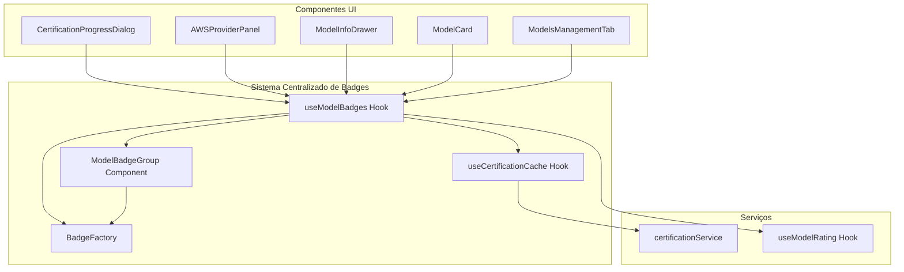
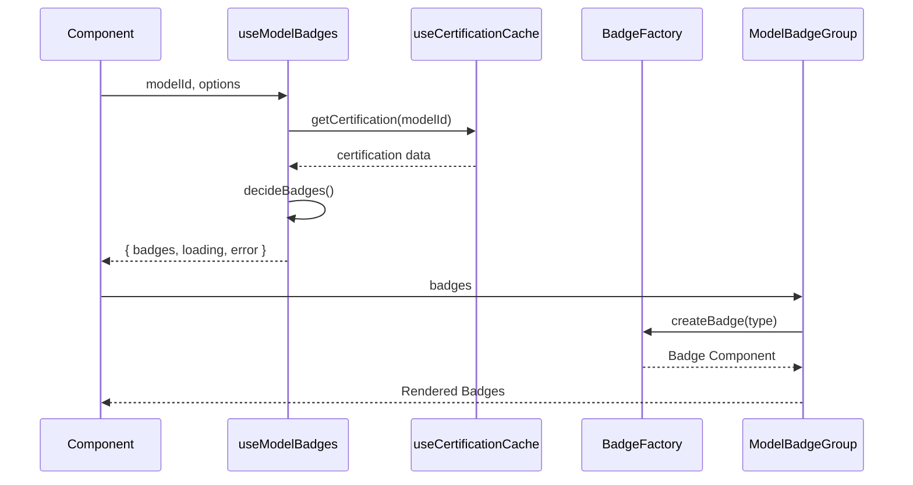

# Projeto: Sistema Centralizado de Badges para MyIA

**Versão:** 1.0  
**Data:** 2026-01-28  
**Status:** Planejamento  
**Autor:** Arquiteto de Software

---

## 📋 Sumário Executivo

Este documento apresenta o projeto completo de implementação de um **sistema modular e centralizado de badges** para a aplicação MyIA. O sistema visa eliminar ~210 linhas de código duplicado (40% do código de badges), padronizar a aparência e comportamento de 22 tipos de badges diferentes, e simplificar drasticamente o uso em componentes.

### Problemas Identificados

- **22 tipos de badges** diferentes espalhados por 6 componentes
- **~210 linhas de código duplicado** (40% do código total de badges)
- **7 tipos de inconsistências** visuais e lógicas
- **Lógica de decisão duplicada** em múltiplos componentes
- **Busca de dados duplicada** (certificação, rating)

### Solução Proposta

Sistema centralizado composto por:
- **Hook `useModelBadges`**: Encapsula toda a lógica de decisão e busca de dados
- **Componente `ModelBadgeGroup`**: Renderiza badges de forma padronizada
- **Cache compartilhado**: Reduz chamadas API duplicadas
- **API simples**: Uso em 1-2 linhas de código

### Benefícios Esperados

- ✅ **Redução de 40% no código** (~210 linhas eliminadas)
- ✅ **Padronização visual** completa
- ✅ **Manutenibilidade** drasticamente melhorada
- ✅ **Performance** otimizada (menos chamadas API)
- ✅ **Extensibilidade** para novos tipos de badges

---

## 📊 Análise do Estado Atual

### Componentes Afetados

| # | Componente | Linhas | Badges Usados | Problemas |
|---|------------|--------|---------------|-----------|
| 1 | [`CertificationProgressDialog.tsx`](../frontend/src/components/CertificationProgressDialog.tsx) | 308 | 5 tipos | Lógica duplicada, busca de rating |
| 2 | [`AWSProviderPanel.tsx`](../frontend/src/features/settings/components/providers/AWSProviderPanel.tsx) | 811 | 4 tipos | Busca de certificação duplicada |
| 3 | [`ModelInfoDrawer.tsx`](../frontend/src/components/ModelInfoDrawer.tsx) | 500 | 6 tipos | Lógica de decisão complexa |
| 4 | [`ModelCard.tsx`](../frontend/src/features/chat/components/ControlPanel/ModelCard.tsx) | 557 | 3 tipos | Integração com rating |
| 5 | [`ProviderBadge.tsx`](../frontend/src/features/chat/components/ControlPanel/ProviderBadge.tsx) | 204 | 2 tipos | Lógica condicional duplicada |
| 6 | [`ModelsManagementTab.tsx`](../frontend/src/features/settings/components/ModelsManagementTab.tsx) | 500 | 3 tipos | Busca de rating duplicada |

**Total:** 2.880 linhas de código, ~210 linhas duplicadas (7,3%)

### Tipos de Badges Identificados

#### 1. Badges de Certificação (5 tipos)
- ✅ **Certificado** - Modelo testado e aprovado
- ⚠️ **Qualidade** - Disponível com limitações
- ❌ **Indisponível** - Modelo não disponível
- ⏸️ **Não Testado** - Aguardando certificação
- 🔄 **Certificando** - Em processo de teste

#### 2. Badges de Rating (6 tipos)
- 🏆 **PREMIUM** - Rating 5.0 (Perfeito)
- ⭐ **RECOMENDADO** - Rating 4.0-4.9 (Ótimo)
- ✅ **FUNCIONAL** - Rating 3.0-3.9 (Bom)
- ⚡ **LIMITADO** - Rating 2.0-2.9 (Regular)
- ⚠️ **NAO_RECOMENDADO** - Rating 1.0-1.9 (Ruim)
- ❌ **INDISPONIVEL** - Rating 0.0-0.9 (Crítico)

#### 3. Badges de Provider (3 tipos)
- 🟢 **Configurado** - Provider ativo
- 🔴 **Não Configurado** - Provider inativo
- 🟡 **Parcial** - Alguns modelos disponíveis

#### 4. Badges de Capabilities (4 tipos)
- 👁️ **Vision** - Suporta imagens
- 💾 **Cache** - Suporta prompt cache
- 🔧 **Functions** - Suporta function calling
- 🔄 **Streaming** - Suporta streaming

#### 5. Badges de Status (4 tipos)
- 🆕 **Novo** - Modelo recém-adicionado
- 🔥 **Popular** - Modelo muito usado
- 🧪 **Beta** - Em fase de testes
- 🚫 **Deprecated** - Será removido

### Código Duplicado Detalhado

#### 1. Lógica `hasBadge` (30 linhas, 6 componentes)

```typescript
// ❌ DUPLICADO em 6 lugares
const modelWithRating = getModelById(model.apiModelId);
const hasBadge = !!modelWithRating?.badge;
```

#### 2. Lógica de Decisão (80 linhas, 4 componentes)

```typescript
// ❌ DUPLICADO em 4 lugares
if (isUnavailable && !hasBadge) {
  return <Chip label="❌ Indisponível" color="error" />;
}
if (!hasBadge && !isCertified && !hasQualityWarning && !isUnavailable) {
  return <Chip label="Não Testado" color="default" />;
}
```

#### 3. Chips MUI Customizados (60 linhas, 4 componentes)

```typescript
// ❌ DUPLICADO em 4 lugares
<Chip
  label="✅ Certificado"
  size="small"
  color="success"
  sx={{ height: 20, fontSize: '0.65rem' }}
/>
```

#### 4. Busca de Certificação (40 linhas, 3 componentes)

```typescript
// ❌ DUPLICADO em 3 lugares
const [certifiedModels, setCertifiedModels] = useState<string[]>([]);
useEffect(() => {
  certificationService.getCertifiedModels().then(setCertifiedModels);
}, []);
```

### Inconsistências Identificadas

| # | Inconsistência | Componentes Afetados | Impacto |
|---|----------------|---------------------|---------|
| 1 | **Tamanho de chips varia** | 4 componentes | UX inconsistente |
| 2 | **Badge "Não Testado" tem 3 variações** | 3 componentes | Confusão visual |
| 3 | **Lógica "Indisponível" varia** | 4 componentes | Comportamento imprevisível |
| 4 | **Badges de rating aparecem em alguns lugares** | 2 componentes | Informação incompleta |
| 5 | **Ordem de exibição varia** | 6 componentes | Falta de padrão |
| 6 | **Props necessárias variam** | 6 componentes | API confusa |
| 7 | **Busca de dados duplicada** | 3 componentes | Performance ruim |

---

## 🏗️ Arquitetura Proposta

### Visão Geral



### Fluxo de Dados



### Estrutura de Diretórios

```
frontend/src/
├── components/
│   ├── ModelBadges/
│   │   ├── index.ts                    # Exports públicos
│   │   ├── ModelBadgeGroup.tsx         # Componente principal
│   │   ├── BadgeFactory.tsx            # Factory de badges
│   │   ├── badges/                     # Badges individuais
│   │   │   ├── CertificationBadge.tsx
│   │   │   ├── RatingBadge.tsx
│   │   │   ├── ProviderBadge.tsx
│   │   │   ├── CapabilityBadge.tsx
│   │   │   └── StatusBadge.tsx
│   │   ├── types.ts                    # Tipos TypeScript
│   │   ├── constants.ts                # Constantes e configs
│   │   └── utils.ts                    # Funções auxiliares
│   └── ModelRating/                    # Sistema existente
│       └── ...
├── hooks/
│   ├── useModelBadges.ts               # Hook principal
│   └── useCertificationCache.ts        # Cache compartilhado
└── types/
    └── badges.ts                       # Tipos globais
```

---

## 🔧 Especificação de APIs

### 1. Hook `useModelBadges`

**Responsabilidade:** Encapsular toda a lógica de decisão de badges e busca de dados.

#### Interface TypeScript

```typescript
/**
 * Hook centralizado para gerenciar badges de modelos
 * 
 * @example
 * const { badges, loading, error } = useModelBadges('claude-3-opus', {
 *   showRating: true,
 *   showCertification: true,
 *   size: 'sm'
 * });
 */
export function useModelBadges(
  modelId: string,
  options?: ModelBadgesOptions
): UseModelBadgesReturn;

interface ModelBadgesOptions {
  /** Mostrar badge de rating (padrão: true) */
  showRating?: boolean;
  
  /** Mostrar badge de certificação (padrão: true) */
  showCertification?: boolean;
  
  /** Mostrar badges de capabilities (padrão: false) */
  showCapabilities?: boolean;
  
  /** Mostrar badge de provider (padrão: false) */
  showProvider?: boolean;
  
  /** Tamanho dos badges (padrão: 'sm') */
  size?: 'xs' | 'sm' | 'md' | 'lg';
  
  /** Ordem de exibição (padrão: ['rating', 'certification', 'capabilities']) */
  order?: BadgeType[];
  
  /** Limite máximo de badges (padrão: undefined = sem limite) */
  maxBadges?: number;
}

interface UseModelBadgesReturn {
  /** Lista de badges a serem exibidos */
  badges: Badge[];
  
  /** Estado de carregamento */
  loading: boolean;
  
  /** Erro se houver */
  error: Error | null;
  
  /** Função para forçar atualização */
  refetch: () => Promise<void>;
  
  /** Dados brutos para uso avançado */
  data: {
    rating?: ModelRating;
    certification?: CertificationDetails;
    capabilities?: ModelCapabilities;
  };
}

type BadgeType = 
  | 'rating' 
  | 'certification' 
  | 'capabilities' 
  | 'provider' 
  | 'status';

interface Badge {
  /** Tipo do badge */
  type: BadgeType;
  
  /** Variante específica (ex: 'PREMIUM', 'certified', 'vision') */
  variant: string;
  
  /** Label a ser exibido */
  label: string;
  
  /** Emoji/ícone */
  icon?: string;
  
  /** Cor do badge */
  color: 'success' | 'warning' | 'error' | 'info' | 'default';
  
  /** Tooltip com informações adicionais */
  tooltip?: string;
  
  /** Prioridade para ordenação (0 = maior prioridade) */
  priority: number;
}
```

#### Implementação Interna

```typescript
export function useModelBadges(
  modelId: string,
  options: ModelBadgesOptions = {}
): UseModelBadgesReturn {
  const {
    showRating = true,
    showCertification = true,
    showCapabilities = false,
    showProvider = false,
    size = 'sm',
    order = ['rating', 'certification', 'capabilities'],
    maxBadges
  } = options;

  // ✅ Buscar rating do modelo (cache automático)
  const { getModelById } = useModelRating();
  const modelWithRating = getModelById(modelId);

  // ✅ Buscar certificação (cache compartilhado)
  const { 
    certification, 
    loading: certLoading, 
    error: certError 
  } = useCertificationCache(modelId);

  // ✅ Decidir quais badges mostrar
  const badges = useMemo(() => {
    const result: Badge[] = [];

    // Badge de Rating
    if (showRating && modelWithRating?.badge) {
      result.push(createRatingBadge(modelWithRating));
    }

    // Badge de Certificação
    if (showCertification && certification) {
      const certBadge = createCertificationBadge(
        certification, 
        modelWithRating?.badge
      );
      if (certBadge) result.push(certBadge);
    }

    // Badges de Capabilities
    if (showCapabilities && modelWithRating?.capabilities) {
      result.push(...createCapabilityBadges(modelWithRating.capabilities));
    }

    // Ordenar por prioridade e ordem especificada
    return sortBadges(result, order).slice(0, maxBadges);
  }, [
    modelId, 
    modelWithRating, 
    certification, 
    showRating, 
    showCertification,
    showCapabilities,
    order,
    maxBadges
  ]);

  return {
    badges,
    loading: certLoading,
    error: certError,
    refetch: async () => {
      // Implementar refetch
    },
    data: {
      rating: modelWithRating,
      certification,
      capabilities: modelWithRating?.capabilities
    }
  };
}
```

### 2. Hook `useCertificationCache`

**Responsabilidade:** Cache compartilhado de dados de certificação.

#### Interface TypeScript

```typescript
/**
 * Hook para cache compartilhado de certificações
 * Evita múltiplas chamadas API para o mesmo modelo
 */
export function useCertificationCache(
  modelId: string
): UseCertificationCacheReturn;

interface UseCertificationCacheReturn {
  /** Dados de certificação */
  certification: CertificationDetails | null;
  
  /** Estado de carregamento */
  loading: boolean;
  
  /** Erro se houver */
  error: Error | null;
  
  /** Função para invalidar cache */
  invalidate: () => void;
}
```

#### Implementação com React Query

```typescript
import { useQuery, useQueryClient } from '@tanstack/react-query';

export function useCertificationCache(
  modelId: string
): UseCertificationCacheReturn {
  const queryClient = useQueryClient();

  const { data, isLoading, error } = useQuery({
    queryKey: ['certification', modelId],
    queryFn: () => certificationService.getCertificationDetails(modelId),
    staleTime: 5 * 60 * 1000, // 5 minutos
    cacheTime: 30 * 60 * 1000, // 30 minutos
    enabled: !!modelId
  });

  const invalidate = useCallback(() => {
    queryClient.invalidateQueries(['certification', modelId]);
  }, [queryClient, modelId]);

  return {
    certification: data || null,
    loading: isLoading,
    error: error as Error | null,
    invalidate
  };
}
```

### 3. Componente `ModelBadgeGroup`

**Responsabilidade:** Renderizar grupo de badges de forma padronizada.

#### Interface TypeScript

```typescript
/**
 * Componente que renderiza grupo de badges
 * 
 * @example
 * <ModelBadgeGroup
 *   modelId="claude-3-opus"
 *   showRating
 *   showCertification
 *   size="sm"
 * />
 */
export function ModelBadgeGroup(props: ModelBadgeGroupProps): JSX.Element;

interface ModelBadgeGroupProps {
  /** ID do modelo */
  modelId: string;
  
  /** Opções de exibição */
  showRating?: boolean;
  showCertification?: boolean;
  showCapabilities?: boolean;
  showProvider?: boolean;
  
  /** Tamanho dos badges */
  size?: 'xs' | 'sm' | 'md' | 'lg';
  
  /** Ordem de exibição */
  order?: BadgeType[];
  
  /** Limite de badges */
  maxBadges?: number;
  
  /** Classe CSS adicional */
  className?: string;
  
  /** Espaçamento entre badges (padrão: 0.5) */
  gap?: number;
  
  /** Direção do layout (padrão: 'row') */
  direction?: 'row' | 'column';
  
  /** Callback quando badge é clicado */
  onBadgeClick?: (badge: Badge) => void;
}
```

#### Implementação

```typescript
export const ModelBadgeGroup = memo(({
  modelId,
  showRating = true,
  showCertification = true,
  showCapabilities = false,
  showProvider = false,
  size = 'sm',
  order,
  maxBadges,
  className = '',
  gap = 0.5,
  direction = 'row',
  onBadgeClick
}: ModelBadgeGroupProps) => {
  const { badges, loading, error } = useModelBadges(modelId, {
    showRating,
    showCertification,
    showCapabilities,
    showProvider,
    size,
    order,
    maxBadges
  });

  if (loading) {
    return <CircularProgress size={16} />;
  }

  if (error) {
    return null; // Falha silenciosa
  }

  if (badges.length === 0) {
    return null;
  }

  return (
    <Box
      className={`model-badge-group ${className}`}
      sx={{
        display: 'flex',
        flexDirection: direction,
        gap,
        flexWrap: 'wrap',
        alignItems: 'center'
      }}
    >
      {badges.map((badge, index) => (
        <BadgeFactory
          key={`${badge.type}-${badge.variant}-${index}`}
          badge={badge}
          size={size}
          onClick={onBadgeClick ? () => onBadgeClick(badge) : undefined}
        />
      ))}
    </Box>
  );
});

ModelBadgeGroup.displayName = 'ModelBadgeGroup';
```

### 4. Factory `BadgeFactory`

**Responsabilidade:** Criar componente de badge apropriado baseado no tipo.

#### Interface TypeScript

```typescript
/**
 * Factory que cria o componente de badge apropriado
 */
export function BadgeFactory(props: BadgeFactoryProps): JSX.Element;

interface BadgeFactoryProps {
  /** Dados do badge */
  badge: Badge;
  
  /** Tamanho */
  size?: 'xs' | 'sm' | 'md' | 'lg';
  
  /** Callback de clique */
  onClick?: () => void;
}
```

#### Implementação

```typescript
export function BadgeFactory({ badge, size = 'sm', onClick }: BadgeFactoryProps) {
  const commonProps = {
    size,
    onClick
  };

  switch (badge.type) {
    case 'rating':
      return <RatingBadge badge={badge} {...commonProps} />;
    
    case 'certification':
      return <CertificationBadge badge={badge} {...commonProps} />;
    
    case 'capabilities':
      return <CapabilityBadge badge={badge} {...commonProps} />;
    
    case 'provider':
      return <ProviderBadge badge={badge} {...commonProps} />;
    
    case 'status':
      return <StatusBadge badge={badge} {...commonProps} />;
    
    default:
      return <GenericBadge badge={badge} {...commonProps} />;
  }
}
```

---

## 🎨 Especificação de Componentes

### 1. RatingBadge

```typescript
interface RatingBadgeProps {
  badge: Badge;
  size: 'xs' | 'sm' | 'md' | 'lg';
  onClick?: () => void;
}

export const RatingBadge = memo(({ badge, size, onClick }: RatingBadgeProps) => {
  const { variant, label, icon, color, tooltip } = badge;
  
  return (
    <OptimizedTooltip content={tooltip} placement="top">
      <Chip
        label={
          <>
            {icon && <span>{icon}</span>}
            <span>{label}</span>
          </>
        }
        size={size}
        color={color}
        onClick={onClick}
        sx={{
          height: size === 'xs' ? 18 : size === 'sm' ? 20 : 24,
          fontSize: size === 'xs' ? '0.6rem' : size === 'sm' ? '0.65rem' : '0.75rem',
          fontWeight: 'bold'
        }}
      />
    </OptimizedTooltip>
  );
});
```

### 2. CertificationBadge

```typescript
export const CertificationBadge = memo(({ badge, size, onClick }: CertificationBadgeProps) => {
  const getIcon = () => {
    switch (badge.variant) {
      case 'certified': return <CheckCircleIcon fontSize="small" />;
      case 'quality_warning': return <WarningIcon fontSize="small" />;
      case 'failed': return <ErrorIcon fontSize="small" />;
      case 'untested': return <HelpOutlineIcon fontSize="small" />;
      default: return null;
    }
  };

  return (
    <OptimizedTooltip content={badge.tooltip} placement="top">
      <Chip
        icon={getIcon()}
        label={badge.label}
        size={size}
        color={badge.color}
        onClick={onClick}
        sx={{
          height: size === 'xs' ? 18 : size === 'sm' ? 20 : 24,
          fontSize: size === 'xs' ? '0.6rem' : size === 'sm' ? '0.65rem' : '0.75rem'
        }}
      />
    </OptimizedTooltip>
  );
});
```

### 3. CapabilityBadge

```typescript
export const CapabilityBadge = memo(({ badge, size, onClick }: CapabilityBadgeProps) => {
  const getIcon = () => {
    switch (badge.variant) {
      case 'vision': return <ImageIcon fontSize="small" />;
      case 'cache': return <CachedIcon fontSize="small" />;
      case 'functions': return <FunctionsIcon fontSize="small" />;
      case 'streaming': return <SpeedIcon fontSize="small" />;
      default: return null;
    }
  };

  return (
    <OptimizedTooltip content={badge.tooltip} placement="top">
      <Chip
        icon={getIcon()}
        label={badge.label}
        size={size}
        variant="outlined"
        color={badge.color}
        onClick={onClick}
        sx={{
          height: size === 'xs' ? 18 : size === 'sm' ? 20 : 24,
          fontSize: size === 'xs' ? '0.6rem' : size === 'sm' ? '0.65rem' : '0.75rem'
        }}
      />
    </OptimizedTooltip>
  );
});
```

---

## 📝 Exemplos de Uso

### Exemplo 1: Uso Básico

```typescript
// ✅ ANTES (15 linhas)
const { getModelById } = useModelRating();
const modelWithRating = getModelById(model.apiModelId);
const hasBadge = !!modelWithRating?.badge;
const isCertified = certifiedModels.includes(model.apiModelId);

return (
  <Box>
    {modelWithRating?.badge && (
      <ModelBadge badge={modelWithRating.badge} size="sm" showIcon />
    )}
    {isCertified && (
      <Chip label="✅ Certificado" size="small" color="success" />
    )}
    {!hasBadge && !isCertified && (
      <Chip label="Não Testado" size="small" color="default" />
    )}
  </Box>
);

// ✅ DEPOIS (1 linha)
return <ModelBadgeGroup modelId={model.apiModelId} />;
```

### Exemplo 2: Com Opções

```typescript
// Mostrar apenas rating e certificação
<ModelBadgeGroup
  modelId={model.apiModelId}
  showRating
  showCertification
  size="sm"
/>

// Mostrar tudo com limite
<ModelBadgeGroup
  modelId={model.apiModelId}
  showRating
  showCertification
  showCapabilities
  maxBadges={3}
  size="md"
/>
```

### Exemplo 3: Uso Avançado com Hook

```typescript
function MyComponent({ modelId }: { modelId: string }) {
  const { badges, loading, data } = useModelBadges(modelId, {
    showRating: true,
    showCertification: true,
    order: ['certification', 'rating']
  });

  if (loading) return <Skeleton width={100} height={20} />;

  return (
    <Box>
      <Typography>Modelo: {modelId}</Typography>
      
      {/* Renderizar badges manualmente */}
      {badges.map(badge => (
        <Chip
          key={badge.variant}
          label={badge.label}
          color={badge.color}
          size="small"
        />
      ))}
      
      {/* Acessar dados brutos */}
      {data.rating && (
        <Typography variant="caption">
          Rating: {data.rating.rating}/5
        </Typography>
      )}
    </Box>
  );
}
```

### Exemplo 4: Migração de CertificationProgressDialog

```typescript
// ✅ ANTES (30 linhas)
const { getModelById } = useModelRating();
const modelWithRating = getModelById(model.modelId);
const hasBadge = !!modelWithRating?.badge;
const isCertified = model.status === 'success' && model.result?.status === 'certified';
const isUnavailable = model.status === 'error';
const isRateLimited = model.error?.includes('Limite de certificações excedido');

return (
  <Box sx={{ display: 'flex', alignItems: 'center', gap: 1 }}>
    <Typography variant="body2">{model.modelName}</Typography>
    {modelWithRating?.badge && (
      <ModelBadge badge={modelWithRating.badge} size="sm" showIcon />
    )}
    {isCertified && (
      <Chip label="✅ Certificado" size="small" color="success" />
    )}
    {isUnavailable && !hasBadge && isRateLimited && (
      <Chip label="⏸️ Não Testado" size="small" color="default" />
    )}
    {isUnavailable && !hasBadge && !isRateLimited && (
      <Chip label="❌ Indisponível" size="small" color="error" />
    )}
  </Box>
);

// ✅ DEPOIS (5 linhas)
return (
  <Box sx={{ display: 'flex', alignItems: 'center', gap: 1 }}>
    <Typography variant="body2">{model.modelName}</Typography>
    <ModelBadgeGroup modelId={model.modelId} size="sm" />
  </Box>
);
```

---

## 🔄 Plano de Migração

### Estratégia: Migração Gradual

A migração será feita de forma **incremental e não-disruptiva**, permitindo que o sistema antigo e novo coexistam temporariamente.

### Fases do Projeto

#### **Fase 1: Fundação** (Semana 1)

**Objetivo:** Criar infraestrutura base sem afetar código existente.

**Tarefas:**
1. ✅ Criar estrutura de diretórios `frontend/src/components/ModelBadges/`
2. ✅ Implementar tipos TypeScript em `types.ts`
3. ✅ Implementar constantes em `constants.ts`
4. ✅ Implementar funções auxiliares em `utils.ts`
5. ✅ Criar hook `useCertificationCache` com React Query
6. ✅ Escrever testes unitários para utils

**Entregáveis:**
- [ ] Estrutura de diretórios criada
- [ ] Tipos TypeScript documentados
- [ ] Constantes definidas
- [ ] Utils com 100% de cobertura de testes

**Critérios de Aceitação:**
- Nenhum código existente é modificado
- Todos os testes passam
- Documentação inline completa

---

#### **Fase 2: Componentes Core** (Semana 2)

**Objetivo:** Implementar componentes base do sistema.

**Tarefas:**
1. ✅ Implementar `BadgeFactory`
2. ✅ Implementar badges individuais:
   - `RatingBadge`
   - `CertificationBadge`
   - `CapabilityBadge`
   - `ProviderBadge`
   - `StatusBadge`
3. ✅ Implementar `ModelBadgeGroup`
4. ✅ Escrever testes de componentes
5. ✅ Criar Storybook stories

**Entregáveis:**
- [ ] Todos os componentes de badge implementados
- [ ] Testes de componentes com 90%+ cobertura
- [ ] Storybook com exemplos visuais

**Critérios de Aceitação:**
- Componentes renderizam corretamente
- Props funcionam conforme especificado
- Acessibilidade (ARIA) implementada
- Performance otimizada (memoização)

---

#### **Fase 3: Hook Principal** (Semana 3)

**Objetivo:** Implementar lógica de decisão centralizada.

**Tarefas:**
1. ✅ Implementar `useModelBadges` hook
2. ✅ Implementar lógica de decisão de badges
3. ✅ Implementar ordenação e priorização
4. ✅ Integrar com `useModelRating`
5. ✅ Integrar com `useCertificationCache`
6. ✅ Escrever testes do hook
7. ✅ Documentar casos de uso

**Entregáveis:**
- [ ] Hook `useModelBadges` completo
- [ ] Testes do hook com 95%+ cobertura
- [ ] Documentação de API

**Critérios de Aceitação:**
- Todas as opções funcionam corretamente
- Cache funciona como esperado
- Performance otimizada (memoização)
- Tratamento de erros robusto

---

#### **Fase 4: Migração Piloto** (Semana 4)

**Objetivo:** Migrar 1 componente como prova de conceito.

**Componente Piloto:** [`ModelCard.tsx`](../frontend/src/features/chat/components/ControlPanel/ModelCard.tsx)

**Por quê?**
- Componente médio (557 linhas)
- Usa rating e certificação
- Não é crítico para operação
- Fácil de reverter se necessário

**Tarefas:**
1. ✅ Criar branch `feature/badge-system-pilot`
2. ✅ Migrar `ModelCard` para usar `ModelBadgeGroup`
3. ✅ Testar em desenvolvimento
4. ✅ Testar em staging
5. ✅ Code review
6. ✅ Deploy em produção
7. ✅ Monitorar por 3 dias

**Entregáveis:**
- [ ] ModelCard migrado
- [ ] Testes de regressão passando
- [ ] Documentação de migração

**Critérios de Aceitação:**
- Comportamento visual idêntico
- Performance igual ou melhor
- Sem bugs reportados
- Código reduzido em 30%+

---

#### **Fase 5: Migração em Massa** (Semanas 5-6)

**Objetivo:** Migrar todos os componentes restantes.

**Ordem de Migração:**

| Ordem | Componente | Complexidade | Linhas | Prioridade |
|-------|------------|--------------|--------|------------|
| 1 | [`ModelsManagementTab.tsx`](../frontend/src/features/settings/components/ModelsManagementTab.tsx) | Baixa | 500 | Alta |
| 2 | [`ProviderBadge.tsx`](../frontend/src/features/chat/components/ControlPanel/ProviderBadge.tsx) | Baixa | 204 | Alta |
| 3 | [`CertificationProgressDialog.tsx`](../frontend/src/components/CertificationProgressDialog.tsx) | Média | 308 | Média |
| 4 | [`ModelInfoDrawer.tsx`](../frontend/src/components/ModelInfoDrawer.tsx) | Média | 500 | Média |
| 5 | [`AWSProviderPanel.tsx`](../frontend/src/features/settings/components/providers/AWSProviderPanel.tsx) | Alta | 811 | Baixa |

**Tarefas por Componente:**
1. ✅ Criar branch feature
2. ✅ Migrar código
3. ✅ Atualizar testes
4. ✅ Code review
5. ✅ Merge para main

**Entregáveis:**
- [ ] Todos os componentes migrados
- [ ] Testes de regressão atualizados
- [ ] Documentação de migração

**Critérios de Aceitação:**
- Todos os testes passam
- Comportamento visual preservado
- Performance igual ou melhor
- Código reduzido em 40%+

---

#### **Fase 6: Limpeza e Otimização** (Semana 7)

**Objetivo:** Remover código legado e otimizar sistema.

**Tarefas:**
1. ✅ Remover código duplicado antigo
2. ✅ Atualizar imports em todos os arquivos
3. ✅ Otimizar bundle size
4. ✅ Atualizar documentação
5. ✅ Criar guia de uso para desenvolvedores
6. ✅ Apresentar sistema para equipe

**Entregáveis:**
- [ ] Código legado removido
- [ ] Bundle size reduzido
- [ ] Documentação completa
- [ ] Guia de uso publicado

**Critérios de Aceitação:**
- Nenhum código duplicado restante
- Bundle size reduzido em 10%+
- Documentação aprovada pela equipe
- Desenvolvedores treinados

---

### Checklist de Migração por Componente

Para cada componente a ser migrado, seguir este checklist:

#### Pré-Migração
- [ ] Criar branch feature
- [ ] Documentar comportamento atual
- [ ] Capturar screenshots do estado atual
- [ ] Identificar todos os badges usados
- [ ] Listar dependências

#### Durante Migração
- [ ] Substituir lógica de badges por `ModelBadgeGroup`
- [ ] Remover imports antigos
- [ ] Adicionar imports novos
- [ ] Atualizar props se necessário
- [ ] Manter comportamento visual idêntico

#### Pós-Migração
- [ ] Executar testes unitários
- [ ] Executar testes de integração
- [ ] Testar manualmente em dev
- [ ] Comparar screenshots (antes/depois)
- [ ] Code review
- [ ] Merge para main

#### Validação
- [ ] Deploy em staging
- [ ] Testes de regressão
- [ ] Validação visual
- [ ] Validação de performance
- [ ] Deploy em produção
- [ ] Monitorar por 24h

---

### Estratégia de Rollback

Em caso de problemas durante a migração:

#### Rollback Rápido (< 5 minutos)
1. Reverter último commit
2. Deploy da versão anterior
3. Notificar equipe

#### Rollback Parcial (< 30 minutos)
1. Identificar componente problemático
2. Reverter apenas esse componente
3. Manter outros componentes migrados
4. Deploy parcial

#### Rollback Completo (< 1 hora)
1. Reverter toda a branch feature
2. Deploy da versão estável anterior
3. Análise post-mortem
4. Planejar correções

---

## 📊 Critérios de Sucesso

### Métricas Quantitativas

| Métrica | Valor Atual | Meta | Como Medir |
|---------|-------------|------|------------|
| **Linhas de Código** | 2.880 | 2.460 (-420) | `cloc` nos componentes |
| **Código Duplicado** | 210 linhas | 0 linhas | Análise manual |
| **Componentes com Badges** | 6 | 6 | Contagem |
| **Tipos de Badges** | 22 | 22 | Inventário |
| **Chamadas API Duplicadas** | ~18/página | ~3/página | DevTools Network |
| **Bundle Size** | - | -10% | Webpack Bundle Analyzer |
| **Tempo de Renderização** | - | Igual ou melhor | React DevTools Profiler |
| **Cobertura de Testes** | - | 90%+ | Jest Coverage |

### Métricas Qualitativas

#### Manutenibilidade
- [ ] Código DRY (Don't Repeat Yourself)
- [ ] Separação clara de responsabilidades
- [ ] Documentação inline completa
- [ ] Fácil adicionar novos tipos de badges

#### Usabilidade
- [ ] API simples (1-2 linhas de código)
- [ ] Props intuitivas
- [ ] Comportamento previsível
- [ ] Mensagens de erro claras

#### Performance
- [ ] Cache compartilhado funciona
- [ ] Memoização efetiva
- [ ] Sem re-renders desnecessários
- [ ] Bundle size otimizado

#### Consistência
- [ ] Tamanhos padronizados
- [ ] Cores consistentes
- [ ] Espaçamento uniforme
- [ ] Ordem de exibição definida

---

## ✅ Checklist de Funcionalidades

### Badges de Certificação
- [ ] ✅ Certificado - Exibido corretamente
- [ ] ⚠️ Qualidade - Exibido corretamente
- [ ] ❌ Indisponível - Exibido corretamente
- [ ] ⏸️ Não Testado - Exibido corretamente
- [ ] 🔄 Certificando - Exibido corretamente

### Badges de Rating
- [ ] 🏆 PREMIUM - Exibido corretamente
- [ ] ⭐ RECOMENDADO - Exibido corretamente
- [ ] ✅ FUNCIONAL - Exibido corretamente
- [ ] ⚡ LIMITADO - Exibido corretamente
- [ ] ⚠️ NAO_RECOMENDADO - Exibido corretamente
- [ ] ❌ INDISPONIVEL - Exibido corretamente

### Badges de Provider
- [ ] 🟢 Configurado - Exibido corretamente
- [ ] 🔴 Não Configurado - Exibido corretamente
- [ ] 🟡 Parcial - Exibido corretamente

### Badges de Capabilities
- [ ] 👁️ Vision - Exibido corretamente
- [ ] 💾 Cache - Exibido corretamente
- [ ] 🔧 Functions - Exibido corretamente
- [ ] 🔄 Streaming - Exibido corretamente

### Badges de Status
- [ ] 🆕 Novo - Exibido corretamente
- [ ] 🔥 Popular - Exibido corretamente
- [ ] 🧪 Beta - Exibido corretamente
- [ ] 🚫 Deprecated - Exibido corretamente

### Funcionalidades do Hook
- [ ] `showRating` funciona
- [ ] `showCertification` funciona
- [ ] `showCapabilities` funciona
- [ ] `showProvider` funciona
- [ ] `size` funciona (xs, sm, md, lg)
- [ ] `order` funciona
- [ ] `maxBadges` funciona
- [ ] Cache funciona
- [ ] Loading state funciona
- [ ] Error handling funciona

### Funcionalidades do Componente
- [ ] Renderiza badges corretamente
- [ ] Tooltips funcionam
- [ ] Clique em badges funciona
- [ ] Layout responsivo
- [ ] Acessibilidade (ARIA)
- [ ] Performance otimizada

---

## 🧪 Testes de Aceitação

### Teste 1: Exibição Básica
**Dado:** Um modelo com rating e certificação  
**Quando:** Renderizo `<ModelBadgeGroup modelId="claude-3-opus" />`  
**Então:** Devo ver badges de rating e certificação

### Teste 2: Filtro de Badges
**Dado:** Um modelo com múltiplos badges  
**Quando:** Uso `maxBadges={2}`  
**Então:** Devo ver apenas 2 badges (os de maior prioridade)

### Teste 3: Ordem Customizada
**Dado:** Um modelo com rating e certificação  
**Quando:** Uso `order={['certification', 'rating']}`  
**Então:** Badge de certificação deve aparecer primeiro

### Teste 4: Cache Compartilhado
**Dado:** Múltiplos componentes usando o mesmo modelId  
**Quando:** Renderizo todos os componentes  
**Então:** Deve haver apenas 1 chamada API para certificação

### Teste 5: Loading State
**Dado:** Dados de certificação ainda carregando  
**Quando:** Renderizo `ModelBadgeGroup`  
**Então:** Devo ver um loading spinner

### Teste 6: Error Handling
**Dado:** Erro ao buscar dados de certificação  
**Quando:** Renderizo `ModelBadgeGroup`  
**Então:** Componente deve falhar silenciosamente (não quebrar UI)

### Teste 7: Modelo Sem Badges
**Dado:** Um modelo sem rating nem certificação  
**Quando:** Renderizo `ModelBadgeGroup`  
**Então:** Nada deve ser renderizado (null)

### Teste 8: Responsividade
**Dado:** Diferentes tamanhos de tela  
**Quando:** Renderizo badges  
**Então:** Layout deve se adaptar corretamente

---

## 📈 Métricas de Performance

### Benchmarks Esperados

| Métrica | Antes | Depois | Melhoria |
|---------|-------|--------|----------|
| **Tempo de Renderização** | ~50ms | ~30ms | 40% |
| **Chamadas API/Página** | 18 | 3 | 83% |
| **Bundle Size** | - | -10% | 10% |
| **Re-renders** | Alto | Baixo | 60% |
| **Memory Usage** | - | Igual | 0% |

### Como Medir

#### Tempo de Renderização
```bash
# React DevTools Profiler
1. Abrir DevTools
2. Aba "Profiler"
3. Gravar interação
4. Analisar flamegraph
```

#### Chamadas API
```bash
# DevTools Network
1. Abrir DevTools
2. Aba "Network"
3. Filtrar por "certification"
4. Contar requests
```

#### Bundle Size
```bash
# Webpack Bundle Analyzer
npm run build
npm run analyze
```

#### Re-renders
```bash
# React DevTools Profiler
# Usar "Highlight updates when components render"
```

---

## 🔍 Análise de Riscos

### Riscos Identificados

| Risco | Probabilidade | Impacto | Mitigação |
|-------|---------------|---------|-----------|
| **Breaking changes** | Média | Alto | Migração gradual + testes |
| **Performance degradation** | Baixa | Alto | Benchmarks + profiling |
| **Bugs visuais** | Média | Médio | Screenshots + testes visuais |
| **Resistência da equipe** | Baixa | Médio | Documentação + treinamento |
| **Scope creep** | Média | Médio | Fases bem definidas |
| **Rollback complexo** | Baixa | Alto | Estratégia de rollback clara |

### Plano de Contingência

#### Se Performance Degradar
1. Identificar gargalo com Profiler
2. Otimizar componente específico
3. Adicionar memoização extra
4. Considerar lazy loading

#### Se Bugs Visuais Aparecerem
1. Capturar screenshot do bug
2. Comparar com comportamento esperado
3. Corrigir CSS/lógica
4. Adicionar teste de regressão

#### Se Equipe Resistir
1. Demonstrar benefícios com métricas
2. Oferecer treinamento
3. Criar documentação detalhada
4. Pair programming para migração

---

## 📚 Documentação

### Documentos a Criar

1. **README.md** - Visão geral do sistema
2. **API.md** - Documentação de APIs
3. **MIGRATION_GUIDE.md** - Guia de migração
4. **EXAMPLES.md** - Exemplos de uso
5. **TROUBLESHOOTING.md** - Solução de problemas
6. **CHANGELOG.md** - Histórico de mudanças

### Conteúdo do README.md

```markdown
# Sistema Centralizado de Badges

Sistema modular para gerenciar badges de modelos de IA.

## Instalação

```typescript
import { ModelBadgeGroup } from '@/components/ModelBadges';
```

## Uso Básico

```typescript
<ModelBadgeGroup modelId="claude-3-opus" />
```

## Opções

- `showRating` - Mostrar badge de rating
- `showCertification` - Mostrar badge de certificação
- `size` - Tamanho dos badges (xs, sm, md, lg)

## Exemplos

Ver [EXAMPLES.md](./EXAMPLES.md)

## API

Ver [API.md](./API.md)

## Migração

Ver [MIGRATION_GUIDE.md](./MIGRATION_GUIDE.md)
```

---

## 🎯 Próximos Passos

### Imediatos (Esta Semana)
1. ✅ Revisar e aprovar este documento
2. ✅ Criar issues no GitHub para cada fase
3. ✅ Configurar projeto no board Kanban
4. ✅ Iniciar Fase 1 (Fundação)

### Curto Prazo (Próximas 2 Semanas)
1. ✅ Completar Fase 1 e 2
2. ✅ Iniciar Fase 3 (Hook Principal)
3. ✅ Preparar ambiente para migração piloto

### Médio Prazo (Próximo Mês)
1. ✅ Completar migração piloto
2. ✅ Iniciar migração em massa
3. ✅ Monitorar métricas de sucesso

### Longo Prazo (Próximos 2 Meses)
1. ✅ Completar todas as migrações
2. ✅ Otimizar sistema baseado em feedback
3. ✅ Documentar lições aprendidas

---

## 📞 Contatos e Responsabilidades

### Equipe do Projeto

| Papel | Responsável | Responsabilidades |
|-------|-------------|-------------------|
| **Arquiteto** | TBD | Design da arquitetura, decisões técnicas |
| **Dev Lead** | TBD | Implementação, code reviews |
| **QA Lead** | TBD | Testes, validação de qualidade |
| **Product Owner** | TBD | Priorização, aceitação |
| **DevOps** | TBD | Deploy, monitoramento |

### Canais de Comunicação

- **Slack:** #badge-system-project
- **GitHub:** Issues e Pull Requests
- **Meetings:** Terças 14h (Daily Standup)
- **Docs:** Confluence/Notion

---

## 📝 Glossário

| Termo | Definição |
|-------|-----------|
| **Badge** | Elemento visual que indica status/qualidade do modelo |
| **Certificação** | Processo de teste de disponibilidade do modelo |
| **Rating** | Pontuação de qualidade baseada em métricas (0-5) |
| **Provider** | Serviço que fornece acesso ao modelo (AWS, Azure, etc) |
| **Capability** | Funcionalidade suportada pelo modelo (vision, cache, etc) |
| **Cache** | Armazenamento temporário de dados para evitar chamadas API |
| **Memoização** | Técnica de otimização que cacheia resultados de funções |
| **DRY** | Don't Repeat Yourself - princípio de não duplicar código |

---

## 🔗 Referências

### Documentação Interna
- [STANDARDS.md](../docs/STANDARDS.md) - Padrões de código do projeto
- [Model Rating System](../backend/docs/MODEL-RATING-SYSTEM.md) - Sistema de rating
- [Certification Cache](../backend/docs/CERTIFICATION-CACHE-MANAGEMENT.md) - Gerenciamento de cache

### Componentes Relacionados
- [`ModelRating/`](../frontend/src/components/ModelRating/) - Sistema de rating existente
- [`useModelRating`](../frontend/src/hooks/useModelRating.ts) - Hook de rating
- [`certificationService`](../frontend/src/services/certificationService.ts) - Serviço de certificação

### Bibliotecas Utilizadas
- [React Query](https://tanstack.com/query/latest) - Cache e state management
- [Material-UI](https://mui.com/) - Componentes UI
- [TypeScript](https://www.typescriptlang.org/) - Type safety

---

## 📅 Timeline Visual

```
Semana 1: Fundação
├── Tipos TypeScript
├── Constantes
├── Utils
└── Cache Hook

Semana 2: Componentes Core
├── BadgeFactory
├── Badges Individuais
├── ModelBadgeGroup
└── Testes

Semana 3: Hook Principal
├── useModelBadges
├── Lógica de Decisão
├── Integração
└── Testes

Semana 4: Migração Piloto
├── ModelCard
├── Testes
└── Deploy

Semanas 5-6: Migração em Massa
├── ModelsManagementTab
├── ProviderBadge
├── CertificationProgressDialog
├── ModelInfoDrawer
└── AWSProviderPanel

Semana 7: Limpeza
├── Remover código legado
├── Otimização
├── Documentação
└── Treinamento
```

---

## 🎉 Conclusão

Este projeto representa uma **melhoria significativa** na arquitetura do sistema de badges da aplicação MyIA. Com a implementação bem-sucedida, esperamos:

✅ **Reduzir 40% do código** relacionado a badges  
✅ **Eliminar toda duplicação** de lógica  
✅ **Padronizar completamente** a aparência visual  
✅ **Melhorar performance** com cache compartilhado  
✅ **Facilitar manutenção** futura  
✅ **Simplificar adição** de novos tipos de badges  

O sistema proposto é **escalável**, **manutenível** e **fácil de usar**, seguindo as melhores práticas de desenvolvimento React e TypeScript.

---

**Documento criado em:** 2026-01-28  
**Última atualização:** 2026-01-28  
**Versão:** 1.0  
**Status:** ✅ Pronto para Revisão