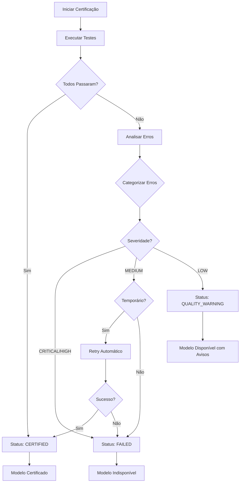

# Taxonomia de Erros - Sistema de Certificação AWS Bedrock

## 📋 Sumário Executivo

Este documento define uma taxonomia completa de erros para o sistema de certificação de modelos AWS Bedrock. O objetivo é diferenciar entre **modelos indisponíveis** (que não podem ser usados) e **modelos disponíveis com problemas de qualidade** (que funcionam mas não passam em testes específicos).

## 🎯 Problema Atual

O sistema atual marca qualquer erro como "falhou", o que é impreciso. Por exemplo:
- ❌ **Incorreto**: Modelo responde "Response too short" → Badge vermelho "Falhou"
- ✅ **Correto**: Modelo responde "Response too short" → Badge amarelo "Atenção - Qualidade"

## 📊 Categorias de Erro

### 1. UNAVAILABLE (Indisponível)
**Descrição**: Modelo não existe, não está disponível na região ou não pode ser acessado.

**Severidade**: 🔴 CRÍTICA

**Características**:
- Modelo não pode ser usado de forma alguma
- Requer ação do usuário ou administrador
- Não há workaround possível

**Mensagens de Erro**:
```typescript
const patterns = [
  /model.*not found/i,
  /model.*not supported/i,
  /model.*does not exist/i,
  /model.*is not available/i,
  /ResourceNotFoundException/i,
  /ModelNotFoundException/i,
  /no such model/i,
  /invalid model/i,
  /model id.*invalid/i
];
```

**Exemplos Reais**:
- `"Model amazon.nova-2-pro:256k not found"`
- `"Model anthropic.claude-v3-opus is not supported"`
- `"ResourceNotFoundException: Could not resolve model"`

**Badge UI**: 
- Cor: `#DC2626` (vermelho)
- Texto: "Indisponível"
- Ícone: ❌

**Ações Sugeridas**:
1. Verificar se o modelo existe no AWS Bedrock
2. Confirmar disponibilidade na região selecionada
3. Verificar se o modelo requer Inference Profile
4. Consultar documentação AWS para nome correto do modelo

---

### 2. PERMISSION_ERROR (Erro de Permissão)
**Descrição**: Credenciais válidas mas sem permissão para acessar o modelo ou serviço.

**Severidade**: 🔴 CRÍTICA

**Características**:
- Credenciais AWS estão corretas
- Falta permissão IAM específica
- Pode ser resolvido ajustando políticas IAM

**Mensagens de Erro**:
```typescript
const patterns = [
  /AccessDeniedException/i,
  /access denied/i,
  /permission denied/i,
  /not authorized/i,
  /insufficient permissions/i,
  /UnauthorizedException/i,
  /forbidden/i,
  /403/
];
```

**Exemplos Reais**:
- `"AccessDeniedException: User is not authorized to perform: bedrock:InvokeModel"`
- `"Access denied to model anthropic.claude-v3-sonnet"`
- `"Insufficient permissions to access Bedrock in us-east-1"`

**Badge UI**:
- Cor: `#DC2626` (vermelho)
- Texto: "Sem Permissão"
- Ícone: 🔒

**Ações Sugeridas**:
1. Adicionar política IAM: `bedrock:InvokeModel`
2. Adicionar política IAM: `bedrock:InvokeModelWithResponseStream`
3. Verificar se a região está permitida nas políticas
4. Consultar documentação de permissões AWS Bedrock

---

### 3. AUTHENTICATION_ERROR (Erro de Autenticação)
**Descrição**: Credenciais AWS inválidas ou expiradas.

**Severidade**: 🔴 CRÍTICA

**Características**:
- Access Key ou Secret Key incorretos
- Credenciais expiradas
- Formato de credenciais inválido

**Mensagens de Erro**:
```typescript
const patterns = [
  /InvalidAccessKeyId/i,
  /SignatureDoesNotMatch/i,
  /invalid credentials/i,
  /authentication failed/i,
  /credentials.*invalid/i,
  /credentials.*expired/i,
  /UnrecognizedClientException/i,
  /InvalidClientTokenId/i
];
```

**Exemplos Reais**:
- `"InvalidAccessKeyId: The AWS Access Key Id you provided does not exist"`
- `"SignatureDoesNotMatch: The request signature we calculated does not match"`
- `"AWS credentials must be in format: ACCESS_KEY:SECRET_KEY"`

**Badge UI**:
- Cor: `#DC2626` (vermelho)
- Texto: "Credenciais Inválidas"
- Ícone: 🔑

**Ações Sugeridas**:
1. Verificar Access Key ID e Secret Access Key
2. Confirmar que credenciais não expiraram
3. Gerar novas credenciais no AWS IAM
4. Verificar formato: `ACCESS_KEY:SECRET_KEY`

---

### 4. RATE_LIMIT (Limite de Taxa)
**Descrição**: Muitas requisições em curto período de tempo.

**Severidade**: 🟡 MÉDIA

**Características**:
- Temporário - pode funcionar depois
- Sistema já implementa retry automático com backoff
- Comum durante certificação em lote

**Mensagens de Erro**:
```typescript
const patterns = [
  /ThrottlingException/i,
  /rate limit/i,
  /too many requests/i,
  /quota exceeded/i,
  /throttling/i,
  /too many tokens/i,
  /request limit/i,
  /TooManyRequestsException/i,
  /429/
];
```

**Exemplos Reais**:
- `"ThrottlingException: Rate exceeded"`
- `"Too many requests. Please try again later"`
- `"Quota exceeded for model invocations"`

**Badge UI**:
- Cor: `#F59E0B` (amarelo)
- Texto: "Limite de Taxa"
- Ícone: ⏱️

**Ações Sugeridas**:
1. Aguardar alguns minutos e tentar novamente
2. Sistema fará retry automático (3 tentativas)
3. Considerar solicitar aumento de quota na AWS
4. Espaçar certificações em lote

---

### 5. TIMEOUT (Tempo Esgotado)
**Descrição**: Modelo demorou muito para responder.

**Severidade**: 🟡 MÉDIA

**Características**:
- Pode indicar modelo lento ou sobrecarga
- Timeout configurado: 30s para maioria dos testes
- Modelo pode funcionar com prompts mais simples

**Mensagens de Erro**:
```typescript
const patterns = [
  /timeout/i,
  /timed out/i,
  /time.*exceeded/i,
  /request timeout/i,
  /TimeoutException/i,
  /Test.*timed out after \d+ms/
];
```

**Exemplos Reais**:
- `"Test basic-prompt timed out after 30000ms"`
- `"Request timeout after 30s"`
- `"Timeout exceeded"`

**Badge UI**:
- Cor: `#F59E0B` (amarelo)
- Texto: "Timeout"
- Ícone: ⏰

**Ações Sugeridas**:
1. Tentar novamente - pode ser temporário
2. Verificar latência da região AWS
3. Considerar usar região mais próxima
4. Modelo pode estar sobrecarregado

---

### 6. CONFIGURATION_ERROR (Erro de Configuração)
**Descrição**: Problema na configuração do modelo ou região.

**Severidade**: 🟠 ALTA

**Características**:
- Modelo existe mas requer configuração especial
- Pode precisar de Inference Profile
- Região incorreta ou não suportada

**Mensagens de Erro**:
```typescript
const patterns = [
  /requires.*inference profile/i,
  /inference profile.*required/i,
  /region.*not supported/i,
  /invalid region/i,
  /configuration.*invalid/i,
  /ValidationException/i,
  /InvalidParameterException/i,
  /model.*requires.*cross-region/i
];
```

**Exemplos Reais**:
- `"Model requires inference profile for cross-region access"`
- `"ValidationException: Invalid region for this model"`
- `"Model amazon.nova-pro requires system-defined inference profile"`

**Badge UI**:
- Cor: `#F97316` (laranja)
- Texto: "Configuração"
- Ícone: ⚙️

**Ações Sugeridas**:
1. Verificar se modelo requer Inference Profile
2. Confirmar região suportada para o modelo
3. Consultar registry de modelos para regras específicas
4. Verificar documentação AWS do modelo

---

### 7. QUALITY_ISSUE (Problema de Qualidade)
**Descrição**: Modelo funciona mas não passa em testes de qualidade.

**Severidade**: 🟢 BAIXA

**Características**:
- **Modelo está DISPONÍVEL e pode ser usado**
- Não passou em critérios de qualidade específicos
- Pode ser aceitável dependendo do caso de uso
- Success rate < 80%

**Mensagens de Erro**:
```typescript
const patterns = [
  /response too short/i,
  /invalid json/i,
  /no response/i,
  /empty response/i,
  /no content/i,
  /no chunks received/i,
  /model did not remember context/i,
  /response.*not.*expected format/i,
  /quality.*below threshold/i
];
```

**Exemplos Reais**:
- `"Response too short"` (resposta < 20 caracteres)
- `"No chunks received"` (streaming não funcionou)
- `"Model did not remember context"` (não manteve histórico)
- `"Empty response"` (resposta vazia)

**Badge UI**:
- Cor: `#FBBF24` (amarelo claro)
- Texto: "Qualidade"
- Ícone: ⚠️

**Ações Sugeridas**:
1. ✅ Modelo pode ser usado normalmente
2. Avaliar se limitações são aceitáveis para seu caso
3. Testar manualmente com seus prompts
4. Considerar usar outro modelo se qualidade for crítica

---

### 8. NETWORK_ERROR (Erro de Rede)
**Descrição**: Problema de conectividade com AWS.

**Severidade**: 🟡 MÉDIA

**Características**:
- Temporário - relacionado à rede
- Pode ser resolvido tentando novamente
- Não é problema do modelo

**Mensagens de Erro**:
```typescript
const patterns = [
  /network error/i,
  /connection.*failed/i,
  /connection.*refused/i,
  /connection.*timeout/i,
  /ECONNREFUSED/i,
  /ENOTFOUND/i,
  /ETIMEDOUT/i,
  /socket hang up/i,
  /network.*unreachable/i
];
```

**Exemplos Reais**:
- `"Network error: ECONNREFUSED"`
- `"Connection timeout to bedrock-runtime.us-east-1.amazonaws.com"`
- `"Socket hang up"`

**Badge UI**:
- Cor: `#F59E0B` (amarelo)
- Texto: "Erro de Rede"
- Ícone: 🌐

**Ações Sugeridas**:
1. Verificar conexão com internet
2. Tentar novamente em alguns instantes
3. Verificar se AWS está com problemas (status.aws.amazon.com)
4. Verificar firewall/proxy

---

### 9. UNKNOWN_ERROR (Erro Desconhecido)
**Descrição**: Erro não categorizado ou inesperado.

**Severidade**: 🟡 MÉDIA

**Características**:
- Não se encaixa em outras categorias
- Requer investigação manual
- Pode ser bug ou caso não previsto

**Mensagens de Erro**:
```typescript
// Qualquer erro que não match com os patterns acima
const patterns = [
  /unknown error/i,
  /unexpected error/i,
  /internal error/i,
  /InternalServerException/i,
  /ServiceUnavailableException/i
];
```

**Exemplos Reais**:
- `"Unknown error"`
- `"InternalServerException: Internal server error"`
- `"Unexpected error occurred"`

**Badge UI**:
- Cor: `#6B7280` (cinza)
- Texto: "Erro Desconhecido"
- Ícone: ❓

**Ações Sugeridas**:
1. Verificar logs detalhados
2. Tentar novamente
3. Reportar erro se persistir
4. Verificar se AWS está com problemas

---

## 🏗️ Estrutura de Dados TypeScript

### Enums

```typescript
/**
 * Categorias de erro na certificação
 */
export enum ErrorCategory {
  UNAVAILABLE = 'unavailable',
  PERMISSION_ERROR = 'permission_error',
  AUTHENTICATION_ERROR = 'authentication_error',
  RATE_LIMIT = 'rate_limit',
  TIMEOUT = 'timeout',
  CONFIGURATION_ERROR = 'configuration_error',
  QUALITY_ISSUE = 'quality_issue',
  NETWORK_ERROR = 'network_error',
  UNKNOWN_ERROR = 'unknown_error'
}

/**
 * Severidade do erro
 */
export enum ErrorSeverity {
  CRITICAL = 'critical',    // 🔴 Modelo não pode ser usado
  HIGH = 'high',            // 🟠 Requer ação mas pode ter workaround
  MEDIUM = 'medium',        // 🟡 Temporário ou recuperável
  LOW = 'low'               // 🟢 Modelo funciona mas com limitações
}

/**
 * Status de certificação expandido
 */
export enum CertificationStatus {
  UNTESTED = 'untested',
  TESTING = 'testing',
  CERTIFIED = 'certified',
  FAILED = 'failed',
  QUALITY_WARNING = 'quality_warning',  // Novo: funciona mas com avisos
  DEPRECATED = 'deprecated',
  MONITORING = 'monitoring'
}
```

### Interfaces

```typescript
/**
 * Badge de UI para exibição de status
 */
export interface BadgeConfig {
  color: string;           // Cor hex (ex: '#DC2626')
  text: string;            // Texto do badge (ex: 'Indisponível')
  icon: string;            // Emoji ou ícone (ex: '❌')
  variant: 'error' | 'warning' | 'info' | 'success';
}

/**
 * Erro categorizado de certificação
 */
export interface CertificationError {
  category: ErrorCategory;
  severity: ErrorSeverity;
  message: string;                    // Mensagem amigável para usuário
  originalError: string;              // Erro original do sistema
  suggestedActions: string[];         // Lista de ações sugeridas
  badge: BadgeConfig;                 // Configuração do badge UI
  isModelAvailable: boolean;          // TRUE se modelo pode ser usado
  technicalDetails?: {
    testId?: string;
    testName?: string;
    latencyMs?: number;
    attemptNumber?: number;
  };
}

/**
 * Resultado de teste expandido
 */
export interface TestResult {
  testId: string;
  testName: string;
  passed: boolean;
  error?: string;
  errorCategory?: ErrorCategory;      // Nova: categoria do erro
  latencyMs: number;
  metadata?: Record<string, any>;
}

/**
 * Resultado de certificação expandido
 */
export interface CertificationResult {
  modelId: string;
  status: CertificationStatus;        // Pode ser 'quality_warning' agora
  testsPassed: number;
  testsFailed: number;
  successRate: number;
  avgLatencyMs: number;
  isCertified: boolean;
  isAvailable: boolean;               // Novo: TRUE se modelo pode ser usado
  results: TestResult[];
  errors?: CertificationError[];      // Nova: lista de erros categorizados
  overallSeverity?: ErrorSeverity;    // Nova: severidade geral
}
```

### Funções Utilitárias

```typescript
/**
 * Categoriza um erro com base na mensagem
 */
export function categorizeError(errorMessage: string): ErrorCategory {
  const msg = errorMessage.toLowerCase();
  
  // UNAVAILABLE
  if (/model.*(not found|not supported|does not exist|not available)/i.test(msg) ||
      /ResourceNotFoundException|ModelNotFoundException/i.test(msg)) {
    return ErrorCategory.UNAVAILABLE;
  }
  
  // PERMISSION_ERROR
  if (/AccessDeniedException|access denied|permission denied|not authorized|forbidden|403/i.test(msg)) {
    return ErrorCategory.PERMISSION_ERROR;
  }
  
  // AUTHENTICATION_ERROR
  if (/InvalidAccessKeyId|SignatureDoesNotMatch|invalid credentials|authentication failed|UnrecognizedClientException/i.test(msg)) {
    return ErrorCategory.AUTHENTICATION_ERROR;
  }
  
  // RATE_LIMIT
  if (/ThrottlingException|rate limit|too many requests|quota exceeded|throttling|429/i.test(msg)) {
    return ErrorCategory.RATE_LIMIT;
  }
  
  // TIMEOUT
  if (/timeout|timed out|time.*exceeded|TimeoutException/i.test(msg)) {
    return ErrorCategory.TIMEOUT;
  }
  
  // CONFIGURATION_ERROR
  if (/requires.*inference profile|region.*not supported|ValidationException|InvalidParameterException/i.test(msg)) {
    return ErrorCategory.CONFIGURATION_ERROR;
  }
  
  // QUALITY_ISSUE
  if (/response too short|invalid json|no response|empty response|no content|no chunks|did not remember context/i.test(msg)) {
    return ErrorCategory.QUALITY_ISSUE;
  }
  
  // NETWORK_ERROR
  if (/network error|connection.*failed|ECONNREFUSED|ENOTFOUND|ETIMEDOUT|socket hang up/i.test(msg)) {
    return ErrorCategory.NETWORK_ERROR;
  }
  
  // UNKNOWN_ERROR (default)
  return ErrorCategory.UNKNOWN_ERROR;
}

/**
 * Obtém severidade baseada na categoria
 */
export function getSeverity(category: ErrorCategory): ErrorSeverity {
  const severityMap: Record<ErrorCategory, ErrorSeverity> = {
    [ErrorCategory.UNAVAILABLE]: ErrorSeverity.CRITICAL,
    [ErrorCategory.PERMISSION_ERROR]: ErrorSeverity.CRITICAL,
    [ErrorCategory.AUTHENTICATION_ERROR]: ErrorSeverity.CRITICAL,
    [ErrorCategory.CONFIGURATION_ERROR]: ErrorSeverity.HIGH,
    [ErrorCategory.RATE_LIMIT]: ErrorSeverity.MEDIUM,
    [ErrorCategory.TIMEOUT]: ErrorSeverity.MEDIUM,
    [ErrorCategory.NETWORK_ERROR]: ErrorSeverity.MEDIUM,
    [ErrorCategory.UNKNOWN_ERROR]: ErrorSeverity.MEDIUM,
    [ErrorCategory.QUALITY_ISSUE]: ErrorSeverity.LOW
  };
  
  return severityMap[category];
}

/**
 * Obtém configuração de badge baseada na categoria
 */
export function getBadgeConfig(category: ErrorCategory): BadgeConfig {
  const badgeMap: Record<ErrorCategory, BadgeConfig> = {
    [ErrorCategory.UNAVAILABLE]: {
      color: '#DC2626',
      text: 'Indisponível',
      icon: '❌',
      variant: 'error'
    },
    [ErrorCategory.PERMISSION_ERROR]: {
      color: '#DC2626',
      text: 'Sem Permissão',
      icon: '🔒',
      variant: 'error'
    },
    [ErrorCategory.AUTHENTICATION_ERROR]: {
      color: '#DC2626',
      text: 'Credenciais Inválidas',
      icon: '🔑',
      variant: 'error'
    },
    [ErrorCategory.CONFIGURATION_ERROR]: {
      color: '#F97316',
      text: 'Configuração',
      icon: '⚙️',
      variant: 'warning'
    },
    [ErrorCategory.RATE_LIMIT]: {
      color: '#F59E0B',
      text: 'Limite de Taxa',
      icon: '⏱️',
      variant: 'warning'
    },
    [ErrorCategory.TIMEOUT]: {
      color: '#F59E0B',
      text: 'Timeout',
      icon: '⏰',
      variant: 'warning'
    },
    [ErrorCategory.NETWORK_ERROR]: {
      color: '#F59E0B',
      text: 'Erro de Rede',
      icon: '🌐',
      variant: 'warning'
    },
    [ErrorCategory.QUALITY_ISSUE]: {
      color: '#FBBF24',
      text: 'Qualidade',
      icon: '⚠️',
      variant: 'info'
    },
    [ErrorCategory.UNKNOWN_ERROR]: {
      color: '#6B7280',
      text: 'Erro Desconhecido',
      icon: '❓',
      variant: 'warning'
    }
  };
  
  return badgeMap[category];
}

/**
 * Verifica se modelo está disponível baseado na categoria
 */
export function isModelAvailable(category: ErrorCategory): boolean {
  // Apenas QUALITY_ISSUE indica que modelo está disponível
  return category === ErrorCategory.QUALITY_ISSUE;
}

/**
 * Obtém ações sugeridas baseadas na categoria
 */
export function getSuggestedActions(category: ErrorCategory): string[] {
  const actionsMap: Record<ErrorCategory, string[]> = {
    [ErrorCategory.UNAVAILABLE]: [
      'Verificar se o modelo existe no AWS Bedrock',
      'Confirmar disponibilidade na região selecionada',
      'Verificar se o modelo requer Inference Profile',
      'Consultar documentação AWS para nome correto do modelo'
    ],
    [ErrorCategory.PERMISSION_ERROR]: [
      'Adicionar política IAM: bedrock:InvokeModel',
      'Adicionar política IAM: bedrock:InvokeModelWithResponseStream',
      'Verificar se a região está permitida nas políticas',
      'Consultar documentação de permissões AWS Bedrock'
    ],
    [ErrorCategory.AUTHENTICATION_ERROR]: [
      'Verificar Access Key ID e Secret Access Key',
      'Confirmar que credenciais não expiraram',
      'Gerar novas credenciais no AWS IAM',
      'Verificar formato: ACCESS_KEY:SECRET_KEY'
    ],
    [ErrorCategory.RATE_LIMIT]: [
      'Aguardar alguns minutos e tentar novamente',
      'Sistema fará retry automático (3 tentativas)',
      'Considerar solicitar aumento de quota na AWS',
      'Espaçar certificações em lote'
    ],
    [ErrorCategory.TIMEOUT]: [
      'Tentar novamente - pode ser temporário',
      'Verificar latência da região AWS',
      'Considerar usar região mais próxima',
      'Modelo pode estar sobrecarregado'
    ],
    [ErrorCategory.CONFIGURATION_ERROR]: [
      'Verificar se modelo requer Inference Profile',
      'Confirmar região suportada para o modelo',
      'Consultar registry de modelos para regras específicas',
      'Verificar documentação AWS do modelo'
    ],
    [ErrorCategory.QUALITY_ISSUE]: [
      '✅ Modelo pode ser usado normalmente',
      'Avaliar se limitações são aceitáveis para seu caso',
      'Testar manualmente com seus prompts',
      'Considerar usar outro modelo se qualidade for crítica'
    ],
    [ErrorCategory.NETWORK_ERROR]: [
      'Verificar conexão com internet',
      'Tentar novamente em alguns instantes',
      'Verificar se AWS está com problemas (status.aws.amazon.com)',
      'Verificar firewall/proxy'
    ],
    [ErrorCategory.UNKNOWN_ERROR]: [
      'Verificar logs detalhados',
      'Tentar novamente',
      'Reportar erro se persistir',
      'Verificar se AWS está com problemas'
    ]
  };
  
  return actionsMap[category];
}

/**
 * Cria objeto CertificationError completo
 */
export function createCertificationError(
  originalError: string,
  technicalDetails?: {
    testId?: string;
    testName?: string;
    latencyMs?: number;
    attemptNumber?: number;
  }
): CertificationError {
  const category = categorizeError(originalError);
  const severity = getSeverity(category);
  const badge = getBadgeConfig(category);
  const suggestedActions = getSuggestedActions(category);
  const isAvailable = isModelAvailable(category);
  
  // Mensagem amigável baseada na categoria
  let message = originalError;
  if (category === ErrorCategory.QUALITY_ISSUE) {
    message = `Modelo disponível mas com limitações de qualidade: ${originalError}`;
  } else if (severity === ErrorSeverity.CRITICAL) {
    message = `Modelo não pode ser usado: ${originalError}`;
  }
  
  return {
    category,
    severity,
    message,
    originalError,
    suggestedActions,
    badge,
    isModelAvailable: isAvailable,
    technicalDetails
  };
}
```

---

## 🎨 Impacto na UI

### Badges por Categoria

| Categoria | Badge | Cor | Permite Uso? |
|-----------|-------|-----|--------------|
| UNAVAILABLE | ❌ Indisponível | Vermelho | ❌ Não |
| PERMISSION_ERROR | 🔒 Sem Permissão | Vermelho | ❌ Não |
| AUTHENTICATION_ERROR | 🔑 Credenciais Inválidas | Vermelho | ❌ Não |
| CONFIGURATION_ERROR | ⚙️ Configuração | Laranja | ❌ Não |
| RATE_LIMIT | ⏱️ Limite de Taxa | Amarelo | ⏳ Temporário |
| TIMEOUT | ⏰ Timeout | Amarelo | ⏳ Temporário |
| NETWORK_ERROR | 🌐 Erro de Rede | Amarelo | ⏳ Temporário |
| QUALITY_ISSUE | ⚠️ Qualidade | Amarelo Claro | ✅ Sim |
| UNKNOWN_ERROR | ❓ Erro Desconhecido | Cinza | ❓ Incerto |

### Componentes UI

#### 1. ModelCard com Badge Categorizado

```tsx
interface ModelCardProps {
  model: ModelMetadata;
  certification?: CertificationResult;
}

function ModelCard({ model, certification }: ModelCardProps) {
  if (!certification) {
    return <Badge color="gray">Não Testado</Badge>;
  }
  
  // Se certificado com sucesso
  if (certification.isCertified) {
    return <Badge color="green">✅ Certificado</Badge>;
  }
  
  // Se tem erros, mostrar o mais severo
  const mostSevereError = certification.errors?.[0];
  if (mostSevereError) {
    const { badge } = mostSevereError;
    return (
      <Badge 
        color={badge.color} 
        variant={badge.variant}
        tooltip={mostSevereError.message}
      >
        {badge.icon} {badge.text}
      </Badge>
    );
  }
  
  return <Badge color="red">❌ Falhou</Badge>;
}
```

#### 2. Detalhes de Erro com Ações

```tsx
interface ErrorDetailsProps {
  error: CertificationError;
}

function ErrorDetails({ error }: ErrorDetailsProps) {
  return (
    <div className="error-details">
      <div className="error-header">
        <span className="error-icon">{error.badge.icon}</span>
        <h3>{error.badge.text}</h3>
        <Badge severity={error.severity}>{error.severity}</Badge>
      </div>
      
      <p className="error-message">{error.message}</p>
      
      {error.isModelAvailable && (
        <Alert variant="info">
          ✅ Este modelo está disponível e pode ser usado, 
          mas apresenta algumas limitações de qualidade.
        </Alert>
      )}
      
      <div className="suggested-actions">
        <h4>Ações Sugeridas:</h4>
        <ul>
          {error.suggestedActions.map((action, i) => (
            <li key={i}>{action}</li>
          ))}
        </ul>
      </div>
      
      {error.technicalDetails && (
        <details>
          <summary>Detalhes Técnicos</summary>
          <pre>{JSON.stringify(error.technicalDetails, null, 2)}</pre>
        </details>
      )}
    </div>
  );
}
```

#### 3. Lista de Modelos com Filtros

```tsx
function ModelList() {
  const [filter, setFilter] = useState<'all' | 'available' | 'certified'>('all');
  
  const filteredModels = models.filter(model => {
    if (filter === 'available') {
      // Inclui certificados + modelos com QUALITY_ISSUE
      return model.certification?.isAvailable;
    }
    if (filter === 'certified') {
      return model.certification?.isCertified;
    }
    return true;
  });
  
  return (
    <div>
      <FilterBar>
        <Button onClick={() => setFilter('all')}>Todos</Button>
        <Button onClick={() => setFilter('available')}>Disponíveis</Button>
        <Button onClick={() => setFilter('certified')}>Certificados</Button>
      </FilterBar>
      
      {filteredModels.map(model => (
        <ModelCard key={model.id} model={model} />
      ))}
    </div>
  );
}
```

---

## 🔄 Fluxo de Certificação Atualizado



### Lógica de Decisão

```typescript
function determineCertificationStatus(
  testResults: TestResult[],
  successRate: number
): {
  status: CertificationStatus;
  isAvailable: boolean;
  overallSeverity?: ErrorSeverity;
} {
  // Se passou em 80%+ dos testes
  if (successRate >= 80) {
    return {
      status: CertificationStatus.CERTIFIED,
      isAvailable: true
    };
  }
  
  // Analisar erros
  const errors = testResults
    .filter(r => !r.passed && r.error)
    .map(r => createCertificationError(r.error!, {
      testId: r.testId,
      testName: r.testName,
      latencyMs: r.latencyMs
    }));
  
  // Encontrar severidade mais alta
  const severities = errors.map(e => e.severity);
  const hasCritical = severities.includes(ErrorSeverity.CRITICAL);
  const hasHigh = severities.includes(ErrorSeverity.HIGH);
  
  // Se todos os erros são QUALITY_ISSUE
  const allQualityIssues = errors.every(
    e => e.category === ErrorCategory.QUALITY_ISSUE
  );
  
  if (allQualityIssues) {
    return {
      status: CertificationStatus.QUALITY_WARNING,
      isAvailable: true,
      overallSeverity: ErrorSeverity.LOW
    };
  }
  
  // Se tem erros críticos ou altos
  if (hasCritical || hasHigh) {
    return {
      status: CertificationStatus.FAILED,
      isAvailable: false,
      overallSeverity: hasCritical ? ErrorSeverity.CRITICAL : ErrorSeverity.HIGH
    };
  }
  
  // Erros médios (temporários)
  return {
    status: CertificationStatus.FAILED,
    isAvailable: false,
    overallSeverity: ErrorSeverity.MEDIUM
  };
}
```

---

## 📝 Exemplos Práticos

### Exemplo 1: Modelo Certificado com Sucesso

```json
{
  "modelId": "anthropic.claude-3-sonnet-20240229-v1:0",
  "status": "certified",
  "testsPassed": 6,
  "testsFailed": 0,
  "successRate": 100,
  "avgLatencyMs": 1250,
  "isCertified": true,
  "isAvailable": true,
  "results": [
    {
      "testId": "basic-prompt",
      "testName": "Basic Prompt Test",
      "passed": true,
      "latencyMs": 1200
    }
  ],
  "errors": []
}
```

**UI**: Badge verde "✅ Certificado"

---

### Exemplo 2: Modelo Disponível com Problema de Qualidade

```json
{
  "modelId": "amazon.titan-text-lite-v1",
  "status": "quality_warning",
  "testsPassed": 4,
  "testsFailed": 2,
  "successRate": 66.7,
  "avgLatencyMs": 800,
  "isCertified": false,
  "isAvailable": true,
  "results": [
    {
      "testId": "basic-prompt",
      "testName": "Basic Prompt Test",
      "passed": true,
      "latencyMs": 750
    },
    {
      "testId": "amazon-text-generation",
      "testName": "Text Generation Test",
      "passed": false,
      "error": "Response too short",
      "errorCategory": "quality_issue",
      "latencyMs": 850
    }
  ],
  "errors": [
    {
      "category": "quality_issue",
      "severity": "low",
      "message": "Modelo disponível mas com limitações de qualidade: Response too short",
      "originalError": "Response too short",
      "suggestedActions": [
        "✅ Modelo pode ser usado normalmente",
        "Avaliar se limitações são aceitáveis para seu caso",
        "Testar manualmente com seus prompts",
        "Considerar usar outro modelo se qualidade for crítica"
      ],
      "badge": {
        "color": "#FBBF24",
        "text": "Qualidade",
        "icon": "⚠️",
        "variant": "info"
      },
      "isModelAvailable": true
    }
  ],
  "overallSeverity": "low"
}
```

**UI**: Badge amarelo claro "⚠️ Qualidade"
**Mensagem**: "Modelo disponível mas com limitações de qualidade"
**Ação**: Usuário pode selecionar e usar o modelo

---

### Exemplo 3: Modelo Indisponível (Not Found)

```json
{
  "modelId": "anthropic.claude-v3-opus",
  "status": "failed",
  "testsPassed": 0,
  "testsFailed": 6,
  "successRate": 0,
  "avgLatencyMs": 0,
  "isCertified": false,
  "isAvailable": false,
  "results": [
    {
      "testId": "basic-prompt",
      "testName": "Basic Prompt Test",
      "passed": false,
      "error": "Model anthropic.claude-v3-opus is not supported. Please check the model ID.",
      "errorCategory": "unavailable",
      "latencyMs": 0
    }
  ],
  "errors": [
    {
      "category": "unavailable",
      "severity": "critical",
      "message": "Modelo não pode ser usado: Model anthropic.claude-v3-opus is not supported",
      "originalError": "Model anthropic.claude-v3-opus is not supported. Please check the model ID.",
      "suggestedActions": [
        "Verificar se o modelo existe no AWS Bedrock",
        "Confirmar disponibilidade na região selecionada",
        "Verificar se o modelo requer Inference Profile",
        "Consultar documentação AWS para nome correto do modelo"
      ],
      "badge": {
        "color": "#DC2626",
        "text": "Indisponível",
        "icon": "❌",
        "variant": "error"
      },
      "isModelAvailable": false
    }
  ],
  "overallSeverity": "critical"
}
```

**UI**: Badge vermelho "❌ Indisponível"
**Mensagem**: "Modelo não pode ser usado"
**Ação**: Modelo não pode ser selecionado

---

### Exemplo 4: Erro de Permissão

```json
{
  "modelId": "anthropic.claude-3-opus-20240229-v1:0",
  "status": "failed",
  "testsPassed": 0,
  "testsFailed": 6,
  "successRate": 0,
  "avgLatencyMs": 0,
  "isCertified": false,
  "isAvailable": false,
  "results": [
    {
      "testId": "basic-prompt",
      "testName": "Basic Prompt Test",
      "passed": false,
      "error": "AccessDeniedException: User is not authorized to perform: bedrock:InvokeModel",
      "errorCategory": "permission_error",
      "latencyMs": 0
    }
  ],
  "errors": [
    {
      "category": "permission_error",
      "severity": "critical",
      "message": "Modelo não pode ser usado: AccessDeniedException",
      "originalError": "AccessDeniedException: User is not authorized to perform: bedrock:InvokeModel",
      "suggestedActions": [
        "Adicionar política IAM: bedrock:InvokeModel",
        "Adicionar política IAM: bedrock:InvokeModelWithResponseStream",
        "Verificar se a região está permitida nas políticas",
        "Consultar documentação de permissões AWS Bedrock"
      ],
      "badge": {
        "color": "#DC2626",
        "text": "Sem Permissão",
        "icon": "🔒",
        "variant": "error"
      },
      "isModelAvailable": false
    }
  ],
  "overallSeverity": "critical"
}
```

**UI**: Badge vermelho "🔒 Sem Permissão"
**Mensagem**: "Modelo não pode ser usado: AccessDeniedException"
**Ação**: Mostrar instruções de como adicionar permissões IAM

---

### Exemplo 5: Rate Limit (Temporário)

```json
{
  "modelId": "anthropic.claude-3-sonnet-20240229-v1:0",
  "status": "failed",
  "testsPassed": 2,
  "testsFailed": 4,
  "successRate": 33.3,
  "avgLatencyMs": 500,
  "isCertified": false,
  "isAvailable": false,
  "results": [
    {
      "testId": "basic-prompt",
      "testName": "Basic Prompt Test",
      "passed": true,
      "latencyMs": 1200
    },
    {
      "testId": "streaming-test",
      "testName": "Streaming Test",
      "passed": false,
      "error": "ThrottlingException: Rate exceeded",
      "errorCategory": "rate_limit",
      "latencyMs": 500
    }
  ],
  "errors": [
    {
      "category": "rate_limit",
      "severity": "medium",
      "message": "ThrottlingException: Rate exceeded",
      "originalError": "ThrottlingException: Rate exceeded",
      "suggestedActions": [
        "Aguardar alguns minutos e tentar novamente",
        "Sistema fará retry automático (3 tentativas)",
        "Considerar solicitar aumento de quota na AWS",
        "Espaçar certificações em lote"
      ],
      "badge": {
        "color": "#F59E0B",
        "text": "Limite de Taxa",
        "icon": "⏱️",
        "variant": "warning"
      },
      "isModelAvailable": false
    }
  ],
  "overallSeverity": "medium"
}
```

**UI**: Badge amarelo "⏱️ Limite de Taxa"
**Mensagem**: "Limite de taxa excedido - tente novamente em alguns minutos"
**Ação**: Botão "Tentar Novamente" disponível

---

## 🎯 Regras de Negócio

### 1. Disponibilidade do Modelo

```typescript
/**
 * Um modelo é considerado DISPONÍVEL se:
 * - Status = CERTIFIED, OU
 * - Status = QUALITY_WARNING (todos erros são QUALITY_ISSUE)
 */
function isModelAvailable(certification: CertificationResult): boolean {
  return certification.isAvailable;
}
```

### 2. Seleção de Modelo na UI

```typescript
/**
 * Usuário pode selecionar modelo se:
 * - Modelo está disponível (certified ou quality_warning)
 */
function canSelectModel(certification: CertificationResult): boolean {
  return certification.isAvailable;
}
```

### 3. Exibição de Avisos

```typescript
/**
 * Mostrar aviso ao selecionar modelo com QUALITY_WARNING
 */
function shouldShowWarning(certification: CertificationResult): boolean {
  return certification.status === CertificationStatus.QUALITY_WARNING;
}
```

### 4. Retry Automático

```typescript
/**
 * Sistema deve fazer retry automático para:
 * - RATE_LIMIT (3 tentativas com backoff)
 * - TIMEOUT (1 tentativa adicional)
 * - NETWORK_ERROR (2 tentativas)
 */
function shouldRetry(category: ErrorCategory, attemptNumber: number): boolean {
  const retryConfig = {
    [ErrorCategory.RATE_LIMIT]: 3,
    [ErrorCategory.TIMEOUT]: 1,
    [ErrorCategory.NETWORK_ERROR]: 2
  };
  
  const maxRetries = retryConfig[category] || 0;
  return attemptNumber < maxRetries;
}
```

---

## 📊 Métricas e Monitoramento

### Métricas a Coletar

```typescript
interface CertificationMetrics {
  // Por categoria de erro
  errorsByCategory: Record<ErrorCategory, number>;
  
  // Por severidade
  errorsBySeverity: Record<ErrorSeverity, number>;
  
  // Disponibilidade
  totalModels: number;
  availableModels: number;      // certified + quality_warning
  certifiedModels: number;      // apenas certified
  unavailableModels: number;    // failed
  
  // Taxas
  certificationRate: number;    // % de modelos certificados
  availabilityRate: number;     // % de modelos disponíveis
  
  // Performance
  avgCertificationTime: number; // ms
  avgLatency: number;           // ms
  
  // Erros temporários
  rateLimitErrors: number;
  timeoutErrors: number;
  networkErrors: number;
}
```

### Dashboard Sugerido

```
┌─────────────────────────────────────────────────────────┐
│ 📊 Certificação de Modelos AWS Bedrock                  │
├─────────────────────────────────────────────────────────┤
│                                                          │
│ ✅ Certificados:        45 (75%)                        │
│ ⚠️  Qualidade:          10 (17%)                        │
│ ❌ Indisponíveis:        5 (8%)                         │
│                                                          │
│ Total Disponíveis:      55 (92%)                        │
│                                                          │
├─────────────────────────────────────────────────────────┤
│ Erros por Categoria:                                    │
│                                                          │
│ 🔴 CRÍTICOS:                                            │
│   ❌ Indisponível:       3                              │
│   🔒 Sem Permissão:      1                              │
│   🔑 Credenciais:        1                              │
│                                                          │
│ 🟡 TEMPORÁRIOS:                                         │
│   ⏱️  Rate Limit:        2                              │
│   ⏰ Timeout:            1                              │
│                                                          │
│ 🟢 QUALIDADE:                                           │
│   ⚠️  Qualidade:         10                             │
│                                                          │
├─────────────────────────────────────────────────────────┤
│ Performance:                                            │
│   Latência Média:       1.2s                            │
│   Tempo Certificação:   45s (60 modelos)                │
└─────────────────────────────────────────────────────────┘
```

---

## 🚀 Implementação Sugerida

### Fase 1: Backend (Categorização)

1. ✅ Criar enums e interfaces em [`types.ts`](backend/src/services/ai/certification/types.ts:1)
2. ✅ Criar funções utilitárias de categorização
3. ✅ Atualizar [`TestRunner`](backend/src/services/ai/certification/test-runner.ts:1) para categorizar erros
4. ✅ Atualizar [`CertificationService`](backend/src/services/ai/certification/certification.service.ts:1) para usar nova lógica
5. ✅ Atualizar schema Prisma se necessário

### Fase 2: API (Endpoints)

1. ✅ Atualizar resposta de certificação com novos campos
2. ✅ Adicionar endpoint para obter modelos disponíveis (não apenas certificados)
3. ✅ Adicionar endpoint para métricas de certificação

### Fase 3: Frontend (UI)

1. ✅ Atualizar componentes de badge
2. ✅ Criar componente de detalhes de erro
3. ✅ Atualizar filtros de modelos
4. ✅ Adicionar avisos ao selecionar modelos com quality_warning
5. ✅ Criar dashboard de métricas

### Fase 4: Testes

1. ✅ Testes unitários para categorização
2. ✅ Testes de integração para fluxo completo
3. ✅ Testes E2E para UI

---

## 📚 Referências

### AWS Bedrock Error Codes

- `ResourceNotFoundException`: Modelo não encontrado
- `AccessDeniedException`: Sem permissão
- `ThrottlingException`: Rate limit
- `ValidationException`: Parâmetros inválidos
- `InvalidAccessKeyId`: Credenciais inválidas
- `SignatureDoesNotMatch`: Credenciais incorretas

### Documentação AWS

- [AWS Bedrock Error Handling](https://docs.aws.amazon.com/bedrock/latest/userguide/error-handling.html)
- [AWS Bedrock Permissions](https://docs.aws.amazon.com/bedrock/latest/userguide/security-iam.html)
- [AWS Bedrock Quotas](https://docs.aws.amazon.com/bedrock/latest/userguide/quotas.html)

---

## ✅ Checklist de Implementação

- [ ] Criar enums `ErrorCategory`, `ErrorSeverity`, `CertificationStatus`
- [ ] Criar interfaces `CertificationError`, `BadgeConfig`
- [ ] Implementar função `categorizeError()`
- [ ] Implementar função `getSeverity()`
- [ ] Implementar função `getBadgeConfig()`
- [ ] Implementar função `getSuggestedActions()`
- [ ] Implementar função `createCertificationError()`
- [ ] Implementar função `determineCertificationStatus()`
- [ ] Atualizar `TestRunner` para categorizar erros
- [ ] Atualizar `CertificationService` com nova lógica
- [ ] Atualizar schema Prisma (adicionar `isAvailable`, `overallSeverity`)
- [ ] Atualizar API responses
- [ ] Criar componente `ErrorDetails`
- [ ] Atualizar componente `ModelCard`
- [ ] Atualizar filtros de modelos
- [ ] Adicionar avisos de qualidade
- [ ] Criar dashboard de métricas
- [ ] Escrever testes unitários
- [ ] Escrever testes de integração
- [ ] Documentar mudanças no CHANGELOG

---

## 🎓 Conclusão

Esta taxonomia resolve o problema fundamental de diferenciar entre:

1. **Modelos Indisponíveis** (não podem ser usados) → Badge vermelho/laranja
2. **Modelos Disponíveis com Limitações** (podem ser usados) → Badge amarelo claro

A implementação desta taxonomia permitirá:

- ✅ Melhor experiência do usuário
- ✅ Decisões mais informadas sobre uso de modelos
- ✅ Troubleshooting mais eficiente
- ✅ Métricas mais precisas
- ✅ Menor frustração com "falsos negativos"

**Próximos Passos**: Revisar este documento com a equipe e iniciar implementação em fases.
