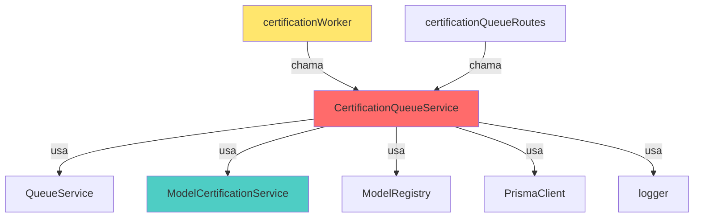
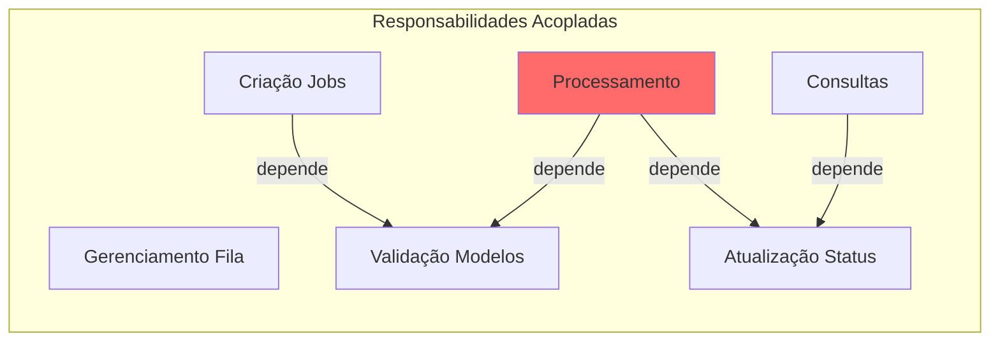
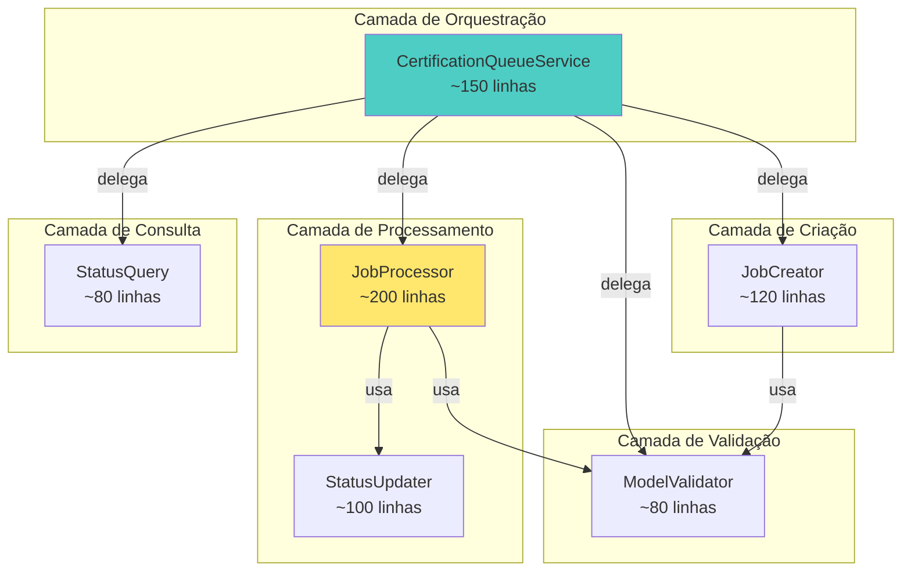
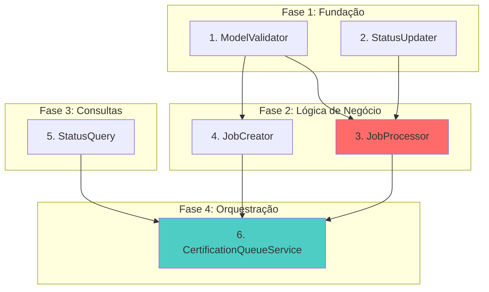
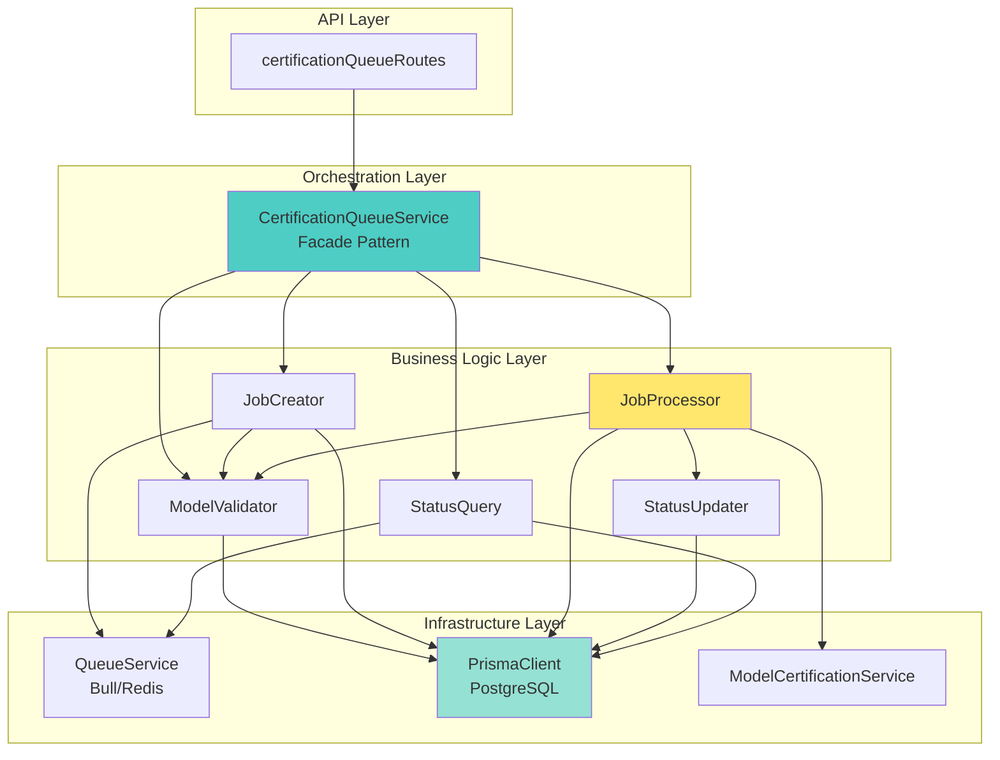

# Plano de Modularização: CertificationQueueService.ts

**Data:** 2026-02-07  
**Arquivo Alvo:** [`backend/src/services/queue/CertificationQueueService.ts`](../../backend/src/services/queue/CertificationQueueService.ts)  
**Tamanho Atual:** 808 linhas (485 linhas efetivas de código)  
**Meta:** ≤250 linhas por arquivo  
**Padrão de Referência:** [STANDARDS.md Seção 15](../../docs/STANDARDS.md:1199)

---

## 📋 Índice

1. [Análise da Estrutura Atual](#1-análise-da-estrutura-atual)
2. [Identificação de Responsabilidades](#2-identificação-de-responsabilidades)
3. [Proposta de Divisão em Módulos](#3-proposta-de-divisão-em-módulos)
4. [Estrutura de Diretórios](#4-estrutura-de-diretórios)
5. [Ordem de Implementação](#5-ordem-de-implementação)
6. [Riscos e Mitigações](#6-riscos-e-mitigações)
7. [Checklist de Validação](#7-checklist-de-validação)

---

## 1. Análise da Estrutura Atual

### 1.1 Visão Geral do Arquivo

O arquivo [`CertificationQueueService.ts`](../../backend/src/services/queue/CertificationQueueService.ts) atualmente possui **808 linhas totais** (~485 linhas de código efetivo), violando o limite de 400 linhas estabelecido no [STANDARDS.md](../../docs/STANDARDS.md:1199).

### 1.2 Métodos Públicos (API Pública)

| Método | Linhas | Responsabilidade | Complexidade |
|--------|--------|------------------|--------------|
| `certifyModel()` | 51-162 (112 linhas) | Certificar modelo único | **Alta** |
| `certifyMultipleModels()` | 169-289 (121 linhas) | Certificar múltiplos modelos | **Alta** |
| `certifyAllModels()` | 297-340 (44 linhas) | Certificar todos modelos Bedrock | Média |
| `processCertification()` | 346-721 (376 linhas) | **Processar job de certificação** | **Crítica** |
| `getJobStatus()` | 726-757 (32 linhas) | Obter status de job | Baixa |
| `cancelJob()` | 762-787 (26 linhas) | Cancelar job | Baixa |
| `getQueueStats()` | 792-804 (13 linhas) | Obter estatísticas da fila | Baixa |

**⚠️ PROBLEMA CRÍTICO:** O método `processCertification()` possui **376 linhas**, representando **46% do arquivo inteiro**. Este é o principal alvo de refatoração.

### 1.3 Dependências Externas

```typescript
// Dependências de Infraestrutura
import { Job } from 'bull';                    // Fila de jobs
import { PrismaClient, Prisma } from '@prisma/client'; // ORM
import { queueService } from './QueueService'; // Gerenciamento de filas

// Dependências de Domínio
import { ModelCertificationService } from '../ai/certification/certification.service';
import { ModelRegistry } from '../ai/registry';

// Dependências de Utilitários
import { logger } from '../../utils/logger';
import { config } from '../../config/env';

// Tipos
import { CertificationJobData, CertificationResult } from '../../types/certification-queue';
```

### 1.4 Acoplamentos Identificados



**Legenda:**
- 🔴 Vermelho: Arquivo a ser refatorado
- 🔵 Azul: Dependências de domínio
- 🟡 Amarelo: Consumidores externos

---

## 2. Identificação de Responsabilidades

### 2.1 Responsabilidades Atuais (Violação do SRP)

O `CertificationQueueService` atualmente viola o **Single Responsibility Principle (SRP)** ao acumular **6 responsabilidades distintas**:

| # | Responsabilidade | Linhas | Justificativa de Separação |
|---|------------------|--------|----------------------------|
| **R1** | **Gerenciamento de Fila** | ~50 | Inicialização, configuração Bull/Redis |
| **R2** | **Validação de Modelos** | ~80 | Verificar ModelRegistry, buscar no banco |
| **R3** | **Criação de Jobs** | ~200 | Criar registros no banco, adicionar à fila |
| **R4** | **Processamento de Certificação** | ~376 | **Executar certificação real (CRÍTICO)** |
| **R5** | **Atualização de Status** | ~60 | Sincronizar banco com fila |
| **R6** | **Consultas de Status** | ~70 | Obter status, estatísticas, cancelar |

### 2.2 Análise de Complexidade Ciclomática

```typescript
// Método processCertification() - Complexidade: ~25 (CRÍTICA)
// - 2 branches: UUID vs apiModelId
// - 3 branches: modo simulação vs real
// - 5 branches: tratamento de erros
// - 8 branches: atualização de status
// - 7 branches: cálculo de rating
```

**⚠️ ALERTA:** Complexidade ciclomática >15 indica necessidade urgente de refatoração.

### 2.3 Dependências Internas (Coesão)



**Conclusão:** R4 (Processamento) é o núcleo mais acoplado e deve ser extraído primeiro.

---

## 3. Proposta de Divisão em Módulos

### 3.1 Arquitetura Proposta



### 3.2 Módulos Propostos

#### **Módulo 1: ModelValidator** (Nova Criação)
**Arquivo:** `backend/src/services/queue/validators/ModelValidator.ts`  
**Tamanho Estimado:** ~80 linhas  
**Responsabilidade:** Validar modelos antes de criar jobs

```typescript
export class ModelValidator {
  /**
   * Valida se modelo existe no banco e no ModelRegistry
   * @throws Error se modelo inválido
   */
  async validateModel(modelId: string): Promise<{
    uuid: string;
    apiModelId: string;
    name: string;
  }>;
  
  /**
   * Valida múltiplos modelos e retorna apenas os válidos
   * @returns Array de modelos válidos + array de inválidos
   */
  async validateModels(modelIds: string[]): Promise<{
    valid: Array<{ uuid: string; apiModelId: string; name: string }>;
    invalid: string[];
  }>;
  
  /**
   * Busca todos modelos Bedrock ativos e válidos
   */
  async getValidBedrockModels(): Promise<Array<{
    uuid: string;
    apiModelId: string;
    name: string;
  }>>;
}
```

**Extração de:**
- Linhas 58-82 (certifyModel)
- Linhas 177-201 (certifyMultipleModels)
- Linhas 304-337 (certifyAllModels)

---

#### **Módulo 2: JobCreator** (Nova Criação)
**Arquivo:** `backend/src/services/queue/creators/JobCreator.ts`  
**Tamanho Estimado:** ~120 linhas  
**Responsabilidade:** Criar registros de jobs no banco e adicionar à fila Bull

```typescript
export class JobCreator {
  constructor(
    private queueService: QueueService,
    private queueName: string
  ) {}
  
  /**
   * Cria job único no banco e na fila
   */
  async createSingleJob(
    modelId: string,
    region: string,
    createdBy?: string
  ): Promise<{ jobId: string; bullJobId: string }>;
  
  /**
   * Cria job em lote (múltiplos modelos x múltiplas regiões)
   */
  async createBatchJob(
    modelIds: string[],
    regions: string[],
    createdBy?: string
  ): Promise<{ jobId: string; totalJobs: number }>;
  
  /**
   * Cria registro de certificação no banco (upsert)
   */
  private async createCertificationRecord(
    modelId: string,
    region: string,
    createdBy?: string
  ): Promise<string>; // retorna certification.id
}
```

**Extração de:**
- Linhas 84-161 (certifyModel - criação de registros)
- Linhas 206-283 (certifyMultipleModels - criação em lote)

---

#### **Módulo 3: JobProcessor** (Nova Criação) ⚠️ CRÍTICO
**Arquivo:** `backend/src/services/queue/processors/JobProcessor.ts`  
**Tamanho Estimado:** ~200 linhas  
**Responsabilidade:** Processar certificação de um modelo (lógica de negócio)

```typescript
export class JobProcessor {
  constructor(
    private certificationService: ModelCertificationService,
    private statusUpdater: StatusUpdater
  ) {}
  
  /**
   * Processa certificação de um modelo
   * PÚBLICO para ser chamado pelo worker
   */
  async process(job: Job<CertificationJobData>): Promise<CertificationResult>;
  
  /**
   * Identifica se modelId é UUID ou apiModelId e busca ambos
   */
  private async resolveModelIds(modelIdParam: string): Promise<{
    uuid: string;
    apiModelId: string;
  }>;
  
  /**
   * Executa certificação (real ou simulada)
   */
  private async executeCertification(
    apiModelId: string,
    region: string,
    useSimulation: boolean
  ): Promise<{
    passed: boolean;
    score: number;
    rating: number | null;
    badge: string;
    testResults: any;
  }>;
  
  /**
   * Trata erros de certificação
   */
  private async handleCertificationError(
    job: Job,
    error: Error,
    modelUUID?: string,
    apiModelId?: string
  ): Promise<void>;
}
```

**Extração de:**
- Linhas 346-721 (processCertification completo)
- Lógica de detecção UUID vs apiModelId
- Lógica de simulação vs certificação real
- Tratamento de erros

---

#### **Módulo 4: StatusUpdater** (Nova Criação)
**Arquivo:** `backend/src/services/queue/updaters/StatusUpdater.ts`  
**Tamanho Estimado:** ~100 linhas  
**Responsabilidade:** Atualizar status de jobs e certificações no banco

```typescript
export class StatusUpdater {
  /**
   * Atualiza JobCertification e ModelCertification quando job inicia
   */
  async updateOnStart(
    jobId: string,
    modelUUID: string,
    apiModelId: string,
    region: string
  ): Promise<void>;
  
  /**
   * Atualiza registros quando job completa com sucesso
   */
  async updateOnSuccess(
    jobId: string,
    modelUUID: string,
    apiModelId: string,
    region: string,
    result: {
      passed: boolean;
      score: number;
      rating: number | null;
      badge: string;
      testResults: any;
      duration: number;
    }
  ): Promise<void>;
  
  /**
   * Atualiza registros quando job falha
   */
  async updateOnFailure(
    jobId: string,
    modelUUID: string,
    apiModelId: string,
    region: string,
    error: {
      message: string;
      category: string;
      duration: number;
    }
  ): Promise<void>;
  
  /**
   * Atualiza contadores do CertificationJob (job PAI)
   */
  async updateJobCounters(
    jobId: string,
    increment: {
      processed: number;
      success?: number;
      failure?: number;
    }
  ): Promise<void>;
}
```

**Extração de:**
- Linhas 394-432 (atualização no início)
- Linhas 536-609 (atualização no sucesso)
- Linhas 668-717 (atualização no erro)
- Linhas 600-608 (atualização de contadores)

---

#### **Módulo 5: StatusQuery** (Nova Criação)
**Arquivo:** `backend/src/services/queue/queries/StatusQuery.ts`  
**Tamanho Estimado:** ~80 linhas  
**Responsabilidade:** Consultar status de jobs e estatísticas

```typescript
export class StatusQuery {
  constructor(
    private queueService: QueueService,
    private queueName: string
  ) {}
  
  /**
   * Obtém status completo de um job
   */
  async getJobStatus(jobId: string): Promise<{
    job: CertificationJob;
    certifications: ModelCertification[];
  } | null>;
  
  /**
   * Obtém estatísticas da fila (Bull + Banco)
   */
  async getQueueStats(): Promise<{
    queue: QueueCounts;
    database: DatabaseStats;
  }>;
  
  /**
   * Cancela um job
   */
  async cancelJob(jobId: string): Promise<void>;
}
```

**Extração de:**
- Linhas 726-757 (getJobStatus)
- Linhas 792-804 (getQueueStats)
- Linhas 762-787 (cancelJob)

---

#### **Módulo 6: CertificationQueueService** (Refatorado)
**Arquivo:** `backend/src/services/queue/CertificationQueueService.ts`  
**Tamanho Final:** ~150 linhas  
**Responsabilidade:** Orquestração e delegação (Facade Pattern)

```typescript
export class CertificationQueueService {
  private queueName: string;
  private queue: any;
  
  // Dependências injetadas
  private modelValidator: ModelValidator;
  private jobCreator: JobCreator;
  private jobProcessor: JobProcessor;
  private statusQuery: StatusQuery;
  
  constructor() {
    this.queueName = config.certificationQueueName as string;
    this.initializeQueue();
    
    // Injetar dependências
    this.modelValidator = new ModelValidator();
    this.jobCreator = new JobCreator(queueService, this.queueName);
    
    const statusUpdater = new StatusUpdater();
    this.jobProcessor = new JobProcessor(certificationService, statusUpdater);
    
    this.statusQuery = new StatusQuery(queueService, this.queueName);
  }
  
  // API Pública (delegação)
  async certifyModel(modelId: string, region: string, createdBy?: string) {
    const model = await this.modelValidator.validateModel(modelId);
    return this.jobCreator.createSingleJob(model.uuid, region, createdBy);
  }
  
  async certifyMultipleModels(modelIds: string[], regions: string[], createdBy?: string) {
    const { valid } = await this.modelValidator.validateModels(modelIds);
    const validIds = valid.map(m => m.uuid);
    return this.jobCreator.createBatchJob(validIds, regions, createdBy);
  }
  
  async certifyAllModels(regions: string[], createdBy?: string) {
    const models = await this.modelValidator.getValidBedrockModels();
    const modelIds = models.map(m => m.uuid);
    return this.jobCreator.createBatchJob(modelIds, regions, createdBy);
  }
  
  // Método PÚBLICO para worker
  async processCertification(job: Job<CertificationJobData>) {
    return this.jobProcessor.process(job);
  }
  
  async getJobStatus(jobId: string) {
    return this.statusQuery.getJobStatus(jobId);
  }
  
  async cancelJob(jobId: string) {
    return this.statusQuery.cancelJob(jobId);
  }
  
  async getQueueStats() {
    return this.statusQuery.getQueueStats();
  }
}
```

---

## 4. Estrutura de Diretórios

### 4.1 Estrutura Proposta

```
backend/src/services/queue/
├── CertificationQueueService.ts      (~150 linhas) ← Orquestrador
├── QueueService.ts                   (existente, sem mudanças)
│
├── validators/
│   └── ModelValidator.ts             (~80 linhas)
│
├── creators/
│   └── JobCreator.ts                 (~120 linhas)
│
├── processors/
│   ├── JobProcessor.ts               (~200 linhas) ← CRÍTICO
│   └── StatusUpdater.ts              (~100 linhas)
│
└── queries/
    └── StatusQuery.ts                (~80 linhas)
```

**Total de Arquivos:** 7 (1 existente + 6 novos)  
**Maior Arquivo:** JobProcessor.ts (~200 linhas) ✅ Dentro do limite  
**Arquivo Orquestrador:** CertificationQueueService.ts (~150 linhas) ✅ Dentro do limite

### 4.2 Justificativa da Estrutura

| Diretório | Responsabilidade | Padrão de Design |
|-----------|------------------|------------------|
| `validators/` | Validação de entrada | **Validator Pattern** |
| `creators/` | Criação de entidades | **Factory Pattern** |
| `processors/` | Lógica de negócio | **Strategy Pattern** |
| `queries/` | Consultas de leitura | **Repository Pattern** |

**Benefícios:**
- ✅ Separação clara de responsabilidades (SRP)
- ✅ Facilita testes unitários (cada módulo testável isoladamente)
- ✅ Reduz complexidade ciclomática
- ✅ Melhora manutenibilidade
- ✅ Permite evolução independente de cada módulo

---

## 5. Ordem de Implementação

### 5.1 Estratégia: Bottom-Up (Menos Risco)

A refatoração será feita de **baixo para cima** (bottom-up), começando pelos módulos sem dependências e terminando no orquestrador.



### 5.2 Passos Detalhados

#### **PASSO 1: Criar ModelValidator** (Risco: Baixo)
**Duração Estimada:** 1-2 horas  
**Arquivos Afetados:** 1 novo

**Ações:**
1. Criar `backend/src/services/queue/validators/ModelValidator.ts`
2. Extrair lógica de validação de:
   - `certifyModel()` (linhas 58-82)
   - `certifyMultipleModels()` (linhas 177-201)
   - `certifyAllModels()` (linhas 304-337)
3. Adicionar testes unitários em `ModelValidator.test.ts`
4. **NÃO modificar CertificationQueueService ainda**

**Validação:**
```bash
npm run test -- ModelValidator.test.ts
npm run lint
```

---

#### **PASSO 2: Criar StatusUpdater** (Risco: Baixo)
**Duração Estimada:** 2-3 horas  
**Arquivos Afetados:** 1 novo

**Ações:**
1. Criar `backend/src/services/queue/updaters/StatusUpdater.ts`
2. Extrair lógica de atualização de:
   - Início do job (linhas 394-432)
   - Sucesso (linhas 536-609)
   - Falha (linhas 668-717)
   - Contadores (linhas 600-608)
3. Adicionar testes unitários
4. **NÃO modificar CertificationQueueService ainda**

**Validação:**
```bash
npm run test -- StatusUpdater.test.ts
npm run lint
```

---

#### **PASSO 3: Criar JobProcessor** (Risco: ALTO ⚠️)
**Duração Estimada:** 4-6 horas  
**Arquivos Afetados:** 1 novo

**Ações:**
1. Criar `backend/src/services/queue/processors/JobProcessor.ts`
2. Extrair **TODO** o método `processCertification()` (linhas 346-721)
3. Injetar dependências:
   - `ModelCertificationService` (já existente)
   - `StatusUpdater` (criado no Passo 2)
4. Adicionar testes de integração (mock de Prisma e ModelCertificationService)
5. **NÃO modificar CertificationQueueService ainda**

**⚠️ ATENÇÃO:**
- Este é o passo mais crítico (376 linhas de lógica complexa)
- Testar exaustivamente antes de integrar
- Validar modo simulação E modo real

**Validação:**
```bash
npm run test -- JobProcessor.test.ts
npm run test:integration -- JobProcessor.integration.test.ts
npm run lint
```

---

#### **PASSO 4: Criar JobCreator** (Risco: Médio)
**Duração Estimada:** 2-3 horas  
**Arquivos Afetados:** 1 novo

**Ações:**
1. Criar `backend/src/services/queue/creators/JobCreator.ts`
2. Extrair lógica de criação de jobs:
   - Job único (linhas 84-161)
   - Job em lote (linhas 206-283)
3. Injetar `ModelValidator` (criado no Passo 1)
4. Adicionar testes unitários

**Validação:**
```bash
npm run test -- JobCreator.test.ts
npm run lint
```

---

#### **PASSO 5: Criar StatusQuery** (Risco: Baixo)
**Duração Estimada:** 1-2 horas  
**Arquivos Afetados:** 1 novo

**Ações:**
1. Criar `backend/src/services/queue/queries/StatusQuery.ts`
2. Extrair métodos de consulta:
   - `getJobStatus()` (linhas 726-757)
   - `getQueueStats()` (linhas 792-804)
   - `cancelJob()` (linhas 762-787)
3. Adicionar testes unitários

**Validação:**
```bash
npm run test -- StatusQuery.test.ts
npm run lint
```

---

#### **PASSO 6: Refatorar CertificationQueueService** (Risco: ALTO ⚠️)
**Duração Estimada:** 3-4 horas  
**Arquivos Afetados:** 1 modificado + 1 worker

**Ações:**
1. **BACKUP:** Criar cópia de segurança do arquivo original
2. Modificar `CertificationQueueService.ts`:
   - Injetar todos os módulos criados (Passos 1-5)
   - Substituir implementações por delegação
   - Manter API pública **IDÊNTICA** (zero breaking changes)
3. Atualizar `certificationWorker.ts` se necessário
4. Executar testes de integração completos
5. Validar SSE (Server-Sent Events) ainda funciona

**⚠️ ATENÇÃO:**
- Este passo modifica o arquivo principal
- Testar TODAS as rotas de certificação
- Validar worker processa jobs corretamente
- Verificar sincronização banco↔Redis

**Validação:**
```bash
# Testes unitários
npm run test -- CertificationQueueService.test.ts

# Testes de integração
npm run test:integration

# Testes E2E (certificação real)
cd backend/scripts/certification
./test-certification-queue.ts

# Validar SSE
node backend/scripts/certification/test-sse-certification.js

# Validar worker
npm run worker:cert
```

---

### 5.3 Rollback Plan (Plano de Reversão)

**Se algo der errado no Passo 6:**

1. **Parar worker:**
   ```bash
   ./start.sh stop backend
   ```

2. **Restaurar backup:**
   ```bash
   cp backend/src/services/queue/CertificationQueueService.ts.backup \
      backend/src/services/queue/CertificationQueueService.ts
   ```

3. **Reverter commit:**
   ```bash
   git revert HEAD
   ```

4. **Reiniciar sistema:**
   ```bash
   ./start.sh restart both
   ```

---

## 6. Riscos e Mitigações

### 6.1 Riscos Identificados

| # | Risco | Probabilidade | Impacto | Severidade |
|---|-------|---------------|---------|------------|
| **R1** | Breaking changes na API pública | Média | **Crítico** | 🔴 Alta |
| **R2** | Quebra de integração com worker | Média | **Crítico** | 🔴 Alta |
| **R3** | Perda de sincronização banco↔Redis | Baixa | **Crítico** | 🟡 Média |
| **R4** | SSE (Server-Sent Events) para de funcionar | Baixa | Alto | 🟡 Média |
| **R5** | Regressão em modo simulação | Baixa | Médio | 🟢 Baixa |
| **R6** | Performance degradada | Muito Baixa | Médio | 🟢 Baixa |

### 6.2 Mitigações Detalhadas

#### **M1: Prevenir Breaking Changes**

**Estratégia:**
- ✅ Manter API pública **IDÊNTICA** (mesmos métodos, mesmas assinaturas)
- ✅ Usar Facade Pattern no `CertificationQueueService` refatorado
- ✅ Testes de contrato (contract testing)

**Validação:**
```typescript
// Teste de contrato (adicionar em CertificationQueueService.test.ts)
describe('API Contract', () => {
  it('deve manter mesma assinatura de certifyModel()', () => {
    const service = new CertificationQueueService();
    expect(service.certifyModel).toBeDefined();
    expect(service.certifyModel.length).toBe(3); // modelId, region, createdBy
  });
  
  it('deve retornar mesmo formato de resposta', async () => {
    const result = await service.certifyModel('model-id', 'us-east-1');
    expect(result).toHaveProperty('jobId');
    expect(result).toHaveProperty('bullJobId');
  });
});
```

---

#### **M2: Garantir Integração com Worker**

**Estratégia:**
- ✅ Método `processCertification()` permanece público
- ✅ Testes de integração com mock de Bull Job
- ✅ Validar worker em ambiente de desenvolvimento antes de deploy

**Validação:**
```bash
# 1. Iniciar worker em modo debug
NODE_ENV=development npm run worker:cert

# 2. Criar job de teste
npx tsx backend/scripts/certification/test-queue-basic.ts

# 3. Verificar logs do worker
tail -f logs/worker.log

# 4. Validar job completou com sucesso
npx tsx backend/scripts/certification/test-job-details.ts <jobId>
```

**Checklist:**
- [ ] Worker inicia sem erros
- [ ] Worker processa job de teste
- [ ] Logs estruturados aparecem corretamente
- [ ] Banco sincronizado com Redis
- [ ] Hooks do Bull (active, completed, failed) funcionam

---

#### **M3: Prevenir Dessincronia Banco↔Redis**

**Estratégia:**
- ✅ Manter logs de sincronização (já existentes no worker)
- ✅ Adicionar testes de sincronização
- ✅ Validar com script de diagnóstico

**Validação:**
```bash
# Script de diagnóstico de sincronização
npx tsx backend/scripts/certification/test-sync-banco-fila.ts

# Verificar logs de sincronização
grep "SYNC-CHECK" logs/worker.log
```

**Logs Esperados:**
```
🔍 [SYNC-CHECK] Job completed - ANTES de atualizar banco
🔍 [SYNC-CHECK] Job completed - DEPOIS de atualizar banco
✅ syncOk: true
```

---

#### **M4: Garantir SSE (Server-Sent Events) Funciona**

**Estratégia:**
- ✅ Testar SSE com script existente
- ✅ Validar callback de progresso ainda funciona
- ✅ Verificar eventos emitidos corretamente

**Validação:**
```bash
# Testar SSE
node backend/scripts/certification/test-sse-certification.js

# Eventos esperados:
# - progress (múltiplos)
# - complete (1)
```

**Checklist:**
- [ ] Eventos de progresso emitidos
- [ ] Evento de conclusão emitido
- [ ] Frontend recebe eventos em tempo real
- [ ] Sem memory leaks (conexões fechadas corretamente)

---

#### **M5: Validar Modo Simulação**

**Estratégia:**
- ✅ Testar com `CERTIFICATION_SIMULATION=true`
- ✅ Validar logs de warning aparecem
- ✅ Verificar flag `simulated: true` no resultado

**Validação:**
```bash
# Ativar modo simulação
export CERTIFICATION_SIMULATION=true

# Executar certificação
npx tsx backend/scripts/certification/certify-model.ts <modelId>

# Verificar logs
grep "SIMULAÇÃO ATIVA" logs/certification.log
```

**Logs Esperados:**
```
🎭 SIMULAÇÃO ATIVA: Certificação de <modelId> @ <region>
⚠️ SIMULAÇÃO: Este bloco NÃO executa lógica real
```

---

#### **M6: Monitorar Performance**

**Estratégia:**
- ✅ Adicionar métricas de duração em cada módulo
- ✅ Comparar performance antes/depois
- ✅ Validar overhead de delegação é mínimo (<5%)

**Validação:**
```typescript
// Adicionar em cada módulo
const startTime = Date.now();
// ... lógica ...
const duration = Date.now() - startTime;
logger.debug(`[${this.constructor.name}] Duração: ${duration}ms`);
```

**Benchmark:**
```bash
# Antes da refatoração
Duração média: ~2500ms (certificação real)

# Depois da refatoração (meta)
Duração média: ≤2625ms (overhead máximo de 5%)
```

---

### 6.3 Plano de Testes

#### **Testes Unitários** (Obrigatórios)

| Módulo | Arquivo de Teste | Cobertura Mínima |
|--------|------------------|------------------|
| ModelValidator | `ModelValidator.test.ts` | 90% |
| StatusUpdater | `StatusUpdater.test.ts` | 90% |
| JobProcessor | `JobProcessor.test.ts` | 85% |
| JobCreator | `JobCreator.test.ts` | 90% |
| StatusQuery | `StatusQuery.test.ts` | 90% |
| CertificationQueueService | `CertificationQueueService.test.ts` | 85% |

**Executar:**
```bash
npm run test -- --coverage
```

---

#### **Testes de Integração** (Obrigatórios)

| Cenário | Script | Validação |
|---------|--------|-----------|
| Certificação única | `test-certification-queue.ts` | Job criado e processado |
| Certificação em lote | `certify-all-models-direct.ts` | Múltiplos jobs processados |
| SSE em tempo real | `test-sse-certification.js` | Eventos recebidos |
| Sincronização banco↔Redis | `test-sync-banco-fila.ts` | Estados consistentes |
| Worker processa jobs | `test-worker.ts` | Worker ativo e processando |

**Executar:**
```bash
cd backend/scripts/certification
./test-certification-api.sh
```

---

#### **Testes E2E** (Recomendados)

| Cenário | Descrição | Validação |
|---------|-----------|-----------|
| Fluxo completo | Frontend → API → Worker → Banco | Certificação visível no frontend |
| Cancelamento de job | Cancelar job em andamento | Job marcado como CANCELLED |
| Re-certificação | Forçar re-certificação (force=true) | Cache ignorado, novo teste executado |
| Erro de provisionamento | Modelo não habilitado na AWS | Erro categorizado corretamente |

---

### 6.4 Critérios de Aceitação

**A refatoração será considerada bem-sucedida SE:**

- ✅ **Todos os arquivos ≤250 linhas** (recomendado) ou ≤400 linhas (máximo)
- ✅ **Zero breaking changes** na API pública
- ✅ **Todos os testes passam** (unitários + integração)
- ✅ **Worker processa jobs** corretamente
- ✅ **SSE funciona** (eventos em tempo real)
- ✅ **Sincronização banco↔Redis** mantida
- ✅ **Performance degradação <5%**
- ✅ **Cobertura de testes ≥85%**
- ✅ **ESLint 0 errors** (warnings aceitáveis)
- ✅ **TypeScript compila** sem erros

---

## 7. Checklist de Validação

### 7.1 Pré-Implementação

- [ ] Plano revisado e aprovado
- [ ] Backup do arquivo original criado
- [ ] Branch de feature criada (`feature/refactor-certification-queue-service`)
- [ ] Ambiente de desenvolvimento configurado
- [ ] Testes existentes documentados

---

### 7.2 Durante Implementação

#### **Passo 1: ModelValidator**
- [ ] Arquivo criado em `validators/ModelValidator.ts`
- [ ] Testes unitários criados
- [ ] Testes passam (100%)
- [ ] ESLint 0 errors
- [ ] TypeScript compila
- [ ] Commit: `feat: extract ModelValidator from CertificationQueueService`

#### **Passo 2: StatusUpdater**
- [ ] Arquivo criado em `updaters/StatusUpdater.ts`
- [ ] Testes unitários criados
- [ ] Testes passam (100%)
- [ ] ESLint 0 errors
- [ ] TypeScript compila
- [ ] Commit: `feat: extract StatusUpdater from CertificationQueueService`

#### **Passo 3: JobProcessor**
- [ ] Arquivo criado em `processors/JobProcessor.ts`
- [ ] Testes unitários criados
- [ ] Testes de integração criados
- [ ] Testes passam (100%)
- [ ] ESLint 0 errors
- [ ] TypeScript compila
- [ ] Validar modo simulação
- [ ] Validar modo real (com credenciais AWS)
- [ ] Commit: `feat: extract JobProcessor from CertificationQueueService`

#### **Passo 4: JobCreator**
- [ ] Arquivo criado em `creators/JobCreator.ts`
- [ ] Testes unitários criados
- [ ] Testes passam (100%)
- [ ] ESLint 0 errors
- [ ] TypeScript compila
- [ ] Commit: `feat: extract JobCreator from CertificationQueueService`

#### **Passo 5: StatusQuery**
- [ ] Arquivo criado em `queries/StatusQuery.ts`
- [ ] Testes unitários criados
- [ ] Testes passam (100%)
- [ ] ESLint 0 errors
- [ ] TypeScript compila
- [ ] Commit: `feat: extract StatusQuery from CertificationQueueService`

#### **Passo 6: Refatorar CertificationQueueService**
- [ ] Backup criado (`.backup` suffix)
- [ ] Dependências injetadas
- [ ] Métodos delegam para módulos
- [ ] API pública mantida idêntica
- [ ] Testes unitários atualizados
- [ ] Testes de integração passam
- [ ] Worker testado
- [ ] SSE testado
- [ ] Sincronização banco↔Redis validada
- [ ] Performance validada (<5% overhead)
- [ ] ESLint 0 errors
- [ ] TypeScript compila
- [ ] Commit: `refactor: modularize CertificationQueueService (808→150 lines)`

---

### 7.3 Pós-Implementação

#### **Validação Funcional**
- [ ] Certificação única funciona
- [ ] Certificação em lote funciona
- [ ] Certificação de todos modelos funciona
- [ ] Cancelamento de job funciona
- [ ] Consulta de status funciona
- [ ] Estatísticas da fila funcionam

#### **Validação de Integração**
- [ ] Worker processa jobs
- [ ] SSE emite eventos
- [ ] Banco sincronizado com Redis
- [ ] Logs estruturados aparecem
- [ ] Hooks do Bull funcionam

#### **Validação de Qualidade**
- [ ] Cobertura de testes ≥85%
- [ ] ESLint 0 errors
- [ ] TypeScript 0 errors
- [ ] Todos arquivos ≤250 linhas
- [ ] Documentação atualizada

#### **Validação de Performance**
- [ ] Benchmark executado
- [ ] Overhead <5%
- [ ] Sem memory leaks
- [ ] Sem degradação de latência

---

### 7.4 Deploy

#### **Pré-Deploy**
- [ ] Merge para `develop` aprovado
- [ ] CI/CD pipeline passa
- [ ] Testes E2E passam
- [ ] Revisão de código completa

#### **Deploy**
- [ ] Backup do banco de dados
- [ ] Deploy em staging
- [ ] Testes de smoke em staging
- [ ] Deploy em produção
- [ ] Monitoramento ativo (primeiras 24h)

#### **Pós-Deploy**
- [ ] Validar certificações em produção
- [ ] Monitorar logs de erro
- [ ] Validar performance em produção
- [ ] Documentar lições aprendidas

---

## 8. Documentação Adicional

### 8.1 Arquivos a Atualizar

| Arquivo | Mudança | Prioridade |
|---------|---------|------------|
| `README.md` | Adicionar seção sobre nova arquitetura | Média |
| `docs/CERTIFICATION-QUEUE-API-SUMMARY.md` | Atualizar diagramas | Alta |
| `docs/CERTIFICATION-WORKER-GUIDE.md` | Atualizar referências | Alta |
| `backend/docs/ARCHITECTURE.md` | Adicionar diagrama de módulos | Média |

### 8.2 Diagramas a Criar

#### **Diagrama de Arquitetura Modular**



---

## 9. Estimativas

### 9.1 Tempo de Implementação

| Fase | Duração | Risco |
|------|---------|-------|
| Passo 1: ModelValidator | 1-2h | Baixo |
| Passo 2: StatusUpdater | 2-3h | Baixo |
| Passo 3: JobProcessor | 4-6h | **Alto** |
| Passo 4: JobCreator | 2-3h | Médio |
| Passo 5: StatusQuery | 1-2h | Baixo |
| Passo 6: Refatorar CQS | 3-4h | **Alto** |
| Testes de Integração | 2-3h | Médio |
| Documentação | 1-2h | Baixo |
| **TOTAL** | **16-25h** | - |

**Estimativa Realista:** 3-4 dias de trabalho (considerando testes e validações)

### 9.2 Recursos Necessários

- **Desenvolvedor Backend:** 1 pessoa (full-time)
- **Revisor de Código:** 1 pessoa (part-time)
- **Ambiente de Testes:** AWS Bedrock com credenciais válidas
- **Ferramentas:** Jest, ESLint, TypeScript, Prisma

---

## 10. Conclusão

### 10.1 Benefícios Esperados

| Benefício | Antes | Depois | Melhoria |
|-----------|-------|--------|----------|
| **Tamanho do arquivo** | 808 linhas | ~150 linhas | **-81%** |
| **Complexidade ciclomática** | ~25 | ~8 | **-68%** |
| **Testabilidade** | Baixa | Alta | ✅ |
| **Manutenibilidade** | Difícil | Fácil | ✅ |
| **Conformidade STANDARDS.md** | ❌ Viola | ✅ Conforme | ✅ |

### 10.2 Impacto no Projeto

- ✅ **Zero breaking changes** (API pública mantida)
- ✅ **Melhora qualidade do código** (SRP, baixo acoplamento)
- ✅ **Facilita evolução futura** (módulos independentes)
- ✅ **Reduz débito técnico** (arquivo crítico refatorado)
- ✅ **Melhora onboarding** (código mais legível)

### 10.3 Próximos Passos

1. **Revisar plano** com equipe
2. **Aprovar estimativas** e cronograma
3. **Criar branch de feature**
4. **Iniciar implementação** (Passo 1)
5. **Validar incrementalmente** (após cada passo)
6. **Merge para develop** (após todos testes passarem)
7. **Deploy em staging** → **Deploy em produção**

---

## 11. Referências

- [STANDARDS.md Seção 15](../../docs/STANDARDS.md:1199) - Tamanho de Arquivos
- [STANDARDS.md Seção 13](../../docs/STANDARDS.md:660) - Sistema de Logging
- [STANDARDS.md Seção 12](../../docs/STANDARDS.md:535) - Padronização de API (JSend)
- [CertificationQueueService.ts](../../backend/src/services/queue/CertificationQueueService.ts) - Arquivo original
- [certificationWorker.ts](../../backend/src/workers/certificationWorker.ts) - Worker integrado
- [CERTIFICATION-QUEUE-API-SUMMARY.md](../../backend/docs/CERTIFICATION-QUEUE-API-SUMMARY.md) - Documentação da API

---

**Plano criado por:** Kilo Code (Architect Mode)  
**Data:** 2026-02-07  
**Versão:** 1.0  
**Status:** ✅ Pronto para Implementação